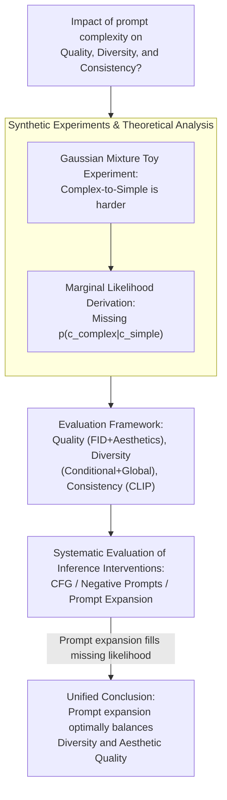

# The Intricate Dance of Prompt Complexity, Quality, Diversity, and Consistency in T2I Models

**Conference**: ICLR 2026  
**arXiv**: [2510.19557](https://arxiv.org/abs/2510.19557)  
**Code**: None  
**Area**: Image Generation / Text-to-Image  
**Keywords**: T2I Models, Prompt Complexity, Synthetic Data, Diversity, Consistency, Diffusion Models

## TL;DR

This paper systematically investigates the impact of text prompt complexity on three critical dimensions of T2I model synthetic data: quality, diversity, and consistency. It proposes a new evaluation framework and discovers that prompt expansion, as an inference-time intervention, optimally balances diversity and aesthetic quality.

## Background & Motivation

Text-to-Image (T2I) models can generate nearly unlimited synthetic data, offering significant potential compared to limited real-world datasets. Prior work evaluates the utility of synthetic data across three key dimensions: **Quality** (visual realism), **Diversity** (coverage of different visual patterns), and **Consistency** (alignment between image and text prompt). However, as prompt engineering is the primary means of interacting with T2I models, there is a lack of deep understanding regarding how prompt complexity systematically affects these three dimensions.

Specifically, the following key questions exist:

**The impact of prompt complexity is not deeply studied**: How do images generated by simple prompts (e.g., "a cat") and complex prompts (e.g., "an orange Maine Coon sitting on an antique sofa with sunlight streaming through the window") differ in quality, diversity, and consistency?

**Distribution gap between synthetic and real data**: How can this gap be systematically quantified?

**Comparison of inference-time intervention methods**: What are the respective strengths and weaknesses of methods such as guidance (CFG), negative prompts, and prompt expansion?

The core insight of this paper is that a complex trade-off relationship exists between prompt complexity and generation quality; understanding this "intricate dance" is crucial for effectively utilizing synthetic data.

## Method

### Overall Architecture

This study does not train new models but instead decomposes "prompt complexity" to clarify how it simultaneously affects the quality, diversity, and consistency of synthetic data. The research proceeds in three steps: First, in a controlled Gaussian mixture toy experiment, real-world data noise is stripped away to observe the essential relationship between prompt complexity and "generalization difficulty," using a probabilistic derivation to explain counterintuitive phenomena. Second, a unified evaluation framework is established, mapping quality, diversity, and consistency to specific metrics to evaluate real data and synthetic data under various prompt strategies on the same scale. Finally, across three datasets (CC12M, ImageNet-1k, DCI) and multiple T2I models (LDMv1.5/XL, LDMv3.5, Flux-schnell, Infinity), inference-time interventions such as CFG, negative prompts, and prompt expansion are systematically compared, confirming that the toy experiment conclusions hold in real-world scenarios. The entire pipeline is conducted during the inference phase without any new model training.

### Key Designs

**1. Synthetic Experiments & Theoretical Analysis: Why "Complex-to-Simple" is harder**

Intuitively, detailed prompts ("an orange Maine Coon on an antique sofa") contain more information and should be harder than simple prompts ("a cat"). However, the synthetic experiments in this paper yield the opposite conclusion: making a model cover more general conditions from specific conditions (i.e., training on complex prompts and generalizing to simple prompt distributions) is more difficult. The reason lies in the probabilistic structure—diffusion models learn the conditional distribution $p(x|c)$, where $c$ is the text condition. More detailed prompts provide stronger constraints on $c$, leading to narrower and more precise generation distributions. Once the prompt becomes simple, the model effectively needs to fit a marginal distribution:

$$p(x|c_{simple}) = \int p(x|c_{complex})\, p(c_{complex}|c_{simple})\, dc_{complex}$$

The term $p(c_{complex}|c_{simple})$ in this integral is a likelihood term that diffusion models are never directly trained to estimate. Without it, the "complex-to-simple" transition misses a piece of the puzzle, which is the root cause of why generalizing from simple prompts is harder. Conversely, this explains a practical phenomenon: although complex prompts reduce diversity, they narrow the distribution shift between synthetic and real data by anchoring the target distribution more precisely.

**2. Evaluation Framework: Measuring Real and Synthetic Data on the Same Scale**

To discuss the "impact of prompt complexity," a metric that does not favor any side is required. The evaluation framework proposed here spans three dimensions, with each mapped to specific indicators to avoid remaining purely conceptual. Quality is measured using FID (Fréchet Inception Distance) alongside human aesthetic scores, considering both distribution-level realism and subjective perception. Diversity is explicitly split into two layers: conditional diversity (the degree of variation in images sampled from the same prompt) and global diversity (the overall coverage across different prompts), as prompt complexity pulls these two layers in opposite directions. Consistency uses semantic alignment metrics like CLIP score to determine if the generated image faithfully follows the input prompt. Together, these provide a complete view of how the "three knobs" move when prompts change.

**3. Systematic Evaluation of Inference Interventions: Adjusting Trade-offs without Retraining**

Since quality, diversity, and consistency form a zero-sum "dance," a natural question is whether they can be adjusted to a better equilibrium at inference time. This paper horizontally compares three common interventions: Classifier-Free Guidance (CFG), which tightens or relaxes generation by weighting conditional and unconditional scores (often improving quality but suppressing diversity); negative prompts, which explicitly specify unwanted content for minor corrections; and Prompt Expansion, which uses a pre-trained LLM to automatically expand simple prompts into detailed descriptions. The critical reinterpretation here is that, combined with the derivation in Design 1, the LLM in prompt expansion acts exactly as the likelihood estimator missing from the diffusion model—it provides the $p(c_{complex}|c_{simple})$ term, thereby maximizing diversity and aesthetic quality without deviating too far from the real distribution.

## Key Experimental Results

### Main Results

Impact of prompt complexity evaluated across three datasets:

| Dataset | Prompt Type | Conditional Diversity | Prompt Consistency | Distribution Shift |
| :--- | :--- | :--- | :--- | :--- |
| CC12M | Simple Prompt | High | High | Large |
| CC12M | Complex Prompt | Low | Low | Small |
| ImageNet-1k | Class Name | High | High | Large |
| ImageNet-1k | Detailed Description | Low | Low | Small |
| DCI | Short Caption | High | High | Large |
| DCI | Long Caption | Low | Low | Small |

### Ablation Study

Comparison of inference-time intervention methods:

| Intervention Method | Image Diversity | Aesthetic Quality | Deviation from Real Distribution |
| :--- | :--- | :--- | :--- |
| No Intervention | Baseline | Baseline | Baseline |
| CFG Enhancement | Decrease | Increase | Deviation |
| Negative Prompt | Slight Increase | Slight Increase | Slight Deviation |
| Prompt Expansion | **Highest** | **Highest** | Moderate |

### Key Findings

1.  **Increased Prompt Complexity** → Decreased conditional diversity, decreased prompt consistency, but reduced synthetic-to-real distribution shift. This aligns with theoretical predictions from synthetic experiments.
2.  **Inference-time interventions** can enhance generation diversity, but at the cost of potential deviation from the real data support set.
3.  **Prompt expansion using pre-trained LLMs as likelihood estimators** consistently achieves the best performance in image diversity and aesthetic quality, even exceeding real data levels.
4.  **Trends are consistent across different T2I models**, indicating these findings are universal.

## Highlights & Insights

1.  **First Systematic Characterization**: Fills the research gap regarding the impact of prompt complexity on T2I synthetic data utility.
2.  **Elegant Theoretical Explanation**: Explains empirical phenomena through the simple mechanism of missing likelihood estimation, providing deep understanding from the perspective of conditional distribution marginalization.
3.  **New Understanding of Prompt Expansion**: Reinterprets prompt expansion as "using language models to estimate missing conditional likelihood," providing a theoretical foundation for this empirical trick.
4.  **High Practical Value**: Directly guides Artificial Intelligence Generated Content (AIGC) applications—when to use simple vs. complex prompts and how to choose intervention methods.

## Limitations & Future Work

1.  **Inference-only Evaluation**: Does not explore the possibility of improving the diversity-consistency-quality trade-off by fine-tuning the T2I model itself.
2.  **Limited Dataset Scale**: While large datasets like CC12M are used, some fine-grained datasets (like DCI) are relatively small.
3.  **Downstream Task Performance**: Metrics are primarily image-level; actual utility differences for synthetic data in downstream vision tasks (e.g., classification, detection) are not verified.
4.  **Coarse Definition of Prompt Complexity**: Quantifies complexity mainly through prompt length/detail, without distinguishing finer factors like semantic complexity (e.g., spatial relations, attribute binding).
5.  **Lack of Evaluation on Latest Models**: Performance of cutting-edge models like DALL-E 3 or Midjourney V6 may differ.

## Related Work & Insights

*   **Synthetic Data Utility**: Complementary to work by Azizi et al., He et al., etc., on using synthetic data for training; this paper provides a deeper mechanistic understanding.
*   **Diffusion Model Conditional Generation Theory**: Connects to theoretical work on diffusion model likelihood estimation, revealing the implicit probabilistic structure in conditional generation.
*   **Practical Insights**: For applications requiring large-scale synthetic data (e.g., data augmentation, privacy protection), appropriate prompt complexity and intervention strategies should be selected based on target task requirements.

## Rating

*   Novelty: ⭐⭐⭐⭐ (Systematic research angle is novel, theoretical explanation has depth)
*   Experimental Thoroughness: ⭐⭐⭐⭐ (Comprehensive evaluation across multiple datasets, models, and methods)
*   Writing Quality: ⭐⭐⭐⭐ (Clear structure, tight integration of theory and experiments)
*   Value: ⭐⭐⭐⭐ (Important guiding significance for T2I synthetic data applications)

<!-- RELATED:START -->

## Related Papers

- [\[ICLR 2026\] FACM: Flow-Anchored Consistency Models](facm_flow-anchored_consistency_models.md)
- [\[ICLR 2026\] GeoDiv: Framework for Measuring Geographical Diversity in Text-to-Image Models](geodiv_framework_for_measuring_geographical_diversity_in_text-to-image_models.md)
- [\[ICLR 2026\] CMT: Mid-Training for Efficient Learning of Consistency, Mean Flow, and Flow Map Models](cmt_mid-training_for_efficient_learning_of_consistency_mean_flow_and_flow_map_mo.md)
- [\[ICML 2026\] MIRO: 多奖励条件预训练同时提升 T2I 质量与效率](../../ICML2026/image_generation/miro_multi-reward_conditioned_pretraining_improves_t2i_quality_and_efficiency.md)
- [\[ICLR 2026\] Temporal Concept Dynamics in Diffusion Models via Prompt-Conditioned Interventions](temporal_concept_dynamics_in_diffusion_models_via_prompt-conditioned_interventio.md)

<!-- RELATED:END -->
