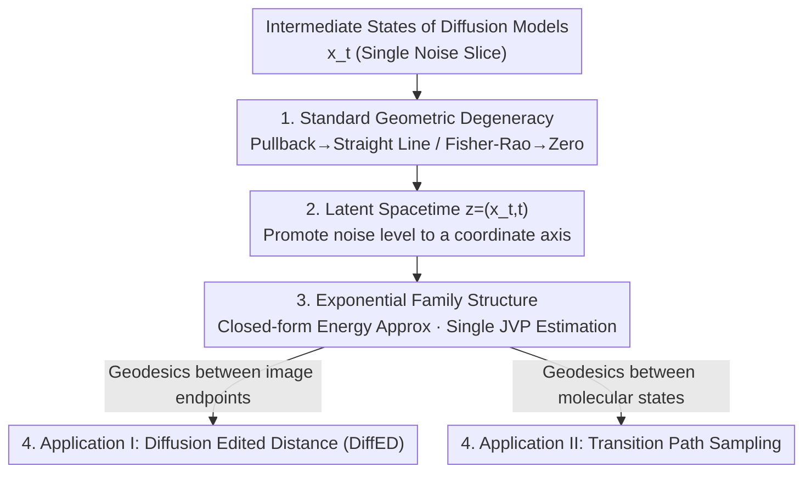

# The Spacetime of Diffusion Models: An Information Geometry Perspective

**Conference**: ICLR 2026 Oral  
**arXiv**: [2505.17517](https://arxiv.org/abs/2505.17517)  
**Code**: [GitHub](https://github.com/rafalkarczewski/spacetime-geometry)  
**Area**: Diffusion Models / Information Geometry / Theoretical Analysis  
**Keywords**: Spacetime Geometry, Fisher-Rao Metric, Pullback Geometry, Diffusion Edited Distance, Transition Path Sampling

## TL;DR

This work proposes the concept of "spacetime" for diffusion models from an information geometry perspective. It demonstrates that standard pullback geometry degenerates into straight lines in diffusion models, introduces spacetime geometry based on the Fisher-Rao metric, and derives practically computable Diffusion Edited Distance (DiffED) and transition path sampling methods.

## Background & Motivation

Understanding the evolution of information in the intermediate noisy states $\mathbf{x}_t$ of diffusion models remains an open problem:

**Limitations of Prior Work**: Pullback metrics are typically used in generative models to study the intrinsic geometry of data. However, this approach faces fundamental issues in diffusion models.

**Background**: Existing works focus primarily on sampling and training, lacking an analysis of how information evolves through the noise process.

**Key Challenge**: Existing image similarity metrics (such as LPIPS) lack a geometric foundation rooted in the generative process.

## Method

### Overall Architecture

The core question addressed is: what geometric information is encoded in the intermediate noisy states $\mathbf{x}_t$, and how should it be measured? The authors first "deconstruct"—proving that the two standard approaches for studying generative model geometry (pulling back the ambient metric via a deterministic decoder and using the Fisher-Rao metric of a stochastic decoder) both degenerate into trivial structures in diffusion models. They then "construct"—explicitly promoting the noise level $t$, previously treated as a parameter, to a coordinate axis to form a $(D+1)$-dimensional "latent spacetime" $\mathbf{z}=(\mathbf{x}_t,t)$. In this spacetime, the family of denoising distributions forms an exponential family, allowing curve energy to have a closed-form approximation estimated via a single forward pass. Consequently, the "most economical geometric path (geodesic) between two points" becomes computable for the first time. This mechanism is applied to two tasks: Diffusion Edited Distance (DiffED) between images and transition path sampling between two molecular states.

### Key Designs

**1. Diagnosing Why Standard Geometry Degenerates: Both natural paths fail by "looking only at a single noise slice"**

To study the intrinsic geometry of $\mathbf{x}_t$, the two most direct paths are dead ends. The first path is pulling back the ambient metric along the deterministic PF-ODE decoder $\mathbf{x}_T\mapsto\mathbf{x}_0(\mathbf{x}_T)$, yielding the pullback metric:

$$\mathbf{G}_{\text{PB}}(\mathbf{x}_T) = \left(\frac{\partial \mathbf{x}_0}{\partial \mathbf{x}_T}\right)^\top \left(\frac{\partial \mathbf{x}_0}{\partial \mathbf{x}_T}\right)$$

This paper proves that this causes all geodesics to decode into **straight line segments** in the data space. Since the latent and data spaces have the same dimensionality and the decoder operates within the ambient space, it fails to encode the intrinsic curvature of the manifold, flattening the geometric information. The second path uses a stochastic decoder (reverse SDE) with the Fisher-Rao metric:

$$\mathbf{G}_{\text{IG}}(\mathbf{x}_T) = \mathbb{E}_{\mathbf{x}_0 \sim p(\mathbf{x}_0|\mathbf{x}_T)}[\nabla_{\mathbf{x}_T}\log p(\mathbf{x}_0|\mathbf{x}_T)\, \nabla_{\mathbf{x}_T}\log p(\mathbf{x}_0|\mathbf{x}_T)^\top]$$

While it seems it could capture probability manifold curvature, at the maximum noise level $\mathbf{x}_T$, the forward process has "forgotten" the data ($p(\mathbf{x}_T|\mathbf{x}_0)\approx p_T(\mathbf{x}_T)$). The denoising distribution barely changes with $\mathbf{x}_T$, causing the metric to collapse to zero. Both paths fail for the same reason: they focus on a **single noise level slice**, where information is either straightened or drowned by noise, suggesting the solution lies in the ignored time dimension.

**2. Latent Spacetime: Promoting noise level from a parameter to a coordinate**

Addressing the "slice perspective" identified in Design 1, the core innovation is to no longer fix $t$, but to introduce a $(D+1)$-dimensional spacetime $\mathbf{z}=(\mathbf{x}_t,t)\in\mathbb{R}^D\times(0,T]$. A point thus carries both its state and its noise level. This allows the entire family of denoising distributions $\{p(\mathbf{x}_0|\mathbf{x}_t)\}$ to be indexed by a single coordinate system. Clean data $\mathbf{x}$ are identified as points $(\mathbf{x},0)$ on the base of the spacetime. Moving along the time axis corresponds to switching the observation scale across different noise levels. Geometry becomes non-degenerate again—the information previously "flattened/collapsed" is recovered by re-incorporating the discarded time dimension.

**3. Exponential Family Structure and Computable Energy: Making abstract geodesics actually computable**

The key observation is that the denoising distributions along a spacetime curve $\boldsymbol\gamma$ form an **exponential family**, leading to a closed-form approximation of the curve energy:

$$\mathcal{E}(\boldsymbol{\gamma}) \approx \frac{N-1}{2}\sum_{n=0}^{N-2}(\boldsymbol{\eta}(\mathbf{z}_{n+1}) - \boldsymbol{\eta}(\mathbf{z}_n))^\top(\boldsymbol{\mu}(\mathbf{z}_{n+1}) - \boldsymbol{\mu}(\mathbf{z}_n))$$

Where the natural parameters $\boldsymbol{\eta}(\mathbf{x}_t,t)=\left(\tfrac{\alpha_t}{\sigma_t^2}\mathbf{x}_t,\,-\tfrac{\alpha_t^2}{2\sigma_t^2}\right)$ and expectation parameters $\boldsymbol{\mu}(\mathbf{x}_t,t)=\left(\mathbb{E}[\mathbf{x}_0|\mathbf{x}_t],\,\mathbb{E}[\|\mathbf{x}_0\|^2|\mathbf{x}_t]\right)$ can be obtained directly from the denoiser: the first moment via Tweedie’s formula and the second via the Hutchinson trick. This allows estimation of the curve energy through a single Jacobian-vector product (JVP) **without simulation**, reducing the "finding geodesics" problem from solving integro-differential equations to optimizing a differentiable discrete sum.

**4. Two Applications: The same geodesic as both an image edit distance and a molecular transition path**

Once energy is computable, geodesics serve two disparate tasks. First, **Diffusion Edited Distance (DiffED)**: distance between two images is defined as the geodesic length connecting spacetime points $(\mathbf{x}^a,0)$ and $(\mathbf{x}^b,0)$:

$$\text{DiffED}(\mathbf{x}^a, \mathbf{x}^b) = \ell(\boldsymbol{\gamma})$$

This geodesic represents the most economical editing sequence—first adding noise to forget idiosyncratic info of $\mathbf{x}^a$, then denoising to introduce $\mathbf{x}^b$. The length quantifies the total change in denoising distributions, measuring structural "rewriting cost" rather than perceptual similarity like LPIPS. Second, **Transition Path Sampling**: between two low-energy states of a Boltzmann distribution $q(\mathbf{x})\propto\exp(-U(\mathbf{x}))$, the spacetime geodesic is used as a "skeleton," followed by annealed Langevin dynamics to sample specific transition paths. This framework naturally supports constraints (low variance, avoiding specified regions) without retraining the model.

## Key Experimental Results

### Comparison of Sampling Trajectories
- PF-ODE paths are very similar to energy-minimizing geodesics.
- Geodesics exhibit slightly less curvature during early sampling stages.

### Diffusion Edited Distance

| Property | Result |
|-----------|--------|
| Correlation with LPIPS | ~-7% (Captures different info) |
| Correlation with SSIM | ~53% |
| Dissimilar Endpoints | Higher intermediate noise |

DiffED captures structural editing costs rather than perceptual similarity.

### Transition Path Sampling (Alanine Dipeptide)

| Method | MaxEnergy↓ | Energy Evals↓ |
|--------|-----------|---------------|
| MCMC-Fixed Length | 42.54±7.42 | 1.29B |
| MCMC-Variable Length | 58.11±18.51 | 21.02M |
| Doob's Lagrangian | 66.24±1.01 | 38.4M |
| **Spacetime Geodesic (Ours)** | **37.36±0.60** | **16M (+16M)** |
| Lower Bound | 36.42 | — |

Ours is closest to the lower bound with several orders of magnitude fewer energy evaluations.

### Key Findings
- Generated paths effectively avoid high-energy regions.
- Unlike Doob's Lagrangian, the method does not collapse to a single path.

## Highlights & Insights

1.  **Deep Theoretical Insight**: Demonstrates the fundamental failure of pullback geometry in diffusion models.
2.  **Elegance of the Spacetime Concept**: Unifies geometric structures across all noise levels.
3.  **Computability**: Leverages exponential family properties to derive simulation-free estimators.
4.  **Multi-domain Application**: Bridging edit distances and molecular dynamics.
5.  **Computational Efficiency**: Energy estimation requires only a single JVP.

## Limitations & Future Work

1.  Spacetime geodesics cannot serve as a replacement sampling method (endpoints must be known).
2.  The Hutchinson estimator may introduce variance in high-dimensional data.
3.  The computational cost of DiffED remains higher than simple distance metrics.
4.  Reliance on denoiser quality (approximation error of $\hat{\mathbf{x}}_0$).
5.  Transition path sampling requires a known energy function.

## Related Work & Insights

- **Riemannian Geometry + Generative Models**: Arvanitidis (2018/2022), Park (2023).
- **Diffusion Model Geometry**: Domingo-Enrich (2025) analysis of memorylessness.
- **Transition Path Sampling**: Holdijk (2023), Doob's Lagrangian (Du 2024).
- **Information Geometry**: Fisher-Rao metric, Amari (2016).

## Rating

- **Novelty**: ⭐⭐⭐⭐⭐ — The spacetime geometry concept is deeply original.
- **Value**: ⭐⭐⭐⭐ — DiffED and transition path sampling offer practical utility.
- **Experimental Thoroughness**: ⭐⭐⭐⭐ — Solid theoretical validation and molecular results.
- **Writing Quality**: ⭐⭐⭐⭐⭐ — Elegant theory and precise expression.

<!-- RELATED:START -->

## Related Papers

- [\[ICLR 2026\] Learning a Distance Measure from the Information-Estimation Geometry of Data](learning_a_distance_measure_from_the_information-estimation_geometry_of_data.md)
- [\[ICLR 2026\] Continual Unlearning for Text-to-Image Diffusion Models: A Regularization Perspective](continual_unlearning_for_text-to-image_diffusion_models_a_regularization_perspec.md)
- [\[ICLR 2026\] Dragging with Geometry: From Pixels to Geometry-Guided Image Editing](dragging_with_geometry_from_pixels_to_geometry-guided_image_editing.md)
- [\[ICML 2026\] Information-Geometric Adaptive Sampling for Graph Diffusion](../../ICML2026/image_generation/information-geometric_adaptive_sampling_for_graph_diffusion.md)
- [\[ICML 2026\] Geometry-Aware Tabular Diffusion](../../ICML2026/image_generation/geometry-aware_tabular_diffusion.md)

<!-- RELATED:END -->
