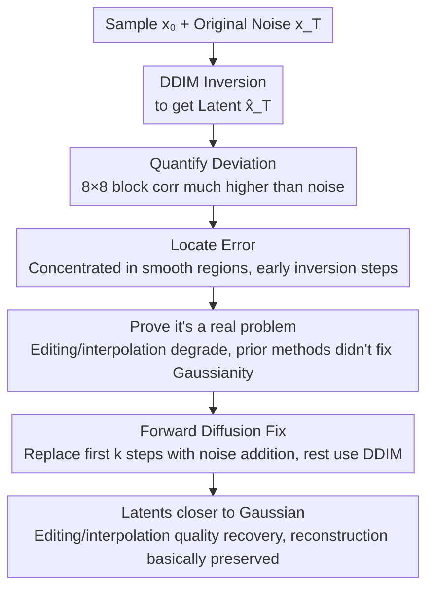

# There and Back Again: On the Relation between Noise and Image Inversions in Diffusion Models

**Conference**: ICLR 2026  
**arXiv**: [2410.23530](https://arxiv.org/abs/2410.23530)  
**Code**: [GitHub](https://github.com/luk-st/taba)  
**Area**: Diffusion Models / Inversion Analysis / Image Editing  
**Keywords**: DDIM Inversion, Latent Encoding, Noise Correlation, Smooth Regions, Forward Diffusion Fix

## TL;DR

This work provides an in-depth analysis of the error mechanisms in DDIM inversion, discovering that latent encodings exhibit low diversity and high correlation in smooth image regions (e.g., sky). Tracing this to inaccurate noise predictions in the initial steps of inversion, the authors propose a simple fix by replacing the first few inversion steps with forward diffusion.

## Background & Motivation

Diffusion models lack an explicit low-dimensional latent space to encode editable features of data. DDIM inversion partially addresses this by reversing the denoising trajectory to transfer an image to its approximate initial noise. However:

**Limitations of Prior Work**: Although it is known that latents produced by DDIM inversion are not perfectly Gaussian, the root causes and specific manifestations have not been systematically studied.

**Existing methods**: Techniques like Null-text inversion and Renoise improve reconstruction quality but do not truly resolve the underlying non-Gaussianity of the latent space.

**Goal**: To improve the manipulability of latent encodings, which currently exhibit lower quality for interpolation and editing compared to the original noise space.

## Method

### Overall Architecture

The paper does not propose a new model but answers a long-neglected question: regarding images generated by diffusion models and then subjected to DDIM inversion, how similar (or dissimilar) are the resulting latent encodings to the original Gaussian noise? Centered on three variables—the Gaussian noise $\mathbf{x_T}$ used for generation, the generated sample $\mathbf{x_0}$, and the latent $\hat{\mathbf{x}}_T$ obtained from inverting that sample—the authors first quantify "deviation from Gaussianity" using a correlation metric. They then localize the error spatially (which regions deviate most) and temporally (at which inversion step errors are injected). After demonstrating that this deviation harms editing and interpolation and is not fixed by current inversion improvements, they provide a training-free fix: replacing the "dirtiest" initial steps of inversion with forward diffusion noise addition.

### Key Designs

**1. Quantifying Deviation: Using 8×8 block correlation to turn "non-Gaussian latents" into comparable metrics**

Clean Gaussian noise has pixels that are nearly independent, with Pearson correlation coefficients within 8×8 blocks near 0 (measured at ~0.039). The authors apply the same statistics to inverted latents $\hat{\mathbf{x}}_T$ and find significantly elevated correlation coefficients, with residual image structures even visible. This validates the qualitative observation that "inverted latents don't look like noise" as a quantifiable metric. The pattern shows pixel-space models deviate most heavily (0.382 for ADM-32, 0.498 for IF), while latent-space models deviate less (0.045 for LDM), yet all are significantly higher than the noise baseline.

| Model | Noise Corr | Latent Corr | Sample Corr |
|------|---------|---------|---------|
| ADM-32 | 0.039 | **0.382** | 0.964 |
| ADM-64 | 0.039 | **0.126** | 0.925 |
| IF | 0.039 | **0.498** | 0.936 |
| LDM | 0.039 | **0.045** | 0.645 |
| DiT | 0.041 | **0.103** | 0.748 |
| SDXL | 0.036 | **0.155** | 0.637 |

**2. Key Challenge: Tracing errors to smooth regions and early inversion steps**

Spatially, the authors segment images into "smooth regions" (sky, solid backgrounds) and "non-smooth regions" using a local variance threshold $\tau=0.025$. They find the issues are concentrated in smooth regions—which should theoretically be the easiest to invert. In these areas, inversion error is higher (ADM-32: 0.49 smooth vs 0.43 non-smooth), yet latent diversity (standard deviation) is lower (ADM-32: 0.34 vs 0.46), meaning low-frequency regions are the least noise-like.

| Model | Smooth Error | Non-smooth Error | Smooth Std Dev | Non-smooth Std Dev |
|------|-----------|-------------|-------------|---------------|
| ADM-32 | **0.49** | 0.43 | **0.34** | 0.46 |
| IF | **0.56** | 0.40 | **0.46** | 0.72 |
| LDM | **0.13** | 0.03 | **0.45** | 0.59 |
| DiT | **0.12** | 0.06 | **0.43** | 0.54 |

Temporally, linear interpolation path analysis shows generation trajectories tilt toward inverted latents $\hat{\mathbf{x}}_T$ as early as 50%–70% of the way through. The root cause is identified as the first few steps of inversion: noise predictions in smooth regions are neither accurate nor diverse enough, injecting errors that persist throughout the trajectory.

**3. Key Insight: Editing performance vs. Gaussianity preservation**

The authors verify that "non-Gaussian latents" directly cause interpolation and editing quality degradation, especially in smooth regions. Furthermore, they evaluate existing improvements like Null-text inversion, Renoise, and DPM-Solver inversion. While these methods improve reconstruction fidelity, they fail to restore the Gaussianity of the latents. This suggests that improved reconstruction does not imply a healthier latent space.

| Method | Recon Improvement | Gaussianity Preserved |
|------|---------|----------|
| Null-text inversion | ✓ | ✗ |
| Renoise | ✓ | ✗ |
| DPM-Solver inversion | ✓ | ✗ |
| Regularization | Partial | Partial |

**4. Mechanism: Forward Diffusion Fix**

Since errors are primarily injected in the first $k$ steps of inversion, the fix replaces these steps with direct forward diffusion noise addition:

$$x_t = \sqrt{\bar{\alpha}_t}\, x_0 + \sqrt{1-\bar{\alpha}_t}\, \epsilon_t$$

where $\epsilon_t$ is independent Gaussian noise. Standard DDIM inversion then proceeds for the remaining steps. This forcibly injects true independent Gaussian components into smooth regions, breaking residual correlations. As only the initial steps are randomized and the latter part remains deterministic, reconstruction quality is largely maintained while interpolation and editing quality significantly improve.

## Key Experimental Results

### Experimental Models
7 diffusion models covering pixel/latent space, conditional/unconditional, and U-Net/DiT architectures.

### Fix Validation

| Strategy | Correlation↓ | Recon Quality↑ | Interpolation↑ | Editing↑ |
|------|--------|---------|---------|---------|
| Standard DDIM | High | Baseline | Low | Low |
| + Regularization | Med | Baseline | Med | Med |
| + Forward k-steps | **Low** | Maintained | **High** | **High** |

### Flow Matching Extension
The same correlation and low diversity issues were found to persist in Flow Matching models.

### Ablation Study

| Parameter | Effect |
|------|------|
| Increase k steps | Diversity increases, but reconstruction may drop |
| Increase DDIM steps | Error decreases slightly, but core problem remains |
| Different Architectures | Consistent trends across all |

## Highlights & Insights

1. **Analytical Depth**: Systematic validation of inversion error patterns across 7 diverse models.
2. **Spatial Pattern Identification**: Precision localization of error concentrated in smooth image regions.
3. **Simple & Effective Fix**: Replacing initial steps provides significant improvements without retraining.
4. **Generalizability**: Applicable to U-Net, DiT, pixel-space, and latent-space models.
5. **Correction of Assumptions**: Demonstrates that prior reconstruction-focused improvements do not necessarily fix the latent space's distribution.

## Limitations & Future Work

1. The forward diffusion steps introduce stochasticity, which may affect perfectly deterministic reconstruction.
2. The optimal number of replacement steps $k$ varies by model and needs tuning.
3. Analysis is primarily based on DDIM; generalization to other samplers requires further validation.
4. Smooth region definition relies on a manual threshold $\tau = 0.025$.
5. Lacks a complete theoretical explanation for why noise predictions are specifically inaccurate in smooth regions during early inversion.

## Related Work & Insights

- **DDIM Inversion**: Song et al. (2021), Dhariwal & Nichol (2021)
- **Inversion Improvements**: Null-text inversion (Mokady 2023), Renoise (Garibi 2024)
- **Image Editing**: P2P (Hertz 2022), SDEdit (Meng 2021)
- **Flow Matching**: Lipman et al. (2023)

## Rating

- **Novelty**: ⭐⭐⭐⭐ — Highly original systematic analysis perspective.
- **Value**: ⭐⭐⭐⭐ — Simple fix that is immediately applicable.
- **Experimental Thoroughness**: ⭐⭐⭐⭐⭐ — Comprehensive across 7 models.
- **Writing Quality**: ⭐⭐⭐⭐⭐ — Clear logic and progressive analysis.

<!-- RELATED:START -->

## Related Papers

- [\[CVPR 2026\] Bidirectional Normalizing Flow: From Data to Noise and Back](../../CVPR2026/image_generation/bidirectional_normalizing_flow_from_data_to_noise_and_back.md)
- [\[NeurIPS 2025\] On the Relation between Rectified Flows and Optimal Transport](../../NeurIPS2025/image_generation/on_the_relation_between_rectified_flows_and_optimal_transport.md)
- [\[ICLR 2026\] Mitigating Noise Shift in Denoising Generative Models with Noise Awareness Guidance](mitigating_noise_shift_in_denoising_generative_models_with_noise_awareness_guida.md)
- [\[ICLR 2026\] Towards Sequence Modeling Alignment Between Tokenizer and Autoregressive Model](towards_sequence_modeling_alignment_between_tokenizer_and_autoregressive_model.md)
- [\[ICLR 2026\] Image Can Bring Your Memory Back: A Novel Multi-Modal Guided Attack against Image Generation Model Unlearning](image_can_bring_your_memory_back_a_novel_multi-modal_guided_attack_against_image.md)

<!-- RELATED:END -->
