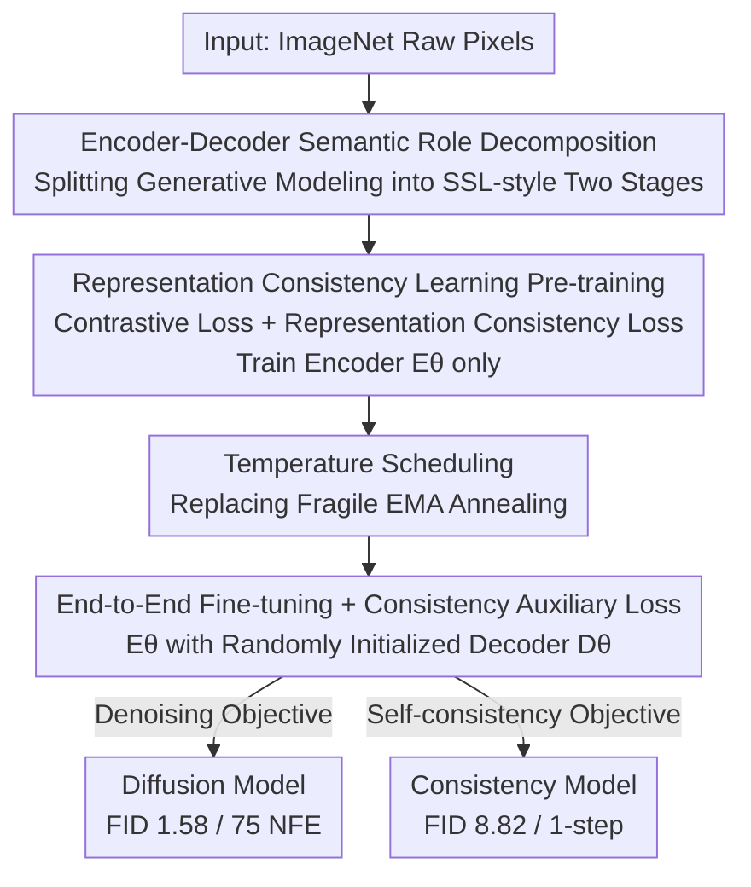

# There is No VAE: End-to-End Pixel-Space Generative Modeling via Self-Supervised Pre-Training

**Conference**: ICLR 2026  
**OpenReview**: [https://openreview.net/forum?id=HbUoKPIZmp](https://openreview.net/forum?id=HbUoKPIZmp)  
**Code**: https://github.com/AMAP-ML/EPG  
**Area**: Diffusion Models / Image Generation  
**Keywords**: Pixel-space Generation, Diffusion Models, Consistency Models, Self-supervised Pre-training, Representation Consistency

## TL;DR
This paper proposes EPG (End-to-end Pixel-space Generative model), a two-stage framework consisting of a "self-supervised pre-trained encoder + end-to-end fine-tuned decoder." By **completely discarding the VAE** and training diffusion and consistency models directly in pixel space, it achieves 1.58 FID (75 NFE) on ImageNet-256. Using approximately 30% of the training compute of DiT, it outperforms DiT/SiT and, for the first time, trains a consistency model directly to 8.82 FID (1-step) without relying on a VAE or pre-trained diffusion models.

## Background & Motivation
**Background**: Modern high-resolution image generation almost exclusively operates in "latent space"—first using a pre-trained VAE to compress images into latents, then training diffusion models (LDM/DiT/SiT) or consistency models on these latents. The VAE handles compression while the generative model handles modeling; this decoupling ensures efficiency and high-quality results.

**Limitations of Prior Work**: However, the VAE itself introduces complications. Training a VAE requires a difficult trade-off between "compression ratio" and "reconstruction fidelity." Even once trained, reconstruction can be distorted for latents outside the training set. More critically, once the VAE capacity is fixed, it becomes a **permanent performance ceiling**—the generative model's potential is capped by the VAE's fixed representational capacity. Direct pixel-space diffusion models bypass the VAE but have historically struggled: either the backbone compute overhead is massive, or convergence is extremely slow, leaving them behind latent-space methods in both quality and efficiency.

**Key Challenge**: The two major obstacles in pixel space are **high computational cost** and **slow convergence**. Previous attempts to modify architectures or diffusion formulations failed to match the quality and efficiency of latent-space methods simultaneously, primarily because they lacked a method for the pixel-space encoder to "quickly learn good semantics."

**Key Insight**: The authors draw inspiration from the classic division of labor in Self-Supervised Learning (SSL)—the encoder acts as a general visual semantic learner, while the decoder serves as a task-specific prediction head. They boldly hypothesize that the encoder-decoder in diffusion generative models can be **decoupled in the same way**: the encoder primarily learns high-level semantics from noisy inputs, while the decoder acts as a low-level pixel generator conditioned on those semantics.

**Core Idea**: The authors **reformulate diffusion model training as a self-supervised learning problem**, similar to training a classifier. Stage one pre-trains the encoder to extract "time-consistent semantics along the same ODE sampling trajectory" across different noise levels. Stage two attaches a randomly initialized decoder to the encoder for end-to-end fine-tuning into a diffusion or consistency model. In short: "Replace the two-stage compression of VAE with the two-stage paradigm of SSL."

## Method

### Overall Architecture
EPG splits pixel-space generation into two stages. **Stage 1 (Pre-training)** trains only the encoder $E_\theta$: using "Representation Consistency Learning," the model learns semantics from clean images while aligning points from different noise levels that lie on the same deterministic ODE sampling trajectory. This essentially rewrites "representation learning on heavily noisy images" as a "generative alignment" task, connecting features of noisy samples to their progressively cleaner versions. **Stage 2 (Fine-tuning)** discards the projection head, connects the pre-trained $E_\theta$ to a **randomly initialized decoder** $D_\theta$, and performs end-to-end fine-tuning of the entire model $f_\theta$. The encoder maps noisy images to features, which the decoder reconstructs into clean pixels. The downstream task can be diffusion training (denoising objective) or consistency training (self-consistency objective).

The backbone uses a Vision Transformer (ViT) with `[CLS]` tokens, time-condition tokens, and image tokens as input. To manage compute across different resolutions, the authors **fix the input token length**—as resolution increases, the patch size is scaled proportionally (16×16 for ImageNet-256, 32×32 for ImageNet-512). Consequently, high resolution does not significantly increase token count or compute.

### Key Designs

**1. Encoder-Decoder Semantic Role Decomposition: Splitting Generative Modeling into SSL-style Two Stages**

To address the fundamental pain point of slow convergence in pixel space, the authors do not force architectural changes. Instead, they answer a more basic question: what do the encoder and decoder in a diffusion model actually learn? They demonstrate that the encoder primarily extracts **high-level visual semantics** from noisy inputs, while the decoder is a **low-level pixel generator conditioned on representations**. This division matches the SSL paradigm where the encoder learns general semantics and the decoder acts as a task head. Thus, the training can be split like SSL: pre-train the encoder separately to provide strong discriminative capabilities from the start, then flexibly adapt these representations to generation tasks containing detailed visual semantics. This insight is the foundation—it redefines "training a diffusion model" as "training a classifier-style self-supervised problem," justifying the title "There is No VAE": since the encoder can learn semantics on its own, a VAE is no longer needed as a compression intermediary.

**2. Representation Consistency Learning: Learning Time-Consistent Semantics under Heavy Noise**

Applying SSL directly for pre-training fails because SSL suffers from **representation collapse** on heavily noisy images, failing to learn meaningful semantics. The challenge is that diffusion noise levels are far higher than the noise in SSL data augmentation. The authors extend the ideas of rRCM, designing the pre-training objective as the sum of two terms: a **contrastive loss** for semantic learning (positive samples from data augmentation) and a **representation consistency loss** for semantic alignment across noise levels (positive samples are time-adjacent points $(x_{t_n}, x_{t_{n-1}})$ on the same ODE trajectory; adjacent points on different trajectories serve as negative samples). Both use NT-Xent as the distance metric:

$$d_{\text{NT-Xent}}(q, q^+) = -\log \frac{\exp(q \cdot q^+/\tau)}{\exp(q \cdot q^+/\tau) + \sum_{q^-}\exp(q \cdot q^-/\tau)}$$

Time-adjacent pairs are constructed via $x_{t_{n-1}} = x_{t_0} + t_{n-1}\epsilon$ (using the same perturbation $\epsilon$ used to generate $x_{t_n}$), making it entirely independent of any pre-trained diffusion model. The effect is to rewrite "representation learning on noisy images" as "generative alignment along sampling trajectories." Features of noisy samples are pulled toward their cleaner versions, yielding time-consistent, high-quality semantics across all noise levels—which the authors identify as the "key to successful pixel-space generation."

**3. Temperature Scheduling: Replacing Fragile EMA Annealing**

The original rRCM framework relied on **manually designed EMA coefficient annealing** to regulate the learning rate of clean image representations, alleviating the difficulty of aligning them with high-noise samples. However, this mechanism introduced a set of **tightly coupled hyperparameters** and a **fragile training process**—slight deviations could lead to collapse, which is fatal for generative tasks requiring hyperparameter flexibility. The authors replace this with a much more intuitive lever: the temperature $\tau$ in the representation consistency loss. A small $\tau$ forces strong separation between different ODE trajectories while tightly aligning points within the same trajectory to the clean endpoint. While a fixed $\tau=0.1$ is nearly effective, it causes brief instability early on (as the model lacks meaningful features to reconcile alignment). Thus, a linear interpolation temperature schedule $\tau(t) = \tau_1(1-t) + \tau_2 t$ ($\tau_1 \le \tau_2$) is used, letting alignment at large timesteps be "looser" initially, with $\tau_2$ converging to $\tau_1$ via a cosine schedule. Crucially, this schedule is **independent of other hyperparameters**, avoiding the "butterfly effect" seen with EMA annealing.

**4. End-to-End Fine-tuning and Consistency Auxiliary Loss: Growing Random Decoders with the Encoder**

After pre-training, the projection head is discarded, and $E_\theta$ is combined with a randomly initialized $D_\theta$ for end-to-end fine-tuning. The diffusion version uses a standard denoising objective $\mathbb{E}[\lambda(t)\|s_\theta(x(t),t)-x(0)\|^2]$ with time-dependent weighting and LogNormal noise sampling; diffusion is chosen over flow matching because it is naturally compatible with consistency model theory. The consistency version faces a problem: standard consistency training only receives supervision from clean data, leading to slow convergence and poor quality. The authors add an **auxiliary loss** that aligns the model output $f_\theta(x_{t_n},t_n)$ with the clean image $x_0$ used to generate the noisy input:

$$\arg\min_\theta \mathbb{E}\left[d_{\text{NT-Xent}}(W_\phi(f_\theta(x_{t_n},t_n),t_n), W_\phi(x_{t_0},t_0))\right]$$

Here, $W_\phi$ is a **frozen copy of the pre-trained encoder** (without the projection head, not updated during fine-tuning). This effectively reuses their own pre-trained weights as a ready-made source of supervision, providing complementary signals for consistency training at almost zero extra cost. This step allows consistency models to achieve strong results directly in the ImageNet-256 pixel space for the first time.

### Loss & Training
Pre-training runs for 600K steps (480 epochs) with a batch size of 1024. For fine-tuning, the diffusion model is trained for 1M steps (800 epochs) and the consistency model for 700K steps (560 epochs). FP16 mixed precision is used. In the fine-tuning stage, the encoder and decoder have an equal number of layers, with residual connections between them and time conditions injected via adaLN-Zero in the decoder.

## Key Experimental Results

### Main Results
System-level comparison on ImageNet-256 (with CFG). EPG outperforms latent-space VAE methods directly in pixel space:

| Model | Space | FID↓ | NFE↓ | Epochs | GFLOPs↓ |
|------|------|------|------|--------|---------|
| DiT-XL/2 | Latent | 2.27 | 250×2 | 1400 | 312+119 |
| SiT-XL/2 | Latent | 2.06 | 250×2 | 1400 | 312+119 |
| JiT-G/16 | Pixel | 1.82 | 191 | 600 | 383 |
| **EPG-XXL/16** | Pixel | 1.87 | **75** | 800 | 176 |
| **EPG-G/16** | Pixel | **1.58** | **75** | 1600 | 321 |

Consistency models (one-step generation, ImageNet-256), successfully trained in pure pixel space without VAE/diffusion models for the first time:

| Model | Space | FID↓ | NFE | #Params |
|------|------|------|-----|---------|
| iCT-XL/2 | Latent | 34.24 | 1 | 84M+675M |
| Shortcut-XL/2 | Latent | 10.60 | 1 | 84M+675M |
| IMM | Latent | 8.05 | 1 | 84M+675M (11× Compute) |
| **EPG-L/16** | Pixel | **8.82** | 1 | 540M |

Training Efficiency (8×H200): The internal pre-training takes only 57 hours, less than the 160 hours for sd-vae-mse. THE total cost for EPG-XL/16 was 139 hours vs 506 hours for DiT-XL/2, while achieving a lower FID (2.04 vs 2.27).

### Ablation Study
Comparison of different pixel-space pre-training schemes on ImageNet-224 (FID):

| Pre-training Scheme | Diffusion DM↓ | Consistency CM↓ | Description |
|------------|---------|-----------|------|
| REPA (SiT-B) | 72.71 | - | Worst, external feature alignment |
| MoCo v3 ViT-B | 56.26 | 36.77 | More stable than scratch |
| Scratch | 59.69 | NaN | Training from scratch, CM collapses |
| rRCM | 46.51 | 37.55 | Original framework |
| **EPG-B/16** | **41.36** | **33.12** | Ours, best on both tasks |

### Key Findings
- **Representation quality and time consistency are the keys to successful pixel-space generation**: EPG consistently outperforms rRCM with a simpler framework and no coupled hyperparameters. The "NaN" result for the consistency model trained from scratch proves that good pre-trained representations are a prerequisite for consistency training to function.
- **Training compute can be traded for performance**: EPG-XXL/16 outperforms SiT-XL/2 using only ~50% of the compute. Overall, it uses only ~30% of the training compute required by DiT.
- **Scalability**: Downstream performance improves monotonically with pre-training batch size (256→1024) and model parameters (Encoder 64M→107M→225M).
- **REPA performs worst in pixel space**: Aligning with external SSL features does not work well in pure pixel space, validating the value of "in-house time-consistent representations."

## Highlights & Insights
- **Redefining Diffusion Training as a Self-Supervised Problem**: The most significant "Aha!" moment is the role decomposition insight—encoders learn semantics, decoders generate pixels; thus, "training a diffusion model ≈ training a classifier." This perspective legitimizes "dropping the VAE."
- **Reusing Frozen Pre-trained Weights as Consistency Supervision**: Reusing the internal encoder to provide supervision for consistency training at zero cost is a highly reusable trick.
- **Temperature Scheduling instead of EMA Annealing**: Replacing fragile multi-hyperparameter coupling with an independent, intuitive temperature schedule is a valuable "de-coupling" lesson in stability engineering.
- **Fixed Token Length for Resolution Scalability**: Proportionally scaling patch sizes to keep token counts constant allows pixel-space methods to control costs elegantly as resolution increases.

## Limitations & Future Work
- **Validated only on ImageNet**: The method hasn't been tested on larger-scale, open-domain, or text-to-image tasks. The authors list scaling to high-resolution/multimodal generation as future work.
- **Pre-training is still an extra stage**: While cheaper than training a VAE, it still requires an independent SSL pre-training phase rather than being truly single-stage.
- **No external supervision integration**: The authors admit EPG is orthogonal to REPA/RAE and could be combined with external supervision, but this was left for future work.
- **Empirical nature of consistency auxiliary loss**: The 4th design was introduced "empirically" and lacks theoretical analysis; the optimal form of temperature scheduling is also largely experimental.

## Related Work & Insights
- **vs Latent-space Methods (LDM/DiT/SiT)**: These rely on pre-trained VAEs for efficiency but are capped by VAE capacity. EPG trains directly in pixel space, replacing VAE with SSL pre-training and outperforming them with equal or less compute without reconstruction bottlenecks.
- **vs Pixel-space Diffusion (RIN/SiD/VDM++/JiT)**: Prior work modified architectures or formulas but failed to match latent-space efficiency. EPG focuses on "ensuring the encoder learns time-consistent semantics first," solving slow convergence through pre-training rather than scaling architecture. It achieves superior FID and NFE.
- **vs USP / REPA**: USP also uses a strong representation learning phase to accelerate diffusion, but in latent space. REPA aligns with external SSL features. EPG focuses on pixel space and does not depend on external models; experiments showed REPA performs poorly in pixel space.
- **vs rRCM**: This work extends rRCM but replaces fragile EMA annealing with temperature scheduling and removes coupled hyperparameters, yielding better results for both DM and CM tasks.

## Rating
- Novelty: ⭐⭐⭐⭐⭐ The perspective of "dropping the VAE and reformulating diffusion training as SSL" is clear and impactful. Successful pixel-space consistency training without VAE/diffusion models is a first.
- Experimental Thoroughness: ⭐⭐⭐⭐ Excellent coverage of ImageNet-256/512, Diffusion+Consistency, efficiency, ablations, and scaling, but limited to Title ImageNet.
- Writing Quality: ⭐⭐⭐⭐ Motivations and methodology are clear; formulas are well-standardized. Some designs are empirical with less theoretical depth.
- Value: ⭐⭐⭐⭐⭐ Sets a new SOTA for pixel-space generation and provides a "VAE-less, scalable, and training-efficient" practical route, offering direct insights for future high-resolution/multimodal generation.

<!-- RELATED:START -->

## Related Papers

- [\[CVPR 2026\] SpeeDiff: Scalable Pixel-Anchored End-to-End Latent Diffusion Model](../../CVPR2026/image_generation/speediff_scalable_pixel-anchored_end-to-end_latent_diffusion_model.md)
- [\[CVPR 2026\] DeCo: Frequency-Decoupled Pixel Diffusion for End-to-End Image Generation](../../CVPR2026/image_generation/deco_frequency-decoupled_pixel_diffusion_for_end-to-end_image_generation.md)
- [\[ICCV 2025\] REPA-E: Unlocking VAE for End-to-End Tuning with Latent Diffusion Transformers](../../ICCV2025/image_generation/repa-e_unlocking_vae_for_end-to-end_tuning_of_latent_diffusion_transformers.md)
- [\[ICCV 2025\] End-to-End Multi-Modal Diffusion Mamba](../../ICCV2025/image_generation/end-to-end_multi-modal_diffusion_mamba.md)
- [\[ICLR 2026\] Adapting Self-Supervised Representations as a Latent Space for Efficient Generation](adapting_self-supervised_representations_as_a_latent_space_for_efficient_generat.md)

<!-- RELATED:END -->
