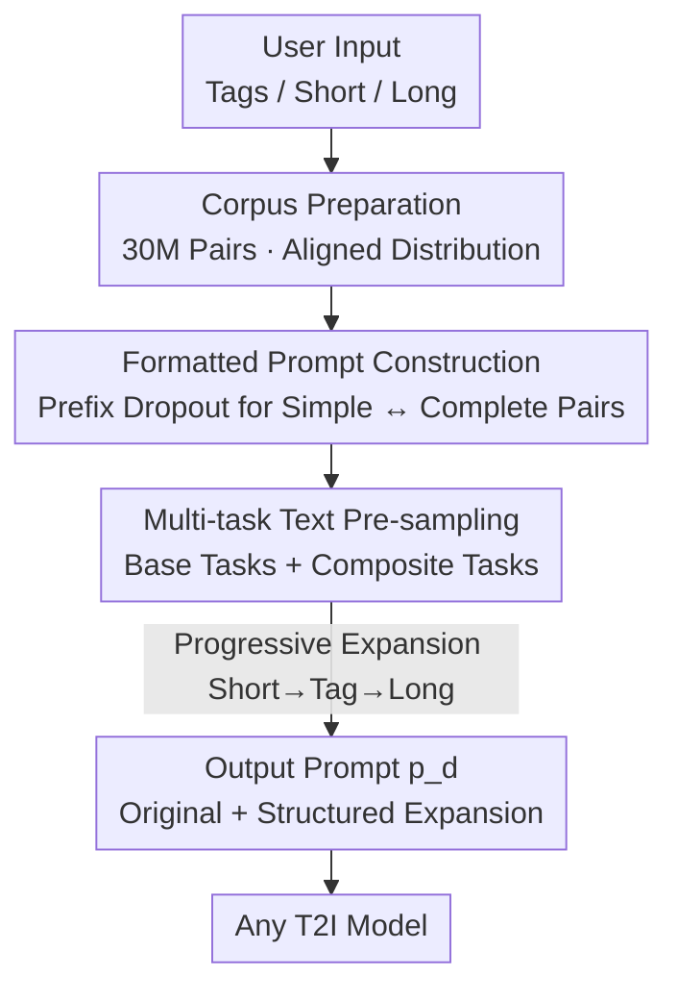

# TIPO: Text to Image with Text Pre-sampling for Prompt Optimization

**Conference**: ICLR 2026  
**OpenReview**: [https://openreview.net/forum?id=dDnw3Pp70x](https://openreview.net/forum?id=dDnw3Pp70x)  
**Code**: https://github.com/KohakuBlueleaf/KGen  
**Area**: Diffusion Models / Text-to-Image / Prompt Optimization  
**Keywords**: prompt optimization, text pre-sampling, distribution alignment, lightweight language models, multi-task training

## TL;DR
TIPO uses a 200M lightweight autoregressive language model to **expand (instead of rewrite)** simple user prompts into detailed prompts aligned with the text distribution of T2I model training. By leveraging a 30M image-text pair corpus and multi-task "text pre-sampling," it significantly enhances image quality, text alignment, and human preference while remaining faster and more efficient than RL or large-model solutions.

## Background & Motivation

**Background**: To achieve precise controllability, modern text-to-image (T2I) models are generally trained on long and detailed descriptions—ranging from comma-separated tag strings (like Danbooru) to multi-sentence natural language paragraphs generated by VLMs. Most models also undergo aesthetic fine-tuning (e.g., LAION-aesthetics), favoring detailed artistic style cues. Consequently, generating high-quality images becomes a skill reserved for "expert prompt engineers," as simple prompts from average users rarely trigger the models' optimal states.

**Limitations of Prior Work**: Existing prompt optimization paths face significant hurdles. (a) Direct rewriting by general LLMs: LLMs are trained on natural language (conversations/articles), which differs vastly from the structured prompt distribution of T2Is, often leading to misalignment. (b) Training LLMs on user-collected prompt libraries: Outputs are unstable due to the inconsistent quality of user inputs. (c) RL-based prompt training using aesthetic scores as rewards (e.g., Promptist): These are computationally expensive and tailored to specific T2I models, failing when the target model changes.

**Key Challenge**: The metric for a "good prompt" is essentially neither "linguistic fluency" nor "high aesthetic score," but whether it **falls within the distribution of the target T2I model's training text**. Existing methods align with either general language distributions (LLMs) or specific model rewards (RL), failing to directly align with the vast text distribution encountered during T2I training.

**Goal**: Construct a cross-model, computationally efficient prompt optimizer that progressively refines any coarse user input (tags, short phrases, or sentences) into a distribution-consistent, detail-rich, and easily editable prompt.

**Key Insight**: The authors formalize the problem as finding an optimized prompt $p_o$ in the prompt space $\mathcal{P}$ such that the distance $d$ between the T2I output distribution $I_p$ and the user intent distribution $I_u$ is minimized: $p_o = \arg\min_{p\in\mathcal{P}} d(I_p, I_u)$. Since $d$ represents image distribution distance (e.g., FID/FDD) and prompts determine the output distribution, "aligning prompts with the training text distribution" serves as a direct proxy for this optimal solution.

**Core Idea**: Transform prompt optimization into a large-scale multi-task pre-training objective. Use a lightweight language model to perform "text pre-sampling" **before** image sampling to extract expansion fragments from a broader semantic space that fall within the target sub-distribution. This involves **preserving the original user text and appending structured expansions**, rather than full rewriting.

## Method

### Overall Architecture

TIPO addresses the conversion of rough user prompts into detailed prompts preferred by T2I models through a three-step pipeline: First, **prepare a text corpus aligned with T2I training distributions** (30M image-text pairs, 40B tokens, filtered and balanced from Danbooru2023 / GBC10M / CoyoHD11M). Second, decompose each image description into "simple ↔ complete" pairs to construct uniformly formatted training samples. Finally, train a 200M LLaMA-based autoregressive model to learn to progressively expand simple inputs into full prompts via multiple "text pre-sampling" tasks. During inference, user inputs undergo pre-sampling transformations to output a contextually rich prompt $p_d$ consisting of "original text + structured expansions," which is then fed into any T2I model.

The key to this pipeline is that expansion fragments are appended to the user's original text in paragraph or tag form, making them information-rich yet **easy to edit or delete**—users can remove unsatisfactory segments without breaking the original intent.

### Key Designs

**1. Text Pre-sampling: Sampling text before images to constrain expansion within the target sub-distribution**

This is the core technology of TIPO, addressing distribution drift in LLM rewrites. Pre-sampling refers to "text sampling before image sampling": using a language model to sample a text expansion before the T2I model samples the image. Standard approaches fail—plain completion copies low-quality phrasing from inputs, while full rewriting risks deviating from user intent. TIPO adopts a middle ground: **retaining the original user input and only appending a structured, distribution-consistent expansion**. From a distribution perspective (Figure 2 in the paper), pre-sampling ensures the inferred output distribution both matches user expectations and retains detail and diversity.

**2. Prefix Dropout: Decomposing descriptions into "Simple as Prefix of Complete" pairs for natural autoregressive expansion**

Training the model to expand requires pairs of "simple prompt → complete prompt." TIPO creatively ensures that the **simple version $p_s$ is always a prefix of the complete version $p_o$**, allowing the model to complete the prompt by simply continuing after $p_s$. For tag-based descriptions: since tags are mostly order-independent, the full set $T=\{t_1,\dots,t_n\}$ is shuffled, and a subset $m<n$ is chosen as $T_s$, such that $p_s=\mathrm{concat}(T_s)$ and $p_o=\mathrm{concat}(T)$. For natural language (NL) descriptions: the first sentence usually carries key information. Thus, the **first sentence is kept, and subsequent sentences are randomly dropped in order** to create $S_s=[\text{sentence}_1, \text{sentence}_{i_2},\dots]$, with $p_s=\mathrm{concat}(S_s)$ and $p_o=\mathrm{concat}(S_s, S)$ to maintain the "prefix" property. Metadata like style, aspect ratio, quality, and year are unified as `<Category>: <Content>`, providing strong guidance to downstream T2I models.

**3. Progressive Refinement via Multi-task & Composite Tasks: A single model for all input types**

To make a single model compatible with tags, short sentences, and long sentences, TIPO breaks prompt optimization into a set of pre-sampling sub-tasks. **Base tasks** handle single-step transformations: `tag to long`, `long to tag`, `short to tag`, and `short to long`. **Composite tasks** chain two transformations in one forward pass (e.g., `short to tag to long`). Composite tasks provide holistic training signals and reduce inference overhead. At inference, these are chained progressively: if both tags $T_s$ and short NL $S_s$ are provided, `short to tag` generates $T_d$, then `tag to long` generates a refined NL, and finally `short to tag to long` synthesizes $T_d$ and NL into a full long prompt $S_d$.

### Loss & Training

The model uses the LLaMA architecture, with the primary experiment utilizing 200M parameters (100M and 500M variants were also trained). The training objective is standard autoregressive language modeling—predicting tokens of $p_o$ conditioned on $p_s$. Training samples are randomly drawn from the base and composite tasks to enhance generalization. The training corpus consists of approximately 40B tokens from Danbooru2023, GBC10M, and CoyoHD11M.

## Key Experimental Results

### Main Results

Comparisons cover in-domain (tags, short NL, truncated long NL) and out-of-domain (OOD) settings. Metrics include FDD↓ (Fréchet DINO Distance), Aesthetic↑, AI Corrupt↓ (artifact detection), and Vendi↑ (diversity). Baselines include GPT-4o-mini zero-shot, MagicPrompt (GPT-2 fine-tuned), and Promptist (RL).

| Task / Metric | Original | GPT | MagicPrompt | Promptist | TIPO |
|------|------|------|------|------|------|
| In-domain Tag · FDD↓ | 0.3558 | 0.5414 | 0.3247 | 0.2350 | **0.2282** |
| In-domain Tag · Corrupt↓ | 0.5743 | 0.2510 | 0.4976 | 0.4331 | **0.0805** |
| In-domain Short NL · Corrupt↓ | 0.2887 | 0.3015 | 0.2936 | 0.3686 | **0.2870** |
| Truncated Long NL · Aesthetic↑ | 5.7497 | **6.0168** | 5.8191 | 5.7759 | 5.8364 |
| OOD · Vendi↑ | N/A | 8.97 | 15.87 | 16.49 | **21.57** |
| **Overall Rank↓** | 2.58 | 3.00 | 3.00 | 3.87 | **2.07** |

Key takeaway: TIPO reduces AI Corrupt from 0.43 (Promptist)/0.25 (GPT) to **0.0805** and achieves the lowest FDD, indicating the best alignment with T2I distributions. While GPT often scores highest in aesthetics, its poor FDD and high corruptions exemplify "good-looking language but wrong distribution." TIPO ranks first overall at **2.07**.

### Mechanism & Efficiency

| Dimension | Result |
|------|------|
| Compatibility (FLUX.1-dev / Omnigen2 / Lumina-2 / HiDream-I1 / Gemini-2.0-Flash) | TIPO generally improves aesthetics and reduces artifacts; even with Gemini's built-in optimization, TIPO provides gains. |
| Inference Latency | TIPO is 1.03s, **29.4%** faster than Promptist, 25.6% faster than PromptExtend, and 9.6% faster than MagicPrompt. |
| Human Preference (221 users, 1400+ comparisons) | TIPO achieves an overall win rate of **51.3%** (rising to 52.5% in OOD); summary reports 62.8% pairwise win rate. |
| Distribution Alignment (FD & MMD↓) | TIPO achieves superior alignment across all prompt types/encoders/metrics (e.g., Short NL Jina FD 0.0322 vs. Promptist 0.1003). |

### Key Findings
- **Distribution alignment is the root cause**: Table 5 validates that TIPO-optimized prompts are closest to T2I training text in embedding space, regardless of the encoder.
- **Aesthetic score $\neq$ quality**: GPT scores high in aesthetics but has high FDD and more artifacts, warning against relying on single aesthetic metrics.
- **Diversity surge in OOD**: When the T2I model (SD-3.5-Large) training data does not overlap with TIPO, TIPO expands Vendi scores from ~9 to **21.57**, significantly increasing diversity while maintaining thematic consistency.

## Highlights & Insights
- **"Expansion, not Rewriting" is a vital engineering trade-off**: Retaining user text while appending editable structured fragments solves both alignment and control issues.
- **Prefix dropout creates signals from unpaired data**: Random sub-setting for tags and sentence-order preservation for NL allows a single description to generate "simple" and "complex" pairs naturally suited for autoregressive tasks.
- **Aligning with distributions beats model scaling**: A 200M model outperforms GPT-4o-mini and RL schemes in quality, alignment, and human preference by focusing on target distribution alignment.

## Limitations & Future Work
- The authors leave stronger backbones (GPT/Qwen) for future work; currently, only LLaMA-200M is verified.
- In in-domain NL settings, gains are less pronounced than in tag-based or OOD tasks, as all methods sacrifice some fidelity/diversity for detail.
- The 62.8% win rate in the abstract differs from the 51.3% in Figure 5a (likely due to subset choice); caution is needed when citing.
- Performance depends on access to large-scale data close to the T2I training distribution; gains diminish on closed-source models with radically different private distributions.

## Related Work & Insights
- **vs. Promptist (RL)**: Promptist uses CLIP rewards for online RL on a single model (90K samples). TIPO uses 30M+ samples for offline distribution alignment, making it cross-model and 29.4% faster.
- **vs. GPT-4o-mini**: GPT aligns with general language, resulting in aesthetic but distribution-drifted prompts. TIPO aligns with T2I training text, resulting in better FDD/Corruptions.
- **vs. VLM Iterative Refinement**: Such methods involve iterative output-evaluation loops which are slow; TIPO achieves alignment in a single forward pass without an image feedback loop.

## Rating
- Novelty: ⭐⭐⭐⭐ Clear perspective on "text pre-sampling" and distribution alignment.
- Experimental Thoroughness: ⭐⭐⭐⭐⭐ Comprehensive verification across domains, backbones, and metrics.
- Writing Quality: ⭐⭐⭐⭐ Clear formalization and visuals.
- Value: ⭐⭐⭐⭐⭐ Extremely practical for T2I prompt engineering—lightweight, cross-model, and open-source.

<!-- RELATED:START -->

## Related Papers

- [\[ICLR 2026\] Long-Text-to-Image Generation via Compositional Prompt Decomposition](long-text-to-image_generation_via_compositional_prompt_decomposition.md)
- [\[CVPR 2025\] Minority-Focused Text-to-Image Generation via Prompt Optimization](../../CVPR2025/image_generation/minority-focused_text-to-image_generation_via_prompt_optimization.md)
- [\[ICLR 2026\] Diverse Text-to-Image Generation via Contrastive Noise Optimization](diverse_text-to-image_generation_via_contrastive_noise_optimization.md)
- [\[ICLR 2026\] Consistent Text-to-Image Generation via Scene De-Contextualization](consistent_text-to-image_generation_via_scene_de-contextualization.md)
- [\[CVPR 2026\] Curriculum Group Policy Optimization: Adaptive Sampling for Unleashing the Potential of Text-to-Image Generation](../../CVPR2026/image_generation/curriculum_group_policy_optimization_adaptive_sampling_for_unleashing_the_potent.md)

<!-- RELATED:END -->
