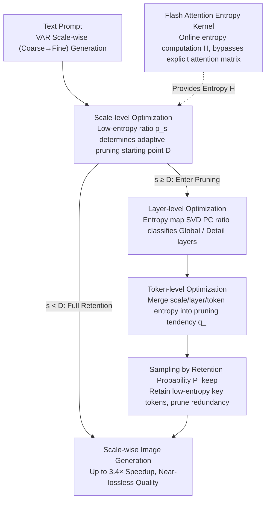

# ToProVAR: Efficient Visual Autoregressive Modeling via Tri-Dimensional Entropy-Aware Semantic Analysis and Sparsity Optimization

## Meta Information
- **Conference**: ICLR 2026
- **arXiv**: [2602.22948](https://arxiv.org/abs/2602.22948)
- **Code**: Coming soon
- **Area**: Others
- **Keywords**: VAR, attention entropy, token pruning, model acceleration, tri-dimensional sparsity optimization

## TL;DR

The ToProVAR framework is proposed, which utilizes attention entropy to uniformly analyze the sparsity of VAR models across token, layer, and scale dimensions. It achieves up to 3.4× acceleration with near-zero loss in image quality, significantly outperforming FastVAR and SkipVAR.

## Background & Motivation

Visual Autoregressive (VAR) models shift image generation from "token-by-token prediction" to "resolution-by-resolution prediction" (coarse-to-fine), enabling GPT-style AR models to surpass diffusion models in image quality for the first time. However, the **Core Problem** is: **the number of tokens grows exponentially with resolution, leading to extremely low computational efficiency in the later stages**.

Limitations of Prior Work:
- **FastVAR**: Retains a fixed proportion of high-frequency tokens in the token dimension → low-frequency but semantically critical tokens are pruned → **semantic loss**.
- **SkipVAR**: Skips certain scales or replaces unconditional branches in the scale dimension → **detail collapse**.
- Both are based on **single-dimensional sparsity analysis**, failing to capture complex relative relationships between tokens.

**Key Challenge**: (1) Requires fine-grained sparsity analysis to prevent information loss; (2) Requires multi-dimensional representations to evaluate token importance; (3) The analysis itself must be efficient without introducing excessive overhead.

## Method

### Overall Architecture

ToProVAR addresses the pain point of "exponential token expansion and compute waste in later scales" of VAR models. It utilizes attention entropy $\mathcal{H}(q_i) = -\sum_{j=1}^{N} \alpha_{i,j} \log \alpha_{i,j}$ as a unified global metric—low entropy implies concentrated attention on specific targets and strong semantic selectivity, while high entropy implies uniform attention distribution and weak semantic focus. Centered on this metric, the framework determines "which computations are redundant" step-by-step across **scale, layer, and token dimensions**: first determining "from which scale to start pruning" in the scale dimension, then distinguishing "which layers are pruneable" in the layer dimension, and finally merging tri-dimensional information into a disposal probability for each token. To make this entropy analysis practical, the key lies in a rewritten FlashAttention kernel (Flash Attention Entropy), which reduces the online computation cost of entropy to near zero, enabling fine-grained pruning for VAR generation **without retraining**.

### Key Designs

**1. Scale-level Optimization: Using low-entropy ratio to automatically determine the pruning starting point**

VAR generates images from coarse to fine across scales, but different images require different depths—complex objects like a "cyber fox" rely on deep scales for details, while a letter "W" stabilizes at shallower scales. ToProVAR calculates the proportion of tokens with entropy lower than the scale average $\rho_s = \frac{|\{i \mid H_i^s < \bar{H}^s\}|}{N_s}$ at each scale $s$, and sets the first scale where the proportion exceeds a threshold as the pruning starting point $D = \min\{s \mid \rho_s \geq \tau\}$. As generation converges, $\rho_s$ stabilizes, indicating many tokens have entered a "determined low-entropy" state and subsequent computation is mostly redundant. The threshold $\tau$ is calibrated via a pre-sampling experiment, making the pruning starting point adaptive for each image rather than a fixed ratio.

**2. Layer-level Optimization: Using principal component ratios of entropy maps to classify layers into pruneable and non-pruneable**

Extending the entropy perspective from individual tokens to the full layer distribution reveals two structurally distinct types of layers: Global Layers exhibit uniform grid-like attention with prominent principal components, responsible for global spatial relationships; Detail Layers exhibit semantic-driven local attention with less prominent principal components, refining local textures. To distinguish them, SVD is applied to the entropy map to calculate the principal component ratio $\varrho^{(l,s)} = \sigma_1^{(l,s)} / \sigma_2^{(l,s)}$, which is mapped to a layer representation score $\mathcal{R}^{(l,s)} = \exp(-\beta(\varrho^{(l,s)}-1))$. Scores close to 1 indicate Detail Layers, which are safe to prune; scores close to 0 indicate Global Layers, which must be retained. Real-world tests show that compressing Global Layers by over 50% leads to severe degradation, while Detail Layers maintain high fidelity even at 90% compression. Thus, the layer score directly determines the allowable sparsity per layer.

**3. Token-level Optimization: Merging tri-dimensional information into a single pruning tendency for sampled retention**

The previous steps provide "at which scale to prune" and "which layers are pruneable." The token-level optimization multiplies the scale factor, layer score, and normalized token entropy to obtain a unified pruning tendency $q_i^{(s,l)} = \phi(s) \cdot \mathcal{R}^{(l,s)} \cdot \hat{H}_i^{(s,l)}$, where $\phi(s) = s / S_{\max}$ is a factor that grows monotonically with scale. The final retention probability is:

$$P_{\text{keep}}(i|s,l) = \begin{cases} 1, & s < D \\ 1 - \text{clip}\big(\alpha_{\min} + (\alpha_{\max}-\alpha_{\min})\,q_i^{(s,l)},\ 0,\ 1\big), & \text{otherwise} \end{cases}$$

Scales before the pruning starting point are fully retained, while subsequent scales apply pruning intensity linearly mapped between $[\alpha_{\min}, \alpha_{\max}]$ based on $q_i$. Consequently, tokens with high entropy, in later scales, and in Detail Layers are most likely to be pruned, while low-entropy semantically critical tokens are preserved even if they have low frequency—addressing FastVAR's weakness of accidentally deleting critical low-frequency tokens.

**4. Flash Attention Entropy: Ensuring online entropy computation does not rely on explicit attention matrices**

Calculating entropy by its definition requires the explicit construction of an $N \times N$ attention matrix, which conflicts with the block-wise accumulation kernel of FlashAttention and would cause the overhead of the three-dimensional analysis to spiral out of control. ToProVAR utilizes the algebraic identity $kx\log(kx) = kx\log x + (\log k)\cdot xk$ to decompose entropy into several statistics that can be accumulated online during block processing. This allows entropy to be computed directly within the FlashAttention kernel without materializing the full matrix. The cost is only approximately 0.17ms (compared to 12.06ms for naive computation at scale 10, a reduction of ~90%), which transforms the "tri-dimensional entropy analysis" from a theoretical possibility into a truly usable end-to-end acceleration solution.

## Main Results (GenEval + DPG)

| Method | GenEval Overall ↑ | DPG Overall ↑ | Latency (s) ↓ | Speedup |
|------|-------------------|---------------|----------|--------|
| Infinity-2B | 0.69 | 83.41 | 2.10 | 1.0× |
| +FastVAR | 0.68 | 83.39 | 0.80 | 2.6× |
| +SkipVAR | 0.67 | 82.94 | 1.10 | 2.0× |
| **+ToProVAR (Ours)** | **0.69** | 83.07 | **0.61** | **3.4×** |
| Infinity-8B | 0.83 | 86.68 | 4.86 | 1.0× |
| +FastVAR | 0.81 | 86.50 | 2.01 | 2.4× |
| +SkipVAR | 0.82 | 86.44 | 2.11 | 2.3× |
| **+ToProVAR (Ours)** | **0.83** | **86.70** | **1.78** | **2.7×** |

### Human Preference Benchmarks (HPSv2 + ImageReward)

On Infinity-8B, ToProVAR reduces latency by 67%, while ImageReward remains consistent (1.04 vs 1.04) and HPSv2 decreases by only 0.41.

### MJHQ30K Perceptual Quality

In the People category, FID even decreased from 58.91 to 58.84 (improvement while accelerating), while FID for Landscape and Food categories remained almost unchanged.

## Ablation Study

| Configuration | Latency (s) | Speedup | GenEval ↑ |
|------|---------|--------|-----------|
| Only Scale Depth | 0.47 | 4.5× | 0.477 |
| + Layer Repr. | 0.57 | 3.7× | 0.679 |
| + Token Pruning (Full) | 0.61 | 3.4× | **0.690** |

- Using only scale depth for acceleration is the most aggressive but leads to severe quality degradation.
- Gradually adding layer-level and token-level optimizations recovers quality.
- Flash Attention Entropy is key to efficiency: latency is 1.10s without FAE vs 0.61s with FAE.

### Computational Overhead Analysis

- FAE adds only 0.17ms at scale=10 (vs 12.06ms for naive computation, a ~90% reduction).
- Layer-level SVD analysis totals 49.84ms, accounting for < 3% of end-to-end latency.

## Highlights & Insights

- Attention entropy serves as a unified metric, elegantly connecting sparsity analysis across three dimensions.
- The Flash Attention Entropy engineering contribution is significant, making online entropy computation practical.
- Achieves 3.4× speedup with lossless quality on Infinity-2B (GenEval unchanged), and 2.7× speedup on 8B with a slight Gain in DPG.
- Visual comparisons clearly demonstrate the resolution of semantic loss, structural distortion, and detail collapse issues.

## Limitations & Future Work

- Validated only on Infinity-2B/8B (VAR architecture); other VAR variants have not been tested.
- Threshold $\tau$ and hyperparameters $\alpha_{\min}, \alpha_{\max}$ require calibration via pre-sampling.
- Although efficient, tri-dimensional analysis still introduces approximately 3% additional overhead.
- Joint optimization of training-time and inference-time strategies was not explored.
- Focused only on image generation; not yet extended to video or multimodal generation.

## Related Work & Insights

- **VAR Models**: Tian et al. (VAR), Infinity (Han et al.) — Scale-wise prediction paradigm.
- **VAR Acceleration**: FastVAR (frequency pruning), SkipVAR (scale skipping), SparseVAR (token sparsity), CoDe (collaborative decoding).
- **Diffusion Model Acceleration**: Distillation, quantization, pruning, feature caching — not directly applicable to VAR.
- **KV Cache Optimization**: HACK, ScaleKV — complementary directions.

## Rating

- **Novelty**: ⭐⭐⭐⭐⭐ — The tri-dimensional attention entropy analysis framework is entirely new.
- **Technical Depth**: ⭐⭐⭐⭐⭐ — Solid theoretical analysis combined with engineering implementation (FAE).
- **Experimental Thoroughness**: ⭐⭐⭐⭐ — Comprehensive metrics across multiple benchmarks with detailed ablations.
- **Value**: ⭐⭐⭐⭐⭐ — 3.4× acceleration with lossless quality, ready for practical application.

<!-- RELATED:START -->

## Related Papers

- [\[NeurIPS 2025\] InfinityStar: Unified Spacetime AutoRegressive Modeling for Visual Generation](../../NeurIPS2025/image_generation/infinitystar_unified_spacetime_autoregressive_modeling_for_v.md)
- [\[AAAI 2026\] Hierarchical Schedule Optimization for Fast and Robust Diffusion Model Sampling](../../AAAI2026/image_generation/hierarchical_schedule_optimization_for_fast_and_robust_diffusion_model_sampling.md)
- [\[ICLR 2026\] Intention-Conditioned Flow Occupancy Models](intention-conditioned_flow_occupancy_models.md)
- [\[ICCV 2025\] Timestep-Aware Diffusion Model for Extreme Image Rescaling](../../ICCV2025/image_generation/timestep-aware_diffusion_model_for_extreme_image_rescaling.md)
- [\[ICCV 2025\] EDiT: Efficient Diffusion Transformers with Linear Compressed Attention](../../ICCV2025/image_generation/edit_efficient_diffusion_transformers_with_linear_compressed_attention.md)

<!-- RELATED:END -->
