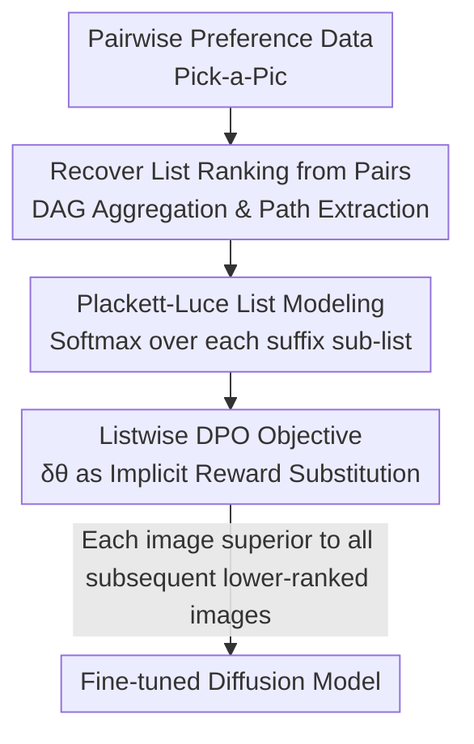

# Towards Better Optimization for Listwise Preference in Diffusion Models

**Conference**: ICLR 2026  
**OpenReview**: [https://openreview.net/forum?id=ippWaS9PG9](https://openreview.net/forum?id=ippWaS9PG9)  
**Area**: Diffusion Models / Alignment RLHF  
**Keywords**: Diffusion Model Alignment, Listwise Preference Optimization, Plackett-Luce, Direct Preference Optimization, Text-to-Image

## TL;DR
This paper proposes Diffusion-LPO, extending DPO preference alignment for diffusion models from "pairwise comparisons" to "full ranked lists." By deriving a listwise objective using the Plackett-Luce model, it ensures every image is superior to all lower-ranked images in a list. It consistently outperforms pairwise Diffusion-DPO across text-to-image, image editing, and personalized alignment tasks (achieving a >12% PickScore win rate improvement on SD1.5).

## Background & Motivation
**Background**: Text-to-image diffusion models (e.g., Stable Diffusion, SDXL) require further alignment with human preferences after pre-training. Drawing from LLM RLHF, a mainstream approach is Direct Preference Optimization (DPO), which bypasses explicit reward models by directly steering the model toward preferred outputs. Diffusion-DPO adapts this by using the relative improvement in denoising loss as an implicit reward, becoming a primary method for aligning diffusion models.

**Limitations of Prior Work**: Most DPO work for diffusion models relies solely on **pairwise preference** data based on the Bradley-Terry model, which only fits binary "winner vs. single loser" outcomes. However, human preferences are naturally **ranked lists**; users provide relative orders when faced with multiple candidates. Forcing lists into disjoint pairs loses the transitive structural information. The authors observe in the Pick-a-Pic dataset that **56% of pairwise annotations can be aggregated into consistent rankings of length >2**, yet this richer ranking information is wasted in pairwise modeling.

**Key Challenge**: Human feedback is inherently listwise, while existing objective functions only model pairwise relationships. Current attempts to use list information face a dilemma: existing list extensions (e.g., breaking a list of length $m$ into $m(m-1)/2$ pairs) either require external reward models/evaluators to score each image (adding computational burden) or reduce the ranking to equally weighted pairwise comparisons, losing the global normalization structure of the list.

**Goal**: Enable diffusion models to learn full relative rankings directly from listwise human feedback without introducing additional reward models.

**Key Insight**: The authors note that recoverable rankings are implicit in pairwise annotations ($x^{(a)}\succ x^{(b)}$ and $x^{(b)}\succ x^{(c)}$ imply $x^{(a)}\succ x^{(b)}\succ x^{(c)}$). The Plackett-Luce (PL) model is a probabilistic model specifically designed for listwise rankings—it normalizes the "current best item" against "all remaining lower-ranked items" via softmax at each step, naturally characterizing the entire sequence.

**Core Idea**: Replace the Bradley-Terry model with the Plackett-Luce model to derive a listwise DPO objective. This forces each sample to be superior to all subsequent lower-ranked samples, preserving the complete relative order. When the list length is 2, it precisely reduces to Diffusion-DPO.

## Method

### Overall Architecture
The pipeline for Diffusion-LPO involves: first, aggregating scattered pairwise preferences from Pick-a-Pic (e.g., $x_a\succ x_b$, $x_b\succ x_c$ under the same prompt) into a Directed Acyclic Graph (DAG) to extract listwise ranking paths $x^{(1)}\succ x^{(2)}\succ\cdots\succ x^{(m)}$. Next, the Plackett-Luce model defines the likelihood of the full ranking, substituting the diffusion model's denoising improvement $\delta_\theta$ as the implicit reward to derive the listwise preference optimization objective $L_{\text{Diffusion-LPO}}$. Finally, the diffusion model is fine-tuned using this objective, ensuring that at each step, the reward of high-ranked images normalizedly outweighs all lower-ranked images. This method requires no external reward models or evaluators.

### Key Designs

**1. Recovering List Ranking from Pairs: Aggregating scattered annotations into DAG ranking paths**

This step addresses the lack of ready-made list datasets. Instead of collecting new data, the authors utilize the transitivity of pairwise preferences: if $x_a\succ x_b$ and $x_b\succ x_c$ exist for prompt $c$, the list $x_a\succ x_b\succ x_c$ is formed. Specifically, all pairwise preferences are organized into a **Directed Acyclic Graph (DAG)** where nodes are images and edges represent preference directions. Directed paths are then extracted as sub-lists. This converts 56% of aggregatable pairwise annotations in Pick-a-Pic into richer listwise supervision without manual re-labeling. The maximum list length is set to 8 (covering ~95% of lists), and list sizes vary between 2 and 8 during training.

**2. Plackett-Luce Listwise Preference Objective: Normalized superiority over all lower-ranked samples**

This is the core contribution. Given a set of ranked candidates $G=\{x^{(1)},\dots,x^{(m)}\}$ for a prompt $c$, the Plackett-Luce model defines the probability of the ranking as a product of softmax terms over each suffix sub-list:

$$p_{\text{PL}}(x^{(1)}\succ\cdots\succ x^{(m)}\mid c)=\prod_{j=1}^{m}\frac{\exp\big(r(c,x^{(j)})\big)}{\sum_{k=j}^{m}\exp\big(r(c,x^{(k)})\big)}$$

This implies that at step $j$, the selected $x^{(j)}$ must have the highest preference among "itself and all remaining lower-ranked candidates." Integrating this into the RLHF objective (with KL regularization against a reference policy) and following Diffusion-DPO by using the denoising improvement $\delta_\theta(c,x_t,t):=-\big(\|\epsilon-\epsilon_\theta(x_t,c,t)\|_2^2-\|\epsilon-\epsilon_{\text{ref}}(x_t,c,t)\|_2^2\big)$ as a proxy for implicit reward, the listwise objective is derived:

$$L_{\text{Diffusion-LPO}}(\theta)=-\mathbb{E}\sum_{j=1}^{m}\Big[\beta T\omega(\lambda_t)\,\delta_\theta(c,x_t^{(j)},t)-\log\sum_{k=j}^{m}\exp\big(\beta T\omega(\lambda_t)\,\delta_\theta(c,x_t^{(k)},t)\big)\Big]$$

This imposes a constraint at each position $j$: the implicit reward of the positive sample $x^{(j)}$ should exceed the log-sum-exp normalization of the "negative set from $j$ to $m$." Unlike pairwise DPO, which only compares one winner to one loser, this objective enforces consistency across the full ranking, and reduces to Diffusion-DPO when $m=2$.

**3. List Normalization vs. Pairwise Decomposition: Correcting reward underestimation in GP-DPO**

The authors denote the naive approach of breaking a list into $m(m-1)/2$ equal pairs as **Group Pairwise DPO (GP-DPO)**. They theoretically demonstrate why LPO is superior. Let $s_\theta^{(j)}:=\frac{p_\theta(x_{0:T}^{(j)}\mid c)}{p_{\text{ref}}(x_{0:T}^{(j)}\mid c)}$ be the policy-related score. When optimizing for $x^{(j)}$ against its negative set, the "aggregated reward" of the negatives differs: Diffusion-LPO uses a direct $\log\sum_{k=j}^{m}(s^{(k)})^\beta$ normalization for the negative group, while GP-DPO averages separate pairings $\frac{1}{m-j+1}\sum_k\log((s^{(j)})^\beta+(s^{(k)})^\beta)$. The authors prove the former is an upper bound on the latter, meaning GP-DPO **underestimates the aggregated reward of the negative group**, creating an artificially inflated margin between the positive $x^{(j)}$ and its negatives. LPO's unified normalization ensures high-ranked samples are appropriately favored.

### Loss & Training
The training target is the $L_{\text{Diffusion-LPO}}$ defined above. Backbones include SD1.5 and SDXL, with data being lists (max length 8) aggregated via DAG from Pick-a-Pic v1. $\beta$ controls KL regularization strength, $\omega(\lambda_t)$ is the SNR-based weight, and $T$ is the number of diffusion steps. Comparisons are made against baselines not requiring extra reward models (SFT, Diffusion-DPO, DSPO).

## Key Experimental Results

### Main Results
Text-to-Image Alignment: Evaluated on Pick-a-Pic / Parti-Prompts / HPSV2 using relative win rates from five automated evaluators: PickScore (PS), HPSV2, CLIP, Image Reward (IM), and Aesthetic (AES).

| Backbone | Test Set | Metric | Diffusion-LPO | Diffusion-DPO | Note |
|------|--------|------|---------------|---------------|------|
| SD1.5 | Pick-a-Pic | PS↑ | **80.4%** | 68.2% | PickScore win rate +12% |
| SD1.5 | HPSV2 | PS↑ | **82.9%** | 69.5% | Consistently leading |
| SDXL | Parti-Prompts | PS↑ | **72.8%** | 66.8% | +6% |
| SDXL | HPSV2 | HPS↑ | **85.0%** | 80.0% | +5% |
| SDXL | Pick-a-Pic | IM↑ | **73.7%** | 66.4% | Outperforms DPO* trained on v2 data |

Diffusion-LPO improves PickScore win rates by over 12% on SD1.5 and, in most metrics, **outperforms Diffusion-DPO\* trained with nearly double the data (Pick-a-Pic v2)**. While SFT is competitive on SD1.5, its win rate drops below 50% on SDXL (due to data quality mismatches with high-quality SDXL generation), whereas LPO maintains a stable lead via relative ranking information.

Image Editing (InstructPix2Pix, SD1.5): Relative to Diffusion-DPO, DINO win rate +4.3%, CLIP +3.6%, L1 +3.8%. On the ImgEdit benchmark with GPT-4o judgment, win rate against Diffusion-DPO is 56.3%.

Personalization (PPD pipeline, SD1.5): Replacing PPD's pairwise loss with LPO increased win rates for held-in users from 71.1% to 72.3%, and for held-out users from 70.3% to **80.2%**, showing significant gains in generalization to unseen users.

### Ablation Study

| Configuration | Key Metric | Note |
|------|---------|------|
| LPO vs GP-DPO (PS, Pick-a-Pic) | 52.3% | LPO win rate over pairwise decomposition |
| LPO vs GP-DPO (AES, Pick-a-Pic) | 53.7% | Empirical advantage of list normalization |
| Max list size = 4 | Avg 68.2% | Shorter lists |
| Max list size = 8 | Avg 69.1% | +1% overall improvement from 4 to 8 |
| Max list size = 12 | Avg 69.3% | Marginal gain beyond length 8 |

### Key Findings
- **List Normalization > Pairwise Decomposition**: Under identical training settings, Diffusion-LPO consistently outperforms GP-DPO with statistical significance across most metrics, empirically validating the theory regarding reward underestimation in GP-DPO.
- **List Length of 8 is Sufficient**: Increasing max length from 4 to 8 yields a ~1% overall gain; increasing to 12 shows diminishing returns, matching the distribution where ~95% of lists are length $\le 8$.
- **Generalization Gains in Personalization**: The win rate for held-out users jumped from 70.3% to 80.2%, suggesting listwise supervision provides relative ranking information that is highly beneficial for generalization.
- **Universal Plug-and-Play**: As a generalization of pairwise DPO, LPO can be applied to DSPO or PPD for further gains. It is effective for both U-Net (SD1.5/SDXL) and DiT (SD3.5-Medium) backbones.

## Highlights & Insights
- **"Lists are hidden in pairs" is a clean observation**: No new data collection is needed; simply aggregating existing pairwise preferences via DAG transitivity upgrades supervision. 56% of annotations are reused, providing richer signals at almost zero cost.
- **Plackett-Luce suffix softmax aligns perfectly with DPO's implicit reward**: The likelihood formulation naturally corresponds to "each image suppressing all subsequent lower-ranking ones," and the fact that it reduces to DPO for $m=2$ makes it a strict generalization.
- **Theoretically identifying systematic bias in pairwise decomposition**: Using an upper-bound inequality, the authors clarify why GP-DPO underestimates negative rewards and inflates margins. This analysis can be transferred to examine other alignment methods that break rankings into pairs.
- **High Portability**: The listwise objective is a plug-and-play loss replacement. Any method built on Diffusion-DPO (e.g., DSPO, personalized PPD) can directly benefit.

## Limitations & Future Work
- **Dependency on aggregatable rankings**: If pairwise preferences are sparse or contain many conflicts (cycles in the DAG), the recoverable list information is limited, reducing the gains. The 56% aggregation rate in Pick-a-Pic might not generalize to all datasets.
- **Reliance on automated evaluators and GPT-4o**: Evaluators like PickScore/HPS are inherently biased; high win rates do not perfectly equate to real human preference improvements.
- **Total order assumption within lists**: The method assumes full-order paths can be extracted, with less discussion on handling partial orders or ties (incomparable nodes in the DAG).
- **Future Directions**: Exploring list modeling with uncertainty/ties, adaptive $\beta$ based on list length, and scaling to stronger DiT backbones with larger preference datasets.

## Related Work & Insights
- **vs. Diffusion-DPO**: DPO utilizes Bradley-Terry for pairwise winner-vs-single-loser modeling; Ours uses Plackett-Luce for full rankings where each image suppresses all lower-ranked ones. It is a strict generalization with higher alignment quality.
- **vs. GP-DPO (Equal weight pairwise decomposition)**: GP-DPO breaks lists into $m(m-1)/2$ pairs, which theoretically underestimates negative aggregate rewards and inflates margins. Ours uses unified normalization across the negative set and consistently outperforms GP-DPO in ablations.
- **vs. Listwise methods requiring external evaluators**: Existing list extensions often rely on auxiliary reward models to score each image; Ours uses denoising improvement as an implicit reward, requiring no external models.
- **vs. DSPO / Diffusion-KTO / MaPO**: These are variants of the pairwise DPO family. Our listwise objective can be treated as an orthogonal loss replacement (validated by further gains when combined with DSPO).

## Rating
- Novelty: ⭐⭐⭐⭐ Systematically introduces Plackett-Luce listwise preference to diffusion DPO with theoretical superiority analysis over pairwise decomposition.
- Experimental Thoroughness: ⭐⭐⭐⭐ Covers T2I, editing, and personalization across two backbones, including GP-DPO comparisons and list length ablations.
- Writing Quality: ⭐⭐⭐⭐ Clear motivation and derivation, moving seamlessly from observation to objective to theory.
- Value: ⭐⭐⭐⭐ Plug-and-play, zero extra data cost, and stackable with the entire Diffusion-DPO family.

<!-- RELATED:START -->

## Related Papers

- [\[ICLR 2026\] Reinforcing Diffusion Models by Direct Group Preference Optimization](reinforcing_diffusion_models_by_direct_group_preference_optimization.md)
- [\[ICLR 2026\] Diffusion Negative Preference Optimization Made Simple](diffusion_negative_preference_optimization_made_simple.md)
- [\[ICLR 2026\] ViPO: Visual Preference Optimization at Scale](vipo_visual_preference_optimization_at_scale.md)
- [\[AAAI 2026\] Rethinking Direct Preference Optimization in Diffusion Models](../../AAAI2026/image_generation/rethinking_direct_preference_optimization_in_diffusion_models.md)
- [\[ICLR 2026\] PCPO: Proportionate Credit Policy Optimization for Preference Alignment of Image Generation Models](pcpo_proportionate_credit_policy_optimization_for_preference_alignment_of_image_.md)

<!-- RELATED:END -->
