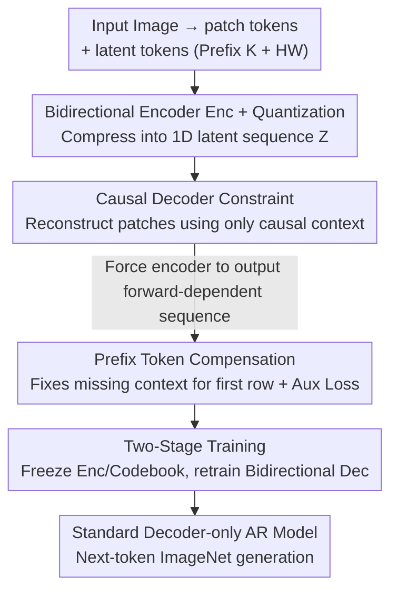

# Towards Sequence Modeling Alignment Between Tokenizer and Autoregressive Model

**Conference**: ICLR 2026  
**OpenReview**: [https://openreview.net/forum?id=GT3obnZ5Fk](https://openreview.net/forum?id=GT3obnZ5Fk)  
**Code**: https://github.com/ (Yes, labeled as the AliTok repository in the paper)  
**Area**: Image Generation / Autoregressive / Visual Tokenizer  
**Keywords**: Visual Tokenizer, Autoregressive Image Generation, Causal Decoder, Forward Dependency, ImageNet

## TL;DR
This paper points out that tokens encoded by conventional image tokenizers exhibit **bidirectional dependency**, which fundamentally conflicts with the strictly unidirectional prediction paradigm of autoregressive (AR) models. The authors propose AliTok, which uses a **causal decoder to constrain a bidirectional encoder**, forcing the production of token sequences that are both semantically rich and highly predictable. This allows a standard decoder-only AR model with only 662M parameters to achieve a gFID of 1.28 on ImageNet-256, surpassing SOTA diffusion models for the first time while being 10× faster in sampling.

## Background & Motivation

**Background**: GPT-style decoder-only Transformers have dominated NLP due to the simple and scalable "next-token prediction" paradigm. The community naturally seeks to extend this to image generation—compressing images into 1D token sequences and predicting them sequentially via raster scan. The primary appeal of this path is its simplicity and ease of multi-modal integration.

**Limitations of Prior Work**: In practice, standard raster-scan AR models (such as LlamaGen) have performed poorly on images. To address this, recent works have modified models or generation paradigms—using Masked Autoregression (MaskGIT, MAR), next-scale prediction (VAR), or random ordering (RandAR). These methods incorporate **bidirectional attention** within the AR framework. While more powerful, they complicate the generation process, deviate from the classic AR paradigm, and increase the difficulty of multi-modal unification.

**Key Challenge**: The authors identify the root cause: it is not the AR model that is flawed, but the **dependency structure of the data itself**. Language is naturally compact, with words and indices mapping one-to-one; images are high-dimensional and redundant, requiring learnable tokenizers for compression. To achieve maximum reconstruction fidelity, conventional tokenizers **encourage global coordinated encoding across all tokens**: a token's representation implicitly depends on its non-causal context, especially tokens occurring **after** it in raster order. Consequently, a target token $x_i$ depends on future content $x_{>i}$, and the conditional distribution $p(x_i \mid x_{<i})$ that the AR model must learn becomes a marginalization over all unknown futures. This is naturally high-entropy, suppressing convergence and generation quality.

**Goal**: Instead of modifying the model to accommodate the data, this work aims to do the opposite—injecting **forward dependency** directly into the token sequence to align the data with the simple power of decoder-only AR models. This involves two sub-problems: (1) making the sequence highly predictable and (2) doing so without sacrificing reconstruction fidelity.

**Key Insight**: The authors conducted a validation experiment by forcing the encoder into a causal structure (prohibiting previous patches from seeing the future). The result was instructive: AR training accuracy surged from 5.4% to 11.2% (vastly improving sequence predictability), but the loss of a global receptive field caused reconstruction rFID to collapse from 0.98 to 1.56. This indicates a genuine tension between "predictability" and "high fidelity"; the key is to achieve **both**.

**Core Idea**: Decouple "global semantic construction" from "causal sequence constraints." Allow a bidirectional encoder to build semantics using a global receptive field as usual, but couple it with a **causal decoder** acting as an implicit regularizer. This forces the encoder to organize all information necessary for reconstruction into the causal history of each token, resulting in sequences that are both semantically rich and highly predictable.

## Method

### Overall Architecture
AliTok is a tokenizer built on a vanilla ViT. The input image $I \in \mathbb{R}^{h\times w\times 3}$ is partitioned into patch tokens $P$ (patch size $f=16$); simultaneously, $K + H\times W$ latent tokens ($K=16$ prefix tokens + $H\times W=256$ latent tokens corresponding to patches) are introduced as information carriers. The latent tokens and patch tokens are concatenated and fed into a bidirectional encoder Enc. After compression, the patch tokens are discarded, and only the latent tokens $Z \in \mathbb{R}^{(K+H\times W)\times D}$ are retained. These are processed via Vector Quantization (Quant) and reconstructed by a decoder Dec.

The training is divided into **two stages**: In the first stage, a **causal decoder** constrains the encoder to produce a "generation-friendly" encoder and codebook. In the second stage, the encoder and codebook are frozen, and a **separate bidirectional decoder is retrained** to focus on reconstruction details, while the AR generation model is trained. This preserves token sequence predictability (generation relies on the stage-one encoder) while restoring reconstruction fidelity (decoding relies on the stage-two bidirectional decoder). Prefix tokens are used to compensate for the "no-context" side effect caused by causal constraints on the first row.

### Key Designs

**1. Causal Decoder Constraint: Forcing "Forward Dependency" via Restricted Receptive Fields**

This is the core of the paper. Standard bidirectional encoders allow tokens to depend on the future, making AR learning difficult. AliTok does not change the encoder structure but adds a constraint at the **decoding end**—the decoder can only observe tokens in raster causal order. The reconstruction of the $i$-th patch is conditioned only on its causal prefix:

$$\{\hat{p}_k\}_{k=1}^{i} = \text{Dec}_{\text{causal}}(\{\text{Quant}(z_k)\}_{k=1}^{i}).$$

This architectural constraint acts as a **strong implicit regularizer**: to minimize reconstruction loss under a "causal-only" decoder, the encoder is forced to change its behavior, actively **organizing context information needed for patch $p_i$ into the causal sequence $z_{1\ldots i}$**. Consequently, the token dependency structure is forcibly aligned with the AR generation process, making next-token prediction "well-defined" for the AR model, leading to stable training and higher generation quality. The first-stage reconstruction loss follows the standard formula: $L_{\text{recon}} = L_{\text{mse}} + L_{\text{perc}} + L_{\text{quant}} + \lambda L_{\text{adv}}$ ($\lambda=0.1$, using Open-MagViT2 for GAN). Unlike "directly making the encoder causal," this design allows the encoder to remain bidirectional with a global receptive field for building semantics, but it is guided by the causal decoder to **organize** the information flow.

**2. Prefix Tokens: Compensating for Context Absence in the First Row**

Causal raster decoding has a flaw: there is no prior context for the first row of the image (16×256 pixels), leading to poor reconstruction quality. AliTok introduces $K=16$ **prefix tokens**, each dedicated to a patch in the first row to provide context priors. These are optimized by a specific auxiliary loss $L_{\text{aux}}$ (including MSE + perceptual loss). Since perceptual loss requires a full image for evaluation, the authors concatenate the first row reconstructed from prefix tokens with the remaining 15 rows reconstructed from the 240 latent tokens. Critically, **the gradients of the latter are detached before concatenation**—ensuring the perceptual network evaluates a spatially coherent full image while backpropagating optimization signals only to the prefix tokens.

**3. Two-Stage Training + Bidirectional Decoder Retraining: Restoring Details**

Because a causal decoder was used in stage one for predictability, reconstruction fidelity inevitably suffers. In the second stage, the **encoder and codebook are frozen**, and a **bidirectional decoder** is retrained separately to focus on detail consistency. The decoder attention is switched back to bidirectional, and 64 buffer tokens (inspired by MAR) are added to enhance modeling capacity through increased computation. Prefix tokens are removed during this stage. This separation is crucial: during generation, the AR model uses the "generation-friendly" encoder/codebook from stage one (preserving predictability), while the final pixel decoding uses the high-fidelity bidirectional decoder from stage two (restoring visual continuity and detail).

### Loss & Training
- Stage 1: 600K steps; Stage 2: 300K steps. Tokenizer trained from scratch on ImageNet-1K using 32×A800-80G GPUs. Vocabulary size: 4096, using online feature clustering to ensure 100% codebook utilization.
- Encoder: ViT-B; Decoder: ViT-L (based on TA-TiTok).
- AR model follows LlamaGen architecture (RMSNorm pre-normalization + layer-wise 2D RoPE), with two modifications: 1D RoPE for the 16 prefix tokens and 2D RoPE for the other 256; QK-Norm added to stabilize large model training. B/L models trained for 800 epochs, XL for 400 epochs, batch size 2048, learning rate 4e-4, 10% dropout for CFG training.

## Key Experimental Results

### Main Results
ImageNet-1K 256×256 Conditional Generation (lower gFID is better):

| Type | Model | #Para. | gFID (w/o cfg) ↓ | gFID (w/ cfg) ↓ | IS (w/ cfg) ↑ |
|------|------|--------|------|------|------|
| Diffusion | LightningDiT | 675M | 2.17 | 1.35 | 295.3 |
| VAR | VAR-d30 | 2.0B | − | 1.92 | 323.1 |
| MAR | MAR-H | 943M | 2.35 | 1.55 | 303.7 |
| AR | RAR-XXL | 1.5B | 3.26 | 1.48 | 326.0 |
| AR | LlamaGen-3B | 3B | 9.38 | 2.18 | 263.3 |
| **AR (Ours)** | **AliTok-B** | **177M** | **2.40** | **1.44** | **319.5** |
| **AR (Ours)** | **AliTok-L** | **318M** | **1.98** | **1.38** | **326.2** |
| **AR (Ours)** | **AliTok-XL** | **662M** | **1.88** | **1.28** | **306.3** |

Key comparison: AliTok-B, using less than 6% of LlamaGen-3B's parameters, improves gFID from 2.18 to 1.44. AliTok-L (318M) surpasses RAR-XXL (1.5B) in both IS and gFID. AliTok-XL (gFID 1.28) marks the first time a standard AR model has outperformed the SOTA diffusion model LightningDiT (1.35).

Sampling Speed (A800, FP32, batch=64, images/sec):

| Method | Type | #Para. | gFID ↓ | images/sec ↑ |
|------|------|--------|--------|--------------|
| MAR-H | MAR | 943M | 1.55 | 0.3 |
| LightningDiT | Diff. | 675M | 1.35 | 0.6 |
| RAR-XXL | AR | 1.5B | 1.48 | 5.0 |
| AliTok-L | AR | 318M | 1.38 | 10.1 |
| AliTok-XL | AR | 662M | 1.28 | 6.3 |

Aided by KV-cache, AliTok-L's throughput is 33.7× faster than MAR-H and 2.0× faster than RAR-XXL. AliTok-XL takes less than 10% of the time required by LightningDiT to generate one image.

### Ablation Study
Incremental components added to AliTok-Base (A is the bidirectional Transformer baseline):

| Config | Causal Dec | Prefix | $L_{\text{aux}}$ | Two-stage | AR Acc.↑ | gFID↓ | rFID↓ |
|------|:---:|:---:|:---:|:---:|------|------|------|
| (A) baseline | | | | | 5.4% | 2.96 | 0.98 |
| (B) +Causal Dec | ✓ | | | | 10.7% | 1.88 | 1.07 |
| (C) +Prefix | ✓ | ✓ | | | 9.7% | 1.86 | 1.01 |
| (D) +Aux Loss | ✓ | ✓ | ✓ | | 10.2% | 1.82 | 1.02 |
| (E) Train 800e | ✓ | ✓ | ✓ | | 10.5% | 1.47 | 0.91 |
| (F) +Two-stage | ✓ | ✓ | ✓ | ✓ | 10.5% | 1.44 | 0.86 |

### Key Findings
- **Causal decoder is the source of qualitative change**: From (A) to (B), AR training accuracy nearly doubles (5.4%→10.7%), and gFID drops from 2.96 to 1.88—confirming that "sequence predictability" is the primary bottleneck for AR. The slight rise in rFID (0.98→1.07) reflects the tension between predictability and fidelity.
- **Prefix tokens + Aux Loss primarily recover rFID**: (B)→(C)→(D) brings rFID back to 1.01/1.02 while slightly lowering gFID, showing that prefix compensation successfully fixes the causal constraint side effects.
- **Two-stage training fully restores fidelity**: (F) reaches an rFID of 0.86 (even better than the bidirectional baseline's 0.98), and gFID reaches 1.44—bidirectional decoder retraining is the final piece for combining generation-friendliness and high fidelity.
- **Inherited AR scaling capability**: Training curves show that larger models achieve lower loss and gFID in fewer steps. B/L models did not converge at 400 epochs, so extending to 800 epochs provided further gains.

## Highlights & Insights
- **Perspective shift from "modifying models" to "modifying data"**: While others add bidirectional attention to AR models, this paper does the opposite—injecting forward dependency into the sequence so that classic decoder-only AR models can beat diffusion models without modification. This "aligning data with the paradigm" approach is transferable.
- **Using decoder structure as an implicit regularizer for the encoder**: Instead of directly constraining the encoder (which would lose the global receptive field), the causal decoder's restricted visibility "pressures" the encoder to organize information sequentially.
- **Detaching gradients for local supervision**: In the prefix auxiliary loss, the full image is used for perceptual loss calculation, but non-prefix gradients are detached. This allows "full-image evaluation" while ensuring "optimization targets only the specific part," a clean and reusable trick.
- **Standard AR surpassing SOTA Diffusion**: With a 10× speed advantage (via KV-cache), this is a strong endorsement for the AR route in multi-modal unification.

## Limitations & Future Work
- **Computing Cost**: B/L models did not converge at 400 epochs and required 800 epochs. The tokenizer itself requires 900K steps on 32×A800s.
- **System Complexity**: While the AR side remains simple, the tokenizer side introduces several components (causal decoder, prefix tokens, auxiliary loss, two-stage retraining), making tuning and implementation non-trivial.
- **AR Architecture Exploration**: The authors used the standard LlamaGen architecture to verify tokenizer effectiveness but did not explore AR model improvements, which could potentially yield further gains.
- **Evaluation Scope**: Experiments were concentrated on ImageNet class-conditional generation. Performance on text-to-image, higher resolutions, and real-world open-domain data remains to be validated. The number of prefix tokens is fixed at 16 (matching the first row patches); whether this needs adjustment for different resolutions/patch sizes is undiscussed.

## Related Work & Insights
- **vs. Masked Autoregression (MAR / MaskGIT)**: These rely on bidirectional attention and multi-round parallel generation for context. AliTok maintains unidirectional AR and shifts bidirectionality into the tokenizer's encoding phase—this is simpler and faster (throughput is 1-2 orders of magnitude higher via KV-cache).
- **vs. Next-scale Prediction (VAR)**: VAR uses cross-scale autoregression and intra-scale bidirectionality, which is higher in complexity. AliTok uses standard next-token prediction, which is better for multi-modal unification.
- **vs. LlamaGen**: The architectures are almost identical; the difference lies entirely in the tokenizer. AliTok-B (177M) with gFID 1.44 crushes LlamaGen-3B (3B) with gFID 2.18, proving the bottleneck is the dependency structure, not the AR model.

## Rating
- Novelty: ⭐⭐⭐⭐⭐ "Changing data dependency instead of the model" + implicit causal regularization is a clean, non-obvious insight.
- Experimental Thoroughness: ⭐⭐⭐⭐ Main results on ImageNet-256/512, sampling speed, and ablation studies are comprehensive, though T2I and open-domain metrics are missing.
- Writing Quality: ⭐⭐⭐⭐⭐ Motivation follows a logical progression, and validation experiments (5.4%→11.2%) ground abstract concepts in evidence.
- Value: ⭐⭐⭐⭐⭐ Significant for the AR route in multi-modal unification by outperforming SOTA diffusion models at 10× speed.

<!-- RELATED:START -->

## Related Papers

- [\[CVPR 2026\] Residual Decoder Adapter: ID-Preserving Tokenizer Adaption for Autoregressive Text Rendering](../../CVPR2026/image_generation/residual_decoder_adapter_id-preserving_tokenizer_adaption_for_autoregressive_tex.md)
- [\[ICLR 2026\] Visual Autoregressive Modeling for Instruction-Guided Image Editing](visual_autoregressive_modeling_for_instruction-guided_image_editing.md)
- [\[ICML 2026\] End-to-End Autoregressive Image Generation with 1D Semantic Tokenizer](../../ICML2026/image_generation/end-to-end_autoregressive_image_generation_with_1d_semantic_tokenizer.md)
- [\[ICLR 2026\] MVAR: Visual Autoregressive Modeling with Scale and Spatial Markovian Conditioning](mvar_visual_autoregressive_modeling_with_scale_and_spatial_markovian_conditionin.md)
- [\[NeurIPS 2025\] GSPN-2: Efficient Parallel Sequence Modeling](../../NeurIPS2025/image_generation/gspn-2_efficient_parallel_sequence_modeling.md)

<!-- RELATED:END -->
