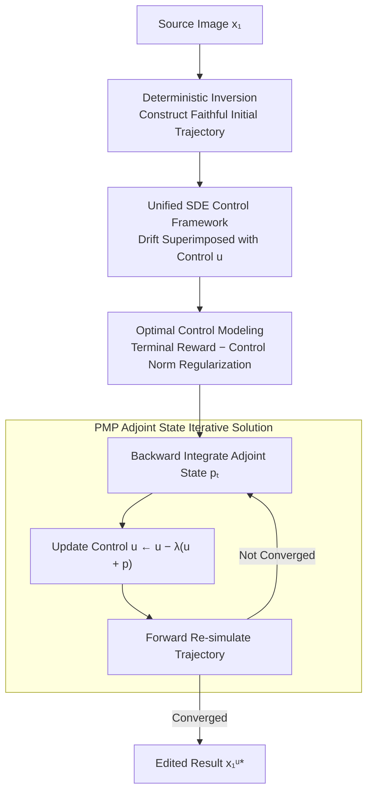

# Training-Free Reward-Guided Image Editing via Trajectory Optimal Control

**Conference**: ICLR 2026  
**arXiv**: [2509.25845](https://arxiv.org/abs/2509.25845)  
**Code**: None  
**Area**: Diffusion Models / Image Editing  
**Keywords**: Optimal Control, Reward-Guided, training-free, Adjoint State, Pontryagin's Maximum Principle

## TL;DR
Reward-guided image editing is reformulated as a trajectory optimal control problem. The reverse process of diffusion/flow models is treated as a controllable trajectory, optimized via adjoint state iteration based on Pontryagin's Maximum Principle (PMP) across the entire trajectory. This achieves effective training-free reward-guided editing without reward hacking.

## Background & Motivation
**Background**: Reward-guided sampling has succeeded in T2I generation (e.g., DPS, FreeDoM, TFG) by utilizing differentiable reward functions to guide the generation process at inference time. However, these methods are designed for sampling and not specifically tailored for editing.

**Limitations of Prior Work**: Reward-guided editing is more difficult than generation—it requires maximizing rewards while maintaining the core identity of the source image. Naive methods (inversion + guided sampling) perform poorly: for complex non-linear reward functions, guidance based on intermediate noisy images or single-step approximations degrades structural fidelity. Direct gradient ascent, while identifying the correct direction, produces adversarial samples by ignoring image priors.

**Key Challenge**: Existing guidance methods face a dilemma in editing scenarios—excessive guidance destroys structure, while insufficient guidance fails to improve rewards. Furthermore, they lack theoretical support for guidance scale selection, requiring extensive hyperparameter tuning.

**Goal**: How to utilize arbitrary differentiable reward functions to guide editing without training the model, while maintaining structural consistency with the source image?

**Key Insight**: Optimal control theory—elevating the problem from "step-wise guidance" to "full-trajectory optimization."

**Core Idea**: Optimize the entire generation trajectory (rather than step-wise guidance of intermediate states) to simultaneously maximize terminal rewards and maintain consistency with the source image.

## Method

### Overall Architecture
This paper addresses **training-free reward-guided image editing**: using arbitrary differentiable rewards (human preference, style, classification logits, CLIPScore) to modify an image without destroying the source identity or incurring reward hacking. The core mechanism elevates the editing process to **optimal control of the entire generation trajectory**.

The workflow is as follows: given a source image $\bm{x}_1$, **deterministic inversion** maps it back to the noise end to obtain an initial trajectory $\{\bm{x}_t\}_{t=T}^{1}$ that faithfully corresponds to the source image. Next, diffusion and Flow Matching are unified into a single **controllable SDE** by superimposing an optimizable control term $u_t$ onto the drift. The editing goal is then formulated as an **optimal control problem** (maximizing terminal reward while penalizing the magnitude of the control term). Finally, **adjoint state iteration** based on PMP is used to repeatedly "back-integrate the adjoint state → update control term → forward re-simulate trajectory" until the endpoint $\bm{x}_1^{u^*}$ achieves a balance between reward and source identity. Unlike step-wise guidance, optimizing the entire trajectory avoids structural damage caused by guiding noisy intermediate images as if they were clean.

### Key Designs

**1. Deterministic Inversion to Construct Initial Trajectory: Providing a faithful starting point for trajectory optimization**

Optimizing the entire trajectory requires an initial trajectory that faithfully corresponds to the source image; otherwise, the endpoint will deviate from the original from the start. This paper uses DDIM inversion for diffusion models and time-reversal ODEs for Flow Matching, both adopting a deterministic form with $\sigma_t = 0$. This ensures that back-propagating from $\bm{x}_1$ to $\bm{x}_T$ and reconstructing forward can approximately restore the source image. This provides a reliable "zero-edit is identity" starting point—when the control $u_t \equiv 0$, the trajectory remains the source image, and any editing becomes a controlled deviation from this baseline.

**2. Unified SDE Control Framework: Incorporating Diffusion and Flow Matching into one control theory**

Base models in editing scenarios can be either diffusion or Flow Matching. Since their sampling processes take different forms, deriving control laws for each separately would be cumbersome. This paper unifies them into a single backward SDE $d\bm{x}_t = b(\bm{x}_t, t)\, dt + \sigma_t\, d\mathbf{B}_t$, where only the drift term $b(\bm{x}_t, t)$ varies by model type (Eq. 4-5). The noise coefficient $\sigma_t$ is set to 0 during deterministic sampling. Consequently, the optimal control derivation is performed only once for this SDE, and both diffusion and Flow Matching can apply it directly without model-specific designs.

**3. Optimal Control Problem Modeling: Resolving the editing dilemma via control norm regularization**

The core conflict in reward-guided editing is achieving high rewards without deviating from the source. This paper injects a control term $u_t$ into the drift and formulates editing as an optimal control problem with terminal and running costs:

$$\min_{u \in \mathcal{U}} \int_T^1 \frac{1}{2} \|u(\bm{x}_t^u, t)\|^2 dt - r(\bm{x}_1^u)$$

$$\text{s.t.} \quad d\bm{x}_t^u = (b(\bm{x}_t^u, t) + u(\bm{x}_t^u, t)) dt + \sigma_t d\mathbf{B}_t, \quad \bm{x}_T^u = \bm{x}_T$$

Where $-r(\bm{x}_1^u)$ increases the terminal reward, and the integral $\frac{1}{2}\|u\|^2$ penalizes the overall magnitude of control. This norm regularization is not arbitrary—it restricts the trajectory's deviation from the original generation manifold, acting as an implicit "source preservation" constraint. Thus, reward and identity preservation are naturally coordinated by a single objective, and guidance intensity collapses into a single knob $w$ for weighting the reward term, eliminating the need for step-wise guidance scale searching.

**4. PMP-based Adjoint State Iteration: Efficient gradient backpropagation for the entire trajectory**

As the optimal control objective has no closed-form solution, the Pontryagin Maximum Principle provides optimality conditions (Eq. 8-10) decoupled into three coupled equations: the forward state equation, the backward adjoint equation, and the optimal control condition $u_t^* = -p_t^*$. These are solved iteratively: first, with the current trajectory $\bm{x}_t$ fixed, the adjoint equation is integrated backward using the terminal condition $p_1^* = -\nabla_{\bm{x}_1} r(\bm{x}_1^*)$ to find the adjoint state $p_t$. Then, the control term is updated via $u_t \leftarrow u_t - \lambda(u_t + p_t)$ towards $u_t^* = -p_t^*$. Finally, a new trajectory is simulated forward using the updated $u_t$. The Jacobian-vector product $[\nabla_{\bm{x}_t} b(\bm{x}_t^*, t)]^\top p_t^*$ in the adjoint equation is calculated efficiently using automatic differentiation without explicitly constructing the Jacobian, making the full-trajectory gradient calculation computationally comparable to standard backpropagation.

### Loss & Training
The method requires no parameter training and only optimizes control terms at inference time. The optimization objective is the cost functional described above—terminal reward $r(\bm{x}_1^u)$ plus control norm regularization. Reward functions are task-specific: ImageReward for human preference, Gram matrix difference for style transfer, classifier logits for counterfactual generation, and CLIPScore for text-guided editing. Guidance intensity is unified via a weight $w$ scaling $r(\cdot)$. Experiments use StableDiffusion 1.5 for diffusion and StableDiffusion 3 for Flow Matching, with the same control pipeline applied to both without modification.

## Key Experimental Results

### Main Results (Human Preference Task, SD 1.5)

| Method | ImageReward↑ | HPSv2↑ | CLIPScore↑ | Aesthetic↑ | LPIPS↓ | CLIP-I_src↑ |
|------|-------------|--------|-----------|-----------|--------|------------|
| None | 0.154 | 0.239 | 0.289 | 6.052 | 0.000 | 1.000 |
| Gradient Ascent | **1.909** | 0.225 | 0.288 | 5.578 | 0.147 | 0.920 |
| Inv+DPS | 1.599 | 0.232 | 0.265 | 5.828 | 0.288 | 0.851 |
| Inv+TFG | 1.705 | 0.236 | 0.273 | 5.633 | 0.293 | 0.840 |
| **Ours** | 1.891 | **0.253** | **0.290** | **6.109** | 0.172 | **0.924** |

*Our method achieves rewards close to GA while maintaining superior generalization metrics and source image consistency. Although GA has the highest reward, it suffers from severe reward hacking (poor validation metrics).*

### Style Transfer Task

| Method | ‖ΔG‖_F↓ | CLIP-I_sty↑ | DINO_sty↑ | CLIP-I_src↑ |
|------|---------|------------|----------|------------|
| Gradient Ascent | **4.874** | 0.527 | 0.195 | 0.837 |
| Inv+DPS | 6.844 | 0.540 | 0.169 | 0.686 |
| Inv+FreeDoM | 5.462 | 0.563 | 0.225 | 0.621 |
| **Ours** | 5.019 | **0.578** | **0.247** | 0.717 |

*Validation metrics (CLIP-I_sty, DINO_sty) are the best overall, while structural preservation is significantly better than guided sampling baselines.*

### Key Findings
- Gradient Ascent (GA) achieves the highest target rewards but universally suffers from reward hacking, as seen in declining validation metrics.
- Guided sampling (DPS/FreeDoM/TFG) generally destroys the source image structure in editing scenarios, with LPIPS and CLIP-I_src deteriorating significantly.
- Ours avoids reward hacking through full-trajectory optimization; target rewards are near-optimal while generalization metrics lead across the board.
- Control norm regularization is crucial: it restricts trajectory deviation, acting as an implicit source preservation constraint.
- In counterfactual generation, GA performs reasonably well due to the use of robust classifiers, indicating that reward function properties impact relative performance.
- The method is applicable to both diffusion and Flow Matching models without modification.

## Highlights & Insights
- **Theoretical Rigor**: Derives a complete editing framework from optimal control theory; PMP provides necessary optimality conditions.
- **Unified Framework**: Handles both diffusion and Flow Matching models by unifying them as SDE control problems.
- **No Guidance Scale Search**: Guidance intensity across all steps is controlled by a single theoretically grounded weight $w$.
- **Avoidance of Reward Hacking**: Control norm regularization naturally prevents excessive editing.
- **Applicability to Abstract Rewards**: Not limited to text conditions; works for human preferences, styles, and other concepts difficult to express in language.
- **Comparison with Adjoint Matching**: Unlike the latter, which fine-tunes models (changing the distribution), this method optimizes a single trajectory (inference-time editing).

## Limitations & Future Work
- Base models (SD 1.5 / SD 3) are relatively dated and not yet validated on the latest models like FLUX.
- The iterative optimization process requires multiple forward and backward passes, leading to significant computational overhead ($N$ iterations × trajectory length).
- The Jacobian-vector product calculation assumes $b$ is differentiable and the Jacobian is manageable, which may not hold for all models.
- The quality of deterministic inversion directly impacts editing quality—CFG-distilled models may require additional handling.
- Lacks comparison with more complex conditional editing methods (e.g., InstructPix2Pix, FLUX Kontext).
- Evaluation scale is small (300 images).

## Related Work & Insights
- **DPS / FreeDoM / TFG**: Training-free guidance methods that rely on step-wise guidance or one-step approximations, failing to handle complex non-linear rewards effectively.
- **Adjoint Matching**: Also uses PMP and adjoint states but for model fine-tuning (SOC problems); this work applies them to single-image editing at inference time.
- **FlowEdit**: An optimization-free Flow editing method that directly manipulates text-conditioned flows.
- **RFIN / Rout et al.**: Uses OC perspectives for style personalization and Doob’s h-transform but not for reward-guided editing.
- Insight: Optimal control theory provides an elegant and theoretically guaranteed framework for inference-time intervention in generative models, extensible to reward-guided control in video editing or 3D generation.

## Rating
- Novelty: ⭐⭐⭐⭐⭐ — Reformulating reward-guided editing as an OC problem is elegant; PMP derivation is rigorous.
- Experimental Thoroughness: ⭐⭐⭐ — Covers four tasks broadly, but base models are old, evaluation scale is small, and lacks user studies.
- Writing Quality: ⭐⭐⭐⭐⭐ — Theoretical derivations are clear and motivations are progressive.
- Value: ⭐⭐⭐⭐ — Provides a brand-new theoretical framework for reward-guided editing, though actual impact depends on validation with modern large-scale models.

<!-- RELATED:START -->

## Related Papers

- [\[ICLR 2026\] Follow-Your-Shape: Shape-Aware Image Editing via Trajectory-Guided Region Control](follow-your-shape_shape-aware_image_editing_via_trajectory-guided_region_control.md)
- [\[ICLR 2026\] FlowAlign: Trajectory-Regularized, Inversion-Free Flow-based Image Editing](flowalign_trajectory-regularized_inversion-free_flow-based_image_editing.md)
- [\[ICLR 2026\] Shortcut Diffusion Training with Cumulative Consistency Loss: An Optimal Control View](shortcut_diffusion_training_with_cumulative_consistency_loss_an_optimal_control_.md)
- [\[ICLR 2026\] EditReward: A Human-Aligned Reward Model for Instruction-Guided Image Editing](editreward_a_human-aligned_reward_model_for_instruction-guided_image_editing.md)
- [\[ICLR 2026\] ColorCtrl: Training-Free Text-Guided Color Editing Based on Multi-Modal Diffusion Transformer](training-free_text-guided_color_editing_with_multi-modal_diffusion_transformer.md)

<!-- RELATED:END -->
