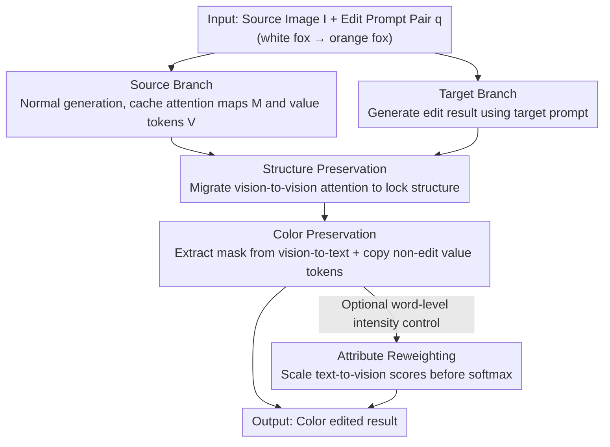

# ColorCtrl: Training-Free Text-Guided Color Editing Based on Multi-Modal Diffusion Transformer

**Conference**: ICLR 2026  
**OpenReview**: [https://openreview.net/forum?id=N1DfzTVuUY](https://openreview.net/forum?id=N1DfzTVuUY)  
**Code**: See paper (project page available)  
**Area**: Diffusion Models / Image Editing  
**Keywords**: Training-free Editing, Color Editing, MM-DiT, Attention Control, Consistency Preservation

## TL;DR
ColorCtrl is a training-free text-guided color editing method that decouples "structure" and "color" by directly manipulating MM-DiT attention maps and value tokens. It achieves precise color editing with virtually zero damage to geometry, material, and lighting consistency across various models (SD3, FLUX.1-dev, CogVideoX), while supporting word-level intensity adjustment.

## Background & Motivation

**Background**: Text-guided color editing (e.g., changing a "red ball" to a "yellow ball" or a "bright morning" to "night") is a fundamental yet far-from-solved problem in image/video editing. It essentially requires the model to implicitly reconstruct the 3D structure and lighting of the entire scene, as "color" comprises not only the object's albedo but also light source color and ambient light. Furthermore, editing must ensure that physical interactions like reflection, refraction, and highlights remain consistent. Current mainstream methods fall into two categories: one involves fine-tuning diffusion models for controllable editing, which requires large-scale data and complex training pipelines; the other involves training-free methods, which win through versatility and ease of use.

**Limitations of Prior Work**: Although training-free methods are versatile, they struggle with fine-grained color control and often introduce visual inconsistencies in both edited and non-edited regions—either the color change is incomplete, or background, structure, and materials are inadvertently altered. Existing attention control methods (like Prompt-to-Prompt and its variants) are mostly designed for the cross-attention of U-Net. DiTCtrl, the only method performing attention control on MM-DiT, suffers from two issues: its attention reweighting destroys attention consistency leading to geometric distortion, and it requires careful selection of effective layers.

**Key Challenge**: There is a natural trade-off between "editing intensity" and "source fidelity" in color editing—achieving a thorough color change often damages structure and materials, while preserving consistency often leads to insufficient color modification. Existing methods are forced to operate selectively on specific inference steps or attention layers, resulting in poor robustness.

**Key Insight**: The shift from U-Net to MM-DiT (Multi-Modal Diffusion Transformer) brings new opportunities. MM-DiT concatenates text and vision tokens into a single self-attention block, where the attention map naturally partitions into four quadrants: vision-to-vision, vision-to-text, text-to-vision, and text-to-text. Different quadrants carry different semantic roles. The authors observe that the vision-to-vision part encodes rich knowledge of "what scene content must remain unchanged," while the vision-to-text part provides high-quality spatial localization for "where the edit target is."

**Core Idea**: Targeted manipulation of MM-DiT attention maps and value tokens is performed in a training-free manner to decouple structure and color. Specifically, vision-to-vision transfer preserves structure, mask-based value token replacement preserves colors in non-edited regions, and text-to-vision attention scaling enables intensity adjustment. This allows the method to be effective across all layers and time steps without needing layer selection or hyperparameter tuning.

## Method

### Overall Architecture

ColorCtrl follows a "dual-branch" editing paradigm: given a source image $I$ and a pair of edit prompts $q$ (e.g., "white fox" → "orange fox"), the **source branch** follows the original generation process to produce the source image and cache attention maps $M$ and value tokens $V$. The **target branch** generates the edited result using the target prompt while reusing the cached intermediate variables from the source branch to inject editing constraints. All modifications occur only in the target branch.

The injection process consists of three steps corresponding to different attention map regions: (1) **Structure Preservation**, migrating the vision-to-vision part of the source attention map to the target; (2) **Color Preservation**, extracting a binary mask from the vision-to-text part to define the edit region and copying vision value tokens for non-edit regions from the source $V$; (3) **Attribute Reweighting** (optional), scaling attention scores of selected word tokens in the text-to-vision region before softmax for intensity control. The first two steps are the core, while the third is an optional addition for fine-grained control.

### Key Designs

**1. Dual-branch + Structure Preservation: Locking "everything that shouldn't move" with vision-to-vision attention**

A straightforward training-free approach is to fix the random seed and generate directly with the target prompt. However, the authors found that the resulting images deviate significantly from the source, failing as an "edit." Thus, a dual-branch approach is adopted where the target branch reuses cached source attention. The key insight is that the **vision-to-vision quadrant** of the MM-DiT attention map (vision query to vision key, localizing the top-left block) naturally encodes structural information. Structure preservation involves migrating this quadrant from source $M$ to target $M^*$ at the same position to obtain $\hat{M}$, satisfying three constraints: (C1) Geometric/Perspective consistency (layout and perspective match the source), (C2) Lighting consistency (source position and scalar intensity remain unchanged, only RGB spectral components allow variation), and (C3) Material consistency (roughness, specular reflection, etc., remain unchanged, only albedo $A$ is modified). Unlike DiTCtrl, ColorCtrl operates on attention maps rather than key/value tokens, enabling it to work across all layers and time steps.

**2. Color Preservation: Using vision-to-text masks to bring back non-edited value tokens**

Structure preservation alone is insufficient, as unwanted color shifts still occur in non-edited regions. To restrict editing strictly to the target area, ColorCtrl extracts a binary mask $m$ from the **vision-to-text** portion of the attention map using a threshold $\epsilon$. A critical design choice: whereas prior work (Cai et al.) averaged the vision-to-text and text-to-vision parts, the authors use only vision-to-text, as it provides significantly more accurate spatial localization for the target (shown in Figure 3(b)). Once the mask is obtained, vision value tokens from the source $V$ for **non-edited regions** are copied to the target $V^*$ to produce $\hat{V}$. Experimentally, it was found that only the **vision part of the value token** should be replaced—replacing the text part $V^{\text{text}}$ weakens text guidance in FLUX.1-dev and creates artifacts in SD3.

**3. Attribute Reweighting: Scaling text-to-vision scores before softmax for word-level adjustment**

Text prompts offer limited control over color granularity (e.g., users cannot explicitly control the degree of "dark" in "dark yellow"). Two reweighting techniques from the U-Net era (scaling specific token embeddings or cross-attention scores) are incompatible with MM-DiT: the former is designed for CLIP while MM-DiT uses T5, and the latter relies on cross-attention which is absent in MM-DiT's self-attention structure. ColorCtrl addresses this by scaling attention scores for selected word tokens in the **text-to-vision region before softmax**. Scaling before softmax is crucial; DiTCtrl's post-softmax scaling violates the sum-to-one assumption, leading to erratic attention behavior and geometric inconsistency.

## Key Experimental Results

### Main Results

Evaluated on the PIE-Bench "Change Color" task (40 pairs). Structural consistency is measured via SSIM on Canny edge maps; non-edit preservation is measured by PSNR/SSIM (masked by Grounded SAM 2); semantic alignment is measured by CLIP score. Comparison with training-free methods:

| Model | Method | Canny SSIM ↑ | BG PSNR ↑ | BG SSIM ↑ | CLIP(Edited) ↑ |
|------|------|------|------|------|------|
| SD3 | DiTCtrl | 0.8119 | 35.40 | 0.9812 | 24.67 |
| SD3 | UniEdit-Flow | 0.8016 | 36.31 | 0.9774 | 24.67 |
| SD3 | **Ours** | **0.8473** | **42.93** | **0.9960** | **26.96** |
| FLUX.1-dev | UniEdit-Flow | 0.8498 | 37.57 | 0.9777 | 23.44 |
| FLUX.1-dev | **Ours** | **0.9196** | **39.49** | **0.9936** | **24.90** |

ColorCtrl leads in structure and background preservation while maintaining the highest CLIP scores, indicating precise editing without consistency loss.

Comparison with commercial models (PIE-Bench):

| Model | Method | Canny SSIM ↑ | BG PSNR ↑ | CLIP(Edited) ↑ |
|------|------|------|------|------|
| — | FLUX.1 Kontext Max | 0.76 | 26.77 | 26.10 |
| — | GPT-4o Image Gen | 0.74 | 23.71 | 26.46 |
| FLUX.1-dev | **Ours** | **0.9196** | **39.49** | 24.90 |

ColorCtrl significantly outperforms commercial models in consistency (Canny SSIM, PSNR). While CLIP similarity is slightly lower, the authors attribute this to commercial models' tendency to force-fit prompts via oversaturated, unrealistic flat colors.

### Ablation Study

| Configuration | Canny SSIM ↑ | BG PSNR ↑ | BG SSIM ↑ | CLIP(Edited) ↑ |
|------|------|------|------|------|
| Fix seed (Direct) | 0.5787 | 20.44 | 0.8411 | 27.54 |
| + Structure Preserv. | 0.7312 | 24.77 | 0.9201 | 27.29 |
| + Color Preserv. (Full) | **0.8473** | **42.93** | **0.9960** | 26.96 |

(Component-wise ablation on SD3.)

### Key Findings
- **Structure preservation is the "foundation"**: Adding structure preservation to a fixed seed generation increases Canny SSIM from 0.5787 to 0.7312 and BG SSIM from 0.8411 to 0.9201, significantly improving geometric and material consistency.
- **Color preservation specifically protects non-edit areas**: With color preservation, BG PSNR jumps from 24.77 to 42.93 and BG SSIM to 0.9960. The cost to CLIP similarity is negligible (27.29 → 26.96).
- **Advantages are more pronounced in video**: When extended to CogVideoX-2B, the gap between ColorCtrl and baselines widens further (Canny SSIM 0.8651 vs next best 0.7880), particularly in temporal coherence.
- **Generalizable to real images and instruction-based models**: Can edit real images when combined with UniEdit-Flow inversion; when connected to models like Step1X-Edit or FLUX.1 Kontext dev, it can refine colors during secondary editing while maintaining structure.

## Highlights & Insights
- **Functional partitioning of the MM-DiT attention map**: Using vision-to-vision for structure, vision-to-text for localization, and text-to-vision for intensity is a clear and transferable insight for other MM-DiT tasks.
- **Engineering advantage of "no layer/step selection"**: Most attention control methods require manual tuning of effective layers/steps. Because ColorCtrl operates on robust attention maps, it works across all layers and steps without parameters.
- **Pre-softmax vs. Post-softmax scaling**: Implementing scaling before softmax avoids the breakdown of "attention sums to 1" seen in DiTCtrl, serving as a reminder to respect normalization assumptions in attention reweighting.
- **The CLIP Similarity Trap**: The paper demonstrates that high CLIP scores often stem from "prompt overfitting" (oversaturated alignment), which is a pitfall in evaluating color editing quality.

## Limitations & Future Work
- The method relies on the specific attention architecture of MM-DiT and is not applicable to U-Net based models.
- Real-image editing requires a preceding inversion step (e.g., via UniEdit-Flow), making overall quality dependent on reconstruction fidelity.
- Masks are extracted via threshold $\epsilon$ from vision-to-text; for scenes with difficult localization or ambiguous semantics, mask quality may affect background preservation (sensitivity to $\epsilon$ was not deeply discussed).
- CLIP similarity is slightly lower than commercial models; while justified by "realism," this "restraint" might not be what users want in creative scenarios requiring vibrant colors.

## Related Work & Insights
- **vs. DiTCtrl**: Both perform attention control on MM-DiT. However, DiTCtrl extracts masks only for video generation (not editing), operates on tokens instead of maps, requires layer selection, and uses post-softmax scaling which breaks geometric consistency.
- **vs. Prompt-to-Prompt**: Classic attention methods rely on cross-attention in U-Net, which does not exist in the self-attention structure of MM-DiT. ColorCtrl is specifically tailored for the four-quadrant attention of MM-DiT.
- **vs. Fine-tuned Models (e.g., FLUX.1 Kontext, GPT-4o)**: Commercial models rely on synthetic pairs. While convenient, they often sacrifice material consistency and realism for prompt alignment; ColorCtrl is training-free and preserves consistency better.

## Rating
- Novelty: ⭐⭐⭐⭐ Clear partitioning of MM-DiT quadrants for structure/localization/intensity control.
- Experimental Thoroughness: ⭐⭐⭐⭐⭐ Covers SD3/FLUX/CogVideoX and instruction models with comprehensive comparisons.
- Writing Quality: ⭐⭐⭐⭐ Clear correspondence between formalization and methodology.
- Value: ⭐⭐⭐⭐ Training-free, zero-tuning, and plug-and-play for multiple MM-DiT models.

<!-- RELATED:START -->

## Related Papers

- [\[ICLR 2026\] LazyDrag: Enabling Stable Drag-Based Editing on Multi-Modal Diffusion Transformers via Explicit Correspondence](lazydrag_enabling_stable_drag-based_editing_on_multi-modal_diffusion_transformer.md)
- [\[CVPR 2026\] Dynamic-eDiTor: Training-Free Text-Driven 4D Scene Editing with Multimodal Diffusion Transformer](../../CVPR2026/image_generation/dynamic-editor_training-free_text-driven_4d_scene_editing_with_multimodal_diffus.md)
- [\[ICLR 2026\] Training-Free Reward-Guided Image Editing via Trajectory Optimal Control](training-free_reward-guided_image_editing_via_trajectory_optimal_control.md)
- [\[CVPR 2026\] Coupled Diffusion Sampling for Training-Free Multi-View Image Editing](../../CVPR2026/image_generation/coupled_diffusion_sampling_for_training-free_multi-view_image_editing.md)
- [\[ICLR 2026\] Multi-Subspace Multi-Modal Modeling for Diffusion Models: Estimation, Convergence and Mixture of Experts](multi-subspace_multi-modal_modeling_for_diffusion_models_estimation_convergence_.md)

<!-- RELATED:END -->
