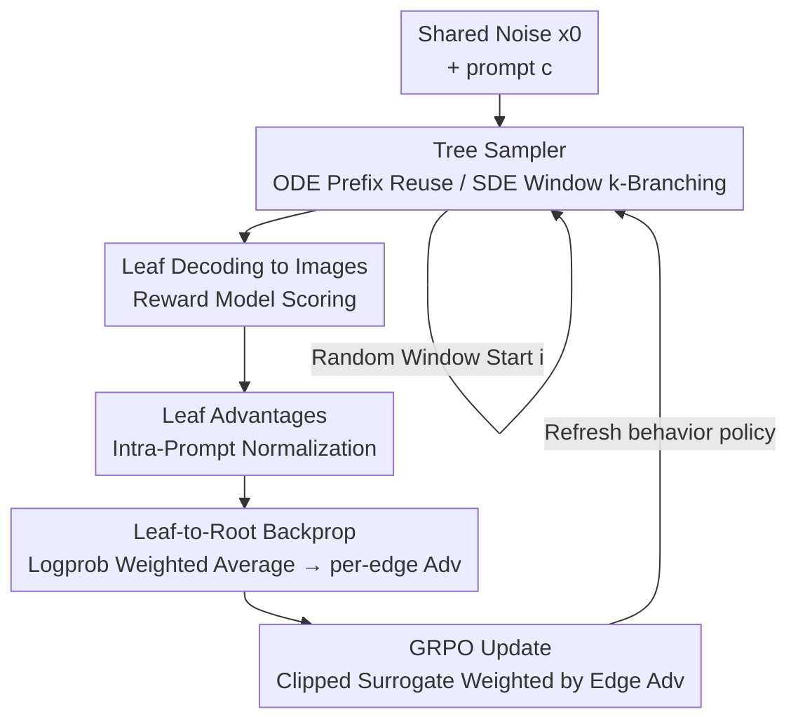

# TreeGRPO: Tree-Advantage GRPO for Online RL Post-Training of Diffusion Models

**Conference**: ICLR 2026  
**OpenReview**: [https://openreview.net/forum?id=3rZdp4TmUb](https://openreview.net/forum?id=3rZdp4TmUb)  
**Code**: https://treegrpo.github.io (Project Page)  
**Area**: Diffusion Models / RL Alignment  
**Keywords**: GRPO, Diffusion RL Post-training, Tree Search, Credit Assignment, Sampling Efficiency

## TL;DR
The denoising process of diffusion/flow models is reinterpreted as a search tree—starting from shared noise, branching only within scheduled SDE windows, and reusing public prefixes for ODE steps. By backpropagating leaf rewards along the tree to derive per-edge advantages for GRPO updates, this method achieves 2.4× faster training under the same sampling budget and consistently outperforms DanceGRPO/MixGRPO on the efficiency-reward Pareto frontier.

## Background & Motivation
**Background**: While diffusion models and rectified flow can generate high-fidelity images, aligning outputs with human preferences/aesthetics requires post-training with human feedback. Drawing from the success of RL post-training in LLMs, researchers have adapted GRPO—a PPO-style update based on relative advantages within a group—to visual generation (e.g., DanceGRPO, FlowGRPO).

**Limitations of Prior Work**: Existing GRPO methods suffer from two major flaws. First, **low sampling efficiency**: every policy update requires sampling multiple full denoising trajectories from scratch, which is computationally expensive. Second, **coarse credit assignment**: a trajectory receives only a single terminal reward $R(x_T,c)$, which is spread uniformly across every denoising step, failing to distinguish the contribution of specific actions. While MixGRPO attempts to reduce costs via ODE-SDE hybrid sampling and sliding windows, it often sacrifices final performance for efficiency.

**Key Challenge**: Trajectory-based methods treat each candidate as an independent sequence. This ignores the structure where different candidates share long denoising prefixes and prevents fine-grained credit assignment due to the lack of intermediate rewards. Both efficiency and credit assignment issues stem from treating denoising as a set of independent linear trajectories.

**Key Insight**: The authors observe that denoising is a fixed-horizon process with constant step sizes, matching the structure where tree search (e.g., AlphaGo) excels in sequential decision-making. Thus, the denoising process is recast as a search tree: starting from shared initial noise, strategically branching at intermediate steps, and reusing common prefixes to explore different completion paths.

**Core Idea**: Replace independent trajectories with a sparse tree featuring "shared prefixes + strategic branching." Prefix reuse improves sampling efficiency, while backpropagating leaf rewards provides per-edge advantages (fine-grained credit assignment). Multi-child branching at internal nodes naturally provides intra-group comparisons, allowing a single forward pass to produce multiple advantages for multiple policy updates.

## Method

### Overall Architecture
TreeGRPO is a tree-structured RL post-training framework for diffusion/flow models consisting of three stages: **tree construction, advantage backpropagation, and GRPO update**. Given a prompt $c$ and a fixed $T$-step schedule, the method starts from shared noise $x_0\sim\mathcal{N}(0,I)$. Steps are categorized into two types: steps within a predefined SDE window $\mathcal{W}$ undergo stochastic perturbations to branch into $k$ children, while steps outside the window use deterministic ODE steps to advance without branching, allowing all descendants to reuse the same prefix. This results in a sparse tree where leaves diverge only at SDE windows. Leaf rewards are normalized within prompt groups to obtain leaf advantages, which are backpropagated bottom-up to internal edges for dense per-edge advantages. Finally, these advantages weight a clipped GRPO objective for policy updates.

### Key Designs

**1. Tree Sampler: ODE Prefix Reuse and SDE Window Branching**

To address the efficiency bottleneck of independent trajectory sampling, TreeGRPO uses a shared tree structure. During the $T$-step schedule: when $t\notin\mathcal{W}$, **deterministic ODE updates** are applied to all frontier nodes simultaneously without creating new branches, ensuring descendant nodes reuse the public prefix. When $t\in\mathcal{W}$, **SDE branching** occurs by adding small random perturbations to the ODE mean, generating $k$ children per frontier node. The sampling log-probabilities $\log\pi_{\theta_\text{old}}(e)$ are recorded for each edge. The computational cost scales linearly with the number of SDE windows, achieving higher candidate diversity than independent sampling within the same NFE budget (fixed at NFE=10), leading to a 2.4× speedup.

**2. Random Window: Truncated Geometric Distribution for SDE Start**

To determine where branching occurs, the authors utilize a continuous SDE window $\mathcal{W}_i=\{i,i+1,\dots,i+w-1\}$ of fixed length $w$. At the start of each training epoch, the starting step $i$ is sampled from a **truncated geometric distribution** over $\{0,\dots,T-w-1\}$:

$$\Pr[i]=\frac{(1-r)\,r^{i}}{1-r^{\,T-w}},\quad i=0,1,\dots,T-w-1.$$

A smaller $r\in(0,1)$ biases the window toward earlier steps, while $r\to1$ approaches a uniform distribution. The authors prioritize early denoising steps as post-training adjustments are more effective during initial stages. Ablations show $r=0.5$ provides the best balance, whereas $r=0.3$ favors aesthetics and $r=0.7$ favors text-alignment.

**3. Leaf-to-Root Backprop: Logprob Weighting for Per-Edge Credit Assignment**

This is the core contribution of TreeGRPO, addressing coarse credit assignment. Leaf advantages $A_\text{leaf}(\ell)$ are first calculated by aggregating scores from one or more reward models using weights $w_k$ as $S(\ell)=\sum_k w_k R_k(y^{(\ell)},c)$, followed by intra-group mean-variance normalization. Advantages are then backpropagated bottom-up: for an internal node $u$, the advantage of its incoming edge is the **logprob weighted average** of its children's advantages:

$$A_\text{edge}(e')=\sum_{e\in S(u)} w_u(e)\,A_\text{edge}(e),\qquad w_u(e)=\frac{\pi_{\theta_\text{old}}(e)}{\sum_{e'\in S(u)}\pi_{\theta_\text{old}}(e')}.$$

The weights $w_u(e)$ are obtained via a softmax over the stored log-probabilities. For ODE segments with a single child, the advantage is simply passed up. This transforms a single trajectory reward into per-step advantages. Theoretically, this probability-weighted aggregation is equivalent to Rao-Blackwellization, which reduces variance by the effective sample size ($ESS=1/\sum_k w_k^2$), leading to more stable gradients and allowing larger trust-region updates. It also acts as an implicit smoother, preventing the policy from collapsing into "peak" solutions driven by lucky noise seeds.

**4. GRPO Update with Edge Advantages: Amortized Forward Passes**

The update uses a standard PPO clipped surrogate objective applied to intra-group, per-edge advantages. For each edge $e\in\mathcal{E}_t$ in the SDE window, the importance ratio $r_t(e;\theta)$ is defined, and the objective is:

$$L_\text{GRPO}(\theta)=-\sum_{t\in\mathcal{W}}\sum_{e\in\mathcal{E}_t}\min\!\Big(r_t(e;\theta)\,A_\text{edge}(e),\ \text{clip}\big(r_t(e;\theta),1-\epsilon,1+\epsilon\big)A_\text{edge}(e)\Big).$$

This utilizes only the clip parameter $\epsilon$ without an explicit KL term. Crucially, because a single node's multi-child branching produces multiple edges and advantages from one forward pass, **multiple policy updates are amortized over a single forward pass**, providing a third efficiency dividend alongside prefix reuse and fine-grained credit.

### Loss & Training
The base model is SD3.5-medium, trained on the HPDv2 dataset (103,700 prompts for alignment, 3,200 for evaluation). All methods use NFE=10, batch size 32, 250 epochs, AdamW (lr 1e-5, weight decay 0.01), and 8×A100 mixed precision. A key prerequisite is the ODE-to-SDE conversion: deterministic ODE solvers lack transition probabilities for policy-gradient RL. Following Song et al., the probability flow ODE is converted to an equivalent SDE that maintains marginal distributions but provides tractable likelihoods, where $\sigma(t)$ defines defined log-probabilities $\log\pi_\theta$ for GRPO updates. Multi-reward training uses weighted sums of advantages ($w_0=0.8$ for HPS, $w_1=0.2$ for ClipScore).

## Key Experimental Results

### Main Results
In single-reward training (HPS-v2.1), TreeGRPO achieves the highest HPS and Aesthetic scores while being the fastest:

| Method | Step Time (s)↓ | HPS-v2.1↑ | ImageReward↑ | Aesthetic↑ | ClipScore↑ |
|------|------|------|------|------|------|
| SD3.5-M (Base) | - | 0.2725 | 0.8870 | 5.9519 | 0.3996 |
| DDPO | 166.1 | 0.2758 | 1.0067 | 5.9458 | 0.3900 |
| DanceGRPO | 173.5 | 0.3556 | **1.3668** | 6.3080 | 0.3769 |
| MixGRPO | 145.4 | 0.3649 | 1.2263 | 6.4295 | 0.3612 |
| **TreeGRPO** | **72.0** | **0.3735** | 1.3294 | **6.5094** | 0.3703 |

DanceGRPO achieves a higher ImageReward but is 2.4× slower. In multi-reward training (HPS:ClipScore = 4:1), TreeGRPO remains dominant with a time of 79.2s (vs. DanceGRPO's 184.0s). On the GPU Hours-Normalized Score Pareto curve, TreeGRPO (48.0h, 15.6%) significantly outperforms DanceGRPO (122.7h, 14.9%) and MixGRPO (97.0h, 12.1%).

### Ablation Study
Tree structure ablation (NFE=10, branching factor $k$, depth $d$):

| Config | Eff. Group | Eff. Steps | Time (s)↓ | HPS-v2↑ | Note |
|------|------|------|------|------|------|
| $k=3, d=3$ (Default) | 27 | 13 | 70.0 | 0.3735 | Best trade-off |
| $k=2, d=3$ | 8 | 7 | 39.4 | 0.3271 | Too few branches |
| $k=2, d=4$ | 16 | 15 | 59.6 | 0.3537 | Diminishing returns |
| $k=4, d=3$ | 64 | 21 | 126.3 | **0.3822** | Higher score, +75% time |
| $k=3, d=3$, 2 Trees | 54 | 26 | 120.2 | 0.3771 | Minimal gain, double time |

Sampling strategy ablation (Random window $r$): $r=0.5$ is most balanced. $r=0.3$ favors aesthetics (Aesthetic 6.6067, ClipScore drops to 0.3556). $r=0.7$ shows the opposite trade-off. A shifting strategy yields the highest ClipScore (0.3738) at the cost of other metrics.

### Key Findings
- **Branching factor $k$ is the primary knob for performance/cost**: Scores increase monotonically with $k=2\to3\to4$, but the time jump for $k=4$ is excessive. $k=3, d=3$ is the "sweet spot." More branches correlate with larger ESS and lower variance.
- **Random window $r$ controls the bias between aesthetics and text-alignment**: Small $r$ values prioritize early steps (aesthetics), while large $r$ favors alignment. Adaptive $r$ adjustment could further improve scores by 2-3%.
- **Efficiency originates from parallel tree sampling**: Maximizing candidate diversity within the same NFE budget while incurring minimal backpropagation overhead results in 72-79s per step compared to 145-184s for baselines.

## Highlights & Insights
- **The "Denoising = Search Tree" perspective shift** is elegant: By leveraging the fixed-horizon structure of denoising, the authors transplant tree search's efficiency to diffusion alignment, solving both efficiency and credit assignment simultaneously.
- **Logprob weighted backpropagation** is both a practical credit mechanism and theoretically grounded via Rao-Blackwellization and implicit smoothing. It prevents policy collapse onto lucky high-reward noise seeds.
- **Amortized updates from multi-child branching** fully exploit the tree structure, ensuring that a single forward pass yields maximal training signal. This is potentially transferable to any sequential generation RL with fixed horizons.

## Limitations & Future Work
- Tree hyperparameters ($\mathcal{W}, k, d, r$) were found via grid search on SD3.5-medium; their optimality for different base models or reward models is not fully verified.
- Experiments were restricted to a single base model and dataset (HPDv2), without expansion to video diffusion or larger models. Theoretical analyses rely on assumptions like "conditional independence of branches" and second-order Taylor approximations.
- Adaptive $r$ adjustment, while promising, was not included in the main method. Multi-reward weights (0.8:0.2) were manually tuned rather than automated.

## Related Work & Insights
- **vs. DanceGRPO / FlowGRPO**: These methods utilize intra-group advantages but require expensive full independent trajectories and distribute single terminal rewards uniformly. TreeGRPO saves 2.4× time via prefix reuse and enables fine-grained credit via backpropagation.
- **vs. MixGRPO**: While MixGRPO uses hybrid sampling to reduce costs, it lacks fine-grained credit and often sacrifices performance for speed. TreeGRPO dominates its Pareto frontier in both efficiency and reward.
- **vs. Language Domain Tree RL**: Unlike tree search on discrete tokens, TreeGRPO exploits the "shared noise prefix" unique to continuous denoising to gain both efficiency and per-step credit.

## Rating
- Novelty: ⭐⭐⭐⭐⭐ "Denoising as a search tree + logprob backprop" is a substantial new perspective for diffusion RL.
- Experimental Thoroughness: ⭐⭐⭐⭐ Solid ablations on tree structure and sampling, though limited to one base model and dataset.
- Writing Quality: ⭐⭐⭐⭐ Clear three-stage framework with strong theoretical-experimental alignment.
- Value: ⭐⭐⭐⭐⭐ 2.4× speedup and Pareto dominance provide a scalable and practical path for visual RL alignment.

<!-- RELATED:START -->

## Related Papers

- [\[ICLR 2026\] TempFlow-GRPO: When Timing Matters for GRPO in Flow Models](tempflow-grpo_when_timing_matters_for_grpo_in_flow_models.md)
- [\[ICLR 2026\] EditScore: Unlocking Online RL for Image Editing via High-Fidelity Reward Modeling](editscore_unlocking_online_rl_for_image_editing_via_high-fidelity_reward_modelin.md)
- [\[CVPR 2025\] Finite Difference Flow Optimization for RL Post-Training of Text-to-Image Models](../../CVPR2025/image_generation/finite_difference_flow_optimization_for_rl_post-training_of_text-to-image_models.md)
- [\[CVPR 2026\] Fine-Grained GRPO for Precise Preference Alignment in Flow Models](../../CVPR2026/image_generation/fine-grained_grpo_for_precise_preference_alignment_in_flow_models.md)
- [\[CVPR 2026\] GDRO: Group-level Reward Post-training Suitable for Diffusion Models](../../CVPR2026/image_generation/gdro_group-level_reward_post-training_suitable_for_diffusion_models.md)

<!-- RELATED:END -->
