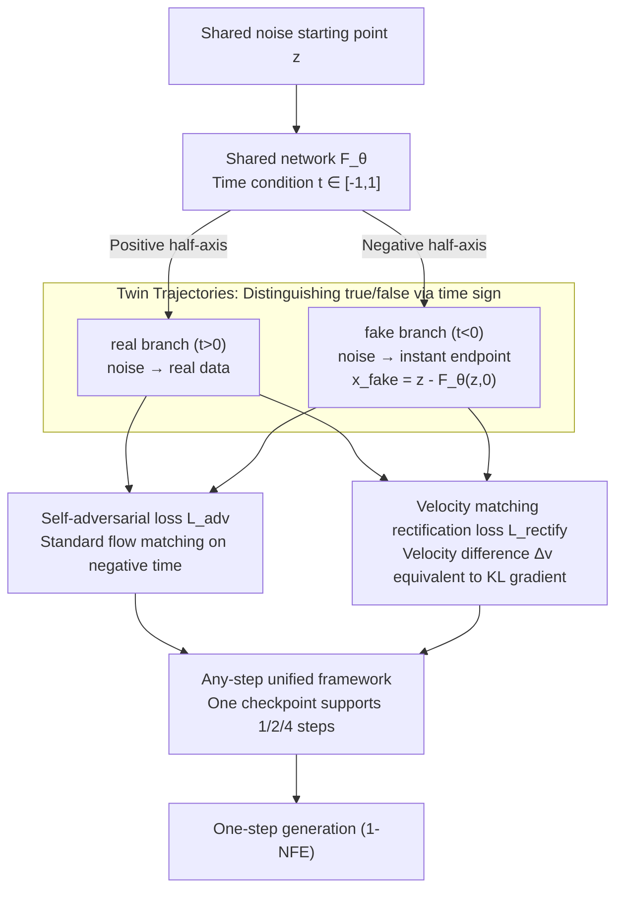

# TwinFlow: Realizing One-step Generation on Large Models with Self-adversarial Flows

**Conference**: ICLR 2026  
**arXiv**: [2512.05150](https://arxiv.org/abs/2512.05150)  
**Code**: [https://github.com/inclusionAI/TwinFlow](https://github.com/inclusionAI/TwinFlow)  
**Area**: Diffusion Models / One-step Generation / Large Model Acceleration  
**Keywords**: one-step generation, self-adversarial, flow matching, 20B scaling, no auxiliary models

## TL;DR

TwinFlow is proposed: by extending the flow matching time interval from $[0,1]$ to $[-1,1]$, "twin trajectories" are constructed to form self-adversarial signals, enabling one-step generation without discriminators or frozen teachers. It is the first to extend 1-NFE generation capabilities to the 20B-parameter Qwen-Image model; the 1-NFE GenEval of 0.86 approaches the original 100-NFE score of 0.87, while reducing inference costs by $100\times$.

## Background & Motivation

Diffusion and flow matching models offer excellent generation quality, but inference requires 40–100 NFE. In the era of large models, inference costs significantly exceed one-time training costs, creating an urgent need for few-step/one-step generation solutions.

**Limitations of Prior Work**:

| Method Category | Auxiliary Training Models | Frozen Teacher | Core Problem |
|---------|:---------:|:------:|---------|
| GAN | 1 (Discriminator) | 0 | Unstable training, difficult to scale to large models |
| Diffusion Distillation | 0 | 1 | Requires frozen teacher, consuming extra VRAM |
| DMD/DMD2 | 1–2 (fake score + discriminator) | 1 | Highest complexity; 20B models directly OOM |
| Consistency Models (LCM/PCM) | 0 | 0–1 | Quality drops sharply when NFE < 4 |
| **TwinFlow (Ours)** | **0** | **0** | **No extra components, trainable at 20B** |

**Key Challenge**: Accelerating large models for one-step generation requires a minimalist and VRAM-efficient framework. However, all high-quality few-step methods rely on auxiliary components (discriminators/teachers), causing OOM at the 20B scale.

**Key Insight**: Can the model "teach itself"? The quality of a model's multi-step output is higher than its one-step output—this quality difference itself serves as a usable self-supervised signal, eliminating the need for an external teacher.

## Method

### Overall Architecture

TwinFlow extends the standard flow matching time interval from $[0,1]$ to $[-1,1]$, allowing the same network $F_\theta$ to simultaneously learn two "twin trajectories" sharing a noise starting point. The positive half-axis $t\in(0,1]$ is the **real** trajectory from noise to real data, while the negative half-axis $t\in[-1,0)$ is the **fake** trajectory from noise to the model's own one-step output (fake data). The model generates the fake endpoint on-the-fly via $\mathbf{x}^{\text{fake}} = \mathbf{z} - F_\theta(\mathbf{z}, 0)$, and uses two self-supervised losses to align the trajectories: the self-adversarial loss $\mathcal{L}_{\text{adv}}$ treats the fake trajectory as standard flow matching on negative time, while the velocity matching rectification loss $\mathcal{L}_{\text{rectify}}$ aligns the real and fake velocity fields, pushing the fake distribution toward the real distribution. This process requires no discriminator or frozen teacher. Finally, an any-step formula allows the same checkpoint to support 1/2/4-step inference.

### Key Designs

**1. Twin Trajectories: Distinguishing true/false by time sign, internalizing the external teacher**

High-quality few-step methods rely on discriminators or frozen teachers because one-step generation needs a reference for "what is good." These auxiliary components cause OOM at the 20B scale. TwinFlow's breakthrough is letting the model act as its own reference: the positive axis $t\in(0,1]$ carries the real branch of the true distribution, while the negative axis $t\in[-1,0)$ carries the fake branch of the model's current distribution. Both branches share the same network $F_\theta$, switching only based on the sign of the time condition. The fake endpoint $\mathbf{x}^{\text{fake}} = \mathbf{z} - F_\theta(\mathbf{z}, 0)$ is provided instantly by the current model, meaning the reference evolves with training (self-play). This saves VRAM and avoids fixed target bias from frozen teachers.

**2. Self-adversarial Loss $\mathcal{L}_{\text{adv}}$: Standard flow matching on negative time**

With the fake branch established, the standard flow matching objective can be applied directly—teaching the network to map noise to fake data under negative time conditions. This step ensures "adversity" occurs entirely within a single network: the model must fit real data (positive axis) while characterizing its own generation distribution (negative axis). The tension between the two constitutes the adversarial signal without needing an independent discriminator.

**3. Velocity Matching Rectification Loss $\mathcal{L}_{\text{rectify}}$: Translating KL gradients into optimizable velocity differences**

Self-adversarial signals alone are insufficient to push the fake distribution toward the real one. The core mathematical insight of this work is that minimizing the difference between the velocity fields of the real and fake trajectories at the same intermediate point $\mathbf{x}_t$:

$$\Delta_\mathbf{v}(\mathbf{x}_t) = \mathbf{v}_{\text{real}}(\mathbf{x}_t, t) - \mathbf{v}_{\text{fake}}(\mathbf{x}_t, -t)$$

is equivalent to minimizing $D_{\text{KL}}(p_{\text{fake}} \,\|\, p_{\text{real}})$. This eliminates the need for an explicit score estimator (as in DMD); instead, the velocity difference is converted into a backpropagatable loss using stop-gradient, allowing the fake distribution to converge toward the real distribution along the KL gradient.

**4. Any-step Unified Framework: One checkpoint for 1/2/4 steps**

Training is based on the RCGM any-step formula, enabling a single checkpoint to flexibly perform 1/2/4/... step inference. This allow for dynamic quality-speed trade-offs during deployment without training separate versions for different step counts.

### Loss & Training

The total objective adds TwinFlow's two self-supervised losses to the standard any-step flow matching baseline:

$$\mathcal{L}(\theta) = \mathcal{L}_{\text{base}} + \underbrace{(\mathcal{L}_{\text{adv}} + \mathcal{L}_{\text{rectify}})}_{\mathcal{L}_{\text{TwinFlow}}}$$

Here, $\mathcal{L}_{\text{base}}$ is $N=2$ any-step flow matching where the target time $r$ is sampled from $[0,1]$. $\mathcal{L}_{\text{TwinFlow}}$ fixes the target time to $r=0$ to focus on one-step generation. These losses are balanced within each mini-batch via a hyperparameter $\lambda$. Experiments show $\lambda\approx 1/3$ is optimal; values too large or too small disrupt the balance between the base and TwinFlow tasks. The framework supports both LoRA fine-tuning (~40GB VRAM) and full-parameter training for Qwen-Image-20B.

Notably, TwinFlow avoids the mode collapse seen in Qwen-Image-Lightning (based on DMD2 without GAN loss). $\mathcal{L}_{\text{base}}$ preserves random target time sampling, forcing the model to learn complete trajectories rather than collapsing into a single mapping. Furthermore, the fake trajectory evolves during training, avoiding the fixed target bias of frozen teachers. Tests show that while Qwen-Image-Lightning produces nearly identical images for the same prompt despite different noise, TwinFlow does not suffer from this degradation.

## Main Results

### Unified Multimodal Model Comparison (Qwen-Image-20B, LoRA)

| Method | NFE ↓ | GenEval ↑ | DPG-Bench ↑ | WISE ↑ |
|------|:-----:|:---------:|:-----------:|:------:|
| Qwen-Image (Original) | 100 | 0.87 | 88.32 | 0.62 |
| Qwen-Image-Lightning | 1 | 0.85 | 87.79 | 0.51 |
| Qwen-Image-RCGM | 1 | 0.52 | 59.50 | 0.30 |
| **Qwen-Image-TwinFlow** | **1** | **0.86** | **86.52** | **0.54** |
| **Qwen-Image-TwinFlow** | **2** | **0.87** | **87.64** | **0.57** |
| BLIP3-o-8B | 60+ | 0.84 | 81.60 | 0.62 |
| Bagel | 100 | 0.82 | — | 0.52 |
| MetaQuery-XL | 60 | 0.78 | 81.10 | 0.55 |

**Key Findings**: At 1-NFE, TwinFlow outperforms most unified multimodal models using 40–100 NFE (Bagel/MetaQuery/BLIP3-o). At 2-NFE, it fully matches the original 100-NFE performance.

### 20B Full-parameter Training Comparison

| Method | NFE | GenEval ↑ | DPG-Bench ↑ | WISE ↑ | Notes |
|------|:---:|:---------:|:-----------:|:------:|------|
| VSD / DMD / SiD (Original) | — | OOM | OOM | OOM | Requires 3 model copies |
| VSD (LoRA fake score) | 1 | 0.67 | 84.44 | 0.22 | Poor quality |
| DMD | 1 | 0.81 | 84.31 | 0.47 | Mode collapse |
| sCM (JVP-free) | 8 | 0.60 | 85.54 | 0.45 | Still low at 8 steps |
| MeanFlow (JVP-free) | 8 | 0.49 | 83.81 | 0.37 | Only 0.49 at 8 steps |
| **TwinFlow** | **1** | **0.85** | **85.44** | **0.51** | — |
| **TwinFlow** | **2** | **0.86** | **86.35** | **0.55** | — |
| **TwinFlow (Longer Training)** | **1** | **0.89** | **87.54** | **0.57** | Full-param improvements |

**Key Findings**: VSD/DMD/SiD OOM in their original 20B configurations. sCM/MeanFlow at 8-NFE are significantly inferior to TwinFlow at 1-NFE. With longer training, 1-NFE GenEval reaches 0.89, exceeding the original 100-NFE score of 0.87.

### Specific T2I Model Comparison (SANA Backbone)

| Method | NFE | Parameters | GenEval ↑ | DPG-Bench ↑ |
|------|:---:|:-----:|:---------:|:-----------:|
| SANA-Sprint-1.6B | 1 | 1.6B | 0.76 | 80.1 |
| RCGM-1.6B | 1 | 1.6B | 0.78 | 76.5 |
| FLUX-Schnell | 1 | 12B | 0.69 | — |
| SDXL-DMD2 | 1 | 0.9B | 0.59 | — |
| **TwinFlow-0.6B** | **1** | **0.6B** | **0.83** | **78.9** |
| **TwinFlow-1.6B** | **1** | **1.6B** | **0.81** | **79.1** |
| SANA-1.5 | 40 | 4.8B | 0.81 | 84.7 |

**Key Findings**: TwinFlow-0.6B at 1-NFE (0.83) outperforms SANA-1.5-4.8B at 40-NFE (0.81), using only 1/8 of the parameters and being 40× faster.

## Ablation Study

- **Impact of $\lambda$**: $\lambda = 1/3$ is optimal; performance drops if it is too high or low, confirming the importance of balancing base loss and TwinFlow loss.
- **Generality of $\mathcal{L}_{\text{TwinFlow}}$**: Across OpenUni, SANA, and Qwen-Image architectures, adding $\mathcal{L}_{\text{TwinFlow}}$ improved 1-NFE DPG-Bench by approximately 3, 2, and 27 percentage points, respectively. The gain for Qwen-Image is the most significant (59.50→86.52).
- **Training Steps vs NFE**: Longer training reduces the required NFE for optimal results; both 1-NFE and few-step generation benefit.

## Highlights & Insights

- **Minimalist design is the primary advantage**: With zero auxiliary models and zero frozen teachers, TwinFlow is currently the only viable solution for 20B scales where other methods suffer from OOM.
- **Mathematical elegance**: By extending the time interval to $[-1,1]$, the real/fake velocity difference naturally equates to the KL divergence gradient, removing the need for explicit score estimation training.
- **Engineering significance**: It is the first to prove that 20B models can achieve high-quality one-step generation, directly impacting large model deployment costs.
- **Any-step flexibility**: A single checkpoint supports 1/2/4-step inference, facilitating dynamic quality/speed choices.

## Limitations & Future Work

- Theoretical convergence guarantees for self-adversarial training are insufficient—while no collapse was observed empirically, rigorous stability analysis is lacking.
- Evaluation lacks traditional distribution quality metrics like FID/IS, relying solely on GenEval/DPG-Bench/WISE.
- Validated only on text-to-image tasks; applicability to video or audio generation remains unknown.
- Image editing experiments are preliminary (15K data, 4-NFE) and require further validation.

## Related Work & Insights

- **vs DMD/DMD2**: DMD requires a fake score estimator and a frozen teacher (total 3 model copies in VRAM), leading to OOM at 20B. TwinFlow requires only 1 model copy.
- **vs sCM/MeanFlow**: These are also auxiliary-free methods, but they only achieve ~0.5 GenEval at 8-NFE with 20B full-parameter training, far below TwinFlow’s 0.85 at 1-NFE.
- **vs SANA-Sprint**: Sprint uses GAN loss and a frozen teacher, which is infeasible at large scales. TwinFlow removes the GAN loss yet achieves 7–11 percentage points higher 1-NFE GenEval.
- **vs Qwen-Image-Lightning**: Both are 20B few-step models, but Lightning suffers from severe mode collapse, which TwinFlow avoids.

## Rating

- Novelty: ⭐⭐⭐⭐ The derivation of twin trajectories and velocity matching rectification is elegant, though the core intuition (using multi-step output as a signal) is straightforward.
- Experimental Thoroughness: ⭐⭐⭐⭐⭐ Scales from 0.6B to 20B, covers LoRA and full-parameter training, uses 3 benchmarks, offers detailed ablations, and compares with 7 baselines.
- Writing Quality: ⭐⭐⭐⭐ Clear structure, complete mathematical derivations, and comprehensive tables.
- Value: ⭐⭐⭐⭐⭐ Achieves high-quality 1-step generation at 20B for the first time, with direct and significant impact on large model inference costs.

<!-- RELATED:START -->

## Related Papers

- [\[ICML 2026\] Adversarial Flow Models](../../ICML2026/image_generation/adversarial_flow_models.md)
- [\[CVPR 2026\] Temporal Equilibrium MeanFlow: Bridging the Scale Gap for One-Step Generation](../../CVPR2026/image_generation/temporal_equilibrium_meanflow_bridging_the_scale_gap_for_one-step_generation.md)
- [\[ICLR 2026\] FALCON: Few-step Accurate Likelihoods for Continuous Flows](falcon_few-step_accurate_likelihoods_for_continuous_flows.md)
- [\[ICLR 2026\] FARI: Robust One-Step Inversion for Watermarking in Diffusion Models](fari_robust_one-step_inversion_for_watermarking_in_diffusion_models.md)
- [\[ICML 2026\] Riemannian MeanFlow for One-Step Generation on Manifolds](../../ICML2026/image_generation/riemannian_meanflow_for_one-step_generation_on_manifolds.md)

<!-- RELATED:END -->
