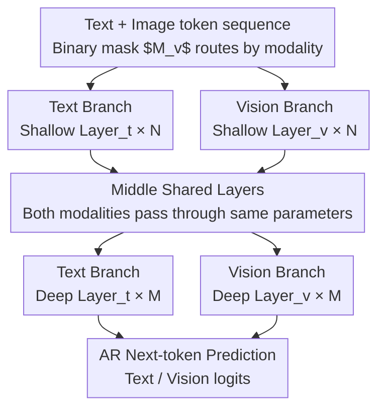

# Uni-X: Mitigating Modality Conflict with a Two-End-Separated Architecture for Unified Multimodal Models

**Conference**: ICLR 2026  
**arXiv**: [2509.24365](https://arxiv.org/abs/2509.24365)  
**Code**: [https://github.com/CURRENTF/Uni-X](https://github.com/CURRENTF/Uni-X)  
**Area**: Image Generation  
**Keywords**: Unified Multimodal Models, Gradient Conflict, Modality Separation, Autoregressive Generation, Image Generation and Understanding

## TL;DR
Uni-X proposes an X-shaped architecture that is separated at both ends and shared in the middle to mitigate gradient conflicts between visual and textual modalities in Unified Multimodal Models (UMM). By setting shallow and deep layers as modality-specific while keeping middle layers parameter-shared, it matches or exceeds the performance of 7B AR-UMMs in image generation and multimodal understanding with only 3B parameters.

## Background & Motivation

**Background**: Unified Multimodal Models (UMM) aim to support both image understanding and generation within a single framework. Autoregressive (AR) approaches tokenize visuals into a "foreign language" via VQ, offering architectural simplicity but limited performance. Complex designs (e.g., MoT, AR+Diffusion hybrid, task branches) are effective but sacrifice parameter sharing and scalability.

**Limitations of Prior Work**: Fully modality-shared Transformers suffer from severe gradient conflicts during joint training. The authors migrate the concept of gradient conflict from multi-task learning to UMM for the first time, discovering that visual and textual gradients conflict significantly in both shallow and deep layers.

**Key Challenge**: The conditional entropy of image token sequences is much higher than that of natural languages (English, German, Chinese), meaning visual sequences are inherently harder to predict and require modeling longer-distance spatial entanglement dependencies. When a shared Transformer processes low-entropy text and high-entropy visuals simultaneously, shallow and deep layers are forced to reconcile conflicting low-level distributions.

**Goal**: How to effectively mitigate inter-modality gradient conflicts while maintaining the simplicity of pure AR architectures?

**Key Insight**: Empirical analysis of gradient conflicts reveals that conflict weakens in the middle layers (where abstract semantic alignment occurs), providing a basis for a hierarchical structural design.

**Core Idea**: Shallow and deep layers are utilized for modality-specific processing (handling different low-level statistical distributions), while middle layers share parameters (utilizing high-level semantic alignment), forming an X-shaped separated-shared architecture.

## Method

### Overall Architecture
Uni-X addresses the problem where pure autoregressive (AR) unified multimodal models exhibit gradient interference during joint training if all Transformer layers share parameters between text and images. Instead of stacking additional modules, it modifies the hierarchical structure by partitioning an $L$-layer pre-trained LLM $\{\text{Layer}_t^i\}_{i=0}^{L-1}$ into three segments: the first $N$ layers and the last $M$ layers are designated as "separated layers," while the remaining middle layers are "shared layers." Within the separated layers at both ends, an additional set of parallel vision-specific layers $\{\text{Layer}_v^i\}$ is introduced alongside the original text layers. During forward propagation, a binary mask $M_v$ routes visual tokens to the vision branch and text tokens to the text branch. The overall structure is wide at the ends (modality-specific) and narrow in the middle (shared), hence the name X-shaped. This layer partitioning is derived from a systematic analysis: quantifying conflict, partitioning layers by conflict distribution, and explaining the conflict distribution through information theory.

### Key Designs

**1. Gradient Conflict Quantization: Measuring "Modality Interference"**

The design is motivated by a previously unquantified phenomenon: in fully shared Transformers during joint training, update directions for text and images counteract each other. Uni-X adopts the gradient conflict concept from multi-task learning, defining a computable metric. Specifically, it calculates the gradient of text-only batches $g_{\text{text}}$ and image-text batches $g_{\text{img}}$, then computes their cosine similarity $S_{\text{inter}}$. To remove noise—since even same-modality batches are not perfectly aligned—it calculates a baseline similarity $S_{\text{base}}$ from random splits of the same data. Conflict is defined as $c_g = -(S_{\text{inter}} - S_{\text{base}})$, where higher values indicate more oppositional gradients across modalities. Layer-wise measurement reveals a clear pattern: conflict is most severe in shallow and deep layers and weakest in the middle, providing direct justification for the X-shaped architecture.

**2. Two-End-Separated Architecture: Matching Structure to Conflict Distribution**

Since conflict is concentrated at the ends and weakest in the middle, the ends are separated while the middle remains shared. Forward propagation branches based on layer position: when $l < N$ or $l \geq L-M$ (separated layers), each modality $x$ passes through its own layer $H_x^{l+1} = \text{Layer}_x^l(H_x^l)$ without inter-modality interference. Otherwise, in middle shared layers, both modalities are concatenated and processed by the same parameters $H_x^{l+1} = [\text{Layer}_t^l(H^l)]_x$. A key constraint is strict isolation within separated blocks, forcing the model to learn robust single-modality representations before aligning semantics in middle layers. The logic is to align network structure with modality features—shallow and deep layers handle low-level statistical distributions where modality differences are greatest, while middle layers handle high-level semantic abstraction where sharing is most effective.

**3. Information Theory Explanation: Why "Vision is a Harder Foreign Language"**

This analysis investigates the root cause of the conflict. Using n-gram conditional entropy, Uni-X discovers that after VQ-tokenization, image sequences have much higher conditional entropy than natural languages. High conditional entropy implies that predicting the next token is more difficult given the context, suggesting longer-range spatial entanglement dependencies within the sequence. This grounds gradient conflict: when a shared shallow/deep layer is forced to fit low-entropy text distributions and high-entropy visual distributions simultaneously, the vastly different complexity requirements for low-level processing lead to opposing gradients. Thus, "vision is a harder foreign language" is a mathematical reality supported by entropy differences, explaining why separation is needed at the ends rather than the middle.

### Loss & Training
The model is trained using standard autoregressive cross-entropy loss $\mathcal{L} = -\sum_{i=1}^T \log P(s_i | s_{<i})$ without additional diffusion or alignment objectives. On the visual side, a Chameleon VQGAN tokenizer encodes $512 \times 512$ images into $32 \times 32$ discrete tokens (codebook size 8192), which are concatenated with text tokens into a single sequence for prediction. Classifier-Free Guidance (CFG) is set to 4.0 during generation.

## Key Experimental Results

### Main Results (Text Performance)

| Model | Parameters | ARC-E | ARC-C | WinoG | BoolQ | MMLU | Avg |
|------|------|-------|-------|-------|-------|------|-----|
| Chameleon | 7B | 76.1 | 46.5 | 70.4 | 81.4 | 52.1 | 65.3 |
| Liquid | 7B | 75.6 | 49.0 | 72.7 | 81.0 | 56.0 | 66.9 |
| **Ours (Uni-X)** | **3B/4.5B** | **79.0** | 47.9 | 68.9 | **82.2** | **57.6** | **67.1** |

### Main Results (Image Generation & Multimodal Understanding)

| Model | Parameters | GenEval | DPG | MME | POPE | MMB | SEED |
|------|------|---------|-----|-----|------|-----|------|
| EMU3 | 8B | 66 | 80.6 | 1243.8 | 85.2 | 58.5 | 68.2 |
| Liquid | 7B | 68 | 79.8 | 1107.2 | 81.1 | — | — |
| Janus-Pro | 7B | 80 | 84.1 | — | 87.4 | 79.2 | 72.1 |
| **Ours (Uni-X)** | **3B/4.5B** | **82** | 79.8 | 1158.3 | 83.6 | 59.3 | 60.2 |

### Key Findings
- Uni-X with 3B parameters achieves a score of 82 on GenEval, surpassing most 7B AR-UMMs, including Chameleon (39), EMU3 (66), and Liquid (68).
- Uni-X does not use semantic encoders (like CLIP/SigLIP) and relies on a pure AR architecture, indicating that gradient conflict is the key performance bottleneck.
- Gradient conflict analysis shows that Uni-X not only avoids conflicts at the ends but also further alleviates residual conflicts in the middle shared layers.
- Under identical training conditions, Uni-X exhibits better training efficiency than the fully shared baseline.

## Highlights & Insights
- **Problem Discovery over Solution**: This work is the first to quantify gradient conflict in UMM and trace it to information-theoretic roots (entropy differences). This analytical framework is broadly applicable to other multimodal/multi-task systems.
- **Victory of Simplicity**: Compared to complex designs like MoT or AR+Diffusion hybrids, Uni-X achieves competitive performance through simple layer partitioning, maintaining the scalability advantages of pure AR.
- **Parameter Efficiency**: Matching 7B performance with 3B parameters suggests that architectural design can be an effective alternative to brute-force scaling.
- **Novel Information Theory Perspective**: Explaining "vision as a harder foreign language" via conditional entropy is intuitive and theoretically grounded, explaining why separation is required at the ends rather than central layers.

## Limitations & Future Work
- Currently only handles non-interleaved multimodal inputs; performance on interleaved sequences (mixed text and images) is unverified.
- The choice of $N$ and $M$ (number of separated layers) currently relies on empirical tuning and lacks a principled selection rule.
- Strict isolation within separated layers might limit early-stage cross-modality information exchange.
- Dynamic or adaptive layer assignment strategies could be explored in future work.

## Related Work & Insights
- **vs Chameleon**: Fully shared architectures lead to severe conflicts, resulting in a GenEval score of 39 at 7B parameters, while Uni-X 3B reaches 82.
- **vs MoT/UniFork**: These methods mitigate conflict by increasing modular complexity at the cost of parameter sharing, whereas Uni-X remains streamlined.
- **vs Janus-Pro**: Janus-Pro achieves 80 on GenEval using an additional semantic encoder; Uni-X achieves 82 without one.

## Rating
- Novelty: ⭐⭐⭐⭐ Combination of gradient conflict analysis, information theory explanation, and X-shaped architecture.
- Experimental Thoroughness: ⭐⭐⭐⭐ Comprehensive evaluation across text, generation, and understanding tasks with thorough ablation.
- Writing Quality: ⭐⭐⭐⭐⭐ Clear motivation and rigorous logic from analysis to design.
- Value: ⭐⭐⭐⭐ Provides practical architectural principles for UMM design.

<!-- RELATED:START -->

## Related Papers

- [\[NeurIPS 2025\] Mitigating Intra- and Inter-modal Forgetting in Continual Learning of Unified Multimodal Models](../../NeurIPS2025/image_generation/mitigating_intra-_and_inter-modal_forgetting_in_continual_learning_of_unified_mu.md)
- [\[ICLR 2026\] Draw-In-Mind: Rebalancing Designer-Painter Roles in Unified Multimodal Models Benefits Image Editing](draw-in-mind_rebalancing_designer-painter_roles_in_unified_multimodal_models_ben.md)
- [\[ICLR 2026\] Generation then Reconstruction: Accelerating Masked Autoregressive Models via Two-Stage Sampling](generation_then_reconstruction_accelerating_masked_autoregressive_models_via_two.md)
- [\[ICLR 2026\] Detecting and Mitigating Memorization in Diffusion Models through Anisotropy of the Log-Probability](detecting_and_mitigating_memorization_in_diffusion_models_through_anisotropy_of_.md)
- [\[ICML 2026\] Conflict-Aware Additive Guidance for Flow Models under Compositional Rewards](../../ICML2026/image_generation/conflict-aware_additive_guidance_for_flow_models_under_compositional_rewards.md)

<!-- RELATED:END -->
