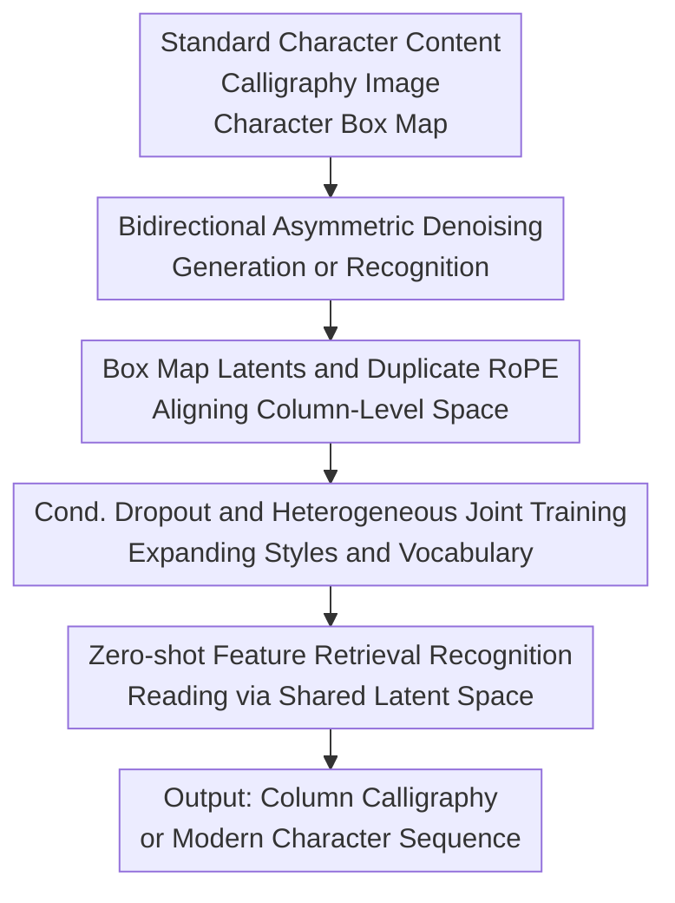

# UniCalli: A Unified Diffusion Framework for Column-Level Generation and Recognition of Chinese Calligraphy

**Conference**: ICLR 2026  
**OpenReview**: [https://openreview.net/forum?id=OSIPdrw56X](https://openreview.net/forum?id=OSIPdrw56X)  
**Code**: The authors promise to release code, datasets, and pre-trained weights after publication.  
**Area**: Diffusion Models / Image Generation / Calligraphy Generation and Recognition  
**Keywords**: Chinese Calligraphy Generation, Column-level Layout, Diffusion Transformer, Calligraphy Recognition, Cultural Heritage Digitalization

## TL;DR
UniCalli unifies column-level generation and recognition of Chinese calligraphy into a multimodal Diffusion Transformer. Through asymmetric denoising, box map spatial priors, and joint training, the model generates entire columns of calligraphy with natural ligatures and layout rhythm while maintaining robust recognition capabilities across long-tail calligraphers and styles.

## Background & Motivation
**Background**: Computational modeling of Chinese calligraphy generally follows two paths. One treats it as single-character font generation or few-shot style transfer, focusing on making a character resemble a target style. The other attempts to use general image generation models or Vision-Language Models (VLMs) to draw entire columns. The former is more reliable in character structure, while the latter closer approaches the visual form of complete works.

**Limitations of Prior Work**: Single-character generation methods overlook column-level aesthetics—the most critical aspect of calligraphy: linking strokes (牵丝), variations in size, vertical rhythm, and overall composition (章法). Although general image models can produce "calligraphy-like" pages, they frequently suffer from incorrect or missing characters and render specific styles as blurred textures. Calligraphy is not merely texture generation; a model must understand both "what the character is" and "how to write it within this column, author, and style."

**Key Challenge**: Generation tasks require strong style priors and global layout planning, while recognition tasks require stable glyph structures and character identity constraints. Previously, these tasks were trained separately: generation models often sacrificed glyph correctness for style, and recognition models lacked a generative understanding of styles, ligatures, and spatial rhythms. This paper argues that these tasks are not independent but are two directions of the same set of "semantic, glyph, style, and position" representations.

**Goal**: The authors aim to build a unified framework for column-level calligraphy: generating entire columns given standard character content and style, and inversely identifying modern characters from calligraphy images, while maintaining generalization in low-resource, long-tail styles, and ancient script scenarios.

**Key Insight**: UniCalli utilizes the multimodal denoising mechanism of diffusion models, encoding standard font renders, calligraphy images, and character box maps into latent variables. By controlling the task direction via asymmetric noise timesteps—where a clean standard character branch with a noisy calligraphy branch performs generation, and vice versa for recognition—the network repeatedly learns the mapping between "standard content" and "calligraphic visual form."

**Core Idea**: Employs a multimodal Diffusion Transformer with spatial priors to simultaneously learn calligraphy generation and recognition, using recognition to constrain glyph correctness in generation and using generation to supplement the style and layout understanding needed for recognition.

## Method

### Overall Architecture
The input to UniCalli consists of three types of visual signals: standard font renderings of the target text, real or to-be-generated calligraphy images, and box maps corresponding to each character's position and scale. These are encoded into latent variables via a pre-trained VAE and jointly modeled by a modified MMDiT (Multi-Modal Diffusion Transformer) using shared attention. The task direction is determined by the content branch timestep $t_c$ and the calligraphy/box map branch timestep $t_i$.

During generation, the content remains clean ($t_c=0$) while the calligraphy and box maps are denoised ($t_i\sim U(0,1)$). During recognition, the calligraphy branch is clean while the content branch is restored. This framework ensures that both capabilities share the same latent space and spatial coordinates.

### Key Designs
**1. Bidirectional Asymmetric Denoising: Unifying Generation and Recognition**

Unlike traditional split systems, UniCalli uses two independent timesteps to determine which modality is the condition and which is the target. Let $z_c$, $z_i$, and $z_m$ be the latents for content, calligraphy, and box maps, respectively. Flow matching denoising for any latent $z_k$ is defined as $z_k^\epsilon=t_k\epsilon_k+(1-t_k)z_k$. In generation mode ($t_c=0$), the model restores style from content. In recognition mode ($t_i=0$), it restores content from style. This forcing of the MMDiT to alternate between tasks compels the model to learn abstract representations of strokes, structures, and layout.

**2. Box Map Latents and Duplicate RoPE: Learning Column Layouts**

The difficulty in column-level calligraphy lies in natural transitions and rhythm. UniCalli constructs rasterized box maps as latent variables $z_m$. By explicitly restoring box maps during generation, the model learns "how large each character is and where it falls," rather than guessing from pixels. To align modalities, the authors propose Duplicate RoPE (Rotary Positional Embedding) with Modulated Embedding. The 2D RoPE calculated from the calligraphy latent is duplicated for content and box branches, with learnable modulated embeddings $E_{mod,k}$ added to distinguish signals.

**3. Conditional Dropout and Heterogeneous Training: Mitigating Long-Tail Challenges**

Calligraphy data is naturally long-tail. To prevent overfitting on rare styles as abstract textures, UniCalli employs a content dropout probability $p_{drop}$ (optimal at 0.05), where the content condition is replaced by noise ($t_c=1$). This allows the model to learn the distribution of real calligraphy styles in an unconditional manner from unlabelled data, while large-scale synthetic data (TTF fonts) expands the character vocabulary.

**4. Zero-shot Feature Retrieval Recognition: Latent Space Matching**

Instead of an autoregressive decoder, UniCalli utilizes the shared latent space for retrieval. In the offline phase, a reference library $L=\{(c,z_c)\mid c\in V\}$ is built by encoding all characters in the vocabulary. During inference, the predicted content feature $\hat z_{pred}$ is compared against the library using cosine similarity: $\hat c=\arg\max_{c\in V}\frac{\hat z_{pred}\cdot z_c}{\|\hat z_{pred}\|\|z_c\|}$. This allows for easy extension to new character systems (e.g., Oracle Bone script) without retraining a classification head.

### Loss & Training
UniCalli uses flow matching targets $L_{cond}$, $L_{img}$, and $L_{box}$. Generation mode primarily optimizes $L_{img}+L_{box}+\lambda L_{cond}$, while recognition primarily optimizes $L_{cond}+\lambda(L_{img}+L_{box})$, with $\lambda=0.02$. The training set includes 8,000 digitized works (4,000 with full annotations), unlabelled real images, and synthetic samples. The model finetunes a FLUX backbone on sequences of five characters ($128\times640$ resolution) for 500k iterations on 8 H100 GPUs.

## Key Experimental Results

### Main Results
Generation experiments involve both referenced and reference-free synthesis. 20 calligraphy enthusiasts evaluated reference-free results across four dimensions. Recognition was tested on character-level accuracy.

| Task | Metric | Ours | Strongest Baseline | Gain/Conclusion |
|------|------|----------|--------------|------------|
| Ref-free Generation | Style Fidelity ↑ | 4.267 | GPT-5: 2.987 | Significantly higher fidelity |
| Ref-free Generation | Glyph Accuracy ↑ | 4.827 | FontDiffuser: 4.950 | Comparable to single-char SOTA |
| Ref-free Generation | Naturalness ↑ | 4.520 | Doubao: 3.520 | More natural column rhythm |
| Ref-free Generation | Overall Preference ↑ | 4.560 | Doubao: 3.933 | Highest user preference |
| Ref-based Generation | FID ↓ | 37.69 | Doubao: 47.26 | Closer to real distribution |
| Ref-based Generation | LPIPS ↓ | 0.313 | ChatGPT-5: 0.412 | Smaller perceptual gap |

| Recognition Category | Ours Accuracy | Strongest Baseline | Note |
|----------|----------------|--------------|------|
| Regular (Kai) | 0.688 | Ernie-4.5: 0.600 | Clear unified model advantage |
| Clerical (Li) | 0.518 | CalliReader: 0.507 | Slight lead |
| Running (Xing) | 0.528 | CalliReader: 0.658 | Still weaker than specialized OCR |
| Cursive (Cao) | 0.109 | Ernie-4.5: 0.255 | Remained the hardest category |
| Total | 0.540 | Ernie-4.5: 0.534 | Highest overall accuracy |

### Ablation Study
The ablation starts from a standard FLUX baseline, adding joint training, Duplicate RoPE, and Conditional Dropout.

| Configuration | L1 ↓ | SSIM ↑ | LPIPS ↓ | FID ↓ | Details |
|------|------|--------|---------|-------|------|
| Baseline | 0.200 | 0.551 | 0.430 | 52.90 | Standard FLUX-style generation |
| + Joint Training | 0.160 | 0.604 | 0.387 | 46.42 | Recognition improves glyph quality |
| + RoPE Duplication | 0.148 | 0.613 | 0.352 | 41.78 | Better column alignment |
| + Cond. Dropout | 0.152 | 0.602 | 0.313 | 37.69 | Best realism and style diversity |

### Key Findings
- Joint training significantly improves FID and L1, proving recognition tasks constrain generative structures.
- Duplicate RoPE primarily improves spatial alignment and column layout stability.
- Conditional Dropout trades a small amount of L1/SSIM for much better perceptual quality (LPIPS/FID) and reduced mode collapse.
- Zero-shot retrieval allows for generalization to Oracle Bone (62.5% acc) and Egyptian Hieroglyphs (0.96 acc) without specialized OCR heads.

## Highlights & Insights
- The synergy between "reading" and "writing" ensures that style does not come at the cost of legibility.
- Box maps act as a structural language for column-level calligraphy, preventing the degeneration into isolated character mosaics.
- Duplicate RoPE provides a blueprint for other multimodal tasks where multiple signals must align on a shared spatial canvas.
- Conditional Dropout serves as a data interface, allowing unlabelled historical scripts to contribute to style distribution learning.

## Limitations & Future Work
- The model faithfully learns artifacts from historical rubbings (e.g., white noise/cracks), which may not always be desired for creative applications.
- Long-tail styles persist as a challenge; the style of very rare calligraphers may still deviate from original works.
- Recognizing cursive and seal scripts (accuracy < 0.11) remains a significant hurdle.
- Future work could introduce hierarchical layout planning (seals, colophons, margins) to support full-page artistic compositions rather than segments.

## Related Work & Insights
- **vs. FontDiffuser / DP-Font**: While these excel at single-character glyph accuracy, they ignore column-level rhythm. UniCalli provides a holistic column approach.
- **vs. Generalized Models (GPT-4o, Doubao)**: Unified specialized models like UniCalli outperform general models in style fidelity and character structural stability.
- **vs. Specialized Recognition (CalliReader)**: specialized models are stronger in cursive, but UniCalli's unified latent space offers better flexibility for zero-shot expansion to ancient scripts.

## Rating
- Novelty: ⭐⭐⭐⭐⭐ 
- Experimental Thoroughness: ⭐⭐⭐⭐☆ 
- Writing Quality: ⭐⭐⭐⭐☆ 
- Value: ⭐⭐⭐⭐⭐ 

<!-- RELATED:START -->

## Related Papers

- [\[ICLR 2026\] PosterCraft: Rethinking High-Quality Aesthetic Poster Generation in a Unified Framework](postercraft_rethinking_high-quality_aesthetic_poster_generation_in_a_unified_fra.md)
- [\[ICLR 2026\] Safety-Guided Flow (SGF): A Unified Framework for Negative Guidance in Safe Generation](safety-guided_flow_sgf_a_unified_framework_for_negative_guidance_in_safe_generat.md)
- [\[ICML 2026\] A Unified Framework for Diffusion Model Unlearning with f-Divergence](../../ICML2026/image_generation/a_unified_framework_for_diffusion_model_unlearning_with_f-divergence.md)
- [\[ACL 2025\] A Unified Agentic Framework for Evaluating Conditional Image Generation](../../ACL2025/image_generation/a_unified_agentic_framework_for_evaluating_conditional_image_generation.md)
- [\[ICCV 2025\] A Unified Framework for Motion Reasoning and Generation in Human Interaction](../../ICCV2025/image_generation/a_unified_framework_for_motion_reasoning_and_generation_in_human_interaction.md)

<!-- RELATED:END -->
