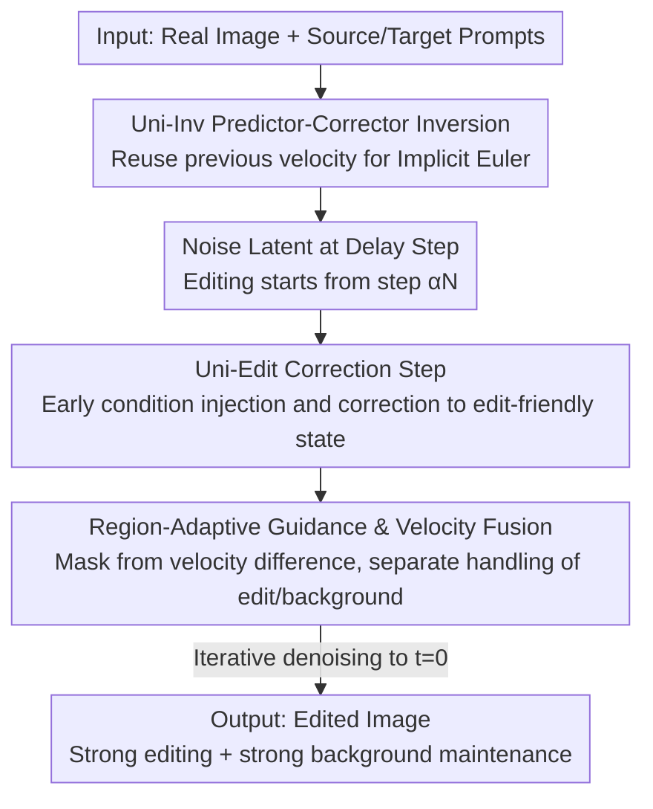

# UniEdit-Flow: Unleashing Inversion and Editing in the Era of Flow Models

**Conference**: ICLR 2026  
**OpenReview**: [https://openreview.net/forum?id=ArU2CeB7Tm](https://openreview.net/forum?id=ArU2CeB7Tm)  
**Code**: Yes (Project page, see paper)  
**Area**: Diffusion Models / Image Editing / Flow Matching  
**Keywords**: Flow Matching, Image Inversion, Image Editing, Predictor-Corrector, Region-Adaptive Guidance

## TL;DR
To address inversion collapse and the failure of delayed injection caused by the "straight, non-intersecting trajectories" in flow matching models (SD3, FLUX), this paper proposes a training-free, model-agnostic predictor-corrector framework. Uni-Inv achieves high-fidelity inversion by constructing an implicit Euler closed-form solution via reusing previous-step velocities. Uni-Edit incorporates a correction step during the editing stage, combined with region-adaptive guidance and velocity fusion. This allows for strong editing performance while maintaining background consistency within 15 steps, achieving SOTA results in both reconstruction and PIE-Bench editing tasks.

## Background & Motivation

**Background**: Diffusion models naturally transform "adding noise to real images → denoising with conditions" into image editors, spawning numerous training-free inversion (e.g., DDIM Inversion) and inversion-based editing methods. Recently, **flow matching models** such as SD3 and FLUX have replaced diffusion models in text-to-image generation. They differ fundamentally from diffusion models in two ways: first, the formulation shifts from stochastic SDEs to deterministic probability flow ODEs (rectified flow, modeling **straight** trajectories between distributions); second, the architecture transitions from U-Nets with cross/self-attention to DiT / MM-DiT.

**Limitations of Prior Work**: Inversion and editing techniques designed for diffusion models either fail or become inapplicable when moved to flow models. Specifically: ① **Degradation of delayed injection**: In diffusion, using the source condition in the first half and switching to the editing condition mid-way allows for smooth trajectory steering. However, flow model trajectories are straight and non-intersecting; points on one trajectory struggle to jump to another mid-way, resulting in "inchoate" editing effects. ② **Accumulation and collapse of inversion error**: Straight trajectories are extremely sensitive to velocity estimation errors. Once velocity is inaccurate, the inversion continuously deviates from the original trajectory, causing reconstruction failure in cluttered scenes.

**Key Challenge**: The geometric property of "straight, non-intersecting" trajectories, which makes flow models more efficient for generation, is precisely the obstacle for inversion and editing. It causes velocity errors to accumulate escape-less and invalidates editing paradigms like "mid-way condition switching" that rely on trajectory intersection.

**Goal**: Redesign inversion and editing explicitly for these design changes (ODE formulation + DiT architecture), decomposed into two sub-problems: (1) how to achieve accurate and stable inversion reconstruction on straight trajectories; (2) how to make delayed injection controllable and effective under non-intersecting trajectories.

**Key Insight**: Instead of trying to "force randomness back into flow models to make them behave like diffusion" (as many concurrent works do), the authors follow the characteristics of straight trajectories. Straight lines imply high velocity consistency between adjacent time steps; therefore, "reusing the previous velocity" can approximate implicit Euler at zero cost, which is the key to accurate inversion.

**Core Idea**: Unify inversion and editing using a "predictor-corrector" framework. For inversion, Uni-Inv uses reused velocity for implicit Euler correction. For editing, Uni-Edit upgrades delayed injection with an "early injection of editing conditions + a correction step based on current latents + velocity fusion with region mask guidance."

## Method

### Overall Architecture

The method centers on the concept of "correction" applied to both inversion and editing. The input consists of a real image $Z_0$, a source condition $c_S$ describing the original image, and a target condition $c_T$ for the editing goal; the output is an edited image that modifies only the target concept while keeping other regions intact. The process consists of three steps: first, use **Uni-Inv** to accurately invert the image to the noise latent $\hat Z_{t_{\alpha N}}$ at the delay step (ensuring "accurate inversion"); then, start the denoising loop of **Uni-Edit** from this delay step, where each step performs a **correction step** to push the current latent into an "edit-friendly" state (solving "inchoate delayed injection"); finally, use a **region mask** calculated from the difference between source and target velocities for adaptive guidance and velocity fusion (ensuring "no damage to the background"). Stepping to $t=0$ yields the final result. The delay rate $\alpha$ controls where editing starts, balancing background maintenance, editing strength, and inference cost ($\mathrm{NFE}=3\alpha N+1$).

### Key Designs

**1. Uni-Inv: Converting Implicit Euler to a Closed-form Solution via "Reused Velocity"**

The goal of inversion is to reverse the ODE back to the initial noise. The ideal formula is the implicit Euler: $\hat Z_{t_i}=\hat Z_{t_{i-1}}-(t_{i-1}-t_i)\,v_\theta(\hat Z_{t_i},t_i)$, but $v_\theta(\hat Z_{t_i},t_i)$ on the right side depends on the yet-to-be-calculated $\hat Z_{t_i}$, making it implicit and unsolvable directly. DDIM Inversion approximates this by using $v_\theta(\hat Z_{t_{i-1}},t_{i-1})$, which assumes the model prediction is constant between adjacent steps, inevitably introducing error. The authors make two observations: first, changing the time parameter of the velocity from $t_{i-1}$ to $t_i$ (i.e., $v_\theta(\hat Z_{t_{i-1}},t_i)$) is closer to implicit Euler and reduces single-step error by eliminating $t$-related error terms; second, the straight trajectories of rectified flow mean the "previous velocity" remains highly applicable at the current step.

Thus, Uni-Inv designs a **predictor-corrector** process: first, use the previous velocity $\hat v_{i-1}$ to "rewind" the sample from $t_{i-1}$ to $t_i$, obtaining a corrected sample $\bar Z_{t_i}=\hat Z_{t_{i-1}}-(t_{i-1}-t_i)\hat v_{i-1}$ (predictor/corrector); then, calculate the velocity aligned with the current time step on $\bar Z_{t_i}$, $\hat v_i=v_\theta(\bar Z_{t_i},t_i)$; finally, execute the actual inversion step $\hat Z_{t_i}=\hat Z_{t_{i-1}}-(t_{i-1}-t_i)\hat v_i$ using this "denoising-like" velocity. This is essentially a closed-form approximation of implicit Euler and **does not requiring extra model forward passes** (unlike ReNoise, which uses recursive sampling). Proposition 4.1 in the paper proves that under Lipschitz velocity fields and trajectories satisfying $\lVert Z_{t_p}-Z_{t_q}\rVert\le C\lVert t_p-t_q\rVert$, Uni-Inv has a single-step inversion/reconstruction error of $O(\Delta t_i^3)$, theoretically guaranteeing reconstruction quality.

**2. Uni-Edit Correction Step: Early Condition Injection and Latent-based Correction**

The failure of delayed injection in flow models occurs because switching conditions mid-way on straight trajectories fails to generate sufficiently different directions, resulting in no modification. Conversely, direct sampling with editing conditions from the start leads to over-editing. Uni-Edit solves this by **both injecting editing conditions early and performing a correction step using the current latent $\tilde Z_{t_i}$ itself** to suppress excessive modification.

Specifically, editing starts from the delay step initialization $\tilde Z_{t_{\alpha N}}=\hat Z_{t_{\alpha N}}$ (directly connected to the Uni-Inv latent). At each step, source velocity $v_i^S=v_\theta(\tilde Z_{t_i},t_i\mid c_S)$ and target velocity $v_i^T=v_\theta(\tilde Z_{t_i},t_i\mid c_T)$ are calculated to construct a correction term:

$$s_i \propto (t_{i-1}-t_i)\,(v_i^T-v_i^S),$$

This corrects the sample to an "edit-friendly" intermediate state $\check Z_{t_i}=\tilde Z_{t_i}+s_i$. Intuitively, $v_i^T-v_i^S$ points towards the "direction to change for editing." This step actively eliminates components hindering editing in early sampling, allowing subsequent denoising to truly modify the target concept.

**3. Region-Adaptive Guidance and Velocity Fusion: Velocity Difference as a Mask**

To "change only what should be changed," it is critical to identify pixels in the edit-related region. Following the observation that the difference between latents under different prompts highlights key edit areas, the authors use the difference between source and target velocities $v_i^-=v_i^T-v_i^S$ to construct a mask $m_i=\mathrm{MASK}(v_i^-)$, where $\mathrm{MASK}(\cdot)$ is a min-max normalization on the channel-mean map. This mask serves two purposes:

First, **region-guided correction**—the correction step is weighted by $(1+m_i)$: $s_i=\omega(t_{i-1}-t_i)(1+m_i)\odot v_i^-$, allowing edit-related regions to "rewind" with larger steps, more thoroughly erasing the original concept. The guidance strength $\omega$ is fixed at 5. Second, **velocity fusion**—subsequent sample updates fuse the target and source velocities according to the mask $v_i^F=m_i\odot v_i^T+(1-m_i)\odot v_i^S$, followed by $\tilde Z_{t_{i-1}}=\check Z_{t_i}+(t_{i-1}-t_i)v_i^F$. This ensures edit areas follow the target velocity while backgrounds follow the source velocity. Compared to existing "latent fusion," velocity fusion avoids additional memory overhead and "Sphinx-like" unnatural artifacts caused by direct concatenation.

### Loss & Training

This method is **completely training-free, tuning-free, and model-agnostic**. The underlying flow models utilize the standard flow matching objective $\min_\theta \mathbb{E}\lVert (Z_1-Z_0)-v_\theta(Z_t,t)\rVert^2$ where $Z_t=tZ_1+(1-t)Z_0$. Both Uni-Inv and Uni-Edit only modify the sampling strategy during inference. Key hyperparameters: 15 editing steps, delay rate $\alpha=0.6$ or $0.8$, guidance strength $\omega=5$; inference budget $\mathrm{NFE}=3\alpha N+1$; inversion uses 50 steps for SD3 and 30 steps for FLUX.

## Key Experimental Results

### Main Results

**Inversion and Reconstruction** (Conceptual Captions validation set, ~13.4k images, NFE aligned to SD3≈100 / FLUX≈60):

| Model | Method | MSE↓($10^3$, Uncond) | PSNR↑(Uncond) | SSIM↑($10^2$, Uncond) | MSE↓($10^3$, Cond) | PSNR↑(Cond) |
|------|------|------|------|------|------|------|
| SD3 | FireFlow | 20.27 | 19.60 | 66.96 | 16.95 | 20.85 |
| SD3 | **Uni-Inv** | **11.52** | **21.81** | **78.89** | **7.86** | **23.41** |
| FLUX | FireFlow | 23.31 | 18.15 | 63.85 | 30.78 | 17.59 |
| FLUX | **Uni-Inv** | **8.85** | **22.15** | **79.45** | **14.36** | **20.91** |

Regardless of text conditions or the base model (SD3/FLUX), Uni-Inv outperforms Euler, Heun, RF-Solver, and FireFlow across MSE, PSNR, SSIM, and LPIPS. Notably, in unconditional scenarios (null text), other methods often fail completely while Uni-Inv maintains near-perfect reconstruction.

**Text-Driven Image Editing** (PIE-Bench, 700 images, 10 edit categories):

| Method | Model | Struc.Dist↓($10^3$) | PSNR↑(BG) | CLIP-Whole↑ | CLIP-Edited↑ | Steps | NFE |
|------|------|------|------|------|------|------|------|
| InfEdit | Diff. | 13.78 | 28.51 | 25.03 | 22.22 | 12 | 72 |
| RF-Solver | FLUX | 31.10 | 22.90 | 26.00 | 22.88 | 15 | 60 |
| FireFlow | FLUX | 28.30 | 23.28 | 25.98 | 22.94 | 15 | 32 |
| **Ours (15, 0.6)** | SD3 | 21.40 | 24.96 | 26.39 | 22.72 | 15 | 28 |
| **Ours (15, 0.8)** | FLUX | 26.85 | 24.10 | 26.97 | **23.51** | 15 | 37 |
| **Ours (15, 0.6)** | FLUX | **10.14** | **29.54** | 25.80 | 22.33 | 15 | 28 |

Uni-Edit leads in structural distance, background maintenance (PSNR/LPIPS/MSE/SSIM), and CLIP similarity overall. It achieves this with only 15 steps and an NFE as low as 28, significantly cheaper than diffusion baselines (NFE 100).

### Ablation Study

The main tables reflect the impact of components. Core comparisons include:

| Configuration | Observation | Explanation |
|------|------|------|
| Vanilla Flow Inversion | Reconstruction fails in cluttered scenes | Velocity error accumulation/collapse on straight lines |
| Vanilla Delayed Injection | Editing is "inchoate" or unchanged | Non-intersecting trajectories prevent mid-way steering |
| Direct Cond Sampling | Over-editing, background destroyed | Deviation from original trajectory from the start |
| + Uni-Inv | Accurate reconstruction, stable even uncond | Implicit Euler correction via reused velocity |
| + Correction Step | Sufficient and effective editing | Early injection + current latent correction |
| + Region Guidance/Fusion | Edits applied only to target region | Divide-and-conquer via velocity difference mask |
| vs. Latent Fusion | Avoids unnatural "Sphinx" artifacts | Velocity fusion is more natural and memory-efficient |

### Key Findings
- **Alignment of velocity time parameters is crucial**: Changing the approximation time from $t_{i-1}$ to $t_i$ significantly reduces local error, being the direct source of Uni-Inv's accuracy.
- **Unconditional inversion is the true benchmark**: Removing text conditions causes RF-Solver / FireFlow to drop significantly in quality, while Uni-Inv remains stable, proving its gains come from the inversion mechanism itself.
- **Mask evolution is intuitive**: Early steps focus on larger areas with stronger editing to erase original concepts; later steps refine details as the impact of $m_i$ weakens.
- **Velocity fusion vs. Latent fusion**: Latent fusion leads to unnatural artifacts near mask boundaries, whereas velocity fusion is more seamless and requires zero extra VRAM.

## Highlights & Insights
- **Turning "Weakness" into "Strength"**: Straight, non-intersecting trajectories are typically a hurdle for inversion. The authors leverage the "velocity consistency" of straight lines to implement implicit Euler at low cost.
- **Unified Predictor-Corrector**: The "correction" philosophy is applied to both sides—correcting samples for inversion and correcting directions for editing—creating an elegant framework.
- **Utility of Velocity Difference**: $v_i^T-v_i^S$ functions as both the editing direction (correction term) and the source for the region mask, solving "where to change" and "how to change" simultaneously.
- **Transferable Tricks**: Using velocity differences for region masks and velocity fusion over latent fusion can be directly applied to other sampling-based flow model tasks.

## Limitations & Future Work
- The authors plan to inject more conditions (e.g., using images as personalized prompts), as current work focuses on text-driven editing.
- The mask derived from velocity difference is a simple heuristic; its quality might be a bottleneck in scenarios where edit regions and background are deeply intertwined.
- Parameters like delay rate $\alpha$ and guidance strength $\omega$ involve trade-offs between background maintenance and editing strength. While fixed values are SOTA, adaptive selection for different edit types was not explored.
- Theoretical error bounds depend on Lipschitz assumptions of the velocity field, which are not quantified for large-scale models.

## Related Work & Insights
- **vs. DDIM Inversion**: DDIM assumes constant prediction between steps; Uni-Inv uses current-time aligned reused velocity for a closed-form implicit Euler solution, reducing single-step error to $O(\Delta t^3)$.
- **vs. RF-Solver / FireFlow**: These target reduced discretization error but are not reconstruction-oriented, limiting their use in editing. Uni-Inv specifically ensures reconstruction reliability.
- **vs. Diffusion Editing (P2P, MasaCtrl, InfEdit)**: Diffusion delayed injection relies on trajectory intersection. Uni-Edit reactivates this paradigm for flow models via its correction step and velocity fusion.
- **vs. Latent Fusion**: Uni-Edit's velocity fusion avoids the "Sphinx-like" artifacts and additional memory cost associated with mask-based latent concatenation.

## Rating
- Novelty: ⭐⭐⭐⭐⭐ Directly addresses flow model trajectory characteristics with an elegant reused-velocity implicit Euler and dual-purpose velocity difference.
- Experimental Thoroughness: ⭐⭐⭐⭐ Extensive inversion (13.4k images) and editing (700 images) tasks across SD3/FLUX. Detailed main tables, though component ablations are partially in the appendix.
- Writing Quality: ⭐⭐⭐⭐⭐ Excellent analysis of why diffusion methods fail on flow models. Clear algorithms and diagrams.
- Value: ⭐⭐⭐⭐⭐ Training-free, model-agnostic, and high efficiency (15 steps) make it highly practical for the flow model era.

<!-- RELATED:START -->

## Related Papers

- [\[ICLR 2026\] FlowAlign: Trajectory-Regularized, Inversion-Free Flow-based Image Editing](flowalign_trajectory-regularized_inversion-free_flow-based_image_editing.md)
- [\[ICLR 2026\] Free Lunch for Stabilizing Rectified Flow Inversion](free_lunch_for_stabilizing_rectified_flow_inversion.md)
- [\[ICML 2025\] Taming Rectified Flow for Inversion and Editing](../../ICML2025/image_generation/taming_rectified_flow_for_inversion_and_editing.md)
- [\[ICLR 2026\] Delay Flow Matching](delay_flow_matching.md)
- [\[ICLR 2026\] Structured Flow Autoencoders: Learning Structured Probabilistic Representations with Flow Matching](structured_flow_autoencoders_learning_structured_probabilistic_representations_w.md)

<!-- RELATED:END -->
## Related Papers

- [\[ICLR 2026\] FlowAlign: Trajectory-Regularized, Inversion-Free Flow-based Image Editing](flowalign_trajectory-regularized_inversion-free_flow-based_image_editing.md)
- [\[ICLR 2026\] Free Lunch for Stabilizing Rectified Flow Inversion](free_lunch_for_stabilizing_rectified_flow_inversion.md)
- [\[ICML 2025\] Taming Rectified Flow for Inversion and Editing](../../ICML2025/image_generation/taming_rectified_flow_for_inversion_and_editing.md)
- [\[ICCV 2025\] FlowEdit: Inversion-Free Text-Based Editing Using Pre-Trained Flow Models](../../ICCV2025/image_generation/flowedit_inversion-free_text-based_editing_using_pre-trained_flow_models.md)
- [\[ICLR 2026\] Joint Distillation for Fast Likelihood Evaluation and Sampling in Flow-based Models](joint_distillation_for_fast_likelihood_evaluation_and_sampling_in_flow-based_mod.md)

<!-- RELATED:END -->
