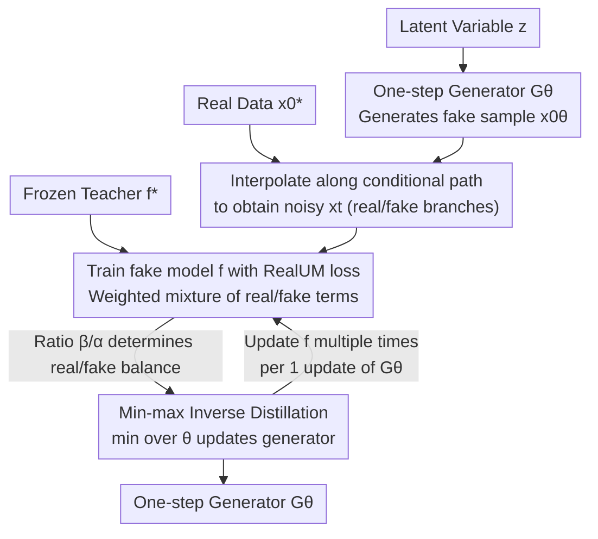

# RealUID: Supervising the Distillation of All Matching Models with Real Data (Without GAN)

**Conference**: ICLR 2026  
**OpenReview**: [https://openreview.net/forum?id=8NuN5UzXLC](https://openreview.net/forum?id=8NuN5UzXLC)  
**Code**: https://github.com/David-cripto/RealUID  
**Area**: Diffusion Models / One-step Generation / Model Distillation  
**Keywords**: matching models, one-step distillation, real data supervision, inverse optimization, flow matching

## TL;DR
RealUID unifies one-step distillation methods specifically designed for single frameworks (such as SiD, FGM, and IBMD) into a single min-max loss through a "linearization + inverse optimization" perspective. It designs a loss that injects real data directly into the distillation objective **without relying on GANs or extra discriminators**. On CIFAR-10, it reduces the FID of flow distillation from 2.58 to 1.98 (unconditional) and from 2.21 to 1.87 (conditional), with a convergence speed approximately 3 times faster.

## Background & Motivation

**Background**: Generative models such as Diffusion Models (DM), Flow Matching (FM), Bridge Matching, and Stochastic Interpolants essentially perform the same task—learning the drift/score of an ODE/SDE to transform noise back into data. The paper collectively refers to these as **matching models**. While they produce high-quality generation, they suffer from slow inference due to the requirement of many integration steps during sampling. Consequently, a series of **one-step distillation** methods have emerged (SiD for diffusion, FGM for flow, IBMD for bridge), which use a pre-trained multi-step teacher to guide a one-step generator $G_\theta$.

**Limitations of Prior Work**: This line of research faces two persistent issues. First, **fragmentation**: although SiD, FGM, and IBMD share almost identical mathematical skeletons, they each derive separate losses and complex proofs for their respective frameworks, lacking a unified explanation. Second, **inability to utilize real data**: these methods are inherently data-free. The generator only follows the teacher and cannot correct the teacher's inherent errors. To incorporate real data, existing approaches typically attach an external GAN, adding a discriminator head to the fake model and an auxiliary adversarial loss.

**Key Challenge**: Integrating GANs incurs significant costs, including modifications to the network architecture (the discriminator head) and the tuning of adversarial weights $\lambda_{adv}$ that are scale-uninterpretable and unrelated to the main distillation loss. It also inherits traditional adversarial training issues: non-stationary objectives, mode collapse, and sensitivity to training dynamics. The root cause is that **real data is "plugged in" externally rather than naturally emerging from the distillation loss itself**.

**Goal**: (1) To provide a unified, concise, and rigorous theoretical framework for one-step distillation of all matching models; (2) To find a natural way to integrate real data into distillation without any additional models or losses.

**Key Insight**: The authors observe that the true obstacle to unification is the intractable term in the distillation loss where the "expectation is nested inside a squared norm." If a **linearization identity** can be used to decompose it into a linearly sampleable form, the entire distillation can be formulated as a unified min-max problem. This min-max structure exactly matches the standard form of **inverse optimization**, which is naturally compatible with "loss swapping," providing an entry point for real data.

**Core Idea**: By using linearization, distillation is unified as a Min-max Unified Inverse Distillation (UID). The Unified Matching loss within it is then rewritten as a weighted sum of a "generated data term" and a "real data term" (RealUM). As long as minimizing the loss on real data still recovers the same teacher, real data is seamlessly injected into the distillation without a GAN.

## Method

### Overall Architecture

RealUID aims to distill an expensive, frozen multi-step teacher $f^*$ into a one-step generator $G_\theta$ while allowing real data $p^*_0$ to participate directly in supervision. The process is a min-max alternating optimization: the inner loop maximizes the training of a **fake model** $f$ to fit the current generation distribution (while memorizing real data), and the outer loop minimizes to update the generator $G_\theta$, forcing the generation distribution to align with the real distribution represented by the teacher.

In each round: the latent variable $z$ passes through the one-step generator to produce a fake sample $x_0^\theta$; real samples $x_0^*$ are taken directly from the dataset; both branches interpolate noisy samples $x_t$ along the conditional path of the matching model. The fake model $f$ is trained using a **RealUM loss containing both generated and real data terms** (the sole entry point for real data); the frozen teacher $f^*$ provides a reference. The "teacher term − fake term" forms the RealUID loss, where $f$ is maximized and $\theta$ is minimized. For stability, the fake model is updated several times for each generator update. The linearization trick in the first design below is key to making all min-max terms linearly sampleable.

### Key Designs

**1. Linearization Trick: Rewriting Intractable Distances as Unified Min-max**

The distillation goal is to minimize the squared distance between the teacher function $f^*$ and the student function $f^\theta$ along the generation path: $\mathbb{E}\|f^*_t(x_t^\theta) - f^\theta_t(x_t^\theta)\|^2$. The difficulty lies in $f^\theta_t(x_t^\theta) = \mathbb{E}_{x_0^\theta}[f^\theta_t(x_t^\theta|x_0^\theta)]$ being an expectation, making the entire term intractable once squared: direct sampling is biased, and calculating the derivative requires explicit knowledge of $p_0^\theta$'s dependence on $\theta$. The authors use a simple identity $\|a\|^2 = \max_b\{-\|b\|^2 + 2\langle b, a\rangle\}$ and introduce an auxiliary function $\delta$ (setting $\delta = f^* - f$, where $f$ is the fake model) to linearize the squared norm:

$$\mathbb{E}\|f^*_t - f^\theta_t\|^2 = \max_{f}\Big\{ L_{UM}(f^*, p_0^\theta) - L_{UM}(f, p_0^\theta) \Big\}$$

Each term becomes linear with respect to the expectation and is directly sampleable. Thus, distillation is written as a unified **UID loss** $\min_\theta\max_f\{L_{UM}(f^*, p_0^\theta) - L_{UM}(f, p_0^\theta)\}$ (Theorem 1: The real data generator $p_0^\theta = p_0^*$ is the solution). The value of this approach is that SiD (setting $\alpha_{SiD}=0.5$), FGM, and IBMD are all special cases of it. What previously required separate proofs for each framework is now explained by one linearization, and this trick is more general, extending to Bridge Matching, Stochastic Interpolants, and non-squared $\ell_2$ variants.

**2. RealUM Loss: Splitting Real Data into the Fake Model Objective Without a Discriminator**

The min-max structure of UID takes the form of inverse optimization $\min_\theta\max_f\{L(f^*,\theta) - L(f,\theta)\}$. Inverse optimization is open to "swapping the loss $L$," provided the new loss minimized on real data still recovers the same teacher $f^*$. Based on this, the authors transform the Unified Matching loss into the **RealUM loss** (Def 2), a weighted sum of two terms with $\alpha,\beta\in(0,1]$:

$$L^{\alpha,\beta}_{R\text{-}UM}(f, p_0^\theta) = \underbrace{\alpha\,\mathbb{E}\big\|f_t(x_t^\theta) - \tfrac{\beta}{\alpha} f^\theta_t(x_t^\theta|x_0^\theta)\big\|^2}_{\text{Generated Data Term}} + \underbrace{(1-\alpha)\,\mathbb{E}\big\|f_t(x_t^*) - \tfrac{1-\beta}{1-\alpha} f^*_t(x_t^*|x_0^*)\big\|^2}_{\text{Real Data Term}}$$

The elegance lies in the coefficients: since $\alpha + (1-\alpha) = 1$ and $\alpha\cdot\frac{\beta}{\alpha} + (1-\alpha)\cdot\frac{1-\beta}{1-\alpha} = 1$, when the input is real data, the two terms combined still $\propto \mathbb{E}\|f_t(x_t^*) - f^*_t(x_t^*|x_0^*)\|^2$, and minimization still yields the original teacher $f^*$. Thus, the solution to the inverse min-max remains the real data generator (Theorem 2), but real data has entered the fake model's training through the real data term. Compared to the GAN route, this doesn't change architecture or add adversarial terms—real data emerges naturally from within the distillation loss. Data-free UID is a special case where $\alpha=\beta=1$.

**3. The $\beta/\alpha$ Ratio: Determining if Real Data Truly Takes Effect**

Real data enters only during the "max over $f$" step; the generator is only indirectly influenced by the fake model that has memorized real data. Lemma 2 reveals that the active components are $\alpha$ and the ratio $\beta/\alpha$. $\alpha$ only scales the minimized distance, while $\beta/\alpha$ determines the relative relationship between $f^\theta_t$ and $f^*_t$ within the distance. When $\beta/\alpha = 1$, the distance differs from the data-free distance only by a scale; **formally adding real data has no effect**. Only when $\beta/\alpha \neq 1$ does a non-vanishing feedback term appear where $p_0^\theta(x_t)\approx 0$ but $p_0^*(x_t)\gg 0$. This is when the generator **receives supervision for regions where "real data covers but I do not,"** provably correcting the teacher's errors. However, caution is needed: if $\alpha$ or $\beta$ are too small, the contribution of the generated data term vanishes; similarly, $\beta/\alpha \ll 1$ or $\beta/\alpha \gg 1$ leads to gradient issues or drowning out the real data term. The practical recipe is to find a $\beta/\alpha$ near 1 (experimental optima: $0.98$ or $1.02$) and then fine-tune $\alpha < 1$, keeping both close to 1.

### Loss & Training

The total objective is the RealUID min-max: $\min_\theta\max_f\{L^{\alpha,\beta}_{R\text{-}UM}(f^*, p_0^\theta) - L^{\alpha,\beta}_{R\text{-}UM}(f, p_0^\theta)\}$. Implementation is alternating: fixing the generator, updating the fake model $f$ on both generated and real data several times using the RealUM loss to ensure the inner max is approximately achieved; then fixing $f$ and updating the generator $G_\theta$ once. The experiment is implemented with flow matching. Parameter search range for $\alpha,\beta \in [0.85, 1.0]$ with step $0.02$ (searched via $\alpha$ and $\beta/\alpha$ grid). A **fine-tuning stage** is also used: the generator is initialized from the best checkpoint of training from scratch, the fake model is initialized from the teacher, and training continues with a new set of $\alpha_{FT},\beta_{FT}$ to further reduce FID.

## Key Experimental Results

Experiments were conducted on CIFAR-10 (32×32) and CelebA (64×64), using lightweight flow matching architectures. A flow teacher was trained, and test FID for 50k samples is reported.

### Main Results

Comparison of one-step generation methods on CIFAR-10 (FID↓, NFE=1):

| Setting | Teacher Flow (100 steps) | FGM (UID Baseline) | UID + GAN | **RealUID + FT** | Strongest Diffusion (SiD2A) |
|------|------|------|------|------|------|
| Unconditional | 3.57 | 3.08 / 2.58 | 2.10 | **1.98** | 1.50 |
| Conditional | 5.56 | 2.58 / 2.21 | 1.88 | **1.87** | 1.39 |

RealUID consistently outperforms the strongest flow distillation baseline FGM within the flow family, with nearly 2× faster inference. It approaches the leading diffusion distillation SiD, though it remains behind the adversarial-augmented SiD2A—which the authors attribute to differences in architecture and teacher capacity rather than the lack of adversarial loss.

### Ablation Study

Grid search of $(\alpha, \beta/\alpha)$ and GAN weight comparison on CIFAR-10 (FID↓, baseline = UID without real data, $\alpha=\beta=1$):

| Configuration | Unconditional FID | Conditional FID | Note |
|------|-----------|-----------|------|
| UID Baseline ($\beta/\alpha=1$) | 2.58 | 2.21 | Formal addition of real data is ineffective |
| RealUID ($\beta/\alpha=0.98$ or $1.02$) | 2.33–2.44 | 2.02–2.19 | Outperforms baseline at most $\alpha$ |
| $\beta/\alpha=0.96 / 1.04$ | 2.66–2.97 | — | Degrades, worse than baseline |
| Best GAN ($\lambda^{G}_{adv}{=}0.3,\lambda^{D}_{adv}{=}1$) | 2.29 | 2.12 | Parity in Uncond, significantly loses to RealUID in Cond |

### Key Findings
- **$\beta/ \alpha$ is the switch**: Real data only has a positive effect when the ratio falls in the narrow band $[0.98, 1.02]$. $\beta/\alpha=1$ is equivalent to no injection, and being too far off degrades performance—perfectly aligning with theoretical analysis.
- **More efficient and stable than GAN**: Without discriminators or adversarial losses, the best configuration significantly outperforms GAN-based schemes in conditional generation and matches them in unconditional.
- **~3x Faster Convergence**: Best RealUID configurations reach baseline saturation levels in ~100k iterations, whereas the baseline takes ~300k.
- **Robust across datasets**: The optimal $\beta/\alpha$ and performance trends on CelebA 64×64 match CIFAR-10, indicating the ratio is not a per-dataset heuristic.

## Highlights & Insights
- **Unifying three methods with one identity**: The identity $\|a\|^2=\max_b\{-\|b\|^2+2\langle b,a\rangle\}$ is used to eliminate the intractable "expectation inside norm" term, unifying SiD, FGM, and IBMD into a single min-max framework. Its theoretical simplicity surpasses the original specialized proofs.
- **Distillation as Inverse Optimization**: Identifying the UID min-max as the standard form of inverse optimization provides the "license" to swap losses and introduce real data, distinguishing RealUID from GAN-based "plug-ins."
- **Transferable Trick**: As long as a loss satisfies the invariant "minimizing on real data recovers the same teacher," any supervision term can be added. This "teacher-invariant" design pattern is reusable in other data-free distillation scenarios.
- **Counter-intuitive $\beta/\alpha$**: Formally adding real data ($\alpha=\beta<1$) may have zero effect. One must deliberately set $\beta/\alpha \neq 1$ to open the real data feedback loop.

## Limitations & Future Work
- **Still trails adversarial SOTA**: RealUID + FT still lags behind SiD2A (1.50 / 1.39). While authors blame architecture and capacity, the possibility that "no adversarial means no ultimate SOTA" remains.
- **Small Experimental Scale**: Tested only on CIFAR-10 and CelebA 32/64. Effectiveness on ImageNet or text-to-image at scale is unverified.
- **Sensitivity to ratio**: The effective range for $\beta/\alpha$ is extremely narrow ($[0.98, 1.02]$). While robust across small datasets, new model families might still require grid search without an automated selection method.
- **Focus on Squared $\ell_2$**: Core conclusions revolve around squared distance and Gaussian paths; non-squared variants and general couplings are in the appendix and not fully validated experimentally.

## Related Work & Insights
- **vs FGM / SiD / IBMD**: These were developed separately for specific models and are data-free. The paper proves all three are special cases of UID (e.g., SiD with $\alpha_{SiD}=0.5$ is equivalent to UID with $\alpha=\beta=1$).
- **vs SiD+GAN / FGM+GAN (e.g., SiDA/SiD2A)**: These rely on external discriminators and adversarial losses, requiring architectural changes and $\lambda_{adv}$ tuning. RealUID modifies the UM loss itself without adding networks, using parameters with clear physical meanings.
- **vs DMD**: DMD minimizes the KL between real and generated distributions. This paper notes it as a special case of the UID framework when swapping to a specific KL loss.

## Rating
- Novelty: ⭐⭐⭐⭐⭐ Unifying all matching distillation via linearization and deriving a GAN-free real data injection loss is highly novel.
- Experimental Thoroughness: ⭐⭐⭐⭐ Strong alignment between ablation and theory with GAN comparisons, but limited to small datasets.
- Writing Quality: ⭐⭐⭐⭐⭐ Clear theoretical progression and definitions; explains a complex unified framework simply.
- Value: ⭐⭐⭐⭐ Provides a clean unified framework and a practical GAN-free solution for one-step distillation. Theoretical contribution outweighs raw SOTA numbers.

<!-- RELATED:START -->

## Related Papers

- [\[CVPR 2026\] Flow Map Distillation Without Data](../../CVPR2026/image_generation/flow_map_distillation_without_data.md)
- [\[ICLR 2026\] SenseFlow: Scaling Distribution Matching for Flow-based Text-to-Image Distillation](senseflow_scaling_distribution_matching_for_flow-based_text-to-image_distillatio.md)
- [\[ICLR 2026\] Joint Distillation for Fast Likelihood Evaluation and Sampling in Flow-based Models](joint_distillation_for_fast_likelihood_evaluation_and_sampling_in_flow-based_mod.md)
- [\[ICLR 2026\] Do We Need All the Synthetic Data? Targeted Image Augmentation via Diffusion Models](do_we_need_all_the_synthetic_data_targeted_image_augmentation_via_diffusion_mode.md)
- [\[ICLR 2026\] Delay Flow Matching](delay_flow_matching.md)

<!-- RELATED:END -->
