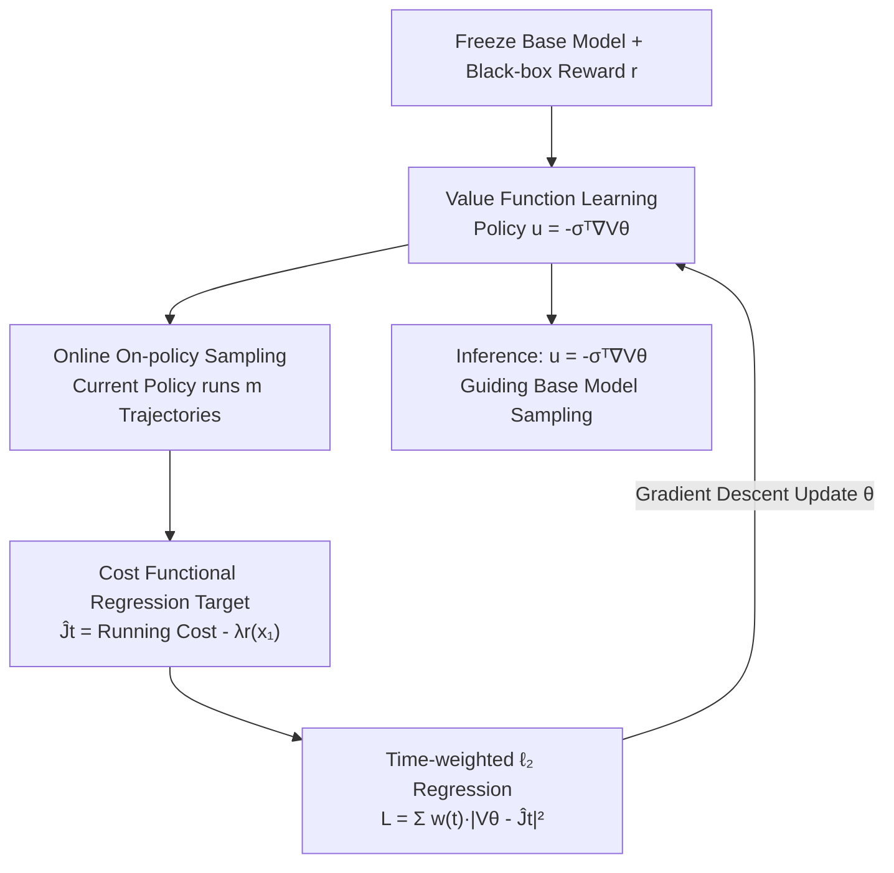

# Value Matching: Scalable and Gradient-Free Reward-Guided Flow Adaptation

**Conference**: ICLR 2026  
**OpenReview**: [https://openreview.net/forum?id=7iXt44Actj](https://openreview.net/forum?id=7iXt44Actj)  
**Area**: Diffusion Models / Flow Matching / Reward Alignment  
**Keywords**: Flow model adaptation, value function learning, stochastic optimal control, non-differentiable rewards, memory-efficient

## TL;DR
The authors reformulate "reward adaptation for large-scale flow/diffusion models" as a stochastic optimal control (SOC) problem, **learning only a small value network online** while freezing the base model. This approach supports non-differentiable (black-box) rewards and allows for on-demand GPU memory adjustment, achieving comparable performance on image and molecular generation using less than 5% of the memory required by fine-tuning methods.

## Background & Motivation

**Background**: Flow matching and diffusion models have become dominant generative models in fields such as imaging, chemistry, biology, and robotics. Adapting these pre-trained large-scale models to downstream rewards (e.g., controllable editing, drug discovery) is crucial for practical applications. Currently, two main categories of methods exist: 1. **Fine-tuning** based on Reinforcement Learning (DDPO/DPOK) and Stochastic Optimal Control (SOC, e.g., Adjoint Matching); 2. **Classifier Guidance (CG)**, which keeps base model parameters fixed.

**Limitations of Prior Work**: Fine-tuning methods require backpropagation through the entire base model, necessitating the caching of all intermediate activations. Consequently, **memory consumption scales linearly with model size**—models at the scale of SD2 can require 250GB of VRAM and 800 GPU-hours. Worse, many SOTA methods (like Adjoint Matching) rely on reward gradients; however, rewards in drug discovery often come from external simulators or experimental measurements that only provide scalar, non-differentiable values. While CG freezes the base model to save memory and supports black-box rewards, it is an **offline** algorithm. It trains only on samples from the pre-training distribution $p^{\text{pre}}_t$, failing to explore high-reward regions outside the original data distribution. Furthermore, its loss includes an $\exp(\lambda r)$ term, which overflows in 32-bit floating point when $\lambda r > 90$, severely limiting the reward scale $\lambda$.

**Key Challenge**: Fine-tuning ties "reward adaptation" to "base model optimization," making memory usage dependent on model scale. CG decouples the two but suffers from distribution shift due to offline training. The goal is a method that decouples components and saves memory while supporting black-box rewards and permitting online exploration of high-reward regions.

**Core Idea**: The authors reformulate KL-regularized reward adaptation as a control-affine SOC problem with quadratic costs and instead **learn its value function $V$ online**. Once $V$ is learned, the optimal control is directly given by the Pontryagin Minimum Principle as $u^\star(x,t) = -\sigma^\top(t)\nabla_x V(x,t)$. Critically, the value function remains differentiable even when the reward is not (as noise acts as a smoothing kernel). This allows for handling black-box rewards and aligns the "training distribution" with the "current policy distribution" for online exploration.

## Method

### Overall Architecture
VM (Value Matching) frames the adaptation problem as controlling a trajectory determined by a base model SDE $dx_t = (b^{\text{pre}} + \sigma u)\,dt + \sigma\,dB_t$ over the time interval $[0,1]$. The objective is to maximize terminal reward $\lambda r(x_1)$ while remaining close to the base distribution. The corresponding value function $V(x,t)=\inf_u J(u;x,t)$ represents the optimal remaining cost from $(x,t)$, and the optimal control is $u^\star=-\sigma^\top\nabla_x V$. **The method follows an iterative regression cycle**: sample trajectories online using the current value network's control policy, estimate the cost functional $\hat J_t$ along the trajectory using single-sample Monte Carlo, and regress $V_\theta(x_t,t)$ toward $\hat J_t$. The base model remains frozen throughout, and only this value network—which can be flexibly sized—is trained.

### Key Designs

**1. Value Function Learning: Decoupling Reward Adaptation from Base Model Optimization**

This design addresses both the memory overhead and the reward differentiability requirements of fine-tuning. VM does not update the base model; it learns a separate value function $V$ and derives control from the first-order optimality condition $u^\star(x,t)=-\sigma^\top(t)\nabla_x V(x,t)$. This offers two mathematical advantages. First, **non-differentiable rewards are handled**: the value function $V(x,t)=-\log\mathbb{E}_{p^{\text{pre}}}[\exp(\lambda r(x_1))\mid x_t=x]$ averages over all noise realizations from $x_t$ to $x_1$. Noise acts as a smoothing kernel, smoothing out reward discontinuities (proven in Proposition 1). Thus, even if the reward is black-box (e.g., JPEG compression bits, xTB dipole moments), the optimal control is well-defined. Second, **resource overhead is controllable**: the dominant computation shifts from "training the base model" to "base model inference + value network training." Since the value network architecture can be small, memory and compute are adjustable, enabling a 95% reduction in VRAM.

**2. Online On-policy Training: Distribution Alignment**

The fundamental flaw of CG is its offline nature—it only trains on samples from the fixed pre-training distribution $p^{\text{pre}}_t$, whereas generative optimization seeks high-reward regions where data is sparse. As the policy shifts probability mass toward high-reward areas, samples from $p^{\text{pre}}_t$ become less informative. VM addresses this by **sampling trajectories online using the current policy $u=-\sigma^\top\nabla_x V_{\bar\theta}$**: $dx_t=(b^{\text{pre}}-\sigma^2\nabla V_{\bar\theta})\,dt+\sigma\,dB_t$. This ensures the training distribution is always aligned with the distribution $p^u_t$ encountered during inference, eliminating the train-test mismatch of CG. Practically, VM remains stable under moderate reward scaling $\lambda$, while CG diverges.

**3. Cost Functional Regression Target + Time Weighting: Stable Regression**

With online trajectories, VM learns $V$ via a concise $\ell_2$ regression. Along each trajectory, the cost functional is estimated as:

$$\hat J_t = \tfrac{1}{2}\int_t^1 \sigma^2(s)\,\|\nabla_x V_{\bar\theta}(x_s,s)\|^2\,ds - \lambda r(x_1),$$

where $\bar\theta=\text{stopgrad}(\theta)$ ensures the target is treated as constant during backpropagation. The network prediction is then regressed: $L(\theta)=\tfrac12\int_0^1 w(t)\,|V_\theta(x_t,t)-\hat J_t|^2\,dt$. A critical engineering component is the **time weighting $w(t)$**: under memoryless noise schedules, $\sigma(t)\to\infty$ as $t\to0$, which would cause variance to explode without weighting. The authors use $w(t)=\frac{1}{\lambda^2}\big(1+\frac12\int_t^1\sigma^2(s)\,ds\big)^{-1}$ to normalize rewards by $\lambda$ and down-weight time steps with high future variance, stabilizing training. This regression also avoids the $\exp(\lambda r)$ overflow issues found in CG.

### Loss & Training
The core loss is the weighted $\ell_2$ value matching $L_{\text{VM}}$. In each iteration: ① Sample $m$ trajectories using the current policy; ② Calculate $\hat J_t$ for each step (with stopgrad); ③ Perform one gradient descent step on $\nabla L(\theta)$. The SDE is discretized into $T$ steps via Euler-Maruyama, and integrals are approximated via Riemann sums. VM can be viewed as a **zero-order (gradient-free) analogue of Adjoint Matching** (AM regresses $\nabla_x J$ to learn $\nabla_x V$, while VM regresses $J$ to learn $V$) and a **simplification of CT-PPO**.

## Key Experimental Results

### Main Results
Testing on CIFAR, DiT (ImageNet 256), SD2 Text-to-Image, and FlowMol using **non-differentiable** rewards (JPEG bits, LAION aesthetic score, dipole moment, QED).

| Task / Base Model | Metric | Base Model | VM | Note |
|--------------|------|--------|-----|------|
| FlowMol (QED, λ=500) | Stable% ↑ | 49.5 | 67.6 | Improvements in stability, validity, and QED simultaneously |
| FlowMol (QED, λ=500) | QED ↑ | 0.42 | 0.49 | As above |
| FlowMol (Dipole) | Avg. Dipole (Debye) ↑ | 6.4 | 7.5 | Fragmentation rate dropped from 31% to 28% |
| SD2 VRAM | Memory (GB) ↓ | — | <12 | Fine-tuning needs ~250GB, **95%+ savings** |
| SD2 Training Time | GPU-Hours ↓ | — | <35 | Fine-tuning needs ~800 GPU-hours |

On CIFAR, compared to fine-tuning methods (DDPO/DPOK/CT-PPO) and inference-time methods (SVDD): in compression tasks, fine-tuning methods suffered mode collapse while VM remained stable. CT-PPO reached comparable performance but required extensive hyperparameter tuning, whereas VM uses only one hyperparameter.

### Ablation Study
Value network scaling (CIFAR + Aesthetic reward, λ=100, Configs A–F, 0.5M–92M parameters):

| Config | Params (M) | Memory (GB) ↓ | Reward ↑ | Note |
|------|---------|-----------|----------|------|
| None | — | — | 2.31 | Base Model |
| A | 0.5 | 3.2 | 3.77 | Smallest network already provides significant reward gains |
| D | 15.1 | 5.7 | 4.02 | Highest reward |
| F | 92.3 | 11.2 | 3.26 | Larger is not necessarily better |

Inference overhead (Batch 128, RTX 4090): VM adds only 1–30% time compared to the base model (e.g., SD2 from 122s to 127s), whereas SVDD is 40×–600× slower due to evaluating 20 candidates per step.

### Key Findings
- **Small Value Networks Suffice**: A 0.5M parameter value network significantly improves rewards. Increasing the network size does not lead to monotonic improvements, supporting the efficiency of small value functions.
- **VM Avoids Reward Hacking**: In molecular tasks, target attributes improve alongside secondary metrics like stability, indicating chemically sound behavior rather than exploitation.
- **Time Weighting $w(t)$ is Essential**: Without it, variance explosions occur near $t=0$ where $\sigma(t)\to\infty$.

## Highlights & Insights
- **Decoupling as the Root of Efficiency**: Shifting the dominant compute from base model backpropagation to base model inference plus small value network training allows memory usage to bypass base model scale.
- **Noise as a Smoothing Kernel**: The smoothing effect of the value function allows for a mathematically elegant handling of black-box rewards without needing explicit gradients.
- **Unified Perspective**: VM links SOC and RL by acting as a zero-order analogue of Adjoint Matching and a simplified version of CT-PPO.
- **Portability**: The weighted $\ell_2$ regression logic for value matching can be applied to any diffusion adaptation scenario where fine-tuning is too costly.

## Limitations & Future Work
- **Inference requires an extra $\nabla_x V$ calculation**: Although overhead is low (1-30%), the value network must be loaded and differentiated during deployment.
- **Single-Sample MC Variance**: While suppressed by stopgrad and time weighting, variance in $\hat J_t$ might become problematic for higher-dimensional or more complex rewards.
- **Dependency on Memoryless Noise Schedules**: Theoretical conclusions regarding differentiability are based on this specific schedule; generalizability to other schedules requires further study.
- **Reward Evaluability**: Black-box rewards must still be executable; if the reward function itself is extremely computationally expensive, the cost of online sampling remains high.

## Related Work & Insights
- **vs Classifier Guidance (CG)**: CG is offline and its loss is prone to overflow; VM is online (on-policy), uses $\ell_2$ regression, and eliminates train-test mismatch.
- **vs Adjoint Matching (AM)**: AM requires reward gradients; VM is gradient-free (zero-order) regarding the reward, supporting black-box functions by regressing the scalar cost $J$.
- **vs CT-PPO / DDPO / DPOK (Fine-tuning RL)**: These methods are memory-intensive and prone to mode collapse; VM freezes the base model, uses minimal VRAM, and is more stable.
- **vs SVDD (Inference-time)**: SVDD evaluates $M$ candidates per step, making it orders of magnitude slower; VM amortizes this cost during training.

## Rating
- **Novelty**: ⭐⭐⭐⭐⭐ Reformulates reward adaptation as online value learning, unifying and simplifying AM and CT-PPO.
- **Experimental Thoroughness**: ⭐⭐⭐⭐ Covers multiple modalities and rewards; includes extensive resource and scaling ablations.
- **Writing Quality**: ⭐⭐⭐⭐⭐ Clear narrative connecting control theory with engineering implementation.
- **Value**: ⭐⭐⭐⭐⭐ High impact for large-scale model adaptation and scientific discovery with black-box rewards due to the 95% memory reduction.

<!-- RELATED:START -->

## Related Papers

- [\[ICLR 2026\] Source-Guided Flow Matching](source-guided_flow_matching.md)
- [\[NeurIPS 2025\] Value Gradient Guidance for Flow Matching Alignment](../../NeurIPS2025/image_generation/value_gradient_guidance_for_flow_matching_alignment.md)
- [\[ICLR 2026\] FlowCast: Trajectory Forecasting for Scalable Zero-Cost Speculative Flow Matching](flowcast_trajectory_forecasting_for_scalable_zero-cost_speculative_flow_matching.md)
- [\[ICLR 2026\] DenseGRPO: From Sparse to Dense Reward for Flow Matching Model Alignment](densegrpo_from_sparse_to_dense_reward_for_flow_matching_model_alignment.md)
- [\[ICLR 2026\] Training-Free Reward-Guided Image Editing via Trajectory Optimal Control](training-free_reward-guided_image_editing_via_trajectory_optimal_control.md)

<!-- RELATED:END -->
