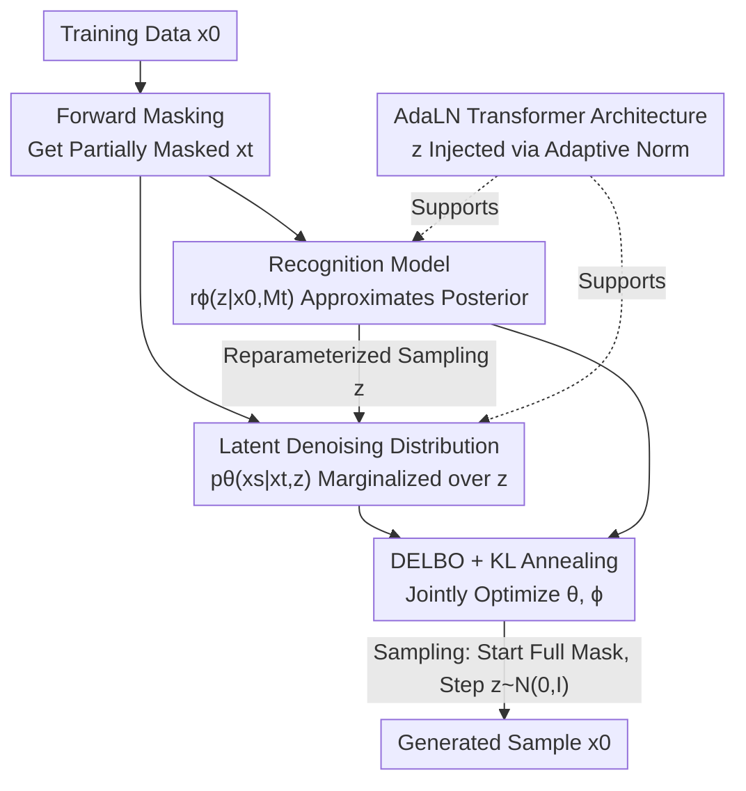

# Variational Autoencoding Discrete Diffusion with Enhanced Dimensional Correlations Modeling

**Conference**: ICLR 2026  
**OpenReview**: [https://openreview.net/forum?id=yh7MV2V0ba](https://openreview.net/forum?id=yh7MV2V0ba)  
**Code**: https://github.com/tyuxie/VADD  
**Area**: Diffusion Models / Discrete Generation  
**Keywords**: Discrete Diffusion, Masked Diffusion Models, VAE, Latent Variables, Dimensional Correlations

## TL;DR
To address the issue of sample corruption in Masked Diffusion Models (MDM) during few-step sampling caused by "independent prediction across dimensions," this paper proposes VADD. By introducing a Gaussian latent variable $z$ into the denoising distribution and jointly training the denoising and recognition models via a Variational Autoencoder (VAE) framework, it implicitly models inter-dimensional correlations. This significantly improves the sample quality of few-step generation while maintaining the same sampling overhead as standard MDM.

## Background & Motivation

**Background**: As diffusion models expanded from continuous spaces (images/audio/video) to discrete spaces, Masked Diffusion Models (MDMs) emerged as a highly competitive approach. The forward process gradually "masks" each dimension into a full `[M]` state, while the reverse process starts from a full mask and **parallelly** demasks (predicts) multiple dimensions. Compared to autoregressive models that generate one token at a time, the parallel prediction of MDM offers natural potential for sampling acceleration.

**Limitations of Prior Work**: In each reverse transition step, MDMs model the denoising distribution as a **product of independent categoricals** across dimensions. While this is acceptable when steps are many and few dimensions are demasked per step, the real utility of MDM lies in "few-step fast sampling." When steps are reduced, many dimensions must be **demasked simultaneously**, causing the independence assumption to fail drastically. Since these dimensions are highly correlated in real data, independent prediction results in self-contradictory and uncoordinated samples (as shown in the 2D toy plots where MDLM collapses during one-step sampling).

**Key Challenge**: The number of dimensions demasked in a single step is proportional to $(\alpha_s-\alpha_t)$. Larger steps lead to more demasking, exacerbating the cumulative approximation error from "conditional independence." Existing mitigations, such as using pretrained autoregressive or correlation models for guidance, introduce extra inner-loop sampling steps, which slows down inference and contradicts the efficiency goal of MDMs.

**Goal**: To enable the single-step denoising distribution of MDM to capture joint correlations between dimensions without **increasing sampling overhead or relying on pretrained teachers**, specifically aiming to improve sample quality in few-step sampling.

**Key Insight**: The authors leverage a classic insight from VAEs: while a mean-field decoder $p_\theta(y|z)$ is independent across dimensions, the marginal distribution $p_\theta(y)=\int p_\theta(y|z)p(z)\,dz$ can still express complex dimensional correlations after **integrating out the latent variable $z$**. Similarly, by injecting a latent variable as a "controller" into the MDM denoising distribution and then marginalizing it, the reverse transition distribution can capture correlations while keeping each conditional distribution factorizable for parallelism.

**Core Idea**: Replace "explicit independent distributions" with "latent variables + marginalization" to model MDM reverse transitions. The latent variable $z$ acts as a high-level semantic controller guiding the denoising toward a specific mode of clean data. Since marginalizing $z$ is intractable, a Variational Autoencoding framework is used, introducing a recognition model and maximizing a new lower bound (DELBO) for joint training.

## Method

### Overall Architecture

VADD (Variational Autoencoding Discrete Diffusion) modifies the MDM reverse transition $p_\theta(x_s|x_t)$ from an "explicitly writable independent distribution" into a **latent variable model**:

$$p_\theta(x_s|x_t)=\int_{\mathbb{R}^d} p_\theta(x_s|x_t,z)\,p(z)\,dz,\qquad p(z)=\mathcal{N}(0_d,I_d).$$

The conditional distribution $p_\theta(x_s|x_t,z)$ still follows the $x_0$-prediction parameterization of MDM and remains factorizable across dimensions (preserving parallelism and efficiency). However, due to the integration over $z$, the **marginal** transition distribution $p_\theta(x_s|x_t)$ can model correlations across dimensions. Intuitively, there are multiple valid ways to recover $x_0$ from a partially masked $x_t$ (i.e., $q(x_0|x_t)$ is multimodal), and $z$ serves as the controller that "selects the mode."

The trade-off is that the marginal likelihood $p_\theta(x_0|x_t)$ involves an intractable integral over $z$, preventing direct maximization of the original ELBO. Therefore, a recognition model $r_\phi(z|x_0,x_t)$ is introduced to approximate the posterior, leading to VAE-style joint training. The denoising model $\mu_\theta$ and recognition model $r_\phi$ are trained together by maximizing a new lower bound called DELBO (with KL annealing). **The recognition model is not needed during sampling**—starting from a full mask, each step involves sampling $z$ from the prior $p(z)$ and then demasking using $p_\theta(x_s|x_t,z)$, maintaining the same cost as standard MDM.

### Key Designs

**1. Latent Denoising Distribution: Capturing Correlations via Marginalization without Losing Parallelism**

This design directly addresses the pain point where "products of independent categoricals cannot model correlations, leading to collapse in few-step sampling." VADD retains the $x_0$-prediction form of MDM but allows the denoising probability $\mu_\theta$ to take $z$ as an additional input:

$$p_\theta(x_s^i|x_t^i,z)=\begin{cases}\mathrm{Cat}(x_s^i;\,\delta_{x_t^i}), & x_t^i\neq[M];\\[4pt]\mathrm{Cat}\!\left(x_s^i;\,\tfrac{1-\alpha_s}{1-\alpha_t}\delta_{[M]}+\tfrac{\alpha_s-\alpha_t}{1-\alpha_t}\,\mu_\theta^i(x_t,z,t)\right), & x_t^i=[M].\end{cases}$$

The key is that **given $z$**, dimensions remain conditionally independent (enabling one-step parallel demasking and fast inference). However, the marginal $p_\theta(x_0|x_t)=\int \prod_i[\cdots]\,p(z)\,dz$ is a coupled mixture distribution capable of expressing joint constraints within a single step (e.g., "all pixels bright or all pixels dark"). Unlike methods that use pretrained autoregressive models for inner-loop guidance, VADD "internalizes" correlations into the model itself.

**2. Variational Autoencoding Mechanism: Joint Training via DELBO + KL Annealing**

Since the marginal $p_\theta(x_0|x_t)$ is intractable due to integration over $z$, the continuous-time ELBO of original MDM cannot be directly maximized. The authors treat $p_\theta(x_0|x_t)$ as a "marginal likelihood conditioned on $x_t$" and apply a VAE framework. Introducing $r_\phi(z|x_0,x_t)\approx p_\theta(z|x_0,x_t)$ yields a **lower bound of the ELBO**—the Double Evidence Lower Bound (DELBO):

$$\widehat{L}(x_0;\theta,\phi)=\int_0^1\!\mathbb{E}_{q(x_t|x_0)}\mathbb{E}_{r_\phi(z|x_0,x_t)}\left[-\tfrac{\alpha_t'}{1-\alpha_t}\log\tfrac{p_\theta(x_0|x_t,z)\,p(z)}{r_\phi(z|x_0,x_t)}\right]dt\;\le\;L(x_0;\theta).$$

The bound is tight when $r_\phi$ perfectly fits the posterior. The recognition model is a diagonal Gaussian $r_\phi(z|x_0,x_t)=\mathcal{N}(m_\phi,\,\mathrm{diag}\{\sigma_\phi^2\})$. To prevent **posterior collapse** (where the recognition model ignores data and reverts to the prior), the authors use KL annealing, weight the KL term with $\lambda$ (scaling from 0 to 1):

$$\widehat{L}_\lambda(x_0;\theta,\phi)=\int_0^1\!\mathbb{E}_{q(x_t|x_0)}\mathbb{E}_{r_\phi}\left[-\tfrac{\alpha_t'}{1-\alpha_t}\Big(\log p_\theta(x_0|x_t,z)-\lambda\log\tfrac{r_\phi(z|x_0,x_t)}{p(z)}\Big)\right]dt.$$

**3. AdaLN Transformer Architecture: Efficient $z$ Injection and Focused Recognition**

Standard Transformers cannot be used directly for text generation; injecting a 1D $z$ without doubling the recognition model's computation is key. For the denoising model, $z$ is injected via **Adaptive Layer Normalization (AdaLN)**. In the recognition model $r_\phi(z|x_0,x_t)$, taking both $x_0$ and $x_t$ sequences would double the cost. Instead, the authors use a binary mask vector $M_t\in\{0,1\}^N$ (1 for masked) to map $(x_0, x_t)$ to $(x_0, M_t)$. AdaLN is then applied only to **masked positions** using a learnable mask representation vector $R_\phi$. The authors emphasize that the **recognition model must depend on $x_t$ (via $M_t$)**; ignoring $x_t$ causes severe posterior collapse even with KL annealing.

### Loss & Training
The training target is to maximize the KL-annealed DELBO $\widehat{L}_\lambda(x_0;\theta,\phi)$ for all $x_0$ in the dataset. $\theta$ and $\phi$ are updated jointly using reparameterization for $\phi$ gradients. The prior is fixed as a standard Gaussian $\mathcal{N}(0_d,I_d)$. $\lambda$ linearly increases from 0 to 1 over early epochs. Sampling follows Algorithm 2: start from $[M]^N$, at each step sample $z\sim p(z)$, then $x_{t_{i-1}}\sim p_\theta(\cdot|x_{t_i},z)$.

## Key Experimental Results

### Main Results

On 2D toys (checkerboard/swissroll/circles), VADD's JS divergence in one-step sampling is one to two orders of magnitude lower than MDLM:

| Dataset | Metric | MDLM | VADD |
|--------|------|------|------|
| checkerboard | JS-1 ↓ | 1.395 | **0.062** |
| checkerboard | JS-5 ↓ | 0.211 | **0.048** |
| swissroll | JS-1 ↓ | 2.619 | **0.086** |
| circles | JS-1 ↓ | 2.273 | **0.161** |

On CIFAR-10, the FID (↓, 50K images) gap for few-step sampling is massive; the fewer the steps, the larger the advantage:

| Sampling Steps $T$ | MDLM | VADD | Gain |
|------|------|------|------|
| 10 | 334.3 | **170.3** | ~2× |
| 20 | 261.3 | **108.7** | ~2.4× |
| 30 | 203.4 | **84.8** | ~2.4× |
| 50 | 140.3 | **64.6** | ~2.2× |
| 100 | 76.5 | **50.5** | ~1.5× |

For likelihood/perplexity: binarized MNIST BPD improved from 0.075 to **0.063**, CIFAR-10 BPD from 2.80 to **2.74**. LM1B test perplexity reached **20.53**, outperforming MDLM (27.70 at 1M steps, 23.00 at 10M steps) and even a 5M-step Autoregressive Transformer (20.86). On OpenWebText zero-shot perplexity, VADD outperformed MDLM† across most datasets while requiring **less than 50%** of MDLM's sampling compute to achieve the same generation perplexity.

### Ablation Study

| Configuration | Phenomenon | Description |
|------|------|------|
| Full VADD | Massive lead in few-step quality | Latent variables model dimensional correlations |
| Recognition model only takes $x_0$ | Severe posterior collapse | Dependencies on $M_t$ are mandatory |
| No KL annealing | Posterior collapse in high dims | $\lambda:0\to1$ is the prerequisite for stability |
| Training/Sampling Cost | Train ~1.5×, Sample equal | OpenWebText training speed: 2.77→1.84 it/s (≈0.66×) |

### Key Findings
- **Few-step sampling is VADD's primary strengths**: As steps decrease and more dimensions are demasked per step, the independence assumption failure worsens, increasing the benefits of VADD's correlation modeling. The gap narrows as steps increase.
- **VAE efficacy in lower dimensions**: BPD improvements in binarized MNIST ($V{=}2$) are much larger than in CIFAR-10. On LM1B, where ~75% are padding tokens (low effective dimensionality), VADD at 1M steps exceeds a strong 5M-step AR baseline.
- **Sample Quality > Likelihood**: VADD provides larger gains in **sample quality** (FID, Gen. Perplexity) than in likelihood (BPD, Perplexity), which aligns with the theoretical goal.
- **Dual Collapse Traps**: Both the $x_t$-dependent recognition model and KL annealing are strictly necessary to avoid posterior collapse.

## Highlights & Insights
- **Grafting VAE "Marginalization-induced Correlation" onto Discrete Diffusion**: Keeps conditional distributions factorizable for parallelism while capturing correlations via marginalization over $z$—improving quality without altering sampling overhead or requiring teachers.
- **Clever DELBO Construction**: Treating the intractable $p_\theta(x_0|x_t)$ as a second-layer marginal likelihood to apply a VAE bound effectively bypasses the "intractable Diffusion ELBO" obstacle.
- **Recognition model with $(x_0, M_t)$**: Leverages the structure that $x_t$ is a masked version of $x_0$. Compressing the input to a single sequence plus a binary mask and applying AdaLN only to masked tokens prevents compute from doubling.
- **Counter-intuitive Insight on $x_t$**: While it seems simpler for the recognition model to only see clean data $x_0$, it inevitably causes collapse. This suggests posterior designs must retain coupling with the noisy state.

## Limitations & Future Work
- **Oversimplified Prior/Prior Hole Risk**: Using a fixed standard Gaussian prior $p(z)$ might lead to "high prior / low posterior" holes. Future work could use conditional priors $p_\theta(z|x_t,t)$ or hierarchical priors.
- **1.5× Training Overhead**: Requires training two equally sized models (denoising and recognition). Future research could explore score divergence losses to train only the generative model.
- **Marginal Likelihood Gains**: The method primarily improves sample quality and coordination; gains in absolute BPD/perplexity are relatively smaller, especially in high-dimensional or large-vocabulary scenarios.
- Currently only validated on absorbing (mask) noise schedules; migration to uniform or other discrete schedules remains for future work.

## Related Work & Insights
- **vs MDLM / MD4 / SEDD (Standard MDM)**: These model reverse transitions as products of independent categoricals, leading to collapse in few-step sampling. VADD adds latent marginalization to solve this at the same sampling cost.
- **vs Guided Correlation Modeling**: Existing methods use pretrained AR models for inner-loop guidance, increasing inference compute. VADD internalizes correlations without extra steps.
- **vs Distillation (DiMO / Soft-DiMO)**: These require a **strong pretrained teacher** as a target. VADD trains directly from data using latent variables from scratch.
- **vs Classic VAE (Bowman 2015)**: VADD reuses KL annealing to fight collapse and contributes a new insight: the recognition model must depend on $x_t$ in discrete diffusion contexts.

## Rating
- Novelty: ⭐⭐⭐⭐⭐ First introduction of latent variable / VAE mechanisms into masked diffusion; the DELBO and $(x_0,M_t)$ designs are elegant.
- Experimental Thoroughness: ⭐⭐⭐⭐ Covers 2D toys, images (MNIST/CIFAR-10), and text (LM1B/OpenWebText). Few-step FID/Perplexity comparisons are clear, though more comparisons with other few-step baselines beyond MDLM would be beneficial.
- Writing Quality: ⭐⭐⭐⭐⭐ Logic is clear, derivation of DELBO is well-explained, and collapse/overhead issues are honestly addressed.
- Value: ⭐⭐⭐⭐⭐ Significant improvement in few-step discrete diffusion quality without extra sampling cost or teacher reliance, which is highly practical for text and pixel generation deployment.

<!-- RELATED:START -->

## Related Papers

- [\[ICLR 2026\] Discrete Variational Autoencoding via Policy Search](discrete_variational_autoencoding_via_policy_search.md)
- [\[ICLR 2026\] Pareto Variational Autoencoder](pareto_variational_autoencoder.md)
- [\[ICLR 2026\] Purrception: Variational Flow Matching for Vector-Quantized Image Generation](purrception_variational_flow_matching_for_vector-quantized_image_generation.md)
- [\[ICML 2025\] Distillation of Discrete Diffusion through Dimensional Correlations (Di4C)](../../ICML2025/image_generation/distillation_of_discrete_diffusion_through_dimensional_correlations.md)
- [\[ICLR 2026\] Loopholing Discrete Diffusion: Deterministic Bypass of the Sampling Wall](loopholing_discrete_diffusion_deterministic_bypass_of_the_sampling_wall.md)

<!-- RELATED:END -->
