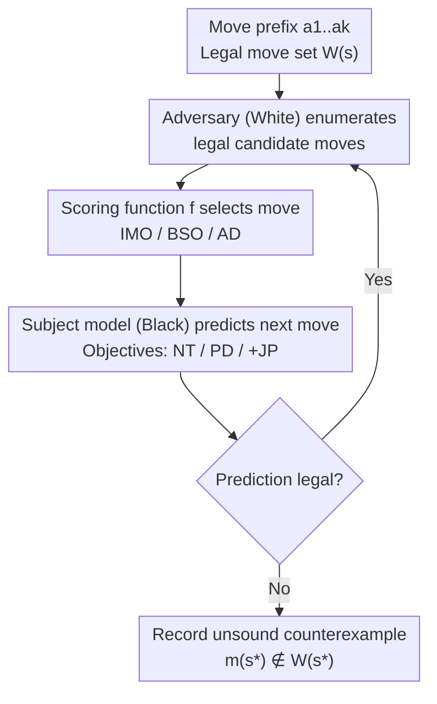

# Verification of the Implicit World Model in a Generative Model via Adversarial Sequences

**Conference**: ICLR 2026  
**arXiv**: [2602.05903](https://arxiv.org/abs/2602.05903)  
**Code**: [https://github.com/szegedai/world-model-verification](https://github.com/szegedai/world-model-verification)  
**Area**: World Models/Explainable AI  
**Keywords**: Implicit World Models, Adversarial Sequence Generation, Chess, Soundness Verification, Linear Probes

## TL;DR
This paper proposes an adversarial sequence generation method to verify the soundness of implicit world models in generative sequence models. Systematic evaluations across various adversarial strategies (IMO/BSO/AD) in the chess domain reveal that all tested models are unsound. Results indicate that training methods and dataset selection significantly impact soundness, and linear board state probes lack causal influence in most models.

## Background & Motivation

**Background**: Whether generative sequence models (e.g., LLMs) learn an underlying "world model" during training is a critical question. Prior work (Li et al. 2023, Toshniwal et al. 2022) trained models on Othello and Chess, claiming models learned world states via linear probes.

**Limitations of Prior Work**: (1) Simple metrics like next-token accuracy can be misleading—a fundamentally flawed model can still maintain high accuracy; (2) Sequence-level analysis proposed by Vafa et al. requires defining probability thresholds for generated languages, introducing ad hoc parameters; (3) It remains unclear whether states decoded by linear probes exert a causal influence on predictions.

**Key Challenge**: While it is theoretically possible to learn a sound world model from sequence samples, practical verification is difficult. Simple tests are insufficient; systematic stress-testing methods are required.

**Goal**: How can the soundness of a generative model's implicit world model be effectively verified? Do board state probes have a causal impact on predictions?

**Key Insight**: An adversary can generate legal sequences that force the generative model to predict illegal continuations, providing an existential counterproof of soundness.

**Core Idea**: By having an adversary play legal moves that pressure the subject model into making illegal moves, the failure modes of the implicit world model can be quantified and analyzed.

## Method

### Overall Architecture

The set of legal moves in chess is treated as a formal language. To verify if a generative sequence model is "sound" (outputting only legal moves in any legal position), an adversary is constructed to induce failures. The verification is a game loop: the adversary plays White and the subject model plays Black. For each step, the adversary selects a move from the set of legal moves $W(a_1..a_k)$ that is most likely to induce an error: $a_{k+1}^{*} = \arg\max_{a_{k+1} \in W(a_1..a_k)} f(M, a_1..a_k\,a_{k+1})$, where $f$ is a scoring function measuring "error-inducing potential." After the move, the subject model $M$ predicts the next move, and its legality is checked. If $M$ predicts an illegal move $m(s^{*}) \notin W(s^{*})$ in a legal position $s^{*}$, an existential counterexample of "unsound world model" is identified. The framework explores two axes: three attack strategies for $f$ (IMO / BSO / AD) and three training objectives for $M$ (NT / PD / +JP).

### Key Designs

**1. Illegal Move Oracle (IMO): Directly guiding the model toward its most likely violation**

The most potent attack involves the adversary directly maximizing the probability of the model producing an illegal move. The scoring function is $f_{\text{IMO}}(M, a_1..a_k a_{k+1}) = \max_{a_{k+2} \notin W} M(a_{k+2}|a_1..a_k a_{k+1})$. For every candidate legal move $a_{k+1}$, the adversary looks one step ahead to see the highest probability the model assigns to *any* illegal continuation. This explicitly searches for the model's weakest points, making the success rate of IMO a tight lower bound on the model's unsoundness.

**2. Board State Oracle (BSO): Disrupting board states to test the causal role of linear probes**

Prior works claimed that internal linear probes can decode board states, suggesting the model "learned the world state." BSO tests if this state actually informs next-token decisions. It defines $f_{\text{BSO}}(M, s) = \mathcal{L}_B(M, s)$, selecting moves that maximize the board state probe's prediction error $\mathcal{L}_B$. The hypothesis is that if the decoded state is causally linked to prediction, disrupting the state should induce illegal moves. The gap between BSO and IMO success rates serves as a measure of probe causality.

**3. Adversarial Detours (AD): Forcing sequences into rare out-of-distribution (OOD) regions**

Following Vafa et al. (2024), this strategy uses $f_{\text{AD}}(M, a_1..a_k a_{k+1}) = -M(a_{k+1}|a_1..a_k)$, selecting legal moves that the model considers least likely. This pushes the game into OOD areas rarely seen during training, where the model lacks reliable state representations. This is particularly effective against models trained on non-uniform data (e.g., strategic games).

**4. NT / PD / +JP Training Objectives: Modifying learning signals**

The framework evaluates different training objectives for $M$: standard Next-Token prediction (NT); Probability Distribution matching (PD), which fits a uniform distribution of all legal moves to force explicit representation of legality; and Joint Probe (+JP), which adds a board state prediction head alongside the next-token head. The combined loss $\text{NT+JP}$ or $\text{PD+JP}$ attempts to bake transition rules directly into the representations.

### Loss & Training

Experiments utilize a GPT-2 architecture (~86M parameters, 12 layers, 768-dim, 12 heads) trained on 6 datasets: random move sequences (500K / 2M / 10M scales) and three types of strategic games (Millionbase / Stockfish / Lichess). Crossing these with 4 training objectives yields 24 models, each subjected to IMO, BSO, and AD attacks.

## Key Experimental Results

### Attack Success Rates (Random Datasets)

| Attack Strategy | Random-10M NT | Random-10M PD |
|----------|---------------|---------------|
| RM (Random Baseline) | 0.673 | 0.874 |
| SMM (Softmax Max Baseline) | 0.172 | 0.900 |
| **IMO** | **0.972** | **0.992** |
| BSO | 0.541 | 0.811 |
| AD | 0.516 | 0.902 |

### Key Findings

1. **All models are unsound**: The IMO attack achieves near 100% success rates (up to 1.000). Even the best model (Random-10M + NT) has a 97.2% success rate.
2. **Dataset choice is critical**: 
    - Random datasets >> Strategic datasets (Millionbase/Stockfish/Lichess) for rule learning.
    - Increasing random training data significantly improves soundness (RM success rate dropped from 95.4% at 500K to 67.3% at 10M).
3. **PD objective is a double-edged sword**: 
    - While PD aims to learn legality, it shows higher vulnerability in non-adversarial baselines (SMM > 0.900), indicating higher error rates in general scenarios.
4. **BSO vs. IMO reveals lack of probe causality**: 
    - BSO success rates are significantly lower than IMO (e.g., 0.541 vs. 0.972).
    - This suggests that disrupting board state probe predictions does not directly lead to illegal moves.
    - Conclusion: Linear probes extract features that are not causally used by most models for next-token prediction.
5. **Random vs. Strategic Dataset differences**: Models trained on strategic data are more vulnerable to AD attacks (large OOD regions), while random data provides more uniform state space coverage.

## Highlights & Insights
- **Adversarial verification is superior to statistical testing**: It avoids ad hoc probability thresholds and directly provides evidence of failures.
- **Negative result on probe causality**: Challenges the assumption that "if a linear probe decodes a state, the model uses that state for prediction."
- **Data Quality Insight**: Random moves are better for learning rules than high-quality strategic moves, as the latter under-represent legal but sub-optimal actions.
- **Generality**: The framework can be extended to any domain where the world model can be defined as a formal language.

## Limitations & Future Work
- Evaluation restricted to 86M parameter GPT-2; larger models may exhibit different behaviors.
- Chess rules are deterministic, whereas world models for natural language are more ambiguous.
- Adversarial search is greedy; more effective attack sequences might exist.
- Potential application to domains with formal rules, such as code generation.

## Related Work & Insights
- **vs. Vafa et al.**: This method avoids the need for arbitrary probability thresholds to define the generated language.
- **vs. Li et al. (OthelloGPT)**: Li et al. claimed causal roles for probes, but findings here in the chess domain contradict that claim.
- **vs. Karvonen 2024**: While Karvonen suggested chess models have consistent world models, adversarial testing proves otherwise.

## Rating
- Novelty: ⭐⭐⭐⭐ The adversarial verification framework and the negative results on probe causality are valuable.
- Experimental Thoroughness: ⭐⭐⭐⭐⭐ Large-scale evaluation across 24 models, 5 attacks, and 6 datasets.
- Writing Quality: ⭐⭐⭐⭐⭐ Formal definitions and experimental designs are rigorous and clear.
- Value: ⭐⭐⭐⭐ Provides significant insights for AI safety and interpretability.

<!-- RELATED:START -->

## Related Papers

- [\[ICLR 2026\] GGBall: Graph Generative Model on Poincaré Ball](ggball_graph_generative_model_on_poincaré_ball.md)
- [\[CVPR 2025\] Training Data Provenance Verification: Did Your Model Use Synthetic Data from My Generative Model for Training?](../../CVPR2025/image_generation/training_data_provenance_verification_did_your_model_use_synthetic_data_from_my_.md)
- [\[ICLR 2026\] Generative Blocks World: Moving Things Around in Pictures](generative_blocks_world_moving_things_around_in_pictures.md)
- [\[NeurIPS 2025\] Denoising Weak Lensing Mass Maps with Diffusion Model and Generative Adversarial Network](../../NeurIPS2025/image_generation/denoising_weak_lensing_mass_maps_with_diffusion_model_and_generative_adversarial.md)
- [\[ICLR 2026\] Continuously Augmented Discrete Diffusion model for Categorical Generative Modeling](continuously_augmented_discrete_diffusion_model_for_categorical_generative_model.md)

<!-- RELATED:END -->
