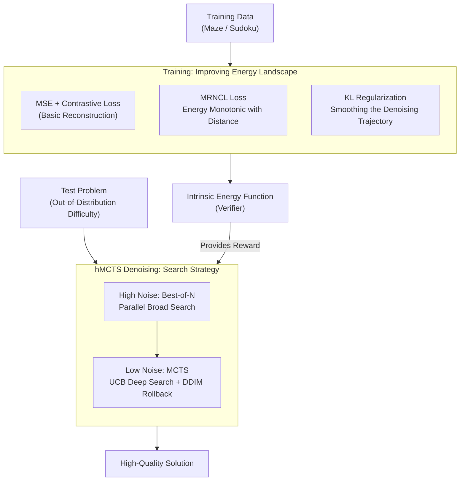

# VFScale: Intrinsic Reasoning through Verifier-Free Test-time Scalable Diffusion Model

**Conference**: ICLR 2026  
**arXiv**: [2502.01989](https://arxiv.org/abs/2502.01989)  
**Code**: [https://github.com/AI4Science-WestlakeU/VFScale](https://github.com/AI4Science-WestlakeU/VFScale)  
**Area**: Diffusion Models/Reasoning  
**Keywords**: Test-time Scaling, Verifier-Free, Energy Function, Monte Carlo Tree Search, Diffusion Model Reasoning

## TL;DR
VFScale proposes a verifier-free test-time scalable diffusion model. By employing MRNCL loss and KL regularization to improve the energy landscape, the intrinsic energy function serves as a verifier. Combined with hybrid MCTS denoising for efficient searching, a model trained on $6 \times 6$ mazes can solve 88% of $15 \times 15$ mazes, whereas standard diffusion models fail completely.

## Background & Motivation

**Background**: Inspired by human System 2 thinking, LLMs excel in complex reasoning via Chain-of-Thought. Diffusion models, through iterative refinement, are also suited for reasoning tasks, but their performance drops sharply when problem difficulty exceeds the training distribution.

**Limitations of Prior Work**: (1) Simply increasing sampling steps saturates quickly (Du et al. 2024); (2) Test-time scaling via increasing sample counts relies on external verifiers for dense scoring signals, which are difficult to obtain for reasoning tasks; (3) Humans perform introspective reasoning without external feedback, a capability largely missing in existing methods.

**Key Challenge**: The energy function of a diffusion model can theoretically serve as a verifier (as the score function is the negative gradient of energy), but existing energy landscapes are of poor quality—low energy does not necessarily correspond to high-quality solutions (poor performance-energy consistency).

**Goal**: How to leverage the diffusion model's intrinsic energy function to replace external verifiers and achieve verifier-free test-time scaling?

**Key Insight**: A dual approach—improving the energy landscape on the training side and enhancing search efficiency on the inference side.

**Core Idea**: Align the monotonic relationship between energy values and sample quality via MRNCL loss, and balance exploration vs. exploitation during denoising using hMCTS.

## Method

### Overall Architecture
VFScale aims to enable test-time scaling without external verifiers by transforming the model's intrinsic energy function into a reliable "quality scorer." The approach proceeds along two lines: on the training side, MRNCL loss (aligning energy with sample quality) and KL regularization (smoothing the energy landscape) are added to the standard MSE reconstruction and contrastive losses, ensuring low energy truly corresponds to high-quality solutions. On the inference side, hybrid MCTS denoising is utilized—employing broad exploration (Best-of-N) during early stages with high noise and deep searching (MCTS) during late stages with low noise, using the model's own energy as the reward to guide the search. The training phase produces a credible intrinsic energy function, which the inference phase then treats as a verifier to drive search, collectively achieving verifier-free test-time scaling.

### Key Designs

**1. MRNCL Loss: Hard-Constraining Energy to Increase with Distance from Correct Answers**

The root cause of poor energy landscapes is that original contrastive losses only require positive samples to be local minima, ignoring the relative ranking between negative samples. MRNCL (Monotonic-Regression Negative Contrastive Learning) addresses this missing ordinal relationship. For each positive sample $x_0$, two negative samples $x_0^-$ and $x_0^{--}$ are constructed, with the latter being further from the positive sample. After adding noise, energy values for three points are obtained: $(0, E_t^+)$, $(l_{2,0}^-, E_t^-)$, and $(l_{2,0}^{--}, E_t^{--})$. Linear regression is performed with $\ell_2$ distance to the positive sample as the x-axis and energy as the y-axis to calculate slope $k_t$ and intercept $b_t$. The loss is defined as:

$$\mathcal{L}_{\text{MRNCL}} = \mathbb{E}\big[\max(0, \gamma - k_t) + \sum \|E - \hat{E}\|_2^2\big]$$

The first term uses a hinge loss to force $k_t > \gamma$ (ensuring energy increases monotonically with distance), and the second term ensures the points fit the regression line (ensuring a smooth relationship). This allows the energy function to act as a verifier during test-time.

**2. KL Regularization: Smoothing the Energy Landscape Across the Denoising Trajectory**

Monotonicity alone is insufficient; a rugged energy landscape can still mislead search. The KL regularization term is defined as:

$$\mathcal{L}_{\text{KL}} = \mathbb{E}_{t, p_{\theta,t}}[E_{\text{stop-grad}(\theta)}(x)] + \mathbb{E}_{t, p_{\theta,t}}[\log p_{\theta,t}(x)]$$

The first term minimizes sample energy, pulling the distribution toward low-energy regions, while the second term maximizes entropy to encourage diversity. Unlike Du et al. (2021) who apply regularization only at the terminal state, this is applied at every denoising step $t$, smoothing the entire trajectory and making the energy scores reliable at every step.

**3. Hybrid MCTS Denoising (hMCTS): Switching Search Strategy by Noise Level**

hMCTS observes that denoising requires different search intensities as noise decreases. Early stages (high noise) use Best-of-$N$ to maintain $L$ parallel branches, avoiding premature pruning. Late stages (low noise) switch to MCTS for deep search. MCTS involves four steps: Selection uses UCB for exploration-exploitation balance:

$$\text{UCB}(x_t, a_t) = Q(x_t, a_t) + c\sqrt{\frac{\ln N_i}{n_i}}$$

Expansion performs a single denoising step with $K$ different Gaussian noise additions. Simulation uses DDIM jump-sampling to reach $\hat{x}_0$ and uses the intrinsic energy $E_\theta(\hat{x}_0)$ as the reward. Backpropagation updates the node values along the path. The jump-sampling of DDIM makes simulations computationally affordable for MCTS.

### Loss & Training
The training side optimizes four losses jointly; the first two ensure generation quality, while the latter two shape the energy landscape:

$$\mathcal{L} = \mathcal{L}_{\text{MSE}} + \mathcal{L}_{\text{Contrast}} + \mathcal{L}_{\text{MRNCL}} + \mathcal{L}_{\text{KL}}$$

## Key Experimental Results

### Main Results (N=1 Inference)

| Method | Maze 6×6 | Maze 10×10 | Maze 15×15 | Sudoku D=33 | Sudoku D=25 |
|------|----------|------------|------------|-------------|-------------|
| Original | 1.000 | 0.578 | 0.063 | 0.320 | 0.023 |
| Ours (VFScale tr.) | 1.000 | 0.775 | 0.281 | 0.195 | 0.008 |

### Test-time Scaling (Maze 15×15)

| Method | N=1 | N=11 | N=41 | N=161 |
|------|-----|------|------|-------|
| Original BoN (Energy) | 0.063 | 0.047 | 0.078 | 0.109 |
| Original BoN (GT) | 0.063 | 0.125 | 0.133 | 0.172 |
| Ours BoN (GT) | 0.250 | 0.508 | 0.656 | 0.742 |
| **Ours hMCTS** | **0.281** | — | — | **0.880** |

### Key Findings
1. **Standard training fails at test-time scaling**: Even with a Ground Truth (GT) verifier guiding BoN, Maze 15×15 success only improves from 6% to 17%.
2. **Energy landscape quality is the bottleneck**: The performance-energy consistency of the original model is only around 70%.
3. **VFScale training significantly improves scalability**: Under the same BoN budget, GT-guided success increases from 17% to 74%.
4. **hMCTS further unlocks scaling potential**: It achieves an 88% success rate (6×6 training $\to$ 15×15 testing).
5. **MRNCL and KL regularization are complementary**: Removing either degrades performance.

## Highlights & Insights
- **Novelty**: Treats the intrinsic energy function of diffusion models as a verifier, achieving "introspective reasoning" without external feedback.
- **Deeper Design Motivation**: Recognizes that contrastive learning ignores the ordinal relationships between negative samples, which is identified as the root cause of poor energy landscapes.
- **Core Idea Efficiency**: The hMCTS design (early BoN and late MCTS) perfectly matches the noise-diminishing characteristics of the denoising process.
- **Value**: Demonstrates strong generalization (6×6 to 15×15), showing the true potential of test-time scaling.

## Limitations & Future Work
- MCTS computational overhead grows with the number of branches $K$ and rollouts $N_r$; balancing this is crucial.
- Validated primarily on structured reasoning like Mazes and Sudoku; language reasoning remains to be explored.
- The linear regression choice in MRNCL might not be the optimal monotonic constraint.
- Exploring adaptive switching points from BoN to MCTS.

## Related Work & Insights
- **Vs. Du et al. 2024**: Their energy diffusion models saturate during test-time scaling; VFScale addresses the underlying landscape issues.
- **Vs. Ma et al. 2025**: They rely on external verifiers for scaling; VFScale internalizes the verification process.
- **Vs. AlphaGo/AlphaZero**: Adapts MCTS core concepts to the diffusion denoising process.

## Rating
- Novelty: ⭐⭐⭐⭐⭐ Concepts of verifier-free scaling, MRNCL, and hMCTS are highly innovative.
- Experimental Thoroughness: ⭐⭐⭐⭐ Extensive validation on Maze/Sudoku, though the task diversity is somewhat limited.
- Writing Quality: ⭐⭐⭐⭐⭐ Clear progression from motivation to solution.
- Value: ⭐⭐⭐⭐⭐ Opens a new direction for diffusion model reasoning and scaling.

<!-- RELATED:START -->

## Related Papers

- [\[ICLR 2026\] MILR: Improving Multimodal Image Generation via Test-Time Latent Reasoning](milr_improving_multimodal_image_generation_via_test-time_latent_reasoning.md)
- [\[ICLR 2026\] Test-Time Iterative Error Correction for Efficient Diffusion Models](test-time_iterative_error_correction_for_efficient_diffusion_models.md)
- [\[ICLR 2026\] Inference-Time Scaling of Diffusion Models Through Classical Search](inference-time_scaling_of_diffusion_models_through_classical_search.md)
- [\[ICLR 2026\] Projected Coupled Diffusion for Test-Time Constrained Joint Generation](projected_coupled_diffusion_for_test-time_constrained_joint_generation.md)
- [\[ICLR 2026\] Mitigating Semantic Collapse in Generative Personalization with Test-Time Embedding Adjustment](mitigating_semantic_collapse_in_generative_personalization_with_test-time_embedd.md)

<!-- RELATED:END -->
