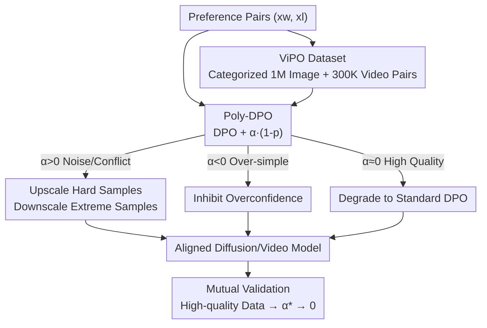

# ViPO: Visual Preference Optimization at Scale

**Conference**: ICLR 2026  
**OpenReview**: [https://openreview.net/forum?id=x5zP3k64Nl](https://openreview.net/forum?id=x5zP3k64Nl)  
**Code**: https://github.com/liming-ai/ViPO (Available)  
**Area**: Diffusion Models / Alignment RLHF / Preference Optimization  
**Keywords**: Diffusion-DPO, Preference Optimization, Polynomial Loss, Large-scale Dataset, Visual Generation

## TL;DR
Addressing the "scaling ceiling" of preference optimization in visual generation, this work advances both algorithms and data: it proposes Poly-DPO, requiring only two lines of code and one hyperparameter $\alpha$ to achieve "confidence-aware" training robust to noisy preferences, and constructs ViPO, a million-scale, category-balanced, 1024px preference dataset. The two components are mutually validating—Poly-DPO automatically degrades to standard DPO ($\alpha \to 0$) when data quality is high, while on noisy data, Poly-DPO achieves a 6.87-point improvement over Diffusion-DPO on GenEval.

## Background & Motivation
**Background**: Migrating RLHF/DPO preference alignment from language models to visual generation has become mainstream. Among these, off-policy Diffusion-DPO is considered the most suitable for "scaling up" as it trains directly on pre-collected preference pairs without online sampling.

**Limitations of Prior Work**: No one has truly successfully scaled this approach. The authors point out that the root cause is the prevalence of **conflicting preference patterns** in existing open-source preference datasets (HPDv2, Pick-a-Pic v1/v2, etc.)—where the winner of a pair is better in some dimensions (e.g., aesthetics) but worse in others (e.g., text-to-image alignment). Running standard DPO on such data prevents the model from learning consistent signals, leading to rapid performance saturation despite increasing data volume. Additionally, older datasets suffer from low resolution (512–768px), poor prompt diversity, distribution imbalance due to random collection, and outdated base generative models.

**Key Challenge**: Gradients in standard Diffusion-DPO treat all samples equally; they are misled by "contradictory pairs" when facing signals and become overconfident on "obvious pairs," learning only surface differences. The "confidence" of the algorithm is entirely dictated by the data distribution, lacking an adaptive knob.

**Goal**: To split the problem into two complementary sub-tasks: (1) Design a preference optimization algorithm robust to noise that learns stably across "noisy/too simple/high quality" distributions; (2) Construct a large-scale preference dataset with high resolution, diverse prompts, balanced categories, and reliable signals.

**Key Insight**: The authors re-examine DPO from the perspective of poly loss—since Diffusion-DPO is essentially a binary classification cross-entropy, it can be Taylor-expanded. By adding a tunable perturbation to the term dominating the gradient, one can explicitly control "confidence."

**Core Idea**: Transform DPO into a confidence-aware Poly-DPO using a polynomial perturbation term $\alpha(1-p_{w>l})$, paired with the categorized million-scale ViPO dataset. The algorithm handles imperfect data, while the data provides the foundation for scaling.

## Method

### Overall Architecture
The approach consists of two pillars: the **ViPO Dataset** (solving "what to feed") and the **Poly-DPO Algorithm** (solving "how to learn"). These converge in the preference optimization training loop and are mutually validated through the convergence phenomenon where $\alpha \to 0$. The process is: preference pairs $(x_w, x_l)$ (from existing noisy sets or the categorized ViPO dataset) are fed into Poly-DPO; Poly-DPO adds a polynomial term controlled by $\alpha$ to the standard Diffusion-DPO loss, dynamically reweighting samples based on data distribution—$\alpha > 0$ for noisy/conflicting data, $\alpha < 0$ for overly simple data, and $\alpha \approx 0$ for high-quality balanced data. This outputs an aligned diffusion/video generation model. A key observation is that for high-quality data (ViPO), the optimal $\alpha$ naturally converges to 0, which confirms that data quality is the primary driver for scaling.

### Key Designs

**1. ViPO Dataset: Eliminating Preference Noise via Categorized Construction**

To address the pain points of "conflicting data + low resolution + distribution imbalance," the authors rebuilt the data from scratch. ViPO contains **1M image preference pairs (1024px, 5 categories) + 300K video pairs (720p+, 3 categories)**. Images are organized across five dimensions (200K pairs each): Aesthetics, Text-Image Alignment, Text Rendering, Portrait Quality, and Composition. Videos use three dimensions (100K each): Motion Quality, Video-Text Alignment, and Visual Quality. Unlike "random collection," ViPO is **categorized**—each dimension is sampled independently to ensure balanced distribution and prevent specific dimensions from being overwhelmed by simple patterns. Generation utilizes SOTA models (FLUX, Qwen-Image, HiDream-I1 for images; WanVideo, Seedance, Veo3 for videos), with filtering and labeling by multiple VLMs to ensure reliable signals. Quantitative evidence shows that in Pick-a-Pic V2, when evaluated by five reward models (PickScore, ImageReward, HPSv2, Aesthetic, CLIP), **only 20.79% of pairs maintain consistent ranking across all dimensions**—the remaining 80% are conflicting.

**2. Poly-DPO: Treating DPO as Binary Classification with a Confidence Knob**

Addressing the issue where gradients treat all samples equally, Poly-DPO rewrites Diffusion-DPO as a binary classification cross-entropy. Defining the probability of the model preferring the winner relative to the reference model as $p_{w>l}=\sigma\big(\beta\log\frac{p_\theta(x_w)}{p_{\text{ref}}(x_w)}-\beta\log\frac{p_\theta(x_l)}{p_{\text{ref}}(x_l)}\big)$, then $\mathcal{L}_{\text{Diffusion-DPO}}=-\log(p_{w>l})$, which is cross-entropy. Borrowing from poly loss, the Taylor expansion $-\log(p_{w>l})=\sum_j \frac{1}{j}(1-p_{w>l})^j$ is modified by adding a perturbation $\alpha$ only to the first term (which contributes most to the gradient), resulting in the simple Poly-DPO loss:

$$\mathcal{L}_{\text{Poly-DPO}}=-\log(p_{w>l})+\alpha(1-p_{w>l}).$$

Code-wise, this is just two lines (`poly_loss = 1 - sigmoid(logits)`; `loss = dpo_loss + alpha * poly_loss`). This essentially multiplies the DPO gradient by a **Poly factor**: $\frac{\partial \mathcal{L}_{\text{Poly-DPO}}}{\partial \text{logit}}=-(1-p_{w>l})(1+\alpha\, p_{w>l})$. This factor makes training explicitly "confidence-aware," allowing for reweighting based on how well the samples are separated without repeated sampling or reward evaluation.

**3. The Three-Regime $\alpha$ and Mutual Validation**

The $\alpha$ in the Poly factor corresponds to three typical data distributions. **$\alpha > 0$ (Enhancing Confidence)**: For conflicting data, $1+\alpha p_{w>l}$ upweights hard samples where $p_{w>l}\approx0.5$ and downweights extreme samples where $p_{w>l}$ is near 0 or 1, forcing the model to focus on the "salvageable" boundary pairs. **$\alpha < 0$ (Reducing Confidence)**: For overly simple data, standard DPO becomes overconfident, essentially "replicating the winner" rather than learning subtle differences; a negative $\alpha$ weakens gradients for high-confidence samples. **$\alpha \approx 0$ (Standard DPO)**: For high-quality balanced data, the optimal $\alpha$ naturally converges to 0. This convergence is the most clever **mutual validation** in this work: it proves ViPO data quality is high enough that complex optimization becomes unnecessary, while proving Poly-DPO's adaptivity—it simplifies when data is good and works hard when data is poor.

### Loss & Training
The core training objective is the Poly-DPO loss: $\mathcal{L}=-\log\sigma(\text{logit})+\alpha\big(1-\sigma(\text{logit})\big)$, where the logit is derived from the denoising error difference between the winner and loser under the current and reference models. The method introduces only one hyperparameter $\alpha$ and two lines of code, compatible with any Diffusion-DPO implementation. Image experiments were conducted on SD1.5, SDXL, SD3, and FLUX; video experiments on Wan2.1-T2V-1.3B.

## Key Experimental Results

### Main Results
**Training on Pick-a-Pic V2 (Noisy set, validating Poly-DPO algorithm)**: SD1.5 with Poly-DPO outperformed Diffusion-DPO and Diffusion-KTO across four test sets.

| Test Set | Metric | SD1.5 Baseline | Diffusion-DPO | Poly-DPO (Ours) |
|----------|--------|----------------|---------------|-----------------|
| Pick-a-Pic V2 | PickScore | 20.57 | 20.95 (+1.8%) | **21.48 (+4.4%)** |
| Pick-a-Pic V2 | HPSv2.1 | 25.02 | 26.12 (+4.4%) | **28.30 (+13.1%)** |
| Pick-a-Pic V2 | ImageReward | 0.085 | 0.297 (+0.212) | **0.679 (+0.594)** |
| HPD V2 | HPSv2.1 | 0.246 | 0.259 (+5.3%) | **0.285 (+15.9%)** |
| Parti | ImageReward | 0.194 | 0.352 (+0.158) | **0.736 (+0.542)** |

On the GenEval composition benchmark, Poly-DPO achieved the highest overall score among off-policy methods:

| Model | Method | Counting | Attribute Binding | Overall ↑ |
|-------|--------|----------|-------------------|-----------|
| SD1.5 | Diffusion-DPO | 38.75 | 3.75 | 43.00 |
| SD1.5 | Poly-DPO (Ours) | **51.25** | **14.00** | **49.87** (+6.87) |
| SDXL | Diffusion-DPO | 49.06 | 18.50 | 58.02 |
| SDXL | Poly-DPO (Ours) | — | **31.00** | **60.34** (+2.32) |

**Training on ViPO-Image-1M (Validating dataset quality)**: Significant gains across GenEval.

| Model | Overall Pre-train | Overall Post-train | Gain |
|-------|-------------------|-------------------|------|
| SD1.5 | 0.42 | 0.52 | +23.8% |
| SDXL | — | 0.63 | Significant |
| SD3.5-Medium | 0.69 | 0.83 | Close to HiDream-I1-Full (0.83) |
| FLUX.1-dev | — | 0.79 | Consistent across dimensions |

### Ablation Study
Regarding the role of $\alpha$ across three distributions (based on SD1.5):

| Data Distribution | Optimal $\alpha$ | Phenomenon & Explanation |
|-------------------|------------------|--------------------------|
| Noise/Conflict (Pick-a-Pic V2) | $\alpha=8$ | Upscales hard samples; score increases with $\alpha > 0$ |
| Over-simple (synthetic) | $\alpha < 0$ | Standard DPO over-fits to winner; negative $\alpha$ inhibits this |
| High quality (ViPO-Image-1M) | $\alpha \approx 0$ | Optimal value converges to 0; Poly-DPO degrades to standard DPO |

### Key Findings
- **Conflicting preferences are the true scaling bottleneck**: Only 20.79% of Pick-a-Pic V2 pairs are consistent across five reward models.
- **Hard samples/Attribute binding show the most gain**: Poly-DPO significantly improve counting and attribute binding, indicating it learns fine-grained preferences rather than surface attributes.
- **$\alpha \to 0$ convergence is a dual validation**: High-quality data makes complex optimization redundant, while highlighting Poly-DPO's necessity for imperfect data.

## Highlights & Insights
- **Minimalist optimization**: Poly-DPO adds only one term $\alpha(1-p_{w>l})$ to Diffusion-DPO yet shifts training from being "data-driven" to "confidence-steered" with near-zero implementation cost.
- **A new perspective of DPO as binary cross-entropy Taylor expansion**: This "frame shift" makes the poly loss toolbox directly available for any BT-model-based preference optimization (including LLMs).
- **Dual approach with mutual validation**: Using $\alpha \to 0$ to simultaneously prove data quality and algorithm adaptivity is a compelling argumentation style.

## Limitations & Future Work
- Due to proprietary model licensing, the full original dataset might not be fully public; public-model-based versions are provided instead.
- Poly-DPO only perturbs the first term of the Taylor expansion (Poly-1); whether higher-order perturbations $\alpha_j$ yield benefits is not fully explored.
- Evaluation relies heavily on a suite of reward models/VLMs (HPSv2.1, ImageReward, GPT-4o, etc.), meaning there is a risk of inheriting reward model biases.
- Experimental results for the video side (ViPO-Video-300K) are less extensive compared to image results.

## Related Work & Insights
- **vs Diffusion-DPO**: Both are off-policy and approximate diffusion log-likelihood ratios, but Poly-DPO solves the saturation problem on noisy data by reweighting confidence.
- **vs Diffusion-KTO**: While KTO is another off-policy improvement, Poly-DPO generally performs better on PickScore/HPSv2.1/ImageReward with simpler changes.
- **vs Online RL (DDPO/SPO, etc.)**: These require expensive iterative sampling and are prone to reward hacking; Poly-DPO exceeds SPO on GenEval without sampling, offering better computational scalability.
- **vs Existing Datasets**: Previous datasets were randomly collected with low resolution; ViPO is categorized, high-resolution (1024px), and uses SOTA generators, providing a better foundation for scaling.

## Rating
- Novelty: ⭐⭐⭐⭐ Reinterpreting DPO as poly expansion + dual validation is clean but not fundamentally disruptive.
- Experimental Thoroughness: ⭐⭐⭐⭐⭐ Covers SD1.5/SDXL/SD3.5/FLUX + Video across multiple benchmarks and reward models.
- Writing Quality: ⭐⭐⭐⭐ Logical flow from motivation to algorithm to data is clear.
- Value: ⭐⭐⭐⭐⭐ A practical two-line algorithm paired with a million-scale open-source dataset is significant infrastructure for the community.

<!-- RELATED:START -->

## Related Papers

- [\[ICLR 2026\] Reinforcing Diffusion Models by Direct Group Preference Optimization](reinforcing_diffusion_models_by_direct_group_preference_optimization.md)
- [\[ICLR 2026\] Towards Better Optimization for Listwise Preference in Diffusion Models](towards_better_optimization_for_listwise_preference_in_diffusion_models.md)
- [\[CVPR 2026\] Seeing What Matters: Visual Preference Policy Optimization for Visual Generation](../../CVPR2026/image_generation/seeing_what_matters_visual_preference_policy_optimization_for_visual_generation.md)
- [\[ICML 2026\] Offline Preference Optimization for Rectified Flow with Noise-Tracked Pairs](../../ICML2026/image_generation/offline_preference_optimization_for_rectified_flow_with_noise-tracked_pairs.md)
- [\[ICLR 2026\] MVAR: Visual Autoregressive Modeling with Scale and Spatial Markovian Conditioning](mvar_visual_autoregressive_modeling_with_scale_and_spatial_markovian_conditionin.md)

<!-- RELATED:END -->
