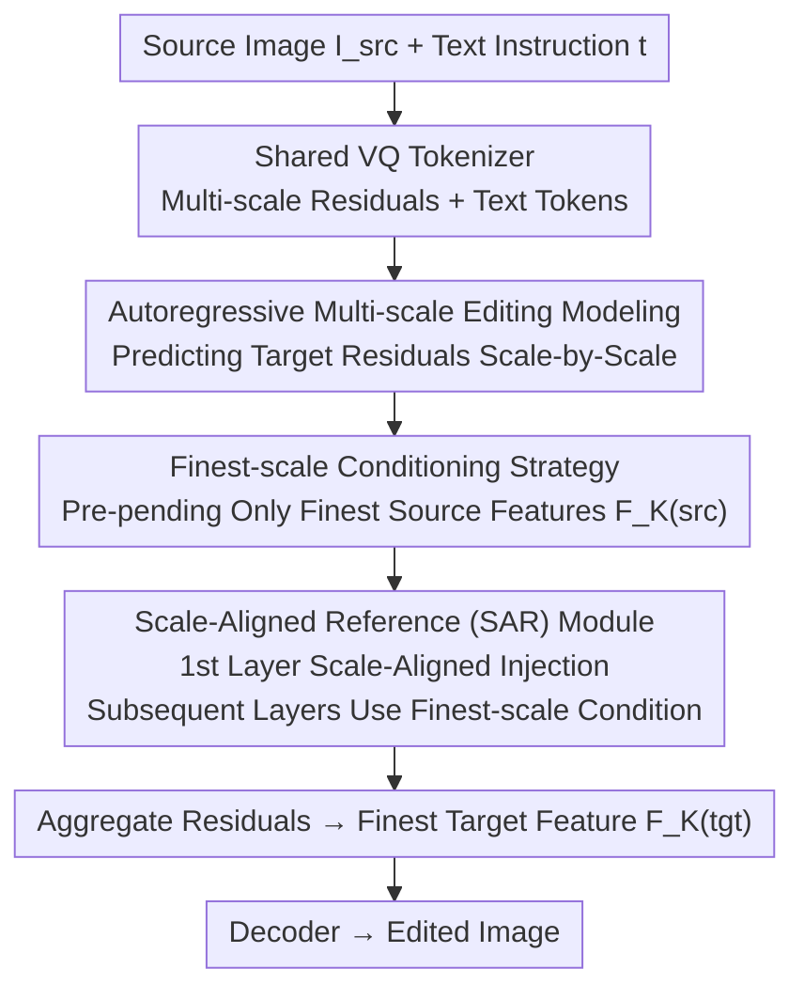

# Visual Autoregressive Modeling for Instruction-Guided Image Editing

**Conference**: ICLR 2026  
**arXiv**: [2508.15772](https://arxiv.org/abs/2508.15772)  
**Code**: [GitHub](https://github.com/HiDream-ai/VAREdit)  
**Area**: Image Generation  
**Keywords**: Image Editing, Visual Autoregressive, Multi-scale Prediction, Instruction-guided, Scale Alignment

## TL;DR

VAREdit is proposed, redefining instruction-guided image editing as a multi-scale prediction problem. It addresses scale mismatch in fine-scale conditioning through the Scale-Aligned Reference module, significantly outperforming diffusion-based methods in edit faithfulness and efficiency.

## Background & Motivation

1. **Background**: Instruction-guided image editing is dominated by diffusion models (e.g., InstructPix2Pix), which perform joint denoising by channel-wise concatenating source and target images.

2. **Limitations of Prior Work**: The global denoising process of diffusion models naturally couples edited regions with the entire image, leading to: (1) spurious modifications in non-edited areas ("bleeding" problem); (2) insufficient instruction following; and (3) high computational costs from multi-step iterative denoising.

3. **Key Challenge**: The strength of diffusion models (global consistency modeling) is exactly the weakness for editing tasks—editing requires precise separation of local modifications and global preservation. The causality and compositionality of autoregressive models are naturally suited for editing, but the VAR paradigm remains unexplored in this context.

4. **Goal**: To introduce the Visual Autoregressive (VAR) multi-scale prediction paradigm to instruction-guided image editing.

5. **Key Insight**: The core challenge for VAR editing lies in the source image conditioning strategy—full-scale conditioning is too expensive ($O(n^2)$), while finest-scale conditioning is efficient but suffers from scale mismatch. Attention heatmap analysis reveals that mismatch only affects the first self-attention layer.

6. **Core Idea**: Inject scale-aligned reference features only in the first self-attention layer and use finest-scale conditioning in subsequent layers to balance efficiency and editing quality.

## Method

### Overall Architecture

VAREdit is based on the pre-trained Infinity model, reframing instruction editing as conditional multi-scale prediction: given a source image $\mathbf{I}^{(src)}$ and text instruction $\mathbf{t}$, the model autoregressively generates $K$ layers of residual maps $\mathbf{R}_{1:K}^{(tgt)}$ for the target image, completing edit results scale-by-scale from coarse to fine. Source image information is primarily injected as finest-scale features $\mathbf{F}_K^{(src)}$, with an additional scale-aligned reference feature provided only in the first self-attention layer to correct mismatch.

### Key Designs

**1. Autoregressive multi-scale editing modeling: localized change and global preservation via causal generation**

Global denoising in diffusion models naturally couples editing areas with the whole image, causing "bleeding" in non-edited regions. VAREdit decomposes editing into residual predictions across $K$ scales, generated causally: $p(\mathbf{R}_{1:K}^{(tgt)}\mid\mathbf{I}^{(src)},\mathbf{t}) = \prod_{k=1}^K p(\mathbf{R}_k^{(tgt)}\mid\mathbf{F}_{1:k-1}^{(tgt)},\mathbf{F}_K^{(src)},\mathbf{t})$. Text instructions enter via cross-attention, and source/target tokens are distinguished by 2D-RoPE. This causal compositionality allows the model to retain previously generated invariant regions while adding residuals only where needed, fundamentally separating preservation from modification.

**2. Finest-scale conditioning strategy: high-frequency features over full-scale quadratic costs**

A natural approach is pre-pending source features from all $K$ scales, but self-attention complexity is $O(n^2)$, making sequences prohibitively expensive. VAREdit pre-pends only the finest-scale (highest resolution) features $\mathbf{F}_K^{(src)}$, significantly shortening sequence length and enabling sub-second inference. The finest scale is chosen because it carries the richest high-frequency details crucial for guiding the "where" and "what" of an edit, whereas coarse scales primarily provide layout information already covered by the residual structure.

**3. Scale-Aligned Reference (SAR) Module: correcting mismatch in the first layer for efficiency**

Finest-scale conditioning causes scale mismatch: the target sequence at coarse scale $k$ has spatial dimensions $(h_k, w_k)$ that do not align with the $(H, W)$ of the finest scale, hindering attention correspondence. Attention heatmap analysis reveals that this mismatch primarily affects the first self-attention layer, which handles global layout and long-range dependencies. SAR downsamples the finest-scale features into a reference $\mathbf{F}_k^{(ref)} = \text{Down}(\mathbf{F}_K^{(src)}, (h_k, w_k))$ for scale $k$. Only in the first layer does the query attend to this aligned reference; subsequent layers continue using the finest-scale condition. Ablations show that extending SAR to all layers decreases performance, confirming that mismatch is concentrated in the first layer.

### Loss & Training

The model uses bitwise classifier loss to optimize target residual token index prediction, following the Infinity training scheme. VAREdit-2B uses two-stage training: 8k steps at 256² resolution and 7k steps at 512² resolution. VAREdit-8B is trained directly for 60k steps at 512². Inference uses CFG strength $\eta=4$ and logits temperature $\tau=0.5$.

## Key Experimental Results

### Main Results

Quantitative comparison on EMU-Edit and PIE-Bench:

| Method | Parameters | GPT-Balance(EMU)↑ | GPT-Balance(PIE)↑ | Time |
|------|--------|-------------------|-------------------|------|
| InstructPix2Pix | 1.1B | 2.923 | 4.034 | 3.5s |
| UltraEdit | 7.7B | 4.541 | 5.580 | 2.6s |
| ICEdit | 17B | 4.785 | 4.933 | 8.4s |
| **VAREdit-2B (Ours)** | 2.2B | 5.662 | 6.996 | **0.7s** |
| **VAREdit-8B (Ours)** | 8.4B | **7.892** | **8.105** | 1.2s |
| Step1X-Edit | 21B | 7.081 | 7.351 | 12.8s |

For 512×512 editing, VAREdit-8B requires only 1.2 seconds, which is **2.2x faster** than the similarly sized UltraEdit.

### Ablation Study

| Conditioning Strategy | CLIP-Out.↑ | GPT-Suc.↑ | GPT-Over.↑ | GPT-Bal.↑ |
|-----------|-----------|-----------|-----------|----------|
| Full-scale Condition | 0.275 | 5.781 | 7.087 | 5.346 |
| Finest-scale Condition | 0.264 | 4.926 | 7.077 | 4.584 |
| Finest-scale + SAR (1st Layer) | **0.271** | **6.210** | **7.055** | **5.662** |
| SAR in all layers | 0.269 | 5.884 | 7.036 | 5.352 |
| SAR in first 3 layers | 0.269 | 5.894 | 7.048 | 5.297 |

### Key Findings

- VAREdit-8B's GPT-Balance scores are **64.9%** (EMU-Edit) and **45.3%** (PIE-Bench) higher than the strongest diffusion baseline (ICEdit).
- SAR performs best when applied only to the first layer—performance drops when applied to all layers, validating the insights from attention analysis.
- In the subset of most successful edits (GPT-Suc.≥9), VAREdit's region preservation score exceeds even OmniGen, proving non-conservative, genuine preservation.
- Among open-source models, VAREdit-8B surpasses larger models such as Step1X-Edit (21B) and FLUX.1 Kontext (12B) in GPT-Balance.

## Highlights & Insights

- **Paradigm Innovation**: Successfully introduces VAR multi-scale prediction to instruction-guided editing, breaking the dominance of diffusion models.
- **Analysis-Driven Design**: The SAR module design is derived from systematic attention heatmap analysis rather than empirical intuition.
- **Efficiency & Quality**: The 2.2B model completes 512² edits in 0.7s, with quality exceeding the 17B ICEdit.
- **Inherent AR Advantage**: The causal generation mechanism naturally supports region-selective modifications.

## Limitations & Future Work

- Reliance on a discrete visual tokenizer limits the upper bound of editing quality through reconstruction loss.
- The largest current model is 8B; scaling effects for even larger models remain to be verified.
- Lack of support for interactive or multi-turn conversational editing.
- Potential exploration of combining with mask-based guidance to further improve regional control precision.

## Related Work & Insights

- VAR (Tian et al., 2024) and Infinity established the foundation for multi-scale autoregressive generation; VAREdit extends this to editing.
- InstructPix2Pix defined the standard paradigm for instruction editing, but its diffusion limitations motivated this AR exploration.
- Insight: Rather than "patching" the flaws of diffusion models, switching to an autoregressive paradigm may offer a more fundamental solution.

## Rating

- Novelty: ⭐⭐⭐⭐⭐ First introduction of the VAR paradigm to image editing with data-driven SAR design.
- Experimental Thoroughness: ⭐⭐⭐⭐⭐ Evaluated across four benchmarks and multiple metrics against frontier models.
- Writing Quality: ⭐⭐⭐⭐ Clear analysis with a complete logical chain from problem to solution.
- Value: ⭐⭐⭐⭐⭐ Significantly outperforms SOTA and establishes a new editing paradigm.

<!-- RELATED:START -->

## Related Papers

- [\[ICLR 2026\] EditReward: A Human-Aligned Reward Model for Instruction-Guided Image Editing](editreward_a_human-aligned_reward_model_for_instruction-guided_image_editing.md)
- [\[ICLR 2026\] MVAR: Visual Autoregressive Modeling with Scale and Spatial Markovian Conditioning](mvar_visual_autoregressive_modeling_with_scale_and_spatial_markovian_conditionin.md)
- [\[ICML 2026\] Visual Implicit Autoregressive Modeling](../../ICML2026/image_generation/visual_implicit_autoregressive_modeling.md)
- [\[CVPR 2026\] FVAR: Next-Focus Prediction for Visual Autoregressive Modeling](../../CVPR2026/image_generation/fvar_next-focus_prediction_for_visual_autoregressive_modeling.md)
- [\[CVPR 2026\] CompBench: Benchmarking Complex Instruction-guided Image Editing](../../CVPR2026/image_generation/compbench_benchmarking_complex_instruction-guided_image_editing.md)

<!-- RELATED:END -->
