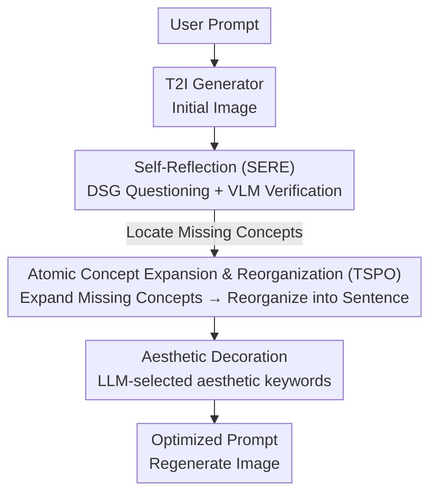

# VisualPrompter: Semantic-Aware Prompt Optimization with Visual Feedback for Text-to-Image Synthesis

**Conference**: ICLR 2026  
**OpenReview**: [https://openreview.net/forum?id=hIwVFRLaFy](https://openreview.net/forum?id=hIwVFRLaFy)  
**Code**: https://github.com/teheperinko541/VisualPrompter  
**Area**: Diffusion Models / Image Generation / Prompt Engineering  
**Keywords**: Text-to-Image, Prompt Optimization, Visual Feedback, Self-Reflection, Atomic Semantics

## TL;DR
VisualPrompter is a training-free prompt engineering framework for text-to-image synthesis. It utilizes an LLM to decompose user prompts into atomic concepts, employs a VLM to verify these concepts against generated images to identify "missing" elements, and performs atomic-level expansion and reorganization specifically for these missing concepts. By rewriting prompts into sentences preferred by the model without compromising user intent, it achieves new SOTA on both DSG and TIFA text-to-image alignment benchmarks.

## Background & Motivation
**Background**: While diffusion models (e.g., SD, Flux) can generate realistic images from text, a significant gap exists between user-written prompts and model-preferred prompts. Novices often provide short, coarse-grained descriptions, whereas models are trained on detailed, fine-grained prompts, leading to frequent failures when directly using user inputs. Prompt engineering has emerged to automate the rewriting of user inputs into better-performing prompts.

**Limitations of Prior Work**: Existing prompt engineering methods primarily focus on "style and aesthetics" (e.g., stacking keywords like "high quality," "4k," "artstation"), leading to three specific issues. First, they **neglect or even damage semantic alignment**—while images become more attractive, the content often deviates from the user's description. Experiments show that NeuroPrompts, Promptist, and BeautifulPrompt generally decrease semantic consistency. Second, they are **"one-size-fits-all"**—applying similar modifications to all prompts without fine-grained, case-specific adjustments. Third, they exhibit **poor generalization**—most are fine-tuned for a specific diffusion model, yet different models "misinterpret" the same prompt in unique ways (e.g., Fig 1b shows SDXL, Flux, and Janus failing differently on the same sentence).

**Key Challenge**: A tension exists between aesthetic enhancement and semantic fidelity. Existing SFT/RL-based "prompt engineers" prioritize aesthetics. Furthermore, they are open-loop systems that never verify whether the generated image actually contains the requested content, precluding model-specific or case-specific corrections.

**Goal**: To develop a prompt optimizer that is both aligned with model preferences and faithful to original user intent, while being plug-and-play across various generative models.

**Key Insight**: Treat the generative model's own output as "model-specific feedback." Since different models fail in different ways, the framework should analyze the actual generated image, identify missing concepts, and apply targeted remedies. Such optimization is naturally model-specific and case-specific.

**Core Idea**: Perform prompt optimization at the **atomic semantic level**. By decomposing prompts into atomic concepts, using a VLM to verify missing concepts in generated images, and reconstructing sentences after expanding only those missing concepts, the "Decompose → Complement → Reorganize" workflow ensures detailed completion while strictly maintaining original semantics.

## Method

### Overall Architecture
VisualPrompter automates the "user prompt → model-preferred prompt" rewriting process by mimicking a human-like chain of thought: generate an initial image, identify incorrect elements, supplement only the missing pieces while retaining correct ones, and polish the final sentence. It consists of two sequential modules: the **Self-Reflection (SERE)** module for "diagnosis" (locating missing concepts via LLM questions + VLM verification) and the **Target-Specific Prompt Optimization (TSPO)** module for "prescription" (atomic-level expansion and sentence reorganization for missing concepts, plus aesthetic decoration). Both modules use off-the-shelf LLMs and VLMs without additional training and are plug-and-play for any generator.

### Key Designs

**1. Self-Reflection (SERE): Locating "What went wrong" at an atomic level via DSG + VLM**

This step addresses the "open-loop" limitation. SERE uses multi-step reasoning for explicit visual feedback. First, **Question Generation**: An LLM parses the input prompt into a Davidsonian Scene Graph (DSG) of atomic concepts. Each concept corresponds to a yes/no question (e.g., "Is there a person?"), with directed edges expressing dependencies (e.g., "The unicycle has one wheel" depends on "There is a unicycle"). Second, **Question Answering**: A VLM (Qwen2-VL) answers these questions based on the generated image. A clever **Dependency Pruning** mechanism is used: if a base concept is judged missing, all its dependent concepts are automatically skipped. The "missing" concepts are those present in the user input but absent from the generated image.

**2. Target-Specific Prompt Optimization (TSPO): Supplementing missing concepts without losing user intent**

Addressing the "one-size-fits-all" issue, TSPO avoids direct whole-sentence rewriting. First, **Semantic Expansion**: The LLM expands only the missing concepts identified by SERE with attributes, actions, or spatial relationships (e.g., "unicycle" becomes "a single-wheeled, upright unicycle"). These additions remain atomic to ensure consistency. Expanding missing concepts acts as a "plug-and-play lever" to push the input toward the model's preferred distribution. Second, **Reorganization**: The LLM assembles the expanded concepts into a grammatically complete prompt, using the original prompt as a guide to ensure it stays true to the initial intent. Correctly rendered descriptions are preserved to avoid unnecessary alterations.

**3. Aesthetic Decoration: Training-free addition of style keywords**

After semantic completion, TSPO performs **Prompt Decoration**. The LLM selects diverse style keywords (e.g., "high-quality," "4k," "fantasy") from provided examples that do not conflict with the content. These are seamlessly embedded or appended. The authors note this is simplified; since the method tends to categorize prompts as "photorealistic," the results might lack fantasy elements compared to methods using RL specifically for aesthetics.

### A Complete Example
Given the prompt "An old man riding a unicycle": SERE parses it into 7 atomic concepts (① Person? ② Old? ③ Unicycle? ④ Riding? ⑤ Balancing? ⑥ Single-wheel? ⑦ Upright?). If the VLM finds that ⑤⑥⑦ (balancing, single-wheel, upright) are missing, TSPO expands only these concepts. The resulting optimized prompt—"An old man is balancing on a unicycle with a single upright wheel, high quality, 4k, outdoors, elegant"—successfully prompts the generator to correct the missing details.

## Key Experimental Results

### Main Results
Two alignment benchmarks: DSG-1k (1060 prompts / 8182 questions) and TIFA v1.0 (4081 prompts, restructured into 19233 DSG questions). Semantic accuracy is measured by the percentage of VLM "yes" responses across 4 generators (SD 1.5 / SD 2.1 / Flux-dev / Janus-Pro).

| Method | DSG Avg | TIFA Avg | Total Avg |
|------|---------|----------|--------|
| Baseline (Original Prompt) | 74.6 | 82.3 | 78.4 |
| NeuroPrompts | — | — | 74.6 |
| Promptist | — | — | 76.2 |
| BeautifulPrompt | — | — | 53.5 |
| **Ours (VisualPrompter)** | — | — | **83.0** |

Key Observations: Existing methods actually **decrease** semantic consistency (NeuroPrompts/Promptist add irrelevant keywords; BeautifulPrompt loses key information). Only VisualPrompter consistently outperforms the baseline, with larger gains on stronger generators like Flux-dev and Janus-Pro. In terms of CLIP Score, Ours achieves 32.69, higher than the baseline's 31.71 and all competitors.

### Ablation Study (DSG Benchmark, Semantic Accuracy / Aesthetic Score)
| Visual Feedback | No Modification | Qwen Rewrite | DSG (Ours) |
|---------|------|------|------|
| w/o Feedback | 72.1 / 5.48 | 67.8 / 5.32 | 71.9 / 5.69 |
| w/ Feedback | 73.8 / 5.54 | 73.0 / 5.45 | **77.0 / 5.73** |

### Key Findings
- **Fine-grained Decomposition > Whole-sentence Rewrite**: Even with feedback, the DSG approach (77.0) significantly outperforms Qwen's direct rewrite (73.0), which can even perform worse than no modification (67.8 without feedback) due to irrelevant verbosity.
- **Visual Feedback is Essential**: Every configuration shows improvement when feedback is added, proving the "closed-loop" reflection is the core performance driver.
- **Aesthetics-Semantic Trade-off**: Ours (5.81) is lower in aesthetics than NeuroPrompts (6.21). Using the NeuroPrompts decorator improves aesthetics but harms semantics, highlighting that optimizing for aesthetic scores often sacrifices semantic integrity.
- **Acceptable Inference Overhead**: Using Qwen2-1.5B for DSG generation takes 10.7s on SD v1.5, which is within practical limits.
- **Cross-model/Online Use**: Consistent improvements were observed across SD, Flux, Janus-Pro, and commercial services like Midjourney and Kolors.

## Highlights & Insights
- **Generative Output as Feedback**: Leveraging VLM to identify missing concepts in the actual output makes optimization inherently case-specific and model-specific, generalizing better than models fine-tuned on a single generator.
- **Atomic Semantics for Controllability**: Decomposing into atomic concepts allows precise identification of exactly which attribute or relationship is missing, preventing the "information drift" common in whole-sentence rewrites.
- **DSG Dependency Pruning**: Using logical dependencies between concepts to prune verification steps is a lightweight yet effective engineering trick to maintain logic and efficiency.
- **Zero-shot & Training-free**: The entire pipeline uses off-the-shelf LLMs/VLMs, requiring zero additional training and making deployment significantly easier.

## Limitations & Future Work
- **Limited Aesthetic Gains**: The decorator is relatively simple and biased toward realism. There is still no perfect solution for balancing extreme aesthetics with perfect semantics.
- **VLM/LLM Reliability**: The process depends on the quality of DSG parsing and VLM answering; VLM misjudgments can lead to incorrect optimization targets.
- **Multi-round Iteration Costs**: The "generate → reflect → rewrite → regenerate" cycle incurs extra computational costs compared to one-shot rewriting.
- **Future Directions**: Developing content-aware style decorators or implementing a multi-round closed loop with an automatic stopping criterion twice semantics are met.

## Related Work & Insights
- **vs. NeuroPrompts / Promptist**: These use SFT/RL but often fail to modify the actual description meaningfully and instead inject irrelevant keywords. Ours outperforms them by explicitly targeting missing semantic atoms.
- **vs. BeautifulPrompt**: While BeautifulPrompt adds details, it frequently loses core user intent. Ours maintains intent by preserving correct concepts and only expanding missing ones.
- **vs. Zero-shot LLM Rewriting**: Direct LLM expansion often creates overly long sentences that confuse diffusion models. Our "Decompose-Reorganize" strategy is superior for alignment.

## Rating
- Novelty: ⭐⭐⭐⭐ Innovative use of visual feedback and atomic semantics to solve semantic alignment in a training-free manner.
- Experimental Thoroughness: ⭐⭐⭐⭐ Validated across multiple benchmarks and generators with clear evidence. 
- Writing Quality: ⭐⭐⭐⭐ Logic is clear, and the pipeline is well-visualized.
- Value: ⭐⭐⭐⭐ High practical value for text-to-image prompt optimization due to its plug-and-play nature.

<!-- RELATED:START -->

## Related Papers

- [\[ICLR 2026\] TIPO: Text to Image with Text Pre-sampling for Prompt Optimization](tipo_text_to_image_with_text_pre-sampling_for_prompt_optimization.md)
- [\[ICLR 2026\] ToProVAR: Efficient Visual Autoregressive Modeling via Tri-Dimensional Entropy-Aware Semantic Analysis and Sparsity Optimization](toprovar_efficient_visual_autoregressive_modeling_via_tri-dimensional_entropy-aw.md)
- [\[ICLR 2026\] DeLeaker: Dynamic Inference-Time Reweighting For Semantic Leakage Mitigation in Text-to-Image Models](deleaker_dynamic_inference-time_reweighting_for_semantic_leakage_mitigation_in_t.md)
- [\[ICLR 2026\] Long-Text-to-Image Generation via Compositional Prompt Decomposition](long-text-to-image_generation_via_compositional_prompt_decomposition.md)
- [\[ICLR 2026\] ViPO: Visual Preference Optimization at Scale](vipo_visual_preference_optimization_at_scale.md)

<!-- RELATED:END -->
