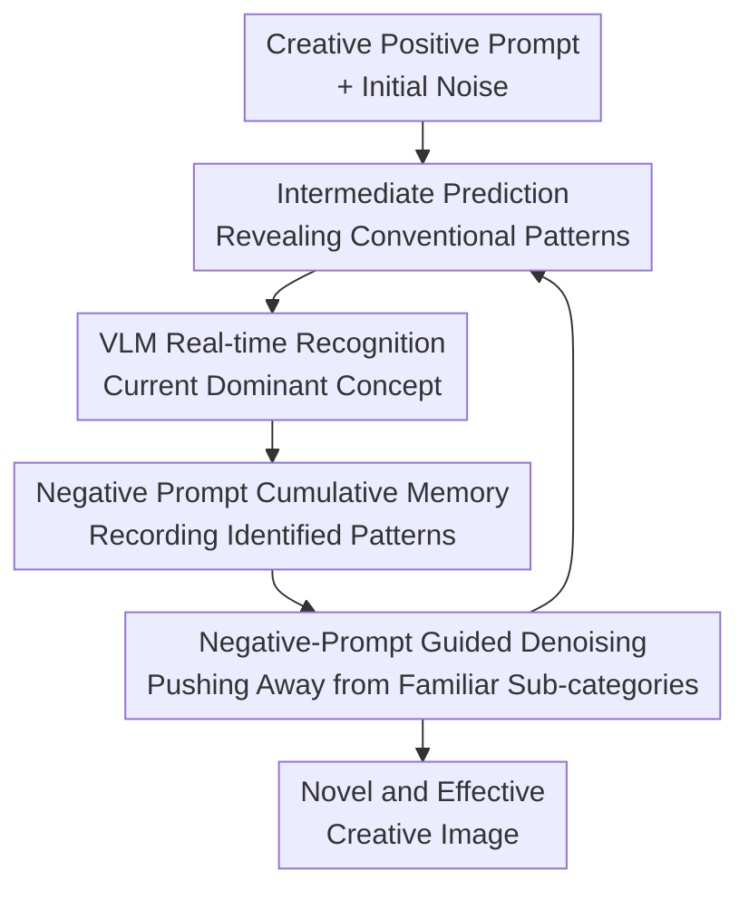

# VLM-Guided Adaptive Negative Prompting for Creative Generation

**Conference**: ICLR2026  
**OpenReview**: [https://openreview.net/forum?id=JzA6d2II4Q](https://openreview.net/forum?id=JzA6d2II4Q)  
**Code**: To be released  
**Area**: Image Generation / Multimodal Feedback Control  
**Keywords**: Creative Generation, T2I Diffusion Models, VLM Feedback, Negative Prompting, Inference-time Control

## TL;DR
This paper proposes a training-free VLM-guided adaptive negative prompting method that continuously identifies conventional concepts emerging in the image during the diffusion denoising process and accumulates them into negative prompts to push the generation trajectory away, thereby generating novel images that still belong to the target category.

## Background & Motivation
**Background**: Text-to-image diffusion models are proficient at generating high-fidelity images following text prompts. When a user input is "a photo of a pet" or "a creative jacket," the model typically provides clear, semantically consistent images. With elaborate prompting, the model can combine existing attributes, such as a blue cat or a winged kitten.

**Limitations of Prior Work**: The issue is that such "creativity" remains mostly a recombination of common patterns from the training distribution. Ordinary prompt engineering pulls the model closer to the text but does not automatically escape high-probability visual patterns like "cats, dogs, ordinary jackets, or common buildings." Existing creative generation methods either require pre-specified concept pairs to mix or, like ConceptLab, optimize text embeddings for each concept, which entails high inference costs and lacks portability across models.

**Key Challenge**: Creative generation is not simply pursuing "the more different, the better." Simply distancing from a category might result in unrecognizable objects: a cup without a cavity, a sofa without a seating surface, or a car without driving space. The true difficulty lies in dynamic control between "maintaining category validity" and "distancing from typical sub-categories."

**Goal**: The authors aim to enable off-the-shelf diffusion models to produce more exploratory samples during inference without training new models, optimizing new tokens, or preparing specialized datasets. Simultaneously, the output must remain recognizable to both humans and models as belonging to the target category, such as pets, buildings, bags, vehicles, or plants.

**Key Insight**: The paper observes that diffusion models gradually reveal which conventional pattern they are converging toward during the intermediate stages of denoising. Instead of listing a long static string of negative prompts beforehand, it is better to let a VLM observe these intermediate predictions: if it finds the current pet resembles a cat, it immediately adds "cat" to the negative prompts; if it later resembles a dog or a bird, those concepts are added subsequently.

**Core Idea**: Use VLM as a real-time observer during the denoising process to convert conventional visual concepts appearing in intermediate images into progressively accumulated negative prompts, continuously pushing the diffusion trajectory away from familiar sub-categories toward less explored semantic regions.

## Method

### Overall Architecture
The input to the method is a positive prompt requesting creative generation, such as "A photo of a new type of pet" or "A photo of a creative building." The diffusion model follows the standard process starting from Gaussian noise, but at each step, it estimates the current clean image, asks a category-related question to the VLM, and adds the conventional objects or attributes identified by the VLM to a negative prompt list for the next denoising step.

This creates a closed loop: the diffusion model attempts to generate images matching the positive prompt, the VLM identifies which conventional patterns it is sliding toward, and the negative prompt mechanism suppresses these patterns in subsequent sampling. The final output is not a pre-specified combination like "cat + bird," but a novel sample generated by being pushed away from typical patterns within the same category.

### Key Designs

**1. VLM Real-time Recognition: Converting Denoising Intermediate States into Actionable Semantic Feedback**

Common negative prompting is "blind": users do not know whether the model will initially look like a cat, a dog, or a hamster before sampling. Thus, static negative prompts can only list common categories, which may not fit the current seed and risk over-suppressing the target category. This work solves this using the intermediate clean image estimate $\hat{x}^{(t)}_0$. In flow matching sampling, the model provides a velocity field $v_\theta(x_t,t,c)$, and the authors use the approximation $\hat{x}^{(t)}_0=x_t-t\cdot v_\theta(x_t,t,c)$ to obtain a visualization of the current prediction, which is then passed to the VLM.

The VLM query is formulated as $r^{(t)}=\mathcal{V}(\hat{x}^{(t)}_0,q^{(t)})$, where $q^{(t)}$ is a category-related question, such as "What pet do you recognize in the image?" or "What is the shape and material of this building?". This yields text feedback that can be directly converted into negative prompts rather than abstract gradients. Its key value lies in the feedback being tied to the current generation trajectory; the same prompt with different random seeds will produce different intermediate trends and thus different negative prompt sequences.

**2. Accumulated Negative Prompt Memory: Avoiding Trajectories Returning to Escaped Patterns**

If only the current VLM answer is used as a negative prompt at each step, the model might cycle back to a pattern identified in previous steps. For instance, if it looks like a cat in early steps and cat is used as a negative prompt, the constraint might vanish if the VLM identifies "dog" later, allowing the image to revert to feline features. This work maintains a growing set of negative prompts: $p^{(t)}_{neg}=p^{(t+1)}_{neg}\cup r^{(t)}$, which starts empty and continuously accumulates identified conventional concepts.

This mechanism acts as a "tabu list for creative exploration": instead of telling the model all common things to avoid at once, it records the shortcuts the model exposes. Ablations show that versions without accumulation more easily revert to ordinary forms in categories like buildings, bags, and jackets. Replaying negative prompt lists from other seeds is also unstable because it lacks the semantic evolution corresponding to the current noise trajectory.

**3. Negative-Prompt Guided Denoising: Reusing CFG Interfaces Without Modifying Model Weights**

The method does not train new diffusion models or optimize specific text embeddings. Instead, it leverages the existing negative prompt formulation. Standard classifier-free guidance (CFG) uses the difference between unconditional and conditional predictions to enhance text alignment. The negative prompt version replaces the "unconditional prediction" with a negative conditional prediction: $\hat{v}^w_\theta=v_\theta(x_t,t,c_{neg})+w\cdot(v_\theta(x_t,t,c_{pos})-v_\theta(x_t,t,c_{neg}))$, where $c_{pos}$ is from the user's positive prompt and $c_{neg}$ is from the accumulated negative prompt set.

This design allows the method to seamlessly integrate into existing diffusion pipelines like SD3.5, SDXL, and Kandinsky. It does not encode creativity into a new token or rely on multi-round optimization for concept embeddings; rather, it alters the trajectory at each denoising step via the directional difference between "current positive goal" and "current patterns to avoid." The authors report that in the most expensive setting—querying ViLT for all 28 denoising steps—the generation time for a single image increases from ~22 seconds (standard SD3.5) to ~35 seconds. This cost is negligible compared to ConceptLab (~8 minutes per concept per seed) or C3 (~30 minutes search time).

**4. Category-related Question Design: Maintaining Validity While Avoiding Typical Sub-categories**

VLM questions are not generic phrases like "What is this image?" but are designed around the target category. For pets, the question is "What pet do you recognize?"; for buildings, it asks about design, shape, and material; for bags, it asks about design, material, and color. The reason is straightforward: negative prompts should suppress familiar sub-patterns within the target category without pushing the entire category away.

If negative prompts are too broad, the model might sacrifice validity; if questions are too narrow, they only avoid a few names. Category-related questions restrict feedback to useful semantic levels, ensuring the model retains the basic structure of a "pet," "building," or "bag," while no longer following the most common paths like cats/dogs, box-like buildings, or ordinary handbags. The paper notes that question design affects the output, and how to automatically select the most appropriate questions for different categories remains an open question.

### Mechanism
Taking "A photo of a new type of pet" as an example: at the start of sampling, the image is blurry, but intermediate predictions may already show feline contours. When the VLM is asked "What pet do you recognize in the photo?" and answers "cat," the negative prompt set updates from empty to `{cat}`. The next denoising step suppresses the cat direction while maintaining the "pet" semantics.

As denoising continues, the image might start resembling a dog, bird, or hamster. After the VLM identifies these, the negative prompt set becomes `{cat, dog, bird, hamster, ...}`. This does not drive the model out of the "pet" category but forces it not to fall into conventional pet sub-categories already encountered. The final image may still have a body, eyes, and an appearance recognizable as a pet but can no longer be easily classified as a cat or dog by GPT-4o or humans.

### Loss & Training
The proposed method has no training phase and introduces no additional loss functions. The core hyperparameters come from the inference process: the time window for VLM queries, query frequency, negative prompt accumulation method, concatenation of negative prompt words, and the guidance scale for positive/negative prompts.

The paper analyzes query steps in the appendix, finding that VLM queries are not necessarily needed at every denoising step; providing feedback only in the first 10 to 15 steps usually preserves most creative gains while reducing overhead. This aligns with diffusion sampling intuition: early steps determine the large-scale structure and semantic patterns, while later steps add detail. If the trajectory is pushed away from common patterns early on, continuous VLM querying in later stages is unnecessary.

## Key Experimental Results

### Main Results
The paper evaluates creative generation via qualitative comparisons, user studies, and automated metrics. The main table tracks 400 images across 4 categories (pet, plant, garment, vehicle; 100 per category). Metrics are grouped into three sets: novelty (relative typicality and GPT novelty score), diversity (total variance and Vendi score), and validity (CLIP score and GPT score).

| Base Model / Method | Relative Typicality↑ | GPT Novelty↑ | Total Variance↑ | Vendi↑ | GPT Validity↑ |
|--------|------:|------:|------:|------:|------:|
| SD3.5 Reference | 1.640 | 0.065 | 0.188 | 3.174 | 1.000 |
| SD3.5 Creative Prompting | 1.645 | 0.230 | 0.191 | 3.139 | 0.933 |
| ConceptLab-Kandinsky2 | 1.922 | 0.238 | 0.289 | 5.119 | 0.862 |
| Ours SD3.5 + ViLT | 1.835 | 0.157 | 0.298 | 5.347 | 0.893 |
| Ours SD3.5 + BLIP-2 | 2.190 | 0.370 | 0.318 | 5.794 | 0.898 |
| Ours SD3.5 + Qwen2.5 | 2.100 | 0.401 | 0.308 | 5.476 | 0.917 |

With SD3.5, the Qwen2.5 and BLIP-2 versions achieve strong performance across novelty, diversity, and validity. Creative Prompting has high validity but novelty and diversity close to standard SD3.5. While ConceptLab has high CLIP validity, its GPT validation is lower; the authors suggest it produces objects that satisfy CLIP distance constraints but are not truly usable.

| Base Model / Method | Relative Typicality↑ | GPT Novelty↑ | Total Variance↑ | Vendi↑ | GPT Validity↑ |
|--------|------:|------:|------:|------:|------:|
| SDXL Reference | 1.775 | 0.015 | 0.174 | 2.906 | 1.000 |
| SDXL Creative Prompting | 1.540 | 0.155 | 0.206 | 3.640 | 0.9125 |
| C3-SDXL | 1.075 | 0.232 | 0.271 | 4.726 | 0.895 |
| Ours SDXL + Qwen2.5 | 1.795 | 0.405 | 0.296 | 5.427 | 0.895 |

On SDXL, the method outperforms C3-SDXL in novelty and diversity while maintaining comparable GPT validity. This indicates the method is not an accidental effect of a specific model but a portable inference-time strategy.

### Ablation Study
| Configuration | Key Metric / Phenomenon | Description |
|------|---------|------|
| GPT-4o Static Negative List | GPT Novelty ~0.093-0.108, lower than dynamic VLM | Fixed negative prompts cannot adapt to the actual generation trend of the current seed. |
| Cross-Seed Replay | Relative Typicality 1.703, GPT Novelty 0.065 | Replaying negative prompts from other seeds is ineffective, showing feedback must be trajectory-dependent. |
| No Accumulation | Vendi 4.355, GPT Novelty 0.060 | Failing to remember past patterns allows the generation to return to previously avoided modes. |
| Captions Regeneration | GPT Validity 0.663 | Re-generating from detailed VLM captions cannot replicate the effect of dynamic exploration. |
| Ours SD3.5 + Qwen2.5 | GPT Novelty 0.401, GPT Validity 0.917 | Dynamic, progressive, seed-based VLM negative prompts achieve the best overall performance. |

### Key Findings
- A user study with 3,200 responses (25 participants, 4 categories, 32 image pairs) shows the method occupies high-novelty and high-validity regions, whereas "creative prompting" is primarily high-validity but low-novelty.
- Sub-category analysis of 100 pet images shows ~87% of images from this method are classified as "unknown" or hard to classify by GPT-4o, while Creative Prompting and C3 still fall heavily into common categories like cats and dogs.
- In complex prompt experiments (200 prompts), the method achieves higher VIE-SC: 9.163 vs 8.992 (Creative Prompting). VIE-PQ is 8.609 vs 8.659, showing increased creative goal following without significant sacrifice in perceptual quality.
- Runtime overhead is moderate: ~35s per image in the heaviest setting vs ~22s for standard SD3.5. Costs can be further reduced by querying only during early denoising steps.

## Highlights & Insights
- The biggest highlight is transforming the VLM from an "evaluator" or "constrained optimization generator" into a real-time feedback controller in diffusion sampling. It doesn't need to know what the final creative result looks like; it only needs to point out "it looks like something conventional now," which is an intuitive and effective inverse guidance.
- The paper decouples creative generation into novelty and validity dimensions for evaluation, which is more convincing than just showing "weird" images. ConceptLab's results serve as a reminder that CLIP distance does not equate to semantic validity; creative metrics must prevent results that are "mathematically novel but semantically invalid."
- Dynamism is the core insight. Static GPT-4o lists and cross-seed replays are weaker, indicating creativity isn't just about "the more negative prompts the better," but about applying the right feedback to the right trajectory at the right time.
- The approach scales to complex workflows. The authors demonstrate that creative objects can be placed in different scenes using Flux-Kontext, maintain creative subjects in complex descriptions, and generate consistent creative sets like tea sets or chess sets.
- A key takeaway for future research is that "intermediate states" of generative models might be the critical interface for controlling creativity. Real-time parameter tuning based on external models reading intermediate predictions could likely apply to video, 3D, and audio generation.

## Limitations & Future Work
- The method increases VLM inference overhead. While lighter than optimization-based methods, real-time products or batch generation require controlling query frequency or using smaller VLMs.
- Output quality depends on the VLM's ability to recognize blurry intermediate images. While models like ViLT, BLIP-2, and Qwen2.5 are robust, stronger VLMs generally yield better results, implying the method's performance ceiling is partly determined by the external VLM.
- Question templates require manual design. Different categories need different questions; if the question is off-target, negative prompts might fail to suppress conventional patterns or accidentally harm validity.
- Negative prompt accumulation might lead to over-exclusion. For some categories, conventional sub-categories form the core semantic scaffolding; excessive negative prompts might make images novel but unusable or difficult to name.
- Current experiments focus on static images. Future work could address video and 3D generation, where temporal and geometric consistency would make "real-time negative prompting" more complex.

## Related Work & Insights
- **vs ConceptLab**: ConceptLab optimizes text embeddings to stay close to the category and far from sub-categories in CLIP space. This work uses VLM feedback during denoising to generate negative prompts without optimization. ConceptLab has clear targets but high costs and potential validity loss; this method is more lightweight and portable.
- **vs C3**: C3 enhances creativity by amplifying denoising features, mostly affecting color, texture, and local style. This work operates at the semantic level to avoid conventional objects/attributes, making it better suited for exploring within categories (new pets, vehicles, etc.).
- **vs Ordinary Creative Prompting**: Adding "creative" to prompts only changes the text intent and cannot account for the model's actual convergence. This method's feedback reacts to the specific trend of every intermediate prediction ("this image is becoming a cat").
- **vs Combinatorial Methods**: Approaches like MagicMix or FreeBlend usually require specific concepts to mix. This work is closer to exploratory creativity, where the system itself searches for uncommon but valid samples within a broad category.
- **Insights**: This VLM-in-the-loop mechanism can migrate to avoiding "clichés" in text, "common motion templates" in video, or "standard structures" in 3D design. The key is not having the monitoring model provide the final answer, but having it continuously point out the familiar patterns the generator is falling into.

## Rating
- Novelty: ⭐⭐⭐⭐☆ The integration of VLM feedback, negative prompting, and diffusion intermediate states into a closed loop is clever. While negative prompting and VLM guidance are not new, this combination is distinct and effective.
- Experimental Thoroughness: ⭐⭐⭐⭐☆ Automated metrics, user studies, cross-model experiments, and ablations provide solid evidence. A minor drawback is that creativity evaluation still relies on GPT and human rating, which have inherent subjectivity.
- Writing Quality: ⭐⭐⭐⭐☆ The structure is clear, qualitative figures and ablations are well-explained, and the method is easy to replicate. Some metric definitions in the appendix require cross-referencing.
- Value: ⭐⭐⭐⭐⭐ This is a highly practical inference-time control method. Being training-free, optimization-free, and pluggable into existing pipelines makes it very valuable for creative image generation tools.

<!-- RELATED:START -->

## Related Papers

- [\[CVPR 2026\] Breaking Semantic Boundaries: Distribution-Guided Semantic Exploration for Creative Generation](../../CVPR2026/image_generation/breaking_semantic_boundaries_distribution-guided_semantic_exploration_for_creati.md)
- [\[ICLR 2026\] Safety-Guided Flow (SGF): A Unified Framework for Negative Guidance in Safe Generation](safety-guided_flow_sgf_a_unified_framework_for_negative_guidance_in_safe_generat.md)
- [\[CVPR 2025\] Redefining <Creative> in Dictionary: Towards an Enhanced Semantic Understanding of Creative Generation](../../CVPR2025/image_generation/redefining_creative_in_dictionary_towards_an_enhanced_semantic_understanding_of_.md)
- [\[ICLR 2026\] Diffusion Negative Preference Optimization Made Simple](diffusion_negative_preference_optimization_made_simple.md)
- [\[ICLR 2026\] Neon: Negative Extrapolation From Self-Training Improves Image Generation](neon_negative_extrapolation_image_generation.md)

<!-- RELATED:END -->
