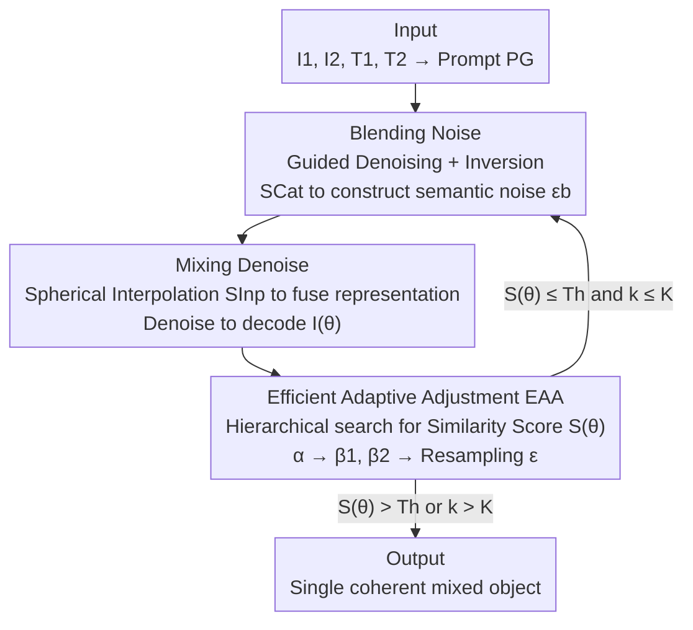

# VMDiff: Visual Mixing Diffusion for Limitless Cross-Object Synthesis

**Conference**: ICLR 2026  
**OpenReview**: [https://openreview.net/forum?id=rrXxoH2jgF](https://openreview.net/forum?id=rrXxoH2jgF)  
**Area**: Diffusion Models / Image Generation  
**Keywords**: Visual Mixing, Cross-Object Fusion, Diffusion Models, Noise Inversion, Spherical Interpolation

## TL;DR
Addressing the task of "fusing two object images into a brand-new hybrid object," this paper proposes VMDiff. It constructs semantic noise carrying dual-object information via guided denoising and inversion at the noise level (concatenation rather than interpolation), fuses two embeddings into a single coherent representation using spherical interpolation at the latent level, and automatically tunes parameters through a similarity-score-driven zero-order search. This simultaneously resolves the chronic issues of "objects appearing side-by-side without true fusion" and "one object overpowering the other."

## Background & Motivation

**Background**: Synthesizing visual elements from multiple sources into a new image is a fundamental problem in image-to-image generation, with demands in artistic creation, VR, product design, and film/gaming. Mainstream approaches include **multi-concept generation** (OmniGen, DreamO, MIP-Adapter, FreeCustom), which places multiple reference concepts in the same frame, and **semantic mixing** (Conceptlab, TP2O, ATIH, FreeBlend), which synthesizes "imaginary" new objects by fusing text/image representations of concepts.

**Limitations of Prior Work**: When applying these robust methods to directly fuse "two real object images into one object," the authors observed two typical failure modes. First is **coexistent generation**: two objects simply appear side-by-side or partially overlapping in the same frame, physically coherent but conceptually independent—e.g., GPT-4o overlapping a glass jar with an owl without a true fusion. Second is **bias generation**: the model generates only one object and discards the other—e.g., DreamO generating only a lipstick while completely ignoring an Iron Man figurine.

**Key Challenge**: The root cause of these failures is the lack of simultaneous constraints on "structural rationality" and "semantic balance" during the fusion process. Random Gaussian noise contains no information about the input objects, leading to the loss of key structures like limbs during denoising (resulting in coexistence/fragmentation). Furthermore, when mixing two semantically unequal concepts, representation imbalance causes one side to dominate the output (resulting in bias).

**Goal**: Synthesize a **single, coherent** new object that preserves the core features of both inputs while maintaining a balance between them.

**Key Insight**: The authors advocate for simultaneous intervention at both the **noise level** and the **latent space level**. The noise level is responsible for injecting "dual-object information" into the initial noise to preserve structure, while the latent space level is responsible for "genuinely fusing" two embeddings into one rather than just concatenating them. An automatically optimizable scalar parameter space is then used to balance the two.

**Core Idea**: By employing "guided denoising + inversion to construct semantic noise (concatenation for detail preservation) + spherical interpolation for representation fusion (interpolation for promoting fusion) + zero-order search with similarity scores for automatic balancing," this method replaces direct random noise, hard concatenation, or pure text mixing to solve both coexistence and bias issues.

## Method

### Overall Architecture
VMDiff takes two object images $I_1, I_2$ and their category labels $T_1, T_2$ (e.g., "charizard figurine" and "panda figurine") as input. It first constructs a guidance prompt $P_G$: "A photo of <$T_1$> creatively fused with <$T_2$>." to output an image fusing both into a single object. The entire pipeline is built upon FLUX.1 Krea and consists of two major components: the **Hybrid Sampling Process (HSP)**, which manages "how to fuse," and **Efficient Adaptive Adjustment (EAA)**, which manages "what parameters fuse best."

Within HSP, there are two steps: **Blending Noise (BNoise)** refines a random noise $\epsilon$ into a semantic noise $\epsilon_b$ carrying dual-object semantics via guided denoising and inversion; **Mixing Denoise (MDeNoise)** starts from $\epsilon_b$ and fuses two image embeddings into a single representation using spherical interpolation, subsequently denoising to decode the fused image $I(\theta)$. EAA treats the learnable parameters $\theta=\{\alpha, \beta_1, \beta_2, \epsilon\}$ as search targets, performing a hierarchical zero-order search using a similarity score $S(\theta)$ and rerunning HSP until the score exceeds a threshold.

### Key Designs

**1. Blending Noise: Injecting dual-object information into noise via guided denoising + inversion, using concatenation over interpolation to preserve details**

This step addresses the fragmentation/coexistence problem caused by random noise lacking input information. Inspired by Rectified Flow, the process starts from random noise $\epsilon$ ($x_T$), performs **guided denoising** to an intermediate timestep $t_{den}=652$, and then **inverts** back to $T$ to obtain the refined noise $\epsilon_b = \hat{x}_T$, ensuring the noise carries the semantic structure of both objects:

$$\hat{x}_t = x_{t_{den}} \Leftarrow x_{t-1}=x_t-(\sigma_t-\sigma_{t-1})v_\phi(x_t,t,z_{SCat}(z_1,z_2;\beta_1,\beta_2),\gamma_{den},z_p)$$
$$\epsilon_b=\hat{x}_T \Leftarrow \hat{x}_{t+1}=\hat{x}_t+(\sigma_{t+1}-\sigma_t)v_\phi(\hat{x}_t,t,z_{SCat}(z_1,z_2;\beta_1,\beta_2),\gamma_{inv},z_p)$$

A high denoising strength $\gamma_{den}=5$ is used for strong guidance, while inversion strength $\gamma_{inv}=0$ minimizes distortion in the noise space, with $T=999$. Crucially, visual information in the condition uses **Scale Concatenation (SCat)** rather than interpolation: $z_{SCat}(z_1,z_2;\beta_1,\beta_2)=\mathrm{concat}(\beta_1 z_1, \beta_2 z_2)$, where two learnable factors $\beta_1, \beta_2 \in \mathbb{R}^+$ control respective weights. The authors hypothesize that interpolation "smoothes out" mismatched embeddings and drowns fine features (e.g., legs, arms), whereas concatenation fully preserves information from both concepts, allowing the inversion process to refine noise based on complete concepts. Ablation studies (Fig. 4) show that interpolation (whether pre- or post-refinement) loses details, while concatenation yields faithful and coherent results.

**2. Mixing Denoise: Fusing two embeddings into "one" via spherical interpolation instead of concatenating into "two"**

While BNoise focuses on "preservation," MDeNoise aims for "fusion"—the goals here are opposite, hence interpolation is used. Starting from $\epsilon_b$, another denoising pass is performed, but the visual condition is replaced with **Scale Interpolation (SInp)**:

$$z_{SInp}(\alpha)=\frac{\sin(\alpha\cdot\delta)}{\sin\delta}z_1+\frac{\sin((1-\alpha)\cdot\delta)}{\sin\delta}z_2, \quad \delta=\cos^{-1}(z_1\cdot z_2)$$

This utilizes spherical linear interpolation (slerp), where $0 \le \alpha \le 1$ is the learnable mixing ratio. Denoising uses a fixed guidance $\gamma_{gen}=4.0$, and the final fused image is decoded by the FLUX.1 Krea decoder. Concatenation is avoided here because its "rigid separation" results in fragmented representations and outputs (resembling two isolated objects); interpolation transitions smoothly along the representation manifold, merging the two into a coherent entity. Fig. 5 shows that replacing MDeNoise with a concatenation variant degrades the result into "two separate objects." **In short: BNoise uses concatenation to preserve details, while MDeNoise uses interpolation to promote fusion.**

**3. Efficient Adaptive Adjustment (EAA): Zero-order hierarchical search driven by similarity scores for automatic concept balancing**

HSP can fuse objects given parameters, but poor parameter selection leads to bias, necessitating automatic tuning. EAA defines a **Similarity Score (SS)** as the optimization objective, rewarding visual and semantic similarity to both inputs while penalizing the difference between them (enforcing balance). EAA performs a **hierarchical zero-order search** over this objective: in the outer loop $k=1 \to K=3$, each round first fixes $\beta_1=\beta_2=1$ and finds the optimal mixing ratio $\alpha^*$ via Golden Section Search. If the score remains below a threshold $T_h=2.4$, it fixes $\alpha^*$ and adjusts the noise factors—increasing the $\beta$ of whichever object has a lower sub-score (e.g., if $S_1 > S_2$, adjust $\beta_2$) to "pull back" the weaker object. If the final score exceeds $T_h$, it is accepted; otherwise, $\epsilon$ is resampled for the next round. $K=3$ rounds are typically sufficient. Zero-order search (resampling + scalar golden section) is used instead of first-order gradient optimization because for diffusion generation, first-order optimization offers no significant advantage over zero-order resampling while being much more costly.

### Loss & Training
This method is training-free and executed entirely during inference. "Optimization" refers to the EAA search for parameters $\theta=\{\alpha, \beta_1, \beta_2, \epsilon\}$, aiming to maximize the similarity score:

$$S(\theta)=\underbrace{S_{I_1}(\theta)+S_{I_2}(\theta)}_{\text{Visual Similarity}}+\underbrace{S_{T_1}(\theta)+S_{T_2}(\theta)}_{\text{Semantic Similarity}}-\underbrace{|S_{I_1}(\theta)-S_{I_2}(\theta)|}_{\text{Visual Balance}}-\underbrace{|S_{T_1}(\theta)-S_{T_2}(\theta)|}_{\text{Semantic Balance}}$$

Where $S_{I_i}(\theta)$ uses a DINO encoder to calculate visual similarity between the fused image $I(\theta)$ and source $I_i$, and $S_{T_i}(\theta)$ uses CLIP for semantic similarity with label $T_i$. The first four terms ensure fidelity, while the last two absolute difference penalties enforce symmetry and prevent overfitting to a single input. Implementation uses FLUX.1 Krea with Redux for latent alignment, 512x512 resolution, 20-step denoising, and Grounded-SAM to locate the most prominent object for similarity calculation.

## Key Experimental Results

The authors established the **IIOF (Image-Image Object Fusion)** benchmark: 40 objects across animals/fruits/man-made objects/character figurines, forming 780 pairs (or 1560 ordered pairs for methods sensitive to sequence). Evaluation uses semantic alignment **SA** (VQAScore T5/LLaVA versions and LLaVA-Critic) and single-entity coherence **SCE**, plus the Similarity Score (SS) and balance $B_{sim}$ (lower is more balanced).

### Main Results

| Method | VQA$^{SA}_{T5}$↑ | VQA$^{SCE}_{T5}$↑ | LC$^{SA}$↑ | LC$^{SCE}$↑ | SS↑ | B$_{sim}$↓ |
|------|------|------|------|------|------|------|
| **VMDiff (Ours)** | **0.639** | **0.540** | **8.372** | **8.392** | **2.068** | **0.324** |
| MIP-Adapter (AAAI) | 0.621 | 0.512 | 8.301 | 8.076 | 1.866 | 0.483 |
| FreeBlend (arXiv) | 0.588 | 0.507 | 7.836 | 7.788 | 1.870 | 0.479 |
| DreamO (SIGGRAPH Asia) | 0.591 | 0.467 | 7.592 | 7.013 | 1.793 | 0.644 |
| OmniGen (CVPR) | 0.570 | 0.469 | 7.550 | 7.233 | 1.705 | 0.617 |
| Conceptlab (TOG) | 0.573 | 0.483 | 7.589 | 7.728 | – | – |
| FreeCustom (CVPR) | 0.579 | 0.452 | 6.958 | 6.946 | 1.580 | 0.776 |
| ATIH (NeurIPS) | 0.523 | 0.465 | 7.275 | 6.816 | – | – |
| Stable Flow (CVPR) | 0.460 | 0.372 | 6.020 | 5.024 | – | – |

VMDiff leads in most metrics. Although MIP-Adapter achieves higher VQA$^{SCE}_{LLaVA}$ in one instance, it ranks second or lower in all other metrics, indicating that VMDiff's improvements are more comprehensive. A $B_{sim}$ of 0.324 is the lowest overall, quantitatively confirming the advantage in balance.

**User Study**: 76 participants evaluated 12 results (6 multi-concept + 6 mixing/editing), totaling 912 votes. VMDiff secured the highest preference at **67.3%** and **87.1%** in the two groups, respectively.

### Ablation Study

| Configuration | VQA$^{SA}_{T5}$↑ | LC$^{SA}$↑ | SS↑ | B$_{sim}$↓ | Description |
|------|------|------|------|------|------|
| Baseline 1 | 0.497 | 7.261 | 1.570 | 0.682 | Random noise + MDeNoise (α=0.5) |
| Baseline 2 | 0.508 | 7.426 | 1.586 | 0.693 | + BNoise (β1=β2=1) |
| + α-search | 0.625 | 8.278 | 2.025 | 0.358 | Add α Golden Section Search |
| + α + β1,β2-search | **0.639** | **8.372** | **2.068** | **0.324** | Full model |

### Key Findings
- **Noise Refinement (BNoise) provides the foundation, Adaptive Search provides the peak**: Moving from Baseline 1 to 2 by adding BNoise improves structural fidelity, but the most significant jump occurs after adding $\alpha$-search—SS rises from 1.586 to 2.025 and $B_{sim}$ drops from 0.693 to 0.358, showing that balance is primarily achieved via the adaptive ratio in EAA.
- **$\beta$-search as fine-tuning**: Adding $\beta_1, \beta_2$ search further improves metrics slightly and reduces $B_{sim}$ to 0.324, smoothing visual-text alignment.
- **Concatenation vs. Interpolation roles are non-interchangeable**: Replacing BNoise with interpolation loses detail; replacing MDeNoise with concatenation leads to isolated objects.
- **Multi-object fusion is extrapolatable but lossy**: Sequential application can produce objects with three fused types, but incurs higher information loss/imbalance.

## Highlights & Insights
- **Symmetric "Concat to Preserve, Interpolate to Fuse" Design**: Using opposite embedding combination methods in two stages of the same denoising framework is an elegant solution to the contradiction of needing both feature preservation and true fusion.
- **Explicit Balance in Similarity Score**: Incorporating the difference between input similarities as a penalty term transforms "bias prevention" from an empirical observation into an optimizable scalar.
- **Zero-order Search over Backpropagation**: Pointing out that first-order gradients offer no distinct advantage but higher costs for diffusion tuning, the paper uses a practical zero-order search in a low-dimensional scalar space.

## Limitations & Future Work
- **Multi-object Degradation**: Information loss/imbalance increases significantly beyond two objects; current sequential methods lack order-invariant learned aggregation.
- **Multiple Generations per Fusion**: EAA requires multiple generations for search, making the total overhead significant for real-time applications.
- **Component Dependency**: Reliance on DINO/CLIP and Grounded-SAM for similarity calculation; "most prominent object" queries may fail with multiple or ambiguous subjects.
- **Controllability Boundary**: $\alpha$ provides only global control; joint-level or part-level control (e.g., "A's head + B's body") remains challenging.

## Related Work & Insights
- **vs. Multi-concept Generation (OmniGen / DreamO / MIP-Adapter)**: These focus on separating concepts, excelling at "coexistence" but failing at "true fusion," often leading to bias. VMDiff merges concepts into a single entity.
- **vs. Semantic Mixing (Conceptlab / TP2O / ATIH / FreeBlend)**: Prior works often lack real visual support (text-only) or produce fragmented results. VMDiff leverages real image structures for more coherent outcomes.
- **vs. Style Transfer / Image Editing (Stable Flow)**: Editing methods usually maintain the layout and change textures/colors. VMDiff performs concept-level fusion to generate a brand-new entity.

## Rating
- Novelty: ⭐⭐⭐⭐ The dual-stage symmetric design is clever, though individual components are existing techniques.
- Experimental Thoroughness: ⭐⭐⭐⭐ Extensive benchmark (780 pairs), strong baselines, and user studies; multi-object fusion is only briefly explored.
- Writing Quality: ⭐⭐⭐⭐ Clear characterization of failure modes (coexistence vs. bias).
- Value: ⭐⭐⭐⭐ Provides a controllable, training-free, and strong baseline for the under-explored task of visual mixing.

<!-- RELATED:START -->

## Related Papers

- [\[CVPR 2026\] ViHOI: Human-Object Interaction Synthesis with Visual Priors](../../CVPR2026/image_generation/vihoi_human-object_interaction_synthesis_with_visual_priors.md)
- [\[ICLR 2026\] Reconciling Visual Perception and Generation in Diffusion Models](reconciling_visual_perception_and_generation_in_diffusion_models.md)
- [\[ICLR 2026\] VisualPrompter: Semantic-Aware Prompt Optimization with Visual Feedback for Text-to-Image Synthesis](visualprompter_semantic-aware_prompt_optimization_with_visual_feedback_for_text-.md)
- [\[ICLR 2026\] Generate Any Scene: Scene Graph Driven Data Synthesis for Visual Generation Training](generate_any_scene_scene_graph_driven_data_synthesis_for_visual_generation_train.md)
- [\[ICML 2026\] Direct 3D-Aware Object Insertion via Decomposed Visual Proxies](../../ICML2026/image_generation/direct_3d-aware_object_insertion_via_decomposed_visual_proxies.md)

<!-- RELATED:END -->
