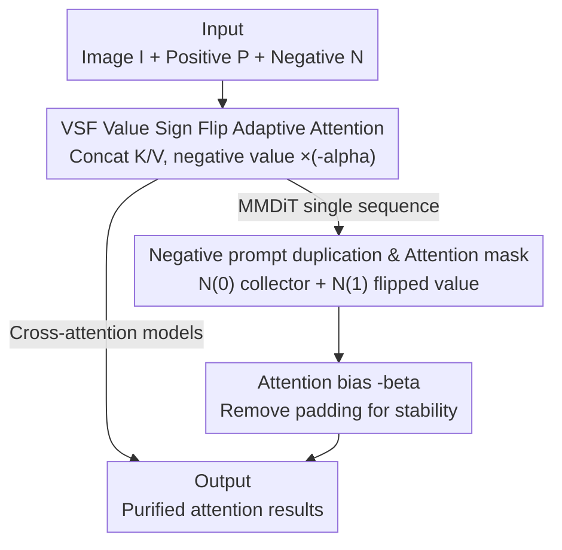

# VSF: Simple, Efficient, and Effective Negative Guidance in Few-Step Image Generation Models By Value Sign Flip

**Conference**: ICLR 2026  
**OpenReview**: [https://openreview.net/forum?id=W2NINfoVtN](https://openreview.net/forum?id=W2NINfoVtN)  
**Code**: https://github.com/weathon/VSF  
**Area**: Diffusion Models / Image Generation  
**Keywords**: Negative Guidance, Few-step Diffusion, Attention Modulation, Value Sign Flip, MMDiT

## TL;DR
To address the inability of distilled few-step (1-8 steps) diffusion/flow-matching models to utilize CFG for negative prompts, this paper proposes Value Sign Flip (VSF). By flipping the sign of negative prompt values within the attention mechanism, VSF achieves token-level, adaptive cancellation of undesirable content across layers, steps, and regions. With nearly zero extra overhead, it improves negative compliance from 0.32–0.38 to 0.42–0.55, even outperforming CFG in non-few-step models.

## Background & Motivation
**Background**: While diffusion and flow-matching models generate high-quality images, "negative prompts" (instructing the model on what to exclude) rely on Classifier-Free Guidance (CFG). This standard implementation replaces the unconditional branch with a negative prompt branch and uses an extrapolated negative sign to push away unwanted concepts.

**Limitations of Prior Work**: To improve speed, many models are distilled for 1-8 step inference (e.g., Flux Schnell, SD3.5 Large Turbo, SDXL Lightning). These models are trained in CFG-disabled modes; forcing CFG leads to severe failure, causing over-saturation artifacts (especially when increasing guidance scale) or generating a "mean of positive and negative images" rather than excluding negative concepts due to divergent signals in few-step regimes. Furthermore, CFG requires two forward passes, doubling the runtime.

**Key Challenge**: Existing few-step negative methods like NASA and NAG move guidance to the attention output space but use a **fixed** guidance strength (preset scale) across the entire image, all layers, and all time steps. Since negative concepts vary in "presence intensity" across different regions and denoising stages, fixed strength fails to be strong where needed or withdraw where unnecessary, forcing a hard trade-off between negative compliance and image quality.

**Goal**: To implement an **adaptive** negative guidance in few-step models that dynamically adjusts strength by token, layer, step, and image region, with nearly no computational increase and no second forward pass.

**Key Insight**: Following the logic of Koulischer et al. to adjust intensity based on the probability of negative content appearing, the authors refine this to the token level. The key observation is that when an image patch attends more to negative prompts than positive ones, it indicates a higher likelihood of unwanted content, necessitating a stronger push-away effect. This "attention intensity" is naturally embedded within the attention maps.

**Core Idea**: Instead of performing subtraction on the attention **output**, VSF flips the **sign of the values** for negative prompts and concatenates them with positive values before the softmax. When an image token attends to a negative prompt, the sign-flipped value acts like an out-of-phase wave in noise-canceling headphones, canceling out unwanted content locally. The cancellation intensity automatically scales with the attention weights.

## Method

### Overall Architecture
VSF takes image tokens $I$, positive prompt tokens $P$, and negative prompt tokens $N$ as inputs, outputting "purified" attention results (eventually forming predicted velocity/noise). The method only modifies the internal attention layers and does not touch the external denoising extrapolation, making it naturally compatible with CFG-disabled few-step models.

The core step: Concatenate positive and negative prompt keys/values along the sequence dimension and multiply negative values by $-\alpha$ (sign-flip scaling) while keeping keys unchanged. Softmax still assigns weights based on "how similar the image is to the negative prompt," but these weights are applied to **inverted** values—the more it attends, the more it cancels. This suffices for cross-attention models. For MMDiT (e.g., SD3.5) which treats image and text as a single sequence, direct sign-flipping would pollute paths like $P\to N$ and $N\to N$. Thus, the authors **duplicate the negative prompt** (one as a "collector," one with flipped values as a "value provider") and use an attention mask to isolate the flipped signal to the $I\to N$ path, adding an attention bias $-\beta$ to stabilize quality.

### Key Designs

**1. Value Sign Flip Adaptive Attention: Replacing Fixed Subtraction with Token-level Dynamic Cancellation**

This design addresses the "fixed guidance strength" limitation of NASA/NAG. The authors first define an ideal form: assign each token a weight $W=g(p^+,p^-,I)$ representing its bias toward positive or negative concepts. NASA's $Z_{NASA}=Z^+-\alpha Z^-$ is rewritten as $Z_W = W Z^+ - \alpha(1-W)Z^-$, allowing positive and negative contributions to fluctuate based on $W$. $W$ can be computed via the ratio of attention scores: using pre-softmax scores $A^+=\exp(Q (K^+)^T/\sqrt{d})$ and $A^-=\exp(Q (K^-)^T/\sqrt{d})$, where $W=\sum A^+ / \sum(A^+ + A^-)$. Higher attention to negative prompts results in a smaller $W$ and a stronger push.

However, explicitly calculating $W$ requires two attention passes. The authors discovered an equivalent simplified implementation: concatenate positive and negative keys/values and **only flip the sign of negative values** (keeping keys the same to retain negative semantic matching). A single softmax operation completes the process:

$$Z_{VSF} = \sigma\!\left(\frac{Q(K^+ \oplus K^-)^T}{\sqrt{d}}\right)(V^+ \oplus -\alpha V^-)$$

where $\oplus$ denotes concatenation along the sequence dimension and $\sigma$ is the softmax. The paper proves this is mathematically equivalent to $Z_W$. It is effective because the cancellation strength is no longer a preset constant but is automatically provided by softmax weights for every token/layer/step/region—functioning as "noise-canceling headphone" style adaptation.

**2. Negative Prompt Duplication and Attention Masking: Isolating Signals to the "Image → Negative" Path**

While effective in cross-attention, VSF faces issues in MMDiT where image and text tokens are processed in a single sequence with all-to-all attention. Directly multiplying $V_N$ by $-\alpha$ would diffuse the flipped signal across all paths involving $V_N$, including unwanted $P\to N$ (positive attending to negative) and $N\to N$ (negative canceling itself).

The solution is to duplicate the negative prompt. $N^{(0)}$ remains unchanged (no flip/scaling), while $N^{(1)}$ has its values flipped/scaled $V_{N^{(1)}}=-\alpha\cdot V_{N^{(1)}}$ and **is not used as a query**. An attention mask isolates the influence: $N^{(0)}$ only attends to $I$ and itself, while only $I$ attends to $N^{(1)}$. Thus, the flipped signal only affects the intended $I\to N^{(1)}$ path. $N^{(0)}$ acts as an "information collector," gathering unwanted elements from the image and updating itself through self-attention before entering the MLP and the next layer (where it is flipped again), mimicking the progressive update mechanism of positive prompts.

**3. Attention Bias and Padding Removal: Ensuring Negative Effectiveness while Maintaining Quality**

To further protect generation quality, an attention bias $-\beta$ is added to the $I\to N^{(1)}$ path (inspired by the idea that masking specific attention directions improves quality), and padding tokens are removed from the negative prompt. $-\beta$ acts as an adjustable "gate" for the flipped signal, preventing excessive intervention in areas where it shouldn't be strong. Ablations showed that removing negative padding is a critical implementation detail for VSF to function correctly compared to failed variants like WEF. $\beta$ is a secondary hyperparameter, while $\alpha$ remains the primary one, making VSF easy to tune.

### Loss & Training
VSF is a **training-free inference-time method**. It introduces no new parameters and requires no fine-tuning, as it is inserted directly into existing attention layers (provided via ComfyUI nodes). For evaluation, the authors fine-tuned a Qwen-2.5-VL as a negation-aware scorer, but this is independent of the generation method itself.

## Key Experimental Results

The authors constructed NegGenBench: 200 "Positive-Negative" prompt pairs generated by ChatGPT o3, where negative elements are essential parts of the positive prompt (e.g., "bicycle" as positive, "wheels" as negative). Metrics for Positive following / Negative following / Quality were scored using LLaMA-4-Maverick.

### Main Results

Comparison on few-step models (SD3.5 Large Turbo, 4 steps):

| Method | Positive ↑ | Negative ↑ | Quality ↑ |
|------|------|------|------|
| **VSF Strong** | 0.870 | **0.545** | 0.952 |
| **VSF Quality** | 0.980 | 0.420 | **0.986** |
| NAG | 0.993 | 0.220 | 0.968 |
| NAG Strong | 0.975 | 0.320 | 0.901 |
| NASA | 0.970 | 0.380 | 0.867 |
| None (No Neg. Guidance) | 0.990 | 0.195 | 0.968 |
| CFG (28 steps, non-few-step) | 1.000 | 0.300 | 0.956 |

VSF Strong's negative score of 0.545 far exceeds other few-step methods (0.32–0.38) and even surpasses CFG in non-few-step settings (0.300). VSF Quality achieves the second-highest negative score while maintaining the highest quality (0.986). In external baseline comparisons, VSF shows the strongest negative compliance among open-source methods, second only to the closed-source GPT-4o (0.705) and comparable to Nano Banana (0.498), while running in ~3s (compared to 55s for generate-then-edit pipelines like Flux Kontext).

### Ablation Study

Trade-off curves were generated by scanning scales across 200 prompts:

| Configuration | Phenomenon | Conclusion |
|------|------|------|
| Full (VSF) | Neg. score can reach ~70 while maintaining pos./quality | Full model |
| WEF (Flip text embedding) | Almost zero effect | Flipping value instead of embedding is key |
| w/o mask (Duplication only) | Neg. score increases, but pos. score plummets | Masking isolation is critical |
| w/o duplication & mask | Signal pollutes other paths; quality collapses | Duplication + masking is essential |
| w/o bias (-β) | Close to the full model | β has a smaller impact (or MLLM is less sensitive) |

### Key Findings
- **Adaptivity is VSF's Moat**: Trade-off curves show VSF maintains positive scores and quality above 90 until the negative score reaches ~60. In contrast, NAG/NASA quality drops to ~60 (complete distortion) before the negative score even hits 50.
- **Root Cause of WEF Failure**: Flipping text embeddings (similar to applying CFG on embeddings) was ineffective. The authors hypothesize this flips both key and value, resulting in pushing away regions "least like the negative prompt"—the wrong direction—confirming the necessity of VSF's "flip value, keep key" design.
- **Attention Map Evidence**: Setting the scale to 0 might generate an unwanted object (e.g., an umbrella). Setting it to 3 avoids it; visualizations show image tokens where the object would appear have higher attention to negative prompts. At steps 4-5, these regions show strong negative attention, precisely erasing the object.

## Highlights & Insights
- **Noise-canceling Analogy**: The comparison of "flipped values being noticed in softmax to cancel out signal" to anti-phase sound waves provides an intuitive explanation for its efficacy with zero overhead.
- **Derivation from Explicit W to Simplified Implementation**: Proving that concatenation plus a sign flip is mathematically equivalent to the complex $Z_W$ weight avoids redundant attention passes, resulting in an elegant one-line softmax solution.
- **Portability of MMDiT Masking**: The strategy of "duplicating one for a read-only collector and one as the value" to isolate signals in all-to-all sequences is a generalizable trick for any task requiring targeted injection or blocking of token influences.
- **Creative Side Effects**: Placing the subject in both positive and negative prompts allows for "semi-canceled" abstract or anti-aesthetic art, a style usually suppressed by RLHF or reward models—VSF provides a training-free manual override.

## Limitations & Future Work
- **Reliance on MLLM Evaluation**: Both negative and quality scores depend on LLaMA-4. The authors note the MLLM's quality scores are lenient (>90 is required to signal degradation), and the small perceived impact of $-\beta$ might reflect MLLM insensitivity.
- **Manual Hyperparameter Tuning**: While there are only two hyperparameters ($\alpha$ and $\beta$), VSF Quality and VSF Strong variants still require manual selection, as there is no mechanism for automatic strength determination.
- **Quality Degradation at Extremes**: Quality still drops once the negative score exceeds ~60; it is not lossless, though it outperforms baselines.
- **Future Directions**: Implementing $\alpha$ as an automated schedule across steps/regions or using negative attention maps for a closed-loop controller could further push the boundaries of available negative compliance.

## Related Work & Insights
- **vs. CFG**: CFG operates in output space and requires twice the inference; it is incompatible with few-step models (causing over-saturation). VSF flips values inside attention, is single-pass, and is designed specifically for CFG-disabled models.
- **vs. NASA**: NASA performs $Z^+-\alpha Z^-$ in the attention output space with global fixed strength and was limited to cross-attention. VSF introduces token-level adaptivity and extends to MMDiT via masking.
- **vs. NAG**: NAG also uses output space extrapolation with normalization/mixing, prioritizing quality over negative compliance. VSF's adaptive cancellation in the value space offers a better trade-off for negative Following.
- **vs. Koulischer et al. (Dynamic Guidance)**: While they adjust intensity by step, they do not adjust by image region. VSF refines this to the token level for full spatial/temporal/layer adaptivity.

## Rating
- Novelty: ⭐⭐⭐⭐⭐ The "flip value sign" approach is elegant, mathematically sound, and solves a real problem in few-step generation.
- Experimental Thoroughness: ⭐⭐⭐⭐ Comparison includes human studies and trade-off curves, though reliance on MLLM scoring adds subjectivity.
- Writing Quality: ⭐⭐⭐⭐ The analogy and evidence are clear, though some implementation details are deferred to appendices.
- Value: ⭐⭐⭐⭐⭐ Training-free, ~3s runtime, and ComfyUI support make it a highly practical addition to few-step models.

<!-- RELATED:START -->

## Related Papers

- [\[ICLR 2026\] Safety-Guided Flow (SGF): A Unified Framework for Negative Guidance in Safe Generation](safety-guided_flow_sgf_a_unified_framework_for_negative_guidance_in_safe_generat.md)
- [\[ICLR 2026\] Diffusion Negative Preference Optimization Made Simple](diffusion_negative_preference_optimization_made_simple.md)
- [\[ICLR 2026\] SERUM: Simple, Efficient, Robust, and Unifying Marking for Diffusion-based Image Generation](serum_simple_efficient_robust_and_unifying_marking_for_diffusion-based_image_gen.md)
- [\[ICLR 2026\] DistillKac: Few-Step Image Generation via Damped Wave Equations](distillkac_few-step_image_generation_via_damped_wave_equations.md)
- [\[ICLR 2026\] PairFlow: Closed-Form Source-Target Coupling for Few-Step Generation in Discrete Flow Models](pairflow_closed-form_source-target_coupling_for_few-step_generation_in_discrete_.md)

<!-- RELATED:END -->
