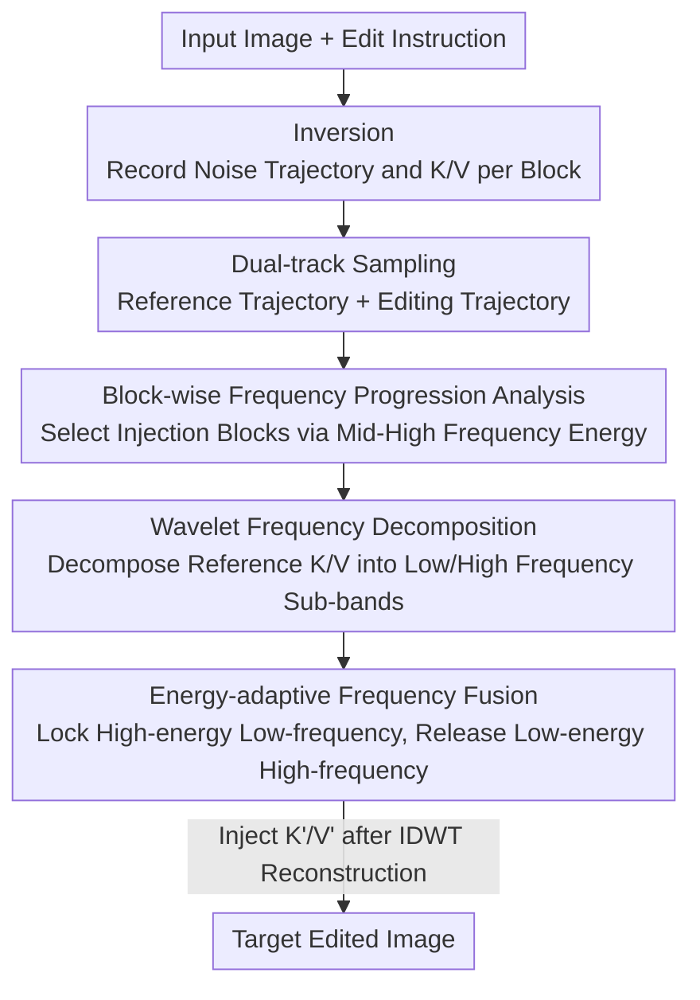

# W-Edit: A Wavelet-based Frequency-aware Framework for Text-driven Image Editing

**Conference**: ICLR 2026  
**OpenReview**: [https://openreview.net/forum?id=jIcfQb66us](https://openreview.net/forum?id=jIcfQb66us)  
**Code**: None  
**Area**: Diffusion Models / Image Editing  
**Keywords**: Text-driven Image Editing, Wavelet Transform, Frequency-aware Modulation, Diffusion Transformer, Training-free

## TL;DR
W-Edit decomposes diffusion features into multi-scale frequency bands using wavelet transforms, injecting the "low-frequency for structure, high-frequency for detail" prior into the attention K/V of pre-trained DiTs. This achieves a training-free balance between structure preservation and local modification, reducing FID to 65.44 and increasing CLIP score to 31.84 on PIE-Bench, outperforming previous training-free editing methods.

## Background & Motivation

**Background**: Text-driven image editing is typically built upon pre-trained T2I diffusion models. Recently, the field has shifted from U-Net (Stable Diffusion) to Diffusion Transformers (FLUX, SD3) and introduced flow matching. Editing methods generally fall into two categories: training-based (InstructPix2Pix, MagicBrush, IMagic) and training-free (inversion, attention injection).

**Limitations of Prior Work**: Training-based methods require constructing large-scale instruction-image triplets or fine-tuning large models, which is costly and prone to catastrophic forgetting, showing poor generalization to unseen domains like video or fine-grained edits. Training-free methods have distinct weaknesses: inversion-based methods mapping images back to noise exhibit trajectory drift and weak controllability; attention injection like Prompt-to-Prompt improves structural maintenance but is extremely sensitive to layer selection and fails under complex edits; the recent Stable-Flow identifies "vital layers" for injection, which improves stability but imposes overly rigid constraints, often failing at necessary scene-level modifications. In short—these methods either "preserve structure but miss the edit" or "achieve the edit but sacrifice consistency."

**Key Challenge**: The authors attribute the root cause to the fact that global semantics (layout, object identity) and local signals (texture, color, fine attributes) are **entangled in the spatial domain**, making it difficult to simultaneously "preserve what shouldn't move" and "change what should."

**Key Insight**: The frequency domain naturally provides a decomposition aligned with editing goals. Low-frequency components encode layout and semantics, serving as reliable anchors for consistency; high-frequency components carry texture and variations suitable for flexible modification. The authors further perform frequency analysis on DiT intermediate features and discover a **block-wise frequency progression**: early blocks primarily characterize low-frequency structures, while later blocks refine high-frequency details—thus reformulating text editing as "multi-level frequency control."

**Core Idea**: Use wavelet transforms to decompose diffusion features into multi-scale frequency bands, locking the reference image's low-frequency (structure) while releasing high-frequency (details) for text-driven modification. These are selectively injected into the pre-trained model's attention in an "energy-adaptive" manner to achieve controllable, training-free editing.

## Method

### Overall Architecture

W-Edit operates around a **dual-track sampling** process: given an input image and an editing instruction, inversion is first performed to obtain the initial noise and inversion trajectory, recording the attention key/value (K, V) for each block. Subsequently, sampling occurs **simultaneously** along two trajectories: the inversion noise (generating the reference image) and new random noise (generating the edited image). In selected Transformer blocks, the reference K/V are decomposed into multi-scale frequency bands via DWT. An energy-adaptive fusion mechanism injects reference frequency features into the editing track, which are then reconstructed via IDWT and written back to the attention layers. This anchors the global structure of the edited image to the reference while allowing high-frequency details to vary freely according to the text instruction. The process requires no training or fine-tuning and is compatible with mainstream architectures like FLUX, SD1.5, and CogVideoX.

### Key Designs

**1. Wavelet Frequency Decomposition: Simultaneous Localization in Space and Frequency**

**Design Motivation**: The core difficulty of editing is the entanglement of structure and detail in the spatial domain. The authors aim to project diffusion features into the frequency domain for explicit decoupling. Traditional Fourier transforms provide global frequency decomposition but lose spatial localization, preventing local/multi-scale control. W-Edit utilizes the Wavelet Transform: the mother wavelet $\psi(t)$ generates $\psi_{a,b}(t)=\frac{1}{\sqrt{a}}\psi\!\left(\frac{t-b}{a}\right)$ through scale parameter $a$ (controlling frequency) and translation parameter $b$ (controlling position), resulting in basis functions localized in both space and frequency. Applying a 2D Discrete Wavelet Transform (DWT) to features yields four sub-bands $F\xrightarrow{\text{DWT}}F_A,F_H,F_V,F_D$, where $F_A$ is the low-frequency approximation and $F_H/F_V/F_D$ are horizontal/vertical/diagonal high-frequency details. Recursive decomposition of $F_A$ provides multi-level representation. This separates "low-frequency = layout semantics = consistency anchors" from "high-frequency = texture changes = editable details," forming the basis for frequency-aware control.

**2. DiT Block-wise Frequency Progression: Locating Injection Blocks via Energy**

**Mechanism**: In U-Net, "early layers manage structure, late layers manage detail" is derived heuristically from resolution changes. However, DiT blocks are homogeneous without clear semantic stages. The authors apply a 2D Fourier Transform $\hat{z}_k(u,v)=\mathcal{F}[z_k]$ to the output $z_k$ of the $k$-th block and define a **Mid-to-High (MTH) frequency energy** metric: using the mid-frequency radius $r_{mid}=r_{max}//2$ as the boundary, the radial power spectrum is accumulated as $E^k_{MTH}=\sum_{r=r_{mid}}^{\text{max}}P_r(\hat{z}_k)$. This scalar quantifies the MTH frequency components of the block. Visualization on FLUX blocks reveals that early blocks encode low-frequency structural foundations, while later blocks exhibit sparser attention and refine high-frequency details. Consequently, blocks with **extremely high or low MTH energy** are selected for frequency fusion. These selected blocks overlap significantly with "vital layers" identified by DINOv2 in Stable-Flow, indicating a strong correspondence between block importance and frequency response.

**3. Energy-adaptive Frequency Fusion: Locking Structure and Releasing Details**

**Function**: Once blocks are selected, the system must decide which frequency bands to take from the reference and which to let the model generate freely. Since most visual energy in natural images is concentrated in low-frequency bands representing global structure, an energy-aware fusion is designed: let the energy of the $i$-th sub-band be $E_i=\sum|F_{ref,i}|^2$. The smallest set of sub-bands whose cumulative energy reaches a threshold $\eta$ is selected:

$$F'_i=\begin{cases}F_{ref,i}, & \text{if}\ \sum_{j=1}^{i}E_j\le\eta\sum_k E_k,\\ F_i, & \text{otherwise.}\end{cases}$$

This replaces high-energy (low-frequency, structure) sub-bands with those from the reference to lock the layout, while leaving low-energy (high-frequency, detail) sub-bands to be generated according to the text. $\eta$ acts as a key slider for "guidance strength vs. feature retention": smaller $\eta$ favors text alignment at the cost of structure, while larger $\eta$ over-preserves the reference, suppressing the edit. $\eta=0.6$ is found to be the optimal trade-off in practice.

**4. Inversion Dual-track + Attention Injection: Applying Frequency Features to the Sampling Trajectory**

**Mechanism**: W-Edit uses flow models like FLUX, where an ODE $\frac{d\phi_t(x)}{dt}=u_t(\phi_t(x))$ transports noise $p_0$ to the data distribution $p_1$. Real images are inverted back to noise using a backward Euler solver, recording K/V at each step. The fused coefficients are reconstructed via IDWT into $F'$ and written into the attention: $K'=F'W_K$, $V'=F'W_V$, $Q=FW_Q$, resulting in $\text{Attn}'(Q,K',V')=\text{Softmax}\!\left(\frac{QK'^\top}{\sqrt{d}}\right)V'$. Low-frequency bands control composition, while high-frequency bands refine details. The dual-track design—where the reference track stores K/V and the editing track starts from pure noise while absorbing these K/V—ensures the edited image is guided toward the original structure, minimizing structural drift.

## Key Experimental Results

### Main Results

Evaluated on PIE-Bench using FLUX.1-dev compared with P2P, MagicBrush, Flow-Edit, and Stable-Flow, alongside VLM evaluation (Phi-3.5-vision) and a User Study with 15 participants.

| Method | CLIP↑ | FID↓ | PSNR↑ | LPIPS↓ | Text Fol.↑ | Modify↑ |
|------|-------|------|-------|--------|-----------|---------|
| P2P | 28.13 | 320.65 | 15.12 | 0.4736 | 31.5% | 24.0% |
| MagicBrush | 29.06 | 206.19 | 15.68 | 0.4615 | 84.5% | 33.5% |
| Flow-Edit | 30.48 | 80.35 | 18.33 | 0.2642 | 76.0% | 54.5% |
| Stable-Flow | 29.16 | 89.78 | 21.02 | 0.1522 | 77.5% | 58.0% |
| **Ours (W-Edit)** | **31.84** | **65.44** | **24.06** | **0.1028** | 81.0% | **63.0%** |

Compared to Flow-Edit, W-Edit reduces FID by 18.6% and increases CLIP by 4.5%. PSNR is 14.5% higher than the runner-up, and LPIPS improves by 32.5%. While MagicBrush has the highest Text Following (84.5%), it sacrifices consistency; W-Edit achieves the best balance between text compliance and minimal modification (63.0%). User study results also show comprehensive leads in realism (4.2) and consistency (3.9). Efficiency-wise, it adds only 10.8% inference time and 1.6% VRAM compared to vanilla FLUX.

### Ablation Study

| Configuration | CLIPimg | CLIPtxt | CLIPdir | Average |
|------|---------|---------|---------|---------|
| Selected-block injection (Full) | 0.9749 | 0.3068 | 0.0826 | **0.4548** |
| All-block injection | 0.9988 | 0.2839 | 0.0013 | 0.4280 |
| w/o SingleStreamBlocks | 0.9184 | 0.3162 | 0.0880 | 0.4409 |
| w/o DualStreamBlocks | 0.9458 | 0.3089 | 0.0871 | 0.4473 |
| w/o high-frequency | 0.9391 | 0.3092 | 0.0821 | 0.4301 |
| w/o low-frequency | 0.9249 | 0.3125 | 0.0954 | 0.4443 |

### Key Findings
- **Selected-layer injection is critical**: Injecting all blocks pushes CLIPimg to 0.9988 but collapses CLIPdir to 0.0013—excessive injection forces the reference and suppresses text guidance. Selecting specific blocks achieves the highest average performance (0.4548).
- **Frequency bands are complementary**: Removing high-frequency details loses fine-grained consistency, while removing low-frequency components disrupts structural preservation.
- **$\eta$ as a trade-off slider**: $\eta < 0.4$ favors text alignment but harms structure; $\eta > 0.8$ over-preserves the reference and stifles the edit. $\eta=0.6$ yields the highest CLIPdir.

## Highlights & Insights
- **Unified training-free mechanism via frequency decomposition**: Instead of manual attention manipulation or retraining, W-Edit uses energy-weighted band substitution. This single mechanism handles object replacement, addition, deletion, and scene/non-rigid edits with broad generalization.
- **Identifying "functional division" in homogeneous DiT blocks**: The frequency energy spectrum fills the gap in DiT's lack of natural hierarchical semantics found in U-Net. The alignment with DINOv2-identified "vital layers" provides a transferable criterion for layer selection.
- **Elegant energy-adaptive thresholding**: Leveraging the prior that natural image energy concentrates in low frequencies, the cumulative threshold $\eta$ allows for adaptive locking of bands. This is more flexible than fixed band selection and is directly applicable to tasks like style transfer or multi-reference fusion.

## Limitations & Future Work
- Selection of injection blocks still relies on a per-architecture analysis (e.g., FLUX's Single/Double streams). A new architecture requires a fresh frequency progression analysis.
- $\eta=0.6$ is a global compromise for PIE-Bench; it may not be optimal for specific edit types (e.g., massive scene rewriting vs. subtle attribute tweaks). An adaptive or instruction-guided $\eta$ regulation is missing.
- Failure modes in extreme edits (large-area inpainting, simultaneous multi-object editing) were not fully explored, and the robustness of frequency locking in such scenarios needs verification.

## Related Work & Insights
- **vs. Stable-Flow**: Both involve selected-layer injection. Stable-Flow uses DINOv2 to find vital layers and imposes rigid constraints, often failing at necessary scene changes. W-Edit uses frequency energy for selection + adaptive fusion, providing a fine-grained dial for flexibility.
- **vs. Prompt-to-Prompt (P2P)**: P2P relies on cross/self-attention injection for structure control but is sensitive to block choice and fails in complex edits (FID 320.65). W-Edit's decoupling in the frequency domain is more robust.
- **vs. FlexiEdit / FDS**: These also use frequency cues but often require additional objective functions or architectural changes. W-Edit is entirely training-free and plug-and-play.

## Rating
- Novelty: ⭐⭐⭐⭐ Systematically introduces wavelet multi-scale decomposition + energy-adaptive fusion to DiT editing with an insightful frequency progression analysis.
- Experimental Thoroughness: ⭐⭐⭐⭐ Quantitative results on PIE-Bench + VLM + User Study + generalization across models (FLUX/SD1.5/CogVideoX).
- Writing Quality: ⭐⭐⭐⭐ Clear logical chain from motivation to frequency insights to methodology.
- Value: ⭐⭐⭐⭐ Training-free and efficient (+10.8% time), high practical value for controllable editing.

<!-- RELATED:START -->

## Related Papers

- [\[CVPR 2026\] CARE-Edit: Condition-Aware Routing of Experts for Contextual Image Editing](../../CVPR2026/image_generation/care-edit_condition-aware_routing_of_experts_for_contextual_image_editing.md)
- [\[CVPR 2026\] HP-Edit: A Human-Preference Post-Training Framework for Image Editing](../../CVPR2026/image_generation/hp-edit_a_human-preference_post-training_framework_for_image_editing.md)
- [\[CVPR 2026\] FreqEdit: Preserving High-Frequency Features for Robust Multi-Turn Image Editing](../../CVPR2026/image_generation/freqedit_preserving_high-frequency_features_for_robust_multi-turn_image_editing.md)
- [\[ICLR 2026\] LogiStory: A Logic-Aware Framework for Multi-Image Story Visualization](logistory_a_logic-aware_framework_for_multi-image_story_visualization.md)
- [\[ICLR 2026\] Follow-Your-Shape: Shape-Aware Image Editing via Trajectory-Guided Region Control](follow-your-shape_shape-aware_image_editing_via_trajectory-guided_region_control.md)

<!-- RELATED:END -->
