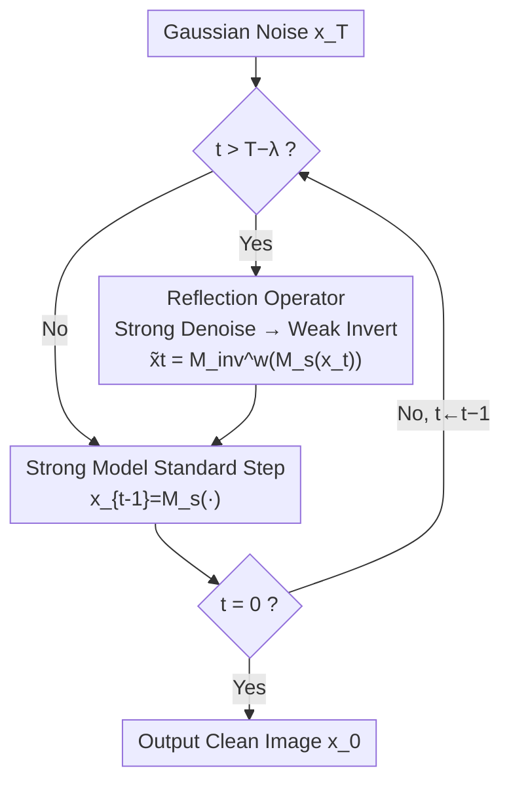

# Weak-to-Strong Diffusion with Reflection

**Conference**: ICLR 2026  
**OpenReview**: [https://openreview.net/forum?id=tg19FVh3p1](https://openreview.net/forum?id=tg19FVh3p1)  
**Area**: Diffusion Models  
**Keywords**: Diffusion sampling, training-free augmentation, weak-to-strong gap, reflection operator, inference-time scaling  

## TL;DR
W2SD proposes alternating "strong model denoising + weak model inversion" (reflection) during diffusion sampling. It uses the estimable "weak-to-strong gap" between a pair of off-the-shelf models to approximate the unobservable "strong-to-ideal gap," pulling the sampling trajectory toward the real data distribution without training. It significantly improves human preference and aesthetic quality across various settings (Image/Video, UNet/DiT/MoE), achieving up to a 90% HPSv2 win rate on Juggernaut-XL.

## Background & Motivation
**Background**: Diffusion models learning the log-probability gradient of real data distributions through score matching are current mainstream generative paradigms. Recently, inference-time scaling has become a focal point, with many works improving sampling quality by modifying input conditions, network structures, or adding extra constraints (e.g., Z-Sampling uses implicit semantic injection, Auto-Guidance trains a degraded model for guidance).

**Limitations of Prior Work**: Due to architectural constraints and data quality, existing diffusion models inevitably suffer from gradient estimation errors during inference, resulting in a "modeling gap" between the learned and real distributions. This manifests as missing details, text/counting errors, and property binding confusion. Existing enhancement methods are often limited to single components (better schedulers, better denoising networks) and lack flexibility—often failing when applied to different architectures or tasks.

**Key Challenge**: To bridge the gap between "existing models ↔ ideal models," one essentially needs the gradient direction of the real data distribution. However, since the real distribution is unobservable, this "strong-to-ideal gap" cannot be directly quantified or optimized.

**Goal**: To find an estimable quantity as a proxy for the unobservable ideal direction without training or structural changes, and to ensure this mechanism can flexibly reuse various off-the-shelf enhancement techniques.

**Key Insight**: The authors observe that while the "strong model to ideal" gap is unmeasurable, the "weak model to strong model" gap is fully measurable. Given a pair of models with different capabilities (strong model $M_s$, weak model $M_w$), the difference between their estimated scores provides a directional signal. If this weak-to-strong direction approximately points toward the ideal distribution, it can serve as a proxy.

**Core Idea**: Use the estimable "weak-to-strong gap" $\Delta_1 = \nabla\log p_s - \nabla\log p_w$ as a proxy for the unobservable "strong-to-ideal gap" $\Delta_2 = \nabla\log p_{gt} - \nabla\log p_s$, and implicitly apply this direction to the sampling trajectory via an alternating denoising/inversion reflection operator.

## Method

### Overall Architecture
W2SD (Weak-to-Strong Diffusion) is a training-free "meta-augmentation" framework. Instead of inventing new denoising networks, it inserts any pair of strong/weak models ($M_s, M_w$) into the standard sampling loop. During the latter stages of sampling, it performs reflection corrections on latent variables to push the trajectory toward the real data distribution before decoding the final image.

The process relies on a key fact: under the same score network, the denoising operator $M$ and inversion operator $M_{inv}$ are inverse mappings, i.e., $M_{inv}(M(x_t,t),t)=x_t$. However, when denoising with a strong model and inverting with a weak model, the round-trip does not close, and the residue is exactly the weak-to-strong gap $\Delta_1(t)$. W2SD utilizes this "unclosed round-trip" to inject correction signals at each step. Specifically (Algorithm 1): for total sampling steps $T$, reflection is triggered only in the last $\lambda$ steps ($t > T-\lambda$). First, strong denoising and weak inversion yield the corrected $\tilde{x}_t = M_{inv}^w(M_s(x_t,t),t)$, followed by a normal denoising step $x_{t-1}=M_s(\tilde{x}_t,t)$. Other steps remain standard.

### Key Designs

**1. Weak-to-Strong Gap as a Proxy for the Ideal Direction: Replacing unmeasurable $\Delta_2$ with measurable $\Delta_1$**

This is the theoretical core of W2SD. The authors define $\Delta_1 = \nabla\log p_s - \nabla\log p_w$ and $\Delta_2 = \nabla\log p_{gt} - \nabla\log p_s$. Theorem 2 provides the condition for this proxy: modeling all three distributions as infinite Gaussian mixtures and using polynomial bias functions $B_s^k, B_w^k$ to characterize normalized weight deviations. When the relative bias ratio satisfies $\left|B_w^k/B_s^k - 2\right|\le \epsilon$, the gap error is bounded: $|\Delta_1(x)-\Delta_2(x)|\le C(x)\cdot\epsilon\cdot|\Delta_2(x)|$. Intuitively, if the weak model's "bias" relative to the ideal is roughly twice that of the strong model, the weak-to-strong direction points toward the ideal. Theorem 3 proves that W2SD strictly reduces the Fisher divergence $\mathcal{J}(p_{gt}\|p_{w2sd})\le\epsilon^2\mathcal{J}(p_{gt}\|p_s)$ when $\epsilon < 1$.

**2. Denoising-Inversion Alternating Reflection Operator**

To apply the $\Delta_1$ direction to the trajectory more smoothly than CFG-style extrapolation, W2SD uses $M_{inv}^w(M_s(\cdot))$. Theorem 1 provides the closed-form result: the reflection modifies $x_t$ into 

$$\tilde{x}_t = x_t + \sigma^2 t\,\Delta t\,(\nabla_{x_t}\log p_t^s(x_t)-\nabla_{x_t}\log p_t^w(x_t))$$

effectively moving one step along the $\Delta_1(t)$ direction. Visualization on 1D/2D Gaussian mixtures and CIFAR-10 shows that when both models are biased toward a specific mode, the reflection trajectory pulls samples toward under-represented regions, increasing generation probability for minority classes and decoupling representations in t-SNE.

**3. Flexible Weak-Strong Model Pairs: Addressing Weight/Condition/Sampling Gaps**

W2SD allows users to define "strong/weak" pairs according to their needs, unifying existing techniques. Three categories are identified (Table 1): **Weight Gap** (Full fine-tuned vs. Base, e.g., Juggernaut-XL vs. SDXL; Personalized LoRA vs. Base; MoE high-score experts vs. low-score experts); **Condition Gap** (High CFG vs. Low/Negative CFG; LLM refined prompt vs. Original prompt); **Sampling Pipeline Gap** (ControlNet/IP-Adapter vs. Standard DDIM). Different pairs yield improvements in different dimensions (human preference, prompt consistency, personalization, etc.), and these gains are cumulative.

### Loss & Training
W2SD is entirely training-free. It requires no additional loss functions or parameter updates, only inserting reflection steps during inference. The core hyperparameter is the reflection step count $\lambda$. To maintain fair time comparisons, authors set $T_{w2s}=\lfloor\frac{1}{2}T_{std}\rfloor$ and $\lambda=\lfloor\frac{1}{2}T_{w2s}\rfloor$ so that the total score predictions $T_{w2s}+2\lambda$ match the standard $T_{std}$ (e.g., $T_{std}=50$ matches $24+2\times12=48$).

## Key Experimental Results

### Main Results
Evaluation covers three gap categories across various modalities and architectures using HPS v2, PickScore, MPS, AES, CLIP, and FID/IS.

| Setup | Model | Metric | Baseline | W2SD |
|------|------|------|------|------|
| Weight Gap (Fine-tuned) | Juggernaut-XL vs SDXL | HPS v2 ↑ | 31.64 | **32.10** |
| Weight Gap (Fine-tuned) | Juggernaut-XL vs SDXL | MPS ↑ | 45.74 | **54.26** |
| Weight Gap (MoE) | DiT-MoE-S | FiD ↓ | 15.10 | **9.10** |
| Weight Gap (MoE) | DiT-MoE-S | IS ↑ | 45.44 | **55.53** |
| Condition Gap (CFG) | SDXL | HPS v2 ↑ | 29.87 | **31.20** |
| Weight + Condition Cumulative | Juggernaut-XL + High CFG | HPS v2 ↑ | 31.64 | **32.96** |

Personalization (SD1.5+LoRA as strong, SD1.5 as weak): DINO 48.03→**51.58**, CLIP-I 64.37→**68.04**, CLIP-T 25.99→**27.66**.

### Ablation Study

| Configuration | HPS v2 ↑ | Win Rate ↑ | Description |
|------|---------|--------|------|
| No Gap (Juggernaut-XL Base) | 31.64 | - | Baseline |
| Condition Gap only | 32.82 | 84% | High vs. Low CFG |
| Weight Gap only | 32.10 | 76% | Fine-tuned vs. Standard |
| Weight + Condition Gap | **32.96** | **90%** | Cumulative Gaps |

### Key Findings
- **Cumulative Gains**: Weight and condition gaps both provide individual gains and are complementary, pushing HPSv2 win rates to 90%.
- **Gap Direction and Magnitude**: When the weak-to-strong gap is $>0$, gains are positive. If $=0$, it degrades to standard sampling. If $<0$ (strong model becomes weaker than the weak), performance drops.
- **Efficiency**: Under identical time budgets, W2SD substantially outperforms standard sampling, proving quality gains outweigh the cost of extra score predictions.
- **Dramatic MoE Improvement**: For DiT-MoE-S (71M params), which often produces distorted images, W2SD nearly halves the FiD and eliminates distortions.

## Highlights & Insights
- **Proxy Strategy**: Using a "measurable difference" to proxy an "unmeasurable" one is a brilliant circumvention of the unobservable real distribution. The "bias ratio $\approx 2$" condition provides a theoretical anchor.
- **Reflection Logic**: Treating the residue of an unclosed denoising/inversion loop as a correction signal is mathematically elegant (Theorem 1) and naturally smoother than CFG extrapolation.
- **Meta-Augmentation**: It does not compete with existing sampling improvements but instead "incorporates" them (LoRA, ControlNet, etc.) by placing them on the strong side of the pair.

## Limitations & Future Work
- **Pair Dependency**: Performance relies heavily on the quality of the strong/weak pairing; poor pairs can lead to model conflict or insufficient gap.
- **Strong Theoretical Assumptions**: Theorems rely on infinite Gaussian mixtures, which may not perfectly reflect real LLM-based diffusion models.
- **Inference Overhead**: Although efficient under time-equivalent budgets, the absolute latency increases due to $2\lambda$ extra predictions.
- **Future Directions**: Self-adaptive $\lambda$ and gap magnitudes, or using a discriminator to assess the weak-to-strong direction in real-time.

## Related Work & Insights
- **vs. Auto-Guidance**: Both use a "worse model" for guidance, but W2SD is training-free, uses smooth reflection instead of CFG-extrapolation, and is much more flexible in pairing selections.
- **vs. Z-Sampling**: Z-Sampling can be viewed as a special case of W2SD's condition gap; W2SD generalizes this to broader categories.
- **vs. Pipeline Enhancements**: W2SD is orthogonal to works like ControlNet or IP-Adapter, treating them as components to be further enhanced by the reflection framework.

## Rating
- Novelty: ⭐⭐⭐⭐⭐ 
- Experimental Thoroughness: ⭐⭐⭐⭐⭐ 
- Writing Quality: ⭐⭐⭐⭐ 
- Value: ⭐⭐⭐⭐⭐ 

<!-- RELATED:START -->

## Related Papers

- [\[CVPR 2026\] Improving Diffusion Generalization with Weak-to-Strong Segmented Guidance](../../CVPR2026/image_generation/improving_diffusion_generalization_with_weak-to-strong_segmented_guidance.md)
- [\[ICML 2026\] Weak Diffusion Priors Can Still Achieve Strong Inverse-Problem Performance](../../ICML2026/image_generation/weak_diffusion_priors_can_still_achieve_strong_inverse-problem_performance.md)
- [\[ICLR 2026\] Generalization of Diffusion Models Arises with a Balanced Representation Space](generalization_of_diffusion_models_arises_with_a_balanced_representation_space.md)
- [\[ICLR 2026\] Inference-Time Scaling of Diffusion Models Through Classical Search](inference-time_scaling_of_diffusion_models_through_classical_search.md)
- [\[ICLR 2026\] Many-for-Many: Unify the Training of Multiple Video and Image Generation and Manipulation Tasks](many-for-many_unify_the_training_of_multiple_video_and_image_generation_and_mani.md)

<!-- RELATED:END -->
