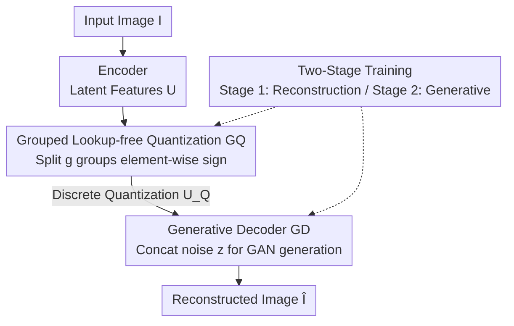

# WeTok: Powerful Discrete Tokenization for High-Fidelity Visual Reconstruction

**Conference**: ICLR 2026  
**Paper**: [OpenReview](https://openreview.net/forum?id=wetok) (⚠️ Subject to the original text)  
**Code**: https://github.com/zhuangshaobin/WeTok  
**Area**: Diffusion Models / Image Generation / Visual Tokenizer  
**Keywords**: Discrete Visual Tokenizer, Lookup-free Quantization, Grouped Quantization, Generative Decoder, High-fidelity Reconstruction

## TL;DR
WeTok is a discrete visual tokenizer that employs "Grouped Lookup-free Quantization (GQ)" to bypass the memory explosion of entropy loss by partitioning large codebooks into smaller groups. It further utilizes a "Generative Decoder (GD)" to transform the decoder from a deterministic regression model into a noise-conditioned GAN generator, enabling the reconstruction of fine details even at high compression ratios. On ImageNet 50k with 400% compression, it achieves a zero-shot rFID of 0.12, surpassing continuous tokenizers such as FLUX-VAE (0.18) and SD-VAE 3.5 (0.19).

## Background & Motivation
**Background**: In visual generation, modeling directly in pixel space is computationally expensive. The mainstream approach involves using a tokenizer to compress images into compact latent representations before running generative models in the latent space. Tokenizers are categorized into continuous types (VAE, mapping to continuous latent spaces) and discrete types (VQ/LFQ, using quantizers to produce finite discrete codes). Discrete tokenizers offer higher compression ratios and naturally suit discrete generative paradigms like Auto-Regressive or MaskGIT.

**Limitations of Prior Work**: Discrete tokenizers face two major challenges. First, **constrained codebook scaling**: to reduce quantization error, codebooks must be enlarged. MAGVIT-v2’s Lookup-free Quantization (LFQ) achieves an implicit codebook size of $2^d$ by taking the sign of latent features per channel. However, it relies on entropy loss to ensure codebook utilization, and the memory cost of entropy calculation grows exponentially with the codebook dimension $d$, leading to OOM issues as $d$ scales. BSQ attempts to save memory by treating bits independently, but this independence assumption introduces approximation errors that degrade performance. Second, **deterministic modeling**: discrete decoders are inherently deterministic, learning to map latent codes to the "expected value" (the average of all possible images) during training. At high compression ratios, a single discrete token may correspond to multiple plausible images (e.g., varying fur textures or leaf patterns), forcing the decoder to output blurry "average" results with lost details.

**Key Challenge**: The trade-off between compression ratio and reconstruction fidelity—discrete methods compress aggressively but yield blurry results, while continuous methods reconstruct well but suffer from low compression. Furthermore, scaling codebooks to improve fidelity hits the memory wall.

**Goal**: To build a discrete tokenizer that maintains high compression while achieving high-fidelity reconstruction. This is divided into two sub-problems: (1) How to scale the codebook infinitely without memory explosion; (2) How to empower a deterministic decoder to model data distributions and sample details.

**Key Insight**: The authors found that LFQ and BSQ represent two extremes of "grouping"—LFQ is "1 large group" ($g=1$) and BSQ is "$d$ 1-dimensional small groups" ($g=d$). By selecting an appropriate number of groups $g$ between these extremes, one can shatter the memory cost of entropy calculations without introducing the significant approximation errors seen in BSQ.

**Core Idea**: Use "Grouped Lookup-free Quantization" to unify and surpass LFQ/BSQ for codebook scaling, and use a "Generative Decoder conditioned on Gaussian noise" to transition reconstruction from regression-of-expectation to distribution-sampling. Together, these enable high-fidelity discrete reconstruction under high compression.

## Method

### Overall Architecture
WeTok follows the CNN encoder/decoder/discriminator framework of Open-MAGVIT2. An input image $I \in \mathbb{R}^{H \times W \times 3}$ is compressed by the encoder into latent features $U$. GQ reshapes $U$ along the channel dimension into $g$ groups, each quantized via a fixed codebook $\{-1, 1\}^{d'}$ using element-wise sign operations to obtain discrete results $U_Q$. In the decoding phase, GD concatenates a Gaussian noise vector $z \sim \mathcal{N}(0, I)$ with $U_Q$ along the channel dimension. The decoder then generates the image $\hat{I}$ via a GAN-based approach from the "noise + condition". Training involves two stages: first, training GQ and the reconstruction decoder using reconstruction loss (including grouped token/codebook entropy loss); second, expanding the decoder channels to receive noise $z$ for generative fine-tuning.

### Key Designs

**1. Grouped Lookup-free Quantization (GQ): Finding the Sweet Spot Between Memory and Error**

To address the issue where LFQ's memory cost explodes and BSQ's bit-stripping introduces error, GQ reshapes $U$ into $U_G \in \mathbb{R}^{h \times w \times g \times d'}$ (where $d = g \cdot d'$, $g$ is the number of groups, and $d'$ is the dimension per group). Each group $k$ is assigned a fixed, non-learnable codebook $C_{GQ,k} = \{-1, 1\}^{d'}$. The conditional probability decomposes into the product of groups: $q(c \mid U[i,j]) = \prod_{k=1}^{g} q_G(c_k \mid U_G[i,j,k])$. Using the additivity of entropy, the token entropy loss is rewritten from the full space $\{-1, 1\}^d$ into the sum of $g$ subspaces $\{-1, 1\}^{d'}$:

$$L_{\text{Token Entropy}} = \frac{1}{hw} \sum_{i,j} \sum_{k=1}^{g} H\big(q_G(c_k \mid U_G[i,j,k])\big),$$

This eliminates the memory bottleneck. Since the codebook entropy loss involves $H(\sum \cdot)$, it cannot be directly decomposed. The authors introduce the approximation $\sum_{i,j} \prod_k q_G \approx \prod_k \sum_{i,j} q_G$ to transform it into a grouped summation. $g$ acts as a tunable knob: larger $g$ approaches BSQ (saving memory but increasing error), while smaller $g$ approaches LFQ (accurate but memory-intensive). Proposition 3.1 states: **For any grouping $G$, the approximation error of GQ's codebook entropy is strictly smaller than that of BSQ** (proof based on order theory in abstract algebra; ⚠️ see Sup. A for details). Thus, GQ enjoys BSQ's memory efficiency with lower error.

**2. Generative Decoder (GD): From Regression to Sampling**

To solve the blurriness of deterministic decoders at high compression, GD feeds an additional Gaussian noise variable to the decoder. While standard GAN loss $L_{GAN}(U_Q) = \log(1 - D(G(U_Q)))$ only enhances perceptual quality, GD modifies it to:

$$L_{GAN}(U_Q) = \mathbb{E}_{z \sim \mathcal{N}(0, I)} \big[ \log(1 - D(G(z, U_Q))) \big],$$

where $U_Q$ is the condition and $z$ is the random source. The semantic shift is crucial: the decoder no longer learns a one-to-one mapping but models the conditional distribution from Gaussian noise to real images given $U_Q$. When a highly compressed token corresponds to multiple images, $z$ allows the decoder to sample a specific, coherent instance with high-frequency details (e.g., specific fur textures). Unlike diffusion-based decoders (DiTo, $\epsilon$-VAE), WeTok is the **first work to introduce a generative decoder to a discrete tokenizer** using efficient single-step GAN sampling.

**3. Two-Stage Training: Stable Generative Fine-tuning**

GAN-based generative training on discrete tokenizers can be unstable due to stop-gradient estimation. The authors employ a two-stage strategy: Stage 1 focuses on reconstruction loss (including GQ's grouped entropy losses) until saturation. In Stage 2, the channel dimension of the decoder's input layer `conv_in` is expanded, and the **newly added channels are zero-initialized** to receive $z$. Zero initialization ensures that the decoder's behavior at the start of Stage 2 is identical to the pre-trained state, allowing for a smooth transition without destroying learned reconstruction capabilities.

### Loss & Training
The total loss inherits the five-term framework of VQVAE: reconstruction loss $\|I - \hat{I}\|^2$, codebook loss, commitment loss (replaced by entropy loss in LFQ), perceptual loss LPIPS, and GAN loss. The entropy loss is replaced by GQ’s grouped token entropy (Eq. 6) and grouped codebook entropy (Eq. 8). Adam is used for optimization. Ablation studies use 250K steps with 256×256 random crops; large-scale models are tuned individually. A counter-intuitive finding: **Constant learning rates** significantly outperform the conventional warm-up + cosine decay for discrete tokenizer training.

## Key Experimental Results

### Main Results
Zero-shot reconstruction on ImageNet 50k validation set (⚠️ numbers may vary slightly by setting):

| Setting | Metric | WeTok | Comparison Method | Notes |
|---------|--------|-------|-------------------|-------|
| High Fidelity / 400% Compression | rFID ↓ | **0.12** | FLUX-VAE 0.18 / SD-VAE 3.5 0.19 | Discrete beats continuous |
| High Comp. / 768× Compression | rFID ↓ | **3.49** | Cosmos 4.57 (at 384×, half the compression) | Better even with double compression |

SOTA comparison on ImageNet 256×256 (Downsampling factor 16, codebook size $\approx 2^{18}$):

| Method | Codebook | rFID ↓ | PSNR ↑ | Usage |
|--------|----------|--------|--------|-------|
| Open-MAGVIT2 | $2^{18}$ | 1.17 | 22.64 | 100% |
| MGVQ | $2^{18}$ | 0.64 | 23.71 | 100% |
| **WeTok (Ours)** | $2^{18}$ | **0.61** | **24.50** | 100% |

### Ablation Study

| Configuration | Key Metric | Notes |
|---------------|------------|-------|
| Quantization GQ ($g=2, d'=8$) | Best rFID | Better than LFQ ($g=1$) and far superior to BSQ ($g=16$) |
| Memory: LFQ @ $d=24$ | OOM | LFQ crashes at $d \ge 24$ |
| Memory: GQ @ $d=40$ | 10.6 GB | GQ/BSQ memory scales minimally with $d$ |
| Stage 1 Only (No GD) | rFID 5.37 | Deterministic decoding |
| Stage 1 + Stage 2 (With GD) | rFID 3.90 | GD significantly improves rFID |
| Arch: C=256, B=4 | Best Recon | Optimal configuration (198M/261M parameters) |

### Key Findings
- **GQ Solves Memory and Error Simultaneously**: LFQ hits OOM at $d=24$, while GQ maintains memory at ~10.6 GB. GQ > LFQ ≫ BSQ under the same compression, proving that grouping is memory-efficient and theoretically more accurate than BSQ.
- **Larger group number $g$ improves reconstruction**: Increasing $g$ consistently improves performance without hitting memory walls—empirical evidence for GQ's infinite scalability.
- **GD Primarily Improves rFID**: Adding GD dropped rFID from 5.37 to 3.90 with minimal changes to PSNR/SSIM, suggesting GD's gain lies in "distributional realism" rather than pixel-wise accuracy. Qualitative results show more natural textures.
- **Data Trade-offs**: Models trained on 400M general domain data show better PSNR/SSIM and generalization but lag behind ImageNet-specific models in rFID/LPIPS, indicating a trade-off between universality and in-distribution metrics.
- **Constant Learning Rates are Superior**: This finding against the "warm-up + cosine" industry standard was adopted as the default for large-scale training.

## Highlights & Insights
- **Unifying LFQ/BSQ via Parameter $g$**: The authors insightfully identified LFQ ($g=1$) and BSQ ($g=d$) as endpoints of a spectrum. The "sweet spot" in the middle allows for optimal performance-memory trade-offs, backed by a rigorous proof that error is strictly lower than BSQ.
- **Zero-Initialization for Noise Injection**: Using zero-init to introduce the noise branch is a clever engineering trick that "painlessly" adds generative capabilities to a pre-trained reconstruction model without breaking learned features.
- **Generative Decoding for Discrete Tokenizers**: While previous generative decoders were for continuous models, WeTok successfully migrates this to the discrete side using efficient GAN sampling, bridging "discrete compression" and "generative reconstruction."

## Limitations & Future Work
- **Approximation Hypothesis in Entropy Loss**: The decomposition in Eq. 7 relies on the $\sum\prod \approx \prod\sum$ approximation; while better than BSQ, it remains an approximation with potentially increasing error at very large $g$.
- **Inherent GAN Instability**: Despite the two-stage strategy, GAN-based generators are more sensitive to hyperparameters than pure regression, requiring individual tuning for large models.
- **Consistency in Metrics**: Minor discrepancies exist in the paper (e.g., rFID 3.49 vs 3.59 across sections); readers should refer to official tables/code.
- **Limited Downstream Generation Validation**: The focus is heavily on reconstruction metrics. Further downstream experiments on end-to-end generation quality (e.g., gFID) would strengthen the case for WeTok as a backbone replacement.

## Related Work & Insights
- **vs LFQ (MAGVIT-v2)**: LFQ uses implicit fixed codebooks but suffers from exponential memory growth. WeTok generalizes LFQ as a $g=1$ case and unlocks scalability via grouping.
- **vs BSQ**: BSQ saves memory but loses performance due to bit independence. WeTok generalizes BSQ as a $g=d$ case, finding a better balance with strictly lower error.
- **vs Diffusion Decoders (DiTo / $\epsilon$-VAE)**: These use diffusion in continuous latents. WeTok is the first for **discrete** latents and uses single-step GANs for better efficiency.
- **vs Continuous Tokenizers (FLUX-VAE / SD-VAE 3.5)**: Continuous methods are typically better at fidelity. WeTok challenges this by outperforming them in rFID at 400% compression.

## Rating
- **Novelty**: ⭐⭐⭐⭐⭐ Unifying LFQ/BSQ and introducing discrete generative decoding are both highly creative.
- **Experimental Thoroughness**: ⭐⭐⭐⭐ Solid reconstruction and ablation; downstream generation could be more extensive.
- **Writing Quality**: ⭐⭐⭐⭐ Clear motivation and formulas, despite minor numerical inconsistencies.
- **Value**: ⭐⭐⭐⭐⭐ Proving discrete tokenizers can beat continuous ones is significant for future visual generation pipelines.

<!-- RELATED:START -->

## Related Papers

- [\[ICLR 2026\] GarmentGPT: Compositional Garment Pattern Generation via Discrete Latent Tokenization](garmentgpt_compositional_garment_pattern_generation_via_discrete_latent_tokeniza.md)
- [\[ICLR 2026\] ReDDiT: Rehashing Noise for Discrete Visual Generation](reddit_rehashing_noise_for_discrete_visual_generation.md)
- [\[CVPR 2026\] Spk2VidNet: A Hierarchical Recurrent Architecture for High-Fidelity Video Reconstruction from Long Spike-Camera Streams](../../CVPR2026/image_generation/spk2vidnet_a_hierarchical_recurrent_architecture_for_high-fidelity_video_reconstr.md)
- [\[ICLR 2026\] EditScore: Unlocking Online RL for Image Editing via High-Fidelity Reward Modeling](editscore_unlocking_online_rl_for_image_editing_via_high-fidelity_reward_modelin.md)
- [\[CVPR 2026\] Spherical Leech Quantization for Visual Tokenization and Generation](../../CVPR2026/image_generation/spherical_leech_quantization_for_visual_tokenization_and_generation.md)

<!-- RELATED:END -->
