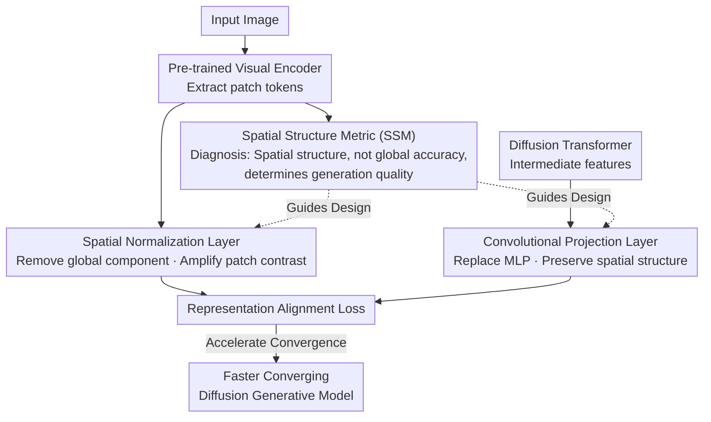

# What Matters for Representation Alignment: Global Information or Spatial Structure?

**Conference**: ICLR 2026  
**OpenReview**: [https://openreview.net/forum?id=y0UxFtXqXf](https://openreview.net/forum?id=y0UxFtXqXf)  
**Paper**: [Project Page](https://end2end-diffusion.github.io/irepa)  
**Code**: See project page (Available)  
**Area**: Diffusion Models / Representation Alignment / Generative Model Training Acceleration  
**Keywords**: Representation Alignment (REPA), Diffusion Transformer, Spatial Structure, Convergence Acceleration, Visual Encoder

## TL;DR
This paper systematically proves that Representation Alignment (REPA) accelerates diffusion model training not by relying on the **global semantic information** of the target representation (ImageNet linear probe accuracy), but rather on the **spatial self-similarity structure between its patch tokens**. Based on this, the authors propose iREPA with only 4 lines of code (convolutional projection + spatial normalization), which consistently accelerates REPA convergence across 27 encoders, various model scales, and training recipes.

## Background & Motivation
**Background**: Representation Alignment (REPA) has become a mainstream method for accelerating the training of Diffusion Transformers—aligning the intermediate features of a diffusion model with the patch token features of a pre-trained visual encoder (such as DINOv2) significantly speeds up convergence and improves final generation quality.

**Limitations of Prior Work**: Despite its empirical effectiveness, the community has almost no mechanistic understanding of "why it works." The prevailing consensus (originating from the original REPA paper) is that **the stronger the global semantics of the encoder (represented by higher ImageNet linear probe accuracy), the better it serves as a target representation**. Consequently, researchers typically select encoders based on linear probe accuracy and interpret the rise in probe accuracy of diffusion features as evidence of effective alignment.

**Key Challenge**: Is this consensus correct? Between global semantic information and spatial structure, which factor truly drives generative performance? This directly determines how to select optimal target representations.

**Key Insight**: The authors noted several counterexamples—PE-Spatial-B, a small model fine-tuned for spatial tasks (with only 53.1% accuracy), serves as a better REPA target for generation FID than PE-Core-G (82.8% accuracy). Even SAM2-S, which possesses almost no global information (24.1% accuracy), outperforms encoders with accuracy 60 points higher. These "unexplained" phenomena suggest that the factor at play might be another dimension: **spatial structure**.

**Core Idea**: Replace "global semantic accuracy" with "spatial self-similarity structure between patch tokens" as the benchmark for evaluating target representations. Use this to design two minimalist modifications that deliberately **amplify** the transfer of spatial information from the teacher encoder to the diffusion model, thereby accelerating REPA.

## Method

### Overall Architecture
This work first falsifies existing consensus and then improves the method accordingly. The method consists of two parts. **The first part is Diagnosis**: defining a rapidly computable Spatial Structure Metric (SSM) and conducting large-scale correlation analysis across 27 visual encoders and 3 SiT sizes to prove that the correlation between SSM and generation FID (Pearson $|r|>0.85$) is significantly higher than linear probe accuracy ($|r|=0.26$), using it to explain the "unexplained" counterexamples. **The second part is Improvement**: since spatial structure is key, two targeted changes are made to the original REPA training recipe—replacing the MLP projection layer (which loses spatial information) with a convolutional projection layer, and adding a spatial normalization layer to the target representation to amplify the contrast between patches—collectively termed iREPA.

The entire pipeline is: the visual encoder extracts patch tokens $\rightarrow$ spatial normalization amplifies spatial contrast $\rightarrow$ serves as the alignment target; intermediate features of the Diffusion Transformer are mapped to the target dimension via a convolutional projection layer $\rightarrow$ alignment loss is computed against the normalized target features. SSM serves as both a diagnostic metric for selecting/explaining encoders and as the design basis for the two modifications in iREPA.

### Key Designs

**1. Spatial Structure Metric (SSM): Replacing Global Accuracy with Patch-wise Spatial Self-similarity**

The pain point is that the community has used linear probe accuracy to measure target representations, yet it is almost uncorrelated with generation FID. The authors instead use the **spatial self-similarity structure** within an image: given patch representations $X = E(I) \in \mathbb{R}^{T\times D}$ (where $T=H\times W$), a cosine kernel measures the pairwise similarity between patches $K_X(t,t') = \frac{\langle x_t, x_{t'}\rangle}{\|x_t\|\,\|x_{t'}\|}$, observing how similarity changes with spatial (Manhattan) distance $d$. The default metric is Local-Distal Similarity (LDS):

$$\mathrm{LDS}(X,P) = \mathbb{E}_{d(t,t')\in(0,r_{near})} K_X(t,t') - \mathbb{E}_{d(t,t')\ge r_{far}} K_X(t,t').$$

The intuition is that a good spatial structure should satisfy the condition that "nearby patches are more similar than distant patches." A larger LDS indicates stronger spatial organization (set $r_{near}=r_{far}=H/2$ naturally; the appendix provides equivalent metrics like CDS/SRSS/RMSC). Correlation analysis across 27 encoders shows that all SSM metrics correlate with gFID at $|r|>0.85$ (LDS 0.852, SRSS 0.885, RMSC 0.888), while linear probe accuracy is only 0.26. SSM also explains previous anomalies: SAM2/PE-Spatial-B have low global accuracy but strong spatial structure; larger models of the same family (PE-G, C-RADIO Large) have higher accuracy but worse spatial structure. Mixing CLS tokens into patches via $p^{new}_i = p_i + \alpha\cdot c$ ($\alpha: 0 \to 0.5$) increases probe accuracy from 70.7% to 78.5% but destroys spatial contrast, causing FID to deteriorate from 19.2 to 25.4. **Conclusion: Spatial structure is the true signal for predicting generation performance.**

**2. Convolutional Projection Layer: Replacing MLP to Prevent Spatial Structure Flattening**

Original REPA uses a 3-layer MLP to map diffusion feature dimensions to target representation dimensions. However, the authors observe that this token-wise MLP projection is lossy—it transforms across channels without sensing the spatial grid, thereby weakening spatial contrast (Fig 6a). Since spatial structure is key, the MLP is replaced with a lightweight convolutional layer (kernel size 3, padding 1, `nn.Conv2d`), allowing projection to act directly on the spatial grid. The inherent local inductive bias of convolution naturally preserves spatial relationships between neighboring patches, ensuring that spatial information is not flattened during mapping, thus providing a cleaner spatial signal to the alignment loss.

**3. Spatial Normalization Layer: Sacrificing Global Components to Amplify Patch Contrast**

Patch tokens from pre-trained encoders often contain a strong **global component** (where the patch mean itself has high linear probe accuracy). This causes unrelated tokens (e.g., foreground object vs. background) to exhibit high cosine similarity, suppressing spatial contrast. Based on the diagnostic conclusion—that global information helps little while spatial contrast is vital—the authors actively **sacrifice this global component to exchange it for spatial contrast**. A spatial normalization layer (similar to instance norm, calculated along the spatial dimension) is added to the target representation patch tokens:

$$y = \frac{x - \gamma\,\mathbb{E}[x]}{\sqrt{\mathrm{Var}[x] + \epsilon}},$$

where $x\in \mathbb{R}^{B\times T\times D}$, and mean/variance are computed over the spatial dimension $T$, with $\epsilon=10^{-6}$. Subtracting $\gamma$ times the spatial mean strips away the global component, while dividing by the spatial standard deviation amplifies relative differences between patches. The resulting normalized target features have stronger spatial contrast, providing the diffusion model with clearer spatial supervision regarding "which patches should be similar and which should not." These two modifications involve fewer than 4 lines of code, collectively called iREPA.

### Loss & Training
The alignment loss follows the original REPA's patch-wise cosine similarity alignment (intermediate diffusion features after convolutional projection are aligned with spatially normalized encoder patch tokens). No new loss terms are introduced; changes are restricted to the projection layer structure and target feature preprocessing. Experiments are conducted on ImageNet 256×256, primarily using SiT-XL/2, evaluated at 100K/400K steps. DINOv2 is the default encoder; iREPA can be directly integrated into various recipes such as REPA, REPA-E, MeanFlow w/ REPA, and JiT w/ REPA.

## Key Experimental Results

### Main Results
iREPA consistently accelerates convergence across different encoders (SiT-XL/2, 100K steps, without CFG):

| Encoder | Method | FID↓ | IS↑ | sFID↓ |
|---------|--------|------|-----|-------|
| DINOv2-B | REPA | 19.06 | 70.3 | 5.83 |
| DINOv2-B | iREPA | **16.96** | 77.9 | 6.26 |
| DINOv3-B | REPA | 21.47 | 63.4 | 6.19 |
| DINOv3-B | iREPA | **16.26** | 78.8 | 6.14 |
| WebSSL-1B | REPA | 26.10 | 53.0 | 6.90 |
| WebSSL-1B | iREPA | **16.66** | 77.5 | 6.18 |
| PE-Core-G | REPA | 32.35 | 42.7 | 6.70 |
| PE-Core-G | iREPA | **18.19** | 75.0 | 6.03 |

Scalability across encoder sizes / model sizes (DINOv2, SiT-XL/2, 100K):

| Dimension | Configuration | REPA FID | +iREPA FID | Gain |
|-----------|---------------|----------|------------|-----------|
| Encoder Size | PE-B (90M) | 22.5 | 17.5 | 22.2% |
| Encoder Size | PE-L (320M) | 28.7 | 17.6 | 38.8% |
| Encoder Size | PE-G (1.88B) | 32.3 | 19.5 | 39.6% |
| Model Size | SiT-B | 49.50 | 43.37 | — |
| Model Size | SiT-L | 24.10 | 20.28 | — |
| Model Size | SiT-XL | 19.06 | 16.96 | — |

### Ablation Study
Breakdown of the two modifications (SiT-XL/2, 100K, FID↓):

| Configuration | DINOv2-B | DINOv3-B | WebSSL-1B | PE-Core-G |
|---------------|----------|----------|-----------|-----------|
| Baseline REPA | 19.06 | 21.47 | 26.10 | 32.35 |
| iREPA (w/o Spatial Norm) | 18.52 | 17.76 | 21.17 | 24.97 |
| iREPA (w/o Conv Proj) | 17.66 | 18.28 | 18.44 | 21.72 |
| iREPA (full) | **16.96** | **16.26** | **16.66** | **18.19** |

Across training recipes (REPA-E, SiT-XL/2, FID↓):

| Encoder | REPA-E | +iREPA-E |
|---------|--------|----------|
| WebSSL-1B | 26.5 | **13.2** |
| PE-G | 25.9 | **16.4** |
| DINOv3-B | 14.4 | **11.7** |
| DINOv2-B | 12.9 | **12.1** |

### Key Findings
- **Spatial structure is the true signal**: Across 27 encoders, SSM correlates with gFID at $|r|>0.85$, while linear probe accuracy is only 0.26. This conclusion holds across SiT-B/L/XL sizes (SSM $|r|>0.826$, probe $|r|<0.306$).
- **Both modifications are effective separately and best together**: Removing either results in a performance drop. Full iREPA achieves the lowest FID across all encoders. Encoders that are "globally strong but spatially weak" (e.g., PE-G, WebSSL-1B) benefit most (PE-G improves from 32.3 $\rightarrow$ 18.2).
- **Relatvie gains of iREPA scale with encoder and model size** (PE-B 22.2% $\rightarrow$ PE-G 39.6%), indicating that the benefits of amplifying spatial structure scale.
- **Counter-consensus evidence**: Even classical spatial features like SIFT/HOG/VGG intermediate layers bring considerable gains to REPA, proving that alignment benefits from spatial features themselves and does not rely on additional global information.

## Highlights & Insights
- **"Changing the benchmark" is the primary value**: Shifting from the community-standard "linear probe accuracy" to "spatial self-similarity structure" explains a series of isolated counterexamples like SAM2, spatial-finetuned small models, or why CLS mixing hurts generation—a single metric unifies all anomalies.
- **Diagnosis leads directly to therapy**: SSM is more than an analytical tool; it precisely identifies the factors "global components suppressing spatial contrast" and "MLP flattening spatial grids." Thus, spatial normalization and convolutional projection are logical remedies rather than ad-hoc tricks.
- **Minimalist implementation (<4 lines of code)**: A single `Conv2d` plus two lines for mean subtraction and standard deviation division can be integrated into REPA / REPA-E / MeanFlow / JiT recipes, making the migration cost extremely low and suitable as a default configuration for representation alignment.
- **Transferable Insight**: The principle of "not just looking at classification accuracy but observing spatial structure when picking teacher representations" is highly relevant for video generation, 3D generation, and other tasks utilizing REPA.

## Limitations & Future Work
- **Focus on convergence speed**: Experiments primarily demonstrate faster convergence (lower FID at the same step count); discussion on ultimate limit performance or heaven-ceiling effects after extremely long training is relatively limited.
- **Metrics and hyperparameters**: SSM metrics like LDS depend on settings like $r_{near}/r_{far}$ (though the authors claim robustness). The impact of $\gamma$ in spatial normalization on "how much global information to sacrifice" warrants more detailed sensitivity analysis.
- **Task Scope**: Validation is concentrated on class-conditional generation on ImageNet 256×256. Whether the findings hold for text-to-image or more complex video/3D generation remains to be verified.
- **Mechanistic understanding is still correlational**: Strong correlation between SSM and FID is empirical evidence; a deeper theoretical characterization of "why spatial structure causally determines generation" is still needed.

## Related Work & Insights
- **vs. REPA (Yu et al., 2024)**: REPA introduced the alignment paradigm and advocated that "stronger global semantics/linear probe are better." This paper directly falsifies this consensus, identifies spatial structure as the driver, and provides iREPA as an improvement.
- **vs. REPA-E / MeanFlow / JiT w/ REPA**: These represent different training recipes or diffusion paradigms. This paper does not compete with them but acts as a universal plugin, providing consistent gains for each.
- **vs. PE / DINOv3 (Spatially fine-tuned encoders)**: These works found that continued training can unify CLS and patch tokens, hurting dense task performance, and thus trained spatial-refined models. This paper extends the "spatial vs. global tradeoff" observation to **generative** scenarios, demonstrating that spatial structure is more important for generation and providing new guidelines for selecting/training target representations for generation.

## Rating
- Novelty: ⭐⭐⭐⭐⭐ Directly challenges and falsifies mainstream consensus, proposing a new quantifiable benchmark.
- Experimental Thoroughness: ⭐⭐⭐⭐⭐ Large-scale correlation analysis (27 Encoders × 3 Sizes × Multiple Recipes) + comprehensive ablations.
- Writing Quality: ⭐⭐⭐⭐ Clear reasoning, elegant unification of counterexamples, though some chart details require careful reference to the text.
- Value: ⭐⭐⭐⭐⭐ Changes the methodology for selecting target representations with an easy-to-use <4 line code addition.

<!-- RELATED:START -->

## Related Papers

- [\[ICLR 2026\] Rethinking Global Text Conditioning in Diffusion Transformers](rethinking_global_text_conditioning_in_diffusion_transformers.md)
- [\[CVPR 2026\] Rethinking Glyph Spatial Information in Font Generation](../../CVPR2026/image_generation/rethinking_glyph_spatial_information_in_font_generation.md)
- [\[ICLR 2026\] SIGMA-GEN: Structure and Identity Guided Multi-Subject Assembly for Image Generation](sigma-gen_structure_and_identity_guided_multi-subject_assembly_for_image_generat.md)
- [\[CVPR 2026\] Seeing What Matters: Visual Preference Policy Optimization for Visual Generation](../../CVPR2026/image_generation/seeing_what_matters_visual_preference_policy_optimization_for_visual_generation.md)
- [\[ICLR 2026\] Generalization of Diffusion Models Arises with a Balanced Representation Space](generalization_of_diffusion_models_arises_with_a_balanced_representation_space.md)

<!-- RELATED:END -->
