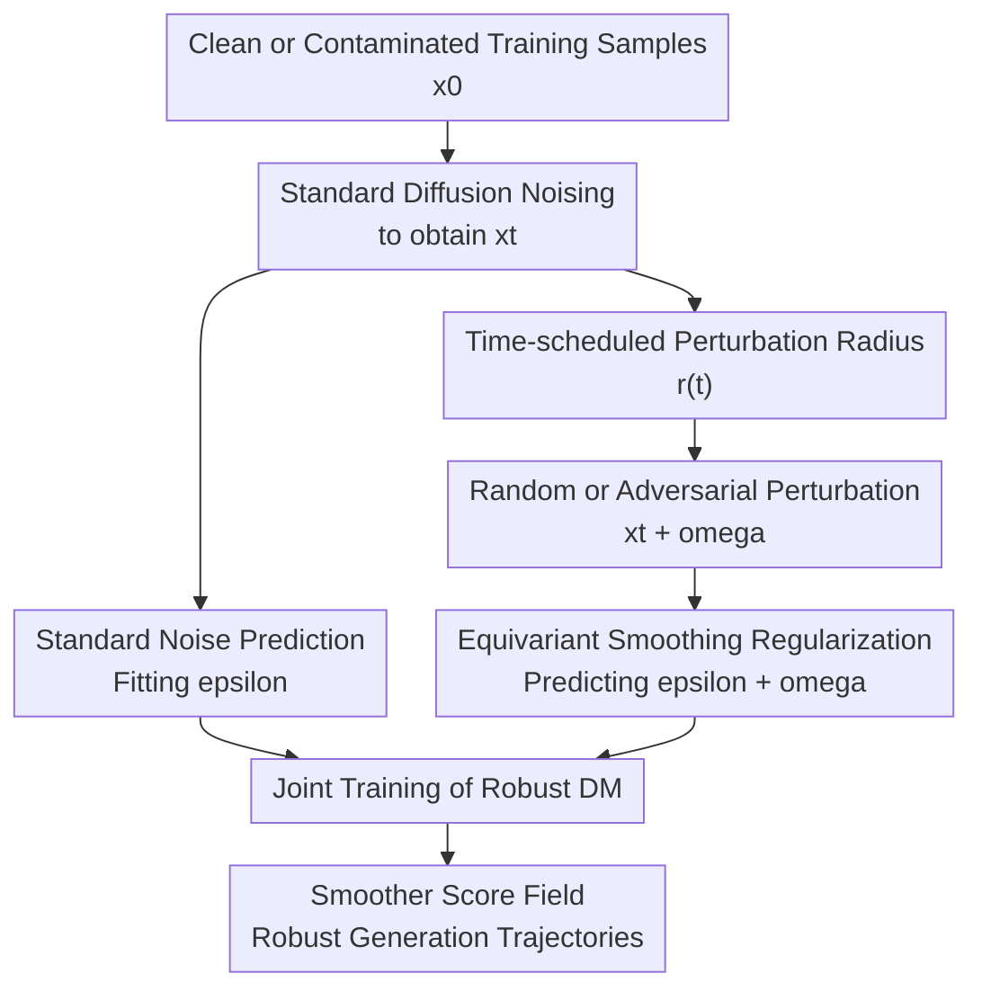

# Why Adversarially Train Diffusion Models?

**Conference**: ICLR 2026  
**OpenReview**: [https://openreview.net/forum?id=lL6htAaolp](https://openreview.net/forum?id=lL6htAaolp)  
**Paper**: [OpenReview](https://openreview.net/forum?id=lL6htAaolp)  
**Code**: https://github.com/OmnAI-Lab/Adversarial-Training-DM  
**Area**: Diffusion Models  
**Keywords**: Adversarial Training, Diffusion Models, Robust Generation, Data Contamination, Equivariant Regularization  

## TL;DR
This paper reformulates adversarial training from classifiers into an "equivariant smoothing" regularizer for diffusion models, enabling the denoising network to generate samples along cleaner and more stable score fields even when training data is highly contaminated or sampling trajectories are attacked.

## Background & Motivation
**Background**: Diffusion models typically learn data distributions through forward diffusion and reverse denoising. The training objective is to let the network predict the added noise $\epsilon$ from $x_t$, then step back to the data manifold along the reverse Markov chain. This paradigm is effective on clean data, but real-world large-scale training sets often contain slight inlier noise, severe outliers, missing/corrupted samples, or even intentionally constructed adversarial perturbations.

**Limitations of Prior Work**: Existing noise-aware diffusion training often requires knowledge of noise distributions, noise variance, or labels distinguishing clean from contaminated samples. These assumptions are reasonable in controlled experiments but fragile in real data pipelines: larger datasets make per-sample annotation of contamination types impossible, and complex contamination makes precise variance hard to determine a priori. Standard DDPM tends to memorize noise from the training set under these conditions, producing Gaussian artifacts, cluttered backgrounds, or outlier structures during generation.

**Key Challenge**: Adversarial training (AT) in classification pursues "invariance"—the output class remains unchanged for slight input changes. However, diffusion models are not classifiers; they perform regression-style denoising at every timestep. Directly requiring $\epsilon_\theta(x_t + \delta, t)$ to be identical to $\epsilon_\theta(x_t, t)$ forces the model to ignore extra perturbations in the input, leading to incorrect positions in the reverse step and eventually learning trajectories that deviate from the true data distribution.

**Goal**: The authors aim to answer a direct question: why and how should adversarial training be applied to diffusion models without undermining generative modeling. Specifically, the paper intends for diffusion models to resist training data noise without knowing contamination labels, intensity, or distributions, while reducing training sample memorization, improving robustness to sampling attacks, and preserving generation quality.

**Key Insight**: Starting from the denoising dynamics of score-based generative models, the paper interprets adversarial training as adding a "local perturbation state" near the diffusion trajectory. The key observation is that when facing $x_t + \omega$, the diffusion model should not output the exact same noise as for $x_t$; instead, it should incorporate this extra perturbation into the denoising prediction so that the reverse step still returns to the vicinity of the same clean trajectory.

**Core Idea**: Replace "invariance" used in classifier AT with "equivariance." By adding time-dependent random/adversarial perturbations during diffusion training and constraining $\epsilon_\theta(x_t+\omega,t)$ to be close to $\epsilon_\theta(x_t,t)+\omega$, the score field is smoothed, weakening the pull of contaminated samples on generative trajectories.

## Method

### Overall Architecture
The proposed method does not replace the DDPM architecture or train an auxiliary denoiser. Instead, it constructs a neighborhood-perturbed version of noisy samples at each timestep of regular diffusion training. The standard branch fits the original noise $\epsilon$ using $x_t$, while the robust branch pushes $x_t$ to $x_t+\omega$ and requires the model prediction to shift equivariantly with the perturbation. This ensures that reverse denoising does not deviate from the target data manifold due to local noise or attacks.

The framework can be understood as: first sampling $x_0, \epsilon, t$ as per standard DDPM to obtain $x_t$, then calculating a suitable perturbation radius $r_\theta(t)$ based on the timestep, generating random or adversarial perturbations within this radius, and finally training with a joint objective of standard denoising loss and equivariant smoothing regularization.

The primary contributions are the "time-scheduled perturbation radius," "random/adversarial perturbation," and "equivariant smoothing regularization." Standard diffusion noising and standard noise prediction serve as the DDPM scaffolding.

### Key Designs
**1. Equivariant Regularization: Diffusion models cannot copy classifier invariance**

Ideally, a classifier outputs the same category for an image and its micro-adversarial perturbation; thus, standard AT minimizes $f_\theta(x+\delta)-f_\theta(x)$. Directly applying this to diffusion models yields an invariance loss like $\|\epsilon_\theta(x_t+\omega,t)-\epsilon_\theta(x_t,t)\|_2^2$. Using 3D synthetic data and CIFAR-10, the paper demonstrates that this objective causes the model to erroneously ignore actual shifts in the input state, potentially leading to divergent trajectories and generated distributions deviating from $p_{data}$.

The authors correct this by changing "invariant output" to "equivariantly shifting output." In epsilon-prediction DDPM, $x_t$ is composed of $x_0$ and noise $\epsilon$. If an additional noise component $\omega$ is added, the model should predict $\epsilon+\omega$ at $x_t+\omega$. The complete training objective is:

$$
L_{AT}=\|\epsilon_\theta(x_t,t)-\epsilon\|_2^2+\lambda_t\|\epsilon_\theta(x_t+\omega,t)-[\epsilon_\theta(x_t,t)+\omega]\|_2^2.
$$

The first term ensures the model learns the data distribution, while the second term enforces local consistency of the score field near the same timestep. The intuition is clear: if a trajectory is pushed away, the model does not pretend nothing happened but learns to "subtract back" this extra offset.

**2. Time-scheduled Perturbation Radius: Perturbations must follow diffusion noise scales**

Diffusion training already involves continuous noising. Blindly overlaying adversarial perturbations can easily violate the Gaussian assumption of the Markov chain, causing over-smoothing or mode merging during the stage where content emerges. Consequently, the paper uses a radius tied to the timestep rather than a fixed one:

$$
x_{t+\omega}=\sqrt{\bar{\alpha}_t}x_0+\sqrt{1-\bar{\alpha}_t}(\epsilon+\omega),
$$

where $\omega$ is constrained within $[-r_\theta(t), r_\theta(t)]$. The radius roughly follows $\sqrt{1-\bar{\alpha}_t}$ and is controlled via an exponential parameter. Intuitively, larger perturbations are allowed in early high-noise stages as samples are close to noise; near $t=0$, where structure is formed, perturbations must shrink to avoid erasing real details.

**3. Random vs. Adversarial Perturbations: Regularization as randomized smoothing or AT**

The paper provides two sources of perturbation. First, random perturbation $\omega_{ran}$ sampled from a radius-constrained uniform distribution, which acts similarly to randomized smoothing with lower overhead but may miss sensitive local directions. Second, adversarial perturbation $\omega_{adv}$, which is randomly initialized and then updated via an FGSM step to maximize the prediction difference between $x_t$ and $x_t+\omega$:

$$
J_\theta(x_t,\omega,t)=\|\epsilon_\theta(x_t+\omega,t)-\epsilon_\theta(x_t,t)\|_2^2.
$$

The adversarial version is more expensive due to the extra backpropagation but shows significantly stronger denoising performance on CIFAR-10.

**4. Side Effects and Benefits of Trajectory Smoothing: Robustness is not a free lunch**

The direct effect of equivariant regularization is making the diffusion flow more concentrated and sharp. In low-dimensional visualizations, Robustadv trajectories are closer to the true data subspace with consistent score field directions. DDPM, conversely, is pulled away by inlier noise or outliers. Benefits of "tightening trajectories" include less noise propagation from contaminated data, more graceful degradation with fewer sampling steps, and sustained FID under intermediate timestep attacks.

However, it compresses data variability. On clean data, Robustadv may generate smoother images with weakened backgrounds and high-frequency details, resulting in worse FID than standard DDPM. The paper compares this to the clean vs. robust accuracy trade-off in classification: stronger regularization makes the model better at ignoring noise but more likely to erase real details.

### Loss & Training
During training, $x_0\sim D$, $\epsilon\sim\mathcal{N}(0,I)$, and timestep $t$ are sampled to produce $x_t$ via standard DDPM. Then, the perturbation radius is sampled to generate either random perturbations or $\omega_{adv}$ via FGSM random start to construct $x_{t+\omega}$. Parameters are updated via $L_{AT}$. 

Experiments use the Improved DDPM codebase on CIFAR-10, CelebA, LSUN Bedroom, and ImageNet. Main hyperparameters: perturbation curve index $\rho=2$, minimum bias $8/255$, global regularization strength $\lambda=0.3$. No extra modules or sampling complexity are added during inference. Training overhead for Robustadv is roughly $2.5\times$ standard DDPM.

## Key Experimental Results

### Main Results
The main experiments focus on "training with unknown contamination": 90% of the training set is corrupted with Gaussian noise, while FID is evaluated on clean data. Crucially, the method does not use clean/noisy labels or noise variance.

| Dataset | Noise Setting | Method | FID↓ | IS↑ |
|--------|----------|------|------|-----|
| CIFAR-10 | clean | DDPM | 7.20 | 8.95 |
| CIFAR-10 | clean | Robustadv | 28.68 | 7.04 |
| CIFAR-10 | 90%, $\sigma=0.1$ | DDPM | 58.05 | 6.93 |
| CIFAR-10 | 90%, $\sigma=0.1$ | Robustadv | 24.70 | 7.21 |
| CIFAR-10 | 90%, $\sigma=0.2$ | DDPM | 102.68 | 4.19 |
| CIFAR-10 | 90%, $\sigma=0.2$ | Robustadv | 24.81 | 7.07 |
| CelebA | 90%, $\sigma=0.2$ | DDPM | 96.03 | 2.65 |
| CelebA | 90%, $\sigma=0.2$ | Robustadv | 16.53 | 2.11 |

Note that in the clean setting, Robustadv's FID is worse, confirming it is not a universal quality booster but excels when training sets are heavily contaminated. On CIFAR-10 ($90\%, \sigma=0.2$), standard DDPM drops to 102.68 FID, while Robustadv remains at 24.81.

| Dataset / Setting | Baseline FID | Robustadv FID | Gain |
|---------------|--------------|---------------|------|
| ImageNet 64, 90%, $\sigma=0.1$ | 97.6 | 83.8 | 13.8 Improvement |
| ImageNet 64, 90%, $\sigma=0.2$ | 129.4 | 80.3 | 49.1 Improvement |
| CIFAR-10, DDPM 300 steps | 224.38 | 37.89 | More stable few-step sampling |

### Ablation Study
| Configuration | Key Metric | Explanation |
|------|----------|------|
| DDPM + invariance | CIFAR-10 clean FID 356.9 | Directly copying classifier AT severely damages generation |
| Robustran, 90%, $\sigma=0.1$ | FID 79.21 | Random perturbations provide some smoothing but insufficient denoising |
| Robustadv, 90%, $\sigma=0.1$ | FID 24.70 | Adversarial perturbations are significantly more effective |
| Fine-tune Robustadv | CelebA FID 25.8 | Adding regularization only in the last 100 epochs reduces cost |

### Key Findings
- Equivariance is more critical than invariance. Ignoring input perturbations causes reversal steps to land in wrong locations or learn contamination distributions.
- Robustadv yields the highest gains on contaminated data (CIFAR-10, CelebA) but sacrifices high-frequency details and variability on clean data.
- Trajectory smoothing provides secondary benefits: generated samples show lower DINOv2 similarity to training samples (fewer near-duplicates) and slower FID degradation under few-step sampling or attacks.
- Training cost is the main trade-off. Robustadv requires roughly $2.5\times$ training time due to adversarial gradient calculations.

## Highlights & Insights
- The transition from "discriminative invariance" to "generative equivariance" clarifies diffusion denoising geometry: if an input state is pushed, the predicted noise must reflect that shift.
- The paper unifies robust training, anti-memorization, and anti-attack properties under the concept of "smoothing diffusion trajectories."
- Low-dimensional experiments validate the "smoothed trajectory" geometric intuition via score fields and reconstruction errors rather than just reporting FID.
- Honest reporting of negative results (clean FID drop, over-smoothing) defines the method's positioning: it is suited for robust generation and contaminated training scenarios.

## Limitations & Future Work
- Training overhead is significant ($2.5\times$ complexity), which might be prohibitive for massive text-to-image or video models.
- Clean data FID degradation suggests the regularizer struggles to distinguish harmful contamination from real high-frequency details.
- Experiments are largely limited to U-Net DDPM/DDIM settings; performance on EDM or Latent Diffusion (Stable Diffusion) remains to be seen.
- While robust at $p=90\%$, behavior under $100\%$ contamination (no clean anchors) is undefined.

## Related Work & Insights
- **vs. Standard DDPM**: Standard models optimize noise prediction error and assume training data represents the true distribution; this work adds local geometric constraints.
- **vs. Classifier AT / TRADES**: Adapts the clean-robust trade-off from TRADES while changing the task objective to denoising equivariance.
- **vs. Ambient Diffusion**: Does not require knowledge of contamination forms or noise variance, making it more applicable to unknown real-world noise at the cost of potential over-smoothing.
- **vs. Consistency Models**: While both involve trajectories, consistency models focus on few-step sampling via distillation; this work focuses on local score smoothing for robustness.

## Rating
- Novelty: ⭐⭐⭐⭐⭐ (Repurposing AT for diffusion-specific equivariance is a clear, meaningful insight).
- Experimental Thoroughness: ⭐⭐⭐⭐ (Extensive across data types and attack scenarios, though latent diffusion is missing).
- Writing Quality: ⭐⭐⭐⭐ (Clear intuition and diagrams; technical notation is dense but consistent).
- Value: ⭐⭐⭐⭐⭐ (A strong foundation for future research in robust diffusion training and anti-memorization).

<!-- RELATED:START -->

## Related Papers

- [\[CVPR 2026\] The Drift Kernel: Why Diffusion Models Change Even When Told Not To](../../CVPR2026/image_generation/the_drift_kernel_why_diffusion_models_change_even_when_told_not_to.md)
- [\[NeurIPS 2025\] Why Diffusion Models Don't Memorize: The Role of Implicit Dynamical Regularization in Training](../../NeurIPS2025/image_generation/why_diffusion_models_dont_memorize_the_role_of_implicit_dynamical_regularization.md)
- [\[ICLR 2026\] D-AR: Diffusion via Autoregressive Models](d-ar_diffusion_via_autoregressive_models.md)
- [\[ICLR 2026\] Reconciling Visual Perception and Generation in Diffusion Models](reconciling_visual_perception_and_generation_in_diffusion_models.md)
- [\[ICLR 2026\] Secure Inference for Diffusion Models via Unconditional Scores](secure_inference_for_diffusion_models_via_unconditional_scores.md)

<!-- RELATED:END -->
