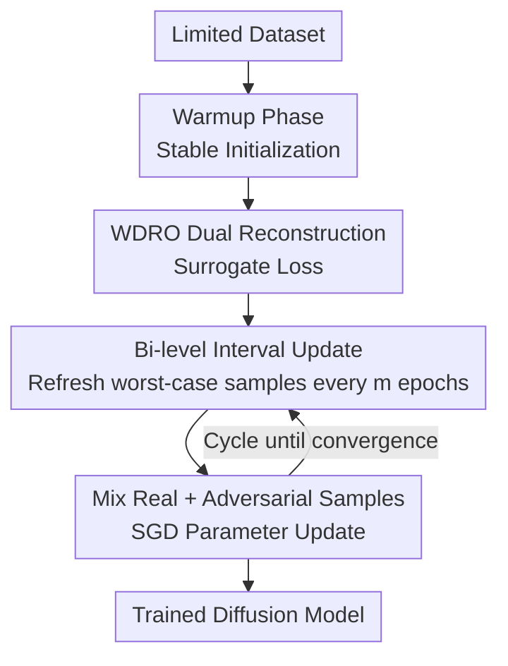

# WILD-Diffusion: A WDRO-inspired Training Method for Limited Data Diffusion Models

**Conference**: ICLR 2026  
**OpenReview**: [https://openreview.net/forum?id=OrCVuQAYzF](https://openreview.net/forum?id=OrCVuQAYzF)  
**Code**: Yes (The paper declares open source, github repo)  
**Area**: Diffusion Models  
**Keywords**: Limited data generation, Diffusion models, Distributionally Robust Optimization, WDRO, Overfitting mitigation

## TL;DR
This paper introduces Wasserstein Distributionally Robust Optimization (WDRO) into diffusion model training. By iteratively generating "worst-case" samples within a Wasserstein uncertainty set centered on the limited data distribution, the training support set is dynamically expanded. This approach reduces FID by more than 10% when using only 20% of the data and provides a plug-and-play training framework with convergence guarantees.

## Background & Motivation
**Background**: Diffusion models (DDPM, score-based SDE, etc.) have become the mainstream for image generation, surpassing GANs in tasks such as editing, inpainting, style transfer, and text-to-image generation. However, these impressive results are built upon a "nearly infinite supply of images"—diffusion models require massive amounts of data for stable training.

**Limitations of Prior Work**: Diffusion models degrade sharply when data is scarce. The authors provide experimental evidence: training a vanilla DDPM on FFHQ using only approximately 4% (2000 images) of the data causes the FID to soar from around 2.5 to approximately 30. Crucially, the FID curve exhibits a "U-shape" during training—decreasing then increasing. Smaller datasets result in earlier inflection points and higher final FIDs, which are typical signals of overfitting: the model memorizes individual training samples rather than learning the underlying distribution, leading to outputs that nearly replicate training data and a sharp drop in diversity.

**Key Challenge**: Mature anti-overfitting techniques from classification models cannot be directly transferred. (R1) Regularizations like L1/L2 are designed to optimize classification decision boundaries, whereas the goal of diffusion models is to characterize the entire data distribution; thus, regularization provides little help. (R2) Data augmentations like Cutout/Mixup/CutMix are static and rule-driven, unable to adaptively constrain distribution shifts. They may even push the training marginal distribution further from the true distribution, causing the model to learn and reproduce "outlier artifacts"—so-called "augmentation leakage."

**Goal**: To find a training paradigm that acts directly on the data distribution, adaptively expands the training support set, and does not deviate from the true distribution, allowing diffusion models to learn effectively even with only thousands or hundreds of images.

**Key Insight**: The authors note that WDRO possesses exactly these properties—it replaces empirical risk minimization with optimization of the worst-case distribution over a Wasserstein uncertainty set $U_\rho(p_{\text{data}}) = \{p : W_c(p, p_{\text{data}}) \le \rho\}$. This is essentially "adaptive support set expansion": ensuring the model performs well on a distribution neighborhood centered at the limited data distribution with a transport budget $\rho$, rather than fitting only a narrow $p_{\text{data}}$ support set.

**Core Idea**: Replace static augmentation with WDRO's "adaptive support set expansion" philosophy. Continuously generate worst-case samples near $p_{\text{data}}$ during training to dynamically expand the training set, pushing the support set of the limited data distribution closer to the true distribution and reducing the gap between them, thereby mitigating overfitting.

## Method

### Overall Architecture
WILD-Diffusion is a plug-and-play training framework: the input is a limited dataset, and the output is a trained diffusion model. It does not modify the model architecture but operates at the data distribution level—changing the standard diffusion training objective from empirical risk minimization on a limited distribution to a min–max optimization over a worst-case distribution within a Wasserstein uncertainty set (Eq. (2)). Since the inner supremum is infinite-dimensional and Wasserstein distance is computationally expensive, the process focuses on making it solvable.

Specifically, the framework uses strong duality to reconstruct the inner supremum into a computable form requiring only an additional surrogate loss (eliminating the uncertainty set). It then implements this via a "Bi-level Interval Update" strategy: a Warmup phase provides a stable initialization, followed by a loop where worst-case samples are refreshed every $m$ epochs through adversarial gradient ascent. These samples are mixed with real samples, and SGD updates the parameters on the mixed set; worst-case samples remain fixed between refreshes. The entire process is supported by convergence guarantees.

### Key Designs

**1. WDRO Dual Reconstruction: Compressing infinite-dimensional worst-case optimization into a computable surrogate loss**

Directly solving the inner supremum of Eq. (2), $\sup_{p \in U_\rho(p_{\text{data}})} \mathbb{E}_p[\ell(\theta; x, t)]$, presents two difficulties: the Wasserstein ball covers an entire family of probability distributions, making the inner maximization inherently infinite-dimensional; furthermore, computing the Wasserstein distance is expensive even as an approximation, which is particularly problematic for diffusion models. Using the strong duality theorem by Gao & Kleywegt, the authors rewrite the worst-case loss with an uncertainty set constraint into a dual form under a fixed penalty parameter $\gamma$:

$$L(\theta) = \sup_p \{\mathbb{E}_p[\ell(\theta; x, t)] - \gamma W_c(p, p_{\text{data}})\} = \mathbb{E}_{p_{\text{data}}}[\phi_\gamma(\theta; x, t)]$$

where the surrogate loss is $\phi_\gamma(\theta; x, t) := \sup_{x' \in X} \{\ell(\theta; x', t) - \gamma c(x', x)\}$, and the transport cost is $c(x, x') = \frac{1}{2}\|x - x'\|_2^2$. The elegance of this step is that the two problems share the same optimal value after duality, but the complex uncertainty set $U_\rho(p_{\text{data}})$ is completely eliminated. One only needs to add a surrogate term to the original diffusion loss $\ell$, transforming an infinite-dimensional constrained optimization into a per-sample finite-dimensional maximization in Euclidean space. The penalty parameter $\gamma$ acts as a "knob for support set expansion": it balances "fidelity to training data" and "robustness to distribution shift"—smaller $\gamma$ allows generated samples to be further from the original samples, making expansion more aggressive. Since $p_{\text{data}}$ is unknown, the empirical distribution $\hat{p}_n$ is used in practice.

**2. Bi-level Interval Update: Periodically generating worst-case samples via adversarial gradient ascent and alternating parameter updates**

After duality, the inner maximization must still be solved per-sample to obtain $x^*$ for calculating the surrogate gradient $\nabla_\theta \phi_\gamma(\theta; x, t) = \nabla_\theta \ell(\theta; x^*, t)$, where $x^* = \arg\max_{x'} \{\ell(\theta; x', t) - \gamma c(x', x)\}$. The authors observe that $x^*$ is formally an adversarial perturbation of $x$ under the current model $\theta$. Thus, they design a bi-level alternating update strategy inspired by adversarial training. Unlike standard adversarial training which generates samples within a fixed norm ball, this method imposes a "soft constraint" via the penalty term $\gamma$ to regulate distribution robustness at the support set level. The two-level updates are: (I) Parameter Update Layer—performing SGD on $\ell$ with the current training set to update $\theta$ every iteration; (II) Distribution (Sample) Update Layer—refreshing a batch of worst-case samples via gradient ascent every $m$ epochs and mixing them with real data to form an augmented training distribution. The samples remain fixed between refreshes. The iterative update rule for samples is:

$$x_i^k \leftarrow x_i^{k-1} + \zeta \nabla_x \{\ell(\theta; x_i^{k-1}, t) - \gamma c(x_i^{k-1}, x_i^0)\}$$

Starting from the real sample $x_i^0$, $K$ steps of iteration are performed to inject adversarial perturbations and obtain the worst-case variant $x_i^K$. This "interval update" schedule is designed to suppress both aforementioned costs—avoiding the need to solve expensive inner maximizations at every step by amortizing sample generation to once every $m$ epochs, thereby maintaining overall training efficiency while ensuring continuous support set expansion. Additionally, the framework performs Warmup for $S_w$ epochs (20% of total rounds in practice) only on limited data to obtain a good initialization before introducing worst-case samples, making the gradients used in Eq. (11) more informative. Since the entire strategy operates only on the data distribution without touching the model structure, it can be applied as a plug-and-play module to various baselines like Patch Diffusion or DeepCache.

**3. Convergence Guarantee: Establishing theoretical bounds for the mixture of min–max and diffusion processes**

WDRO is a notoriously difficult min–max problem to converge, and theoretical analysis becomes even more complex when overlaid with the diffusion process. Therefore, the authors provide a convergence proof to elevate WILD-Diffusion from "experimentally effective" to "theoretically supported." The key technical step is proving an upper bound for the worst-case objective (Lemma 3.5): Under Assumption 3.3, for any $\tau > 0$, with probability at least $1 - e^{-\tau}$, $\sup_{p:W_c(p, p_{\text{data}}) \le \rho} \mathbb{E}_p[\ell] \le \gamma\rho + \mathbb{E}_{\hat{p}_n}[\phi_\gamma] + O(\sqrt{\tau/n})$. Building on this, Theorem 3.6 characterizes convergence using Total Variation distance $D_{\text{TV}}$, proving that under appropriate time $T$ and step size $h$, the TV distance between the generated distribution $q_0$ and the limited data distribution $p_{\text{data}}$ is controlled by the sum of an "estimation error term $\varepsilon_\chi^2$ + sampling error term $D_{\text{ub}}$". Notably, as the robustness budget $\rho \to 0$ and sample size $n \to \infty$, this bound reduces to the result for standard diffusion models by Lee et al. (2022), indicating that the authors' guarantee generalizes existing conclusions to more complex distributionally robust settings.

### Loss & Training
The training target is the dualized $\mathbb{E}_{\hat{p}_n}[\phi_\gamma(\theta; x, t)]$, implemented as SGD on a mixed set of "real samples + adversarial samples": the parameter update step executes $\theta \leftarrow \theta - \eta \nabla_\theta \{\ell(\theta; x_i, t) + \ell(\theta; x_i', t)\}$. Key hyperparameters were determined via sensitivity analysis: inner iteration steps $K = 5$ (diminishing returns beyond this), sample update step size $\eta/\zeta = 0.01$ is optimal, penalty parameter $\gamma = 1$ is relatively stable and optimal, interval parameter $m = 20$ (compromise between efficiency and quality), and Warmup accounts for 20% of total rounds.

## Key Experimental Results

### Main Results
Evaluated on the EDM framework (integrated DDPM++, NCSN++, ADM) using CIFAR-10, FFHQ, CelebA-HQ, and LSUN-Church. FID is calculated with 50,000 generated samples relative to the full training set (lower is better). WILD-Diffusion acts as a plug-and-play module on various baselines:

| Dataset | Backbone | 20% Data | 50% Data | 100% Data |
|--------|----------|---------|---------|----------|
| CIFAR-10 | EDM-DDPM++ | 13.91 → **12.14** (-12.72%) | 6.62 → **6.02** (-9.08%) | 1.97 → **1.93** (-2.03%) |
| FFHQ | EDM-NCSN++ | 9.38 → **7.89** (-15.88%) | 5.04 → **4.60** (-8.73%) | 2.57 → **2.54** (-1.16%) |
| CelebA-HQ | EDM-DDPM++ | 11.86 → **10.22** (-13.83%) | 6.11 → **5.55** (-9.17%) | 3.73 → **3.63** (-2.68%) |
| CIFAR-10 | Patch Diffusion | 12.53 → **11.78** (-5.99%) | 6.42 → **6.07** (-5.45%) | 2.47 → **2.38** (-3.64%) |

Core finding: Gains increase as data decreases. Gain is 15.88% on FFHQ with 20% data but shrinks to 1.16% at 100% data—consistent with the motivation that limited data is more prone to overfitting. Performance also improved when overlaid with orthogonal methods like Patch Diffusion and DeepCache.

### Few-shot Generation
On 100-shot datasets (Obama / Grumpy Cat / Panda) and AnimalFace (Cat/Dog), consistent gains were observed regardless of pre-training:

| Method | Pre-train | Obama | Grumpy | Panda | Cat | Dog |
|------|--------|-------|--------|-------|-----|-----|
| LD-Diffusion | Yes | 13.00 | 13.31 | 4.70 | 12.77 | 12.48 |
| **WILD-Diffusion** | Yes | **12.54** | **12.83** | **4.66** | 12.93 | **12.21** |
| Patch Diffusion | No | 41.47 | 30.89 | 13.25 | 43.71 | 72.17 |
| **WILD-Diffusion** | No | **34.52** | **26.33** | **9.96** | **34.21** | **53.18** |

When training from scratch, FID on Obama dropped to 34.52 (at least 7% improvement over the best scratch baseline), reaching SOTA with only 100 images.

### Ablation Study

| Configuration | Comparison | Conclusion |
|------|---------|------|
| Divergence Replacement | KL / $\chi^2$ / $\alpha$-divergence | Wasserstein distance outperforms other DRO divergences (Fig. 11) |
| Augmentation Replacement | Mixup / CutMix / CutOut | WILD-Diffusion as a "theoretically-guaranteed augmentation" outperforms static ones (Table 8) |
| Interval $m$ | {5,10,20,…,100} | Larger $m$ translates to faster training but higher FID; $m=20$ is optimal |

### Key Findings
- Gains are inversely proportional to data volume; the most scarce scenarios yield the highest returns, directly confirming that "overfitting mitigation" is the core mechanism.
- Wasserstein distance is significantly better than KL/$\chi^2$/$\alpha$-divergence, suggesting that "constraining distribution shifts via transport costs" is more suitable for diffusion models than "constraining via density ratios."
- Interval parameter $m$ is the primary knob for the efficiency–quality trade-off. $K=5$ marks diminishing returns, and $\gamma=1$ is stable.

## Highlights & Insights
- Shifts "anti-overfitting" from the model/loss level (regularization) and static rule level (e.g., Mixup) to the distribution level. WDRO's adaptive support set expansion directly addresses the pain point of "static augmentations causing augmentation leakage."
- The strong duality reconstruction is a masterstroke: it collapses an infinite-dimensional uncertainty set into a single surrogate loss and reveals that worst-case samples $x^*$ are essentially adversarial perturbations.
- "Interval updates (refreshing samples every $m$ epochs)" is a practical trick to amortize expensive inner maximization; it can be transferred to other paradigms requiring periodic generation of hard samples.

## Limitations & Future Work
- Generating worst-case samples requires $K$-step gradient ascent per sample every $m$ epochs, incurring additional computational overhead; the balance between efficiency and quality requires manual tuning.
- Convergence guarantees rely on strong assumptions (log-Sobolev inequality, Lipschitz, bounded score error), which may not hold for real data.
- Experiments focus on unconditional/class-conditional low-to-medium resolution and few-shot 256×256; verification on large-scale text-to-image tasks is absent.
- In extreme few-shot scenarios, it remains to be analyzed whether the generated worst-case samples introduce new biases.

## Related Work & Insights
- **vs. Static Data Augmentation (Mixup/CutMix/CutOut)**: These have fixed rules and cannot adaptively constrain distribution shifts. WILD-Diffusion generates samples within a Wasserstein ball, staying close to the true distribution.
- **vs. Fine-tuning/Transfer Learning (DreamBooth, FreezeD, etc.)**: These rely heavily on source-target similarity and large-scale pre-training. WILD-Diffusion achieves SOTA from scratch.
- **vs. DRO in Diffusion (Wang et al. 2025a)**: That work uses DRO to address training-sampling distribution mismatch, while WILD-Diffusion focuses on limited data generation.
- **vs. Lee et al. (2022) Convergence Analysis**: This paper generalizes those results to distributionally robust settings.

## Rating
- Novelty: ⭐⭐⭐⭐⭐ First to systematically introduce WDRO's adaptive support set expansion into limited data diffusion training with convergence proofs.
- Experimental Thoroughness: ⭐⭐⭐⭐ Covers multiple backbones, datasets, limited and few-shot settings, though large-scale conditional generation is missing.
- Writing Quality: ⭐⭐⭐⭐ Clear logic chain from motivation to algorithm to theory.
- Value: ⭐⭐⭐⭐⭐ Plug-and-play, focuses on data distribution; highly attractive for reaching SOTA with only 100 images.

<!-- RELATED:START -->

## Related Papers

- [\[ICLR 2026\] Direct Reward Fine-Tuning on Poses for Single Image to 3D Human in the Wild](direct_reward_fine-tuning_on_poses_for_single_image_to_3d_human_in_the_wild.md)
- [\[ECCV 2024\] WildVidFit: Video Virtual Try-On in the Wild via Image-Based Controlled Diffusion Models](../../ECCV2024/image_generation/wildvidfit_video_virtual_try-on_in_the_wild_via_image-based_controlled_diffusion.md)
- [\[ECCV 2024\] RPBG: Towards Robust Neural Point-based Graphics in the Wild](../../ECCV2024/image_generation/rpbg_towards_robust_neural_point-based_graphics_in_the_wild.md)
- [\[ICCV 2025\] ImageGem: In-the-wild Generative Image Interaction Dataset for Generative Model Personalization](../../ICCV2025/image_generation/imagegem_in-the-wild_generative_image_interaction_dataset_for_generative_model_p.md)
- [\[ICML 2026\] OmniAID: Decoupling Semantic and Artifacts for Universal AI-Generated Image Detection in the Wild](../../ICML2026/image_generation/omniaid_decoupling_semantic_and_artifacts_for_universal_ai-generated_image_detec.md)

<!-- RELATED:END -->
