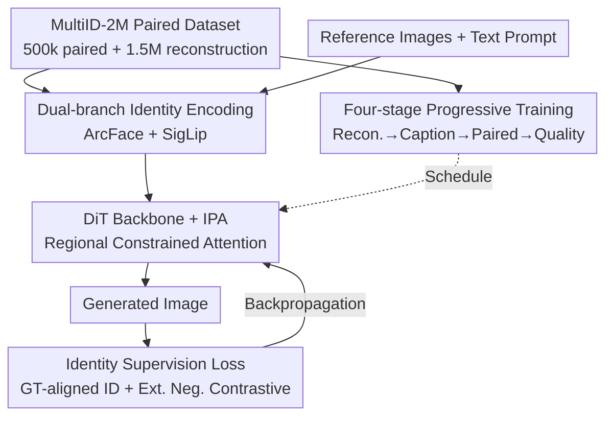

# WithAnyone: Toward Controllable and ID Consistent Image Generation

**Conference**: ICLR 2026  
**OpenReview**: [https://openreview.net/forum?id=xFo13SaHQm](https://openreview.net/forum?id=xFo13SaHQm)  
**Code**: https://doby-xu.github.io/WithAnyone/ (Available)  
**Area**: Diffusion Models / Identity-Consistent Generation  
**Keywords**: Identity Customization, Copy-paste Artifacts, Paired Dataset, Contrastive Learning, FLUX

## TL;DR
To address the "copy-paste" artifact where models directly overlay reference faces onto outputs in identity-customized generation, this paper constructs MultiID-2M, a paired multi-person dataset of 500,000 images, and proposes MultiID-Bench, a benchmark capable of quantifying copy-paste. By utilizing paired training and an ID contrastive loss with extended negative samples, the authors develop WithAnyone (based on FLUX). It achieves the lowest copy-paste score in its class while maintaining the highest SimGT, effectively breaking the "more accurate similarity leads to more severe copying" trade-off.

## Background & Motivation

**Background**: Identity-consistent text-to-image generation has progressed rapidly, moving from IP-Adapter and InstantID to PuLID and UMO. Models can now synthesize portraits highly similar to a given individual, with state-of-the-art work pushing similarity to near-perfect replication. The mainstream approach involves injecting ArcFace or CLIP embeddings of reference faces into the diffusion backbone via cross-attention or adapters.

**Limitations of Prior Work**: The authors observe a widely overlooked phenomenon: in real photos, the facial similarity of the same person fluctuates significantly due to natural variations in pose, expression, makeup, and lighting (Figure 2 shows the median SimRef of real image pairs is around 0.46). However, many generative models "fit" the reference image far beyond this natural range. This manifests as models failing to make a neutral reference face "smile" or change head pose and gaze even when prompted. The authors formally name this failure mode **copy-paste artifacts**—the model is not "flexibly synthesizing after understanding identity" but is directly copying the reference image into the output.

**Key Challenge**: The root cause of copy-paste lies in the data. Robust identity conditioning for "same person, different poses/expressions" requires multiple reference images per identity. However, most facial datasets lack such pairs. Consequently, existing methods default to **single-person reconstruction training** (where reference and target are the same image). Reconstruction targets naturally encourage "copying," leading to models that act like stickers. Worse, the evaluation metric SimRef (similarity to the reference image) reinforces this behavior, as direct replication maximizes SimRef even when prompts explicitly require changes in pose or expression.

**Goal**: (1) Construct a large-scale multi-person dataset with paired references; (2) Establish a benchmark that quantifies copy-paste without rewarding "copying"; (3) Design a training paradigm that extracts "identity rather than pixels" from paired data.

**Key Insight**: Use the Ground Truth (GT) instead of the reference image as the anchor for identity supervision. Combine this with paired training—where a different image of the same identity is randomly selected from a reference gallery as the target—and an ID contrastive loss pulling thousands of negative samples to force the model to rely on high-level identity embeddings and abandon low-level copying.

## Method

### Overall Architecture

WithAnyone is built on the FLUX DiT architecture. It takes 1–4 reference faces and a text prompt as input and outputs a multi-person image that matches the prompt scene while maintaining each individual's identity. The pipeline consists of four components: **Data** (MultiID-2M providing "same person, different image" paired supervision), **Architecture** (dual-branch encoding for each reference face + regional constrained attention to bind face embeddings to specific areas), **Identity Supervision** (GT-aligned ID loss + extended negative contrastive loss optimized alongside diffusion loss), and **Training Schedule** (four stages progressing from pure reconstruction to controllable identity-conditioned synthesis). All four components target the same goal: making the model learn "who this person is" rather than "copying this face."

### Key Designs

**1. MultiID-2M Paired Dataset: Eliminating the root of copy-paste**

Since copy-paste stems from reconstruction training where reference and target are the same, the authors block this shortcut at the data level. MultiID-2M is constructed via a four-stage pipeline: ① Collecting single-person images from the web and clustering them by ArcFace embeddings to build a clean "reference gallery" (~3k identities, ~1M images, avg. 400/person); ② Scenewise retrieval (e.g., "Name + 2/3 actors") + negative keywords to fetch multi-person photos and detect faces; ③ Matching faces in group photos with single-person cluster centers using cosine similarity (threshold 0.4) to pair them; ④ Filtering and labeling via Recognize Anything, aesthetic scoring, OCR for watermark removal, and LLM-generated captions. The result is ~500k paired multi-person images and ~1.5M unlabeled images, covering ~25k identities. The key is that each identity has hundreds of reference images with varying poses/expressions, allowing the model to sample "another image of the same person" as the target.

**2. Dual-branch ID Encoding + Regional Constrained Attention: Precise ID and localized influence**

Each reference face passes through two branches: a face recognition network (ArcFace) for highly discriminative identity embeddings, and a general image encoder (SigLip) for complementary mid-level features. These features are injected into the DiT via IP-Adapter-style cross-attention. A critical constraint is applied: each face embedding is only permitted to attend to image tokens within its corresponding face region. This prevents identity "leaking" or blending between different people in multi-person scenes, ensuring each face manages its own area.

**3. Dual Identity Supervision Losses: Shifting the anchor to GT and pushing identities apart**

To break the trade-off, two identity-specific losses are added to the diffusion flow matching loss $L_{diff}$. First, the **GT-aligned ID loss** addresses the unreliability of performing landmark detection on noisy generated images. Instead of detecting landmarks on the generation, the authors use **landmarks from the GT** to align the generated image, then minimize the cosine distance between their ArcFace embeddings:

$$L_{ID} = 1 - \cos(g, t),$$

where $g$ and $t$ are ArcFace embeddings of the generation and GT, respectively. This allows the loss to function across **all noise levels** with near-zero overhead. Second, the **Extended Negative ID Contrastive Loss** uses InfoNCE to aggregate generated images with their references while pushing away other identities:

$$L_{CL} = -\log \frac{\exp(\cos(g, t)/\tau)}{\sum_{j=1}^{M}\exp(\cos(g, n_j)/\tau)},$$

where $n_j$ are negative samples from different identities. Leveraging the identity-labeled gallery, the model can sample **thousands** of negatives (expanded to 4096 in practice), providing a much stronger discriminative signal than in-batch negatives. The total loss is $L = L_{diff} + \lambda_{ID}L_{ID} + \lambda_{CL}L_{CL}$, with weights set to 0.1.

**4. Four-stage Progressive Training: From reconstruction to controllable synthesis**

A four-stage schedule is used to transition from "reconstruction" to "controllable identity synthesis." Stage 1 (~20k steps): Reconstruction pre-training with dummy prompts to establish identity pathways. Stage 2 (~40k steps): Reconstruction with real captions to align identity with text. Stage 3 **Paired Fine-tuning**: 50% of samples are replaced with paired instances—randomly sampling one image as input and a different image of the same person as the target. This "perturbation" breaks the copy-paste shortcut. Stage 4 Quality Fine-tuning: Refinement on high-quality subsets and stylized variants to improve texture, lighting, and style transfer.

### Loss & Training
Total objective: $L = L_{diff} + 0.1\,L_{ID} + 0.1\,L_{CL}$. The quantitative metric for copy-paste (used for benchmarking, not training), MCP, is defined as the normalized difference in angular distance: $M_{CP}(g\mid t,r) = \dfrac{\theta_{gt}-\theta_{gr}}{\max(\theta_{tr},\varepsilon)} \in [-1,1]$, where $\theta_{ab}=\arccos(\mathrm{Sim}(a,b))$. $M_{CP}=1$ indicates the generation perfectly matches the reference $r$ (complete copy-paste), while $-1$ indicates it perfectly matches the GT $t$. MultiID-Bench uses **SimGT** (similarity to GT, not reference) as the primary metric.

## Key Experimental Results

Baselines include generic models (OmniGen/OmniGen2, Qwen-Image-Edit, etc.) and face customization models (UniPortrait, PuLID, InstantID). MultiID-Bench includes 435 test cases with identities not overlapping with the training set.

### Main Results

On the single-person subset (MultiID-Bench), WithAnyone maintains high SimGT while reducing copy-paste (CP) to the lowest level among face-customization models:

| Method | SimGT ↑ | SimRef ↑ | CP ↓ | CLIP-I ↑ | Aes ↑ |
|------|---------|----------|------|----------|-------|
| InstantID | 0.464 | 0.734 | 0.337 | 0.764 | 5.255 |
| UMO | 0.458 | 0.732 | 0.359 | 0.783 | 4.850 |
| PuLID | 0.452 | 0.705 | 0.315 | 0.779 | 4.839 |
| UniPortrait | 0.447 | 0.677 | 0.265 | 0.793 | 5.018 |
| **WithAnyone** | **0.460** | 0.578 | **0.144** | **0.798** | 4.783 |

Observation: InstantID and UMO achieve slightly higher SimGT by inflating SimRef (0.73), but their CP scores are high (0.34–0.36). WithAnyone’s SimRef is only 0.58, yet it achieves a comparable SimGT of 0.460 with a CP of only 0.144. This indicates its similarity comes from synthesis rather than replication.

### Ablation Study

| Configuration | SimGT ↑ | SimRef ↑ | CP ↓ | Description |
|------|---------|----------|------|------|
| **Full Setting** | 0.405 | 0.551 | 0.161 | Full model |
| w/o Phase 3 | 0.406 | 0.625 | 0.239 | No paired FT: SimRef spikes and CP increases significantly. |
| w/o GT-Align | 0.385 | 0.549 | 0.175 | No GT-alignment: SimGT drops by 0.02. |
| w/o Ext. Neg. | 0.368 | 0.455 | 0.074 | Negatives reduced to 63: Identity learning weakens significantly. |
| FFHQ only | 0.224 | 0.246 | 0.027 | FFHQ only: Fails to learn identity effectively. |

### Key Findings
- **Paired fine-tuning (Phase 3) is crucial for suppressing copy-paste**: Removing it causes SimRef to jump from 0.55 to 0.625 and CP from 0.16 to 0.24, while SimGT remains almost unchanged.
- **Extended negatives contribute the most to SimGT**: Reducing negatives from 4096 to 63 drops SimGT significantly, proving the discriminative signal from large-scale negatives is the primary driver for identity fidelity.
- **Data quality determines the upper bound**: Training on FFHQ alone yields poor results, confirming that the paired multi-person dataset itself is a core contribution.

## Highlights & Insights
- **Exposing the flaws in existing metrics**: The paper argues that SimRef implicitly rewards copy-paste. The design of SimGT + MCP deconstructs "resemblance" and "copying," a general insight applicable beyond this specific model.
- **GT-aligned ID loss as an efficient solution**: Using GT landmarks to align generated images bypasses the difficulty of detecting face points on noisy tensors, making the ID loss available at all diffusion stages with zero additional cost.
- **Scaling negatives via paired galleries**: By using a paired reference gallery, the model scales negative samples to 4096, a signal unavailable in traditional single-person reconstruction datasets.

## Limitations & Future Work
- Data depends heavily on publicly known figures and CC licenses; generalization to private individuals and mitigation of deepfake risks require further exploration.
- A tension between copy-paste and identity fidelity persists; WithAnyone significantly mitigates this trade-off but does not entirely eliminate it.
- Performance under extreme camera angles or occlusion remains to be verified.

## Related Work & Insights
- **vs PuLID / InstantID**: These also inject ArcFace/CLIP embeddings into DiT but rely on single-person reconstruction, leading to high CP scores (0.31–0.34). WithAnyone maintains SimGT while suppressing SimRef to avoid replication.
- **vs UMO / XVerse**: These methods concatenate VAE face embeddings, which are low-level and prone to pixel-level copying. WithAnyone uses dual-branch ID encoding and regional attention to isolate identity and spatial attribution.
- **vs PortraitBooth**: PortraitBooth limits ID loss to early stages ($t<0.25$); WithAnyone enables supervision across all noise levels via GT alignment.

## Rating
- Novelty: ⭐⭐⭐⭐⭐ Formalizes copy-paste as a failure mode and systemically addresses the trade-off via paired data, GT anchors, and extended negatives.
- Experimental Thoroughness: ⭐⭐⭐⭐⭐ Comprehensive testing across multiple benchmarks, four sets of ablations, and human studies.
- Writing Quality: ⭐⭐⭐⭐ Clear motivation and metric design; some architectural details are moved to the appendix.
- Value: ⭐⭐⭐⭐⭐ The dataset, benchmark, and model are open-sourced, serving as infrastructure for identity-customized generation.

<!-- RELATED:START -->

## Related Papers

- [\[ICLR 2026\] Consistent Text-to-Image Generation via Scene De-Contextualization](consistent_text-to-image_generation_via_scene_de-contextualization.md)
- [\[CVPR 2025\] Consistent and Controllable Image Animation with Motion Diffusion Models](../../CVPR2025/image_generation/consistent_and_controllable_image_animation_with_motion_diffusion_models.md)
- [\[ICLR 2026\] OmniText: A Training-Free Generalist for Controllable Text-Image Manipulation](omnitext_a_training-free_generalist_for_controllable_text-image_manipulation.md)
- [\[ICLR 2026\] Any-step Generation via N-th Order Recursive Consistent Velocity Field Estimation](any-step_generation_via_n-th_order_recursive_consistent_velocity_field_estimatio.md)
- [\[ICLR 2026\] Many-for-Many: Unify the Training of Multiple Video and Image Generation and Manipulation Tasks](many-for-many_unify_the_training_of_multiple_video_and_image_generation_and_mani.md)

<!-- RELATED:END -->
