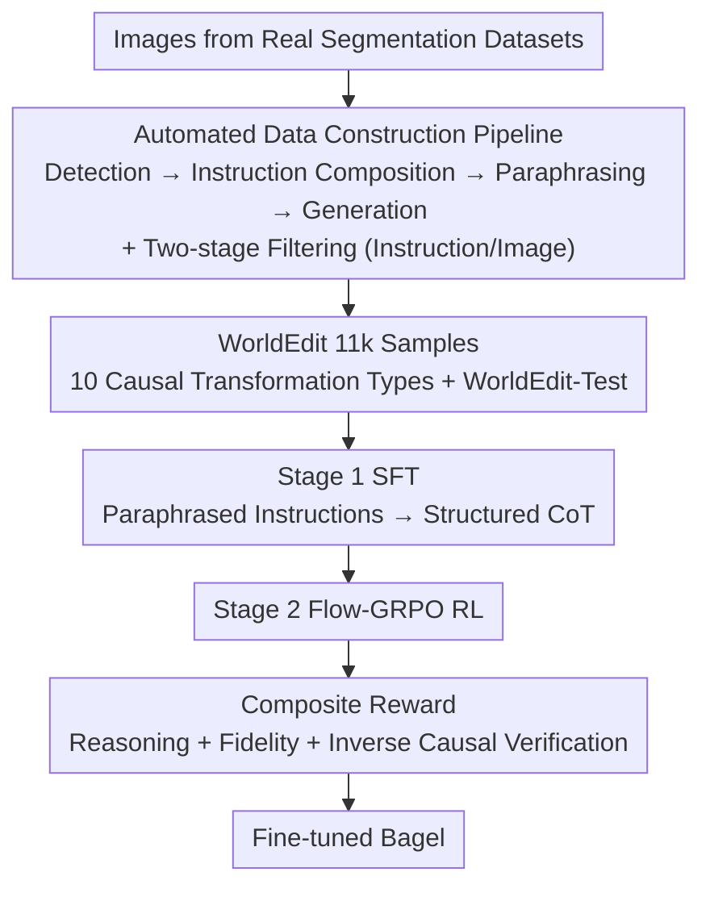

# WorldEdit: Towards Open-World Image Editing with a Knowledge-Informed Benchmark

**Conference**: ICLR 2026  
**Paper**: [OpenReview / Project Page](https://arxiv.org/abs/2026.worldedit) (Note: No arXiv ID in cache, refer to project page)  
**Code**: Available on Project Page  
**Area**: Diffusion Models / Image Editing / Multimodal VLM  
**Keywords**: Open-world editing, Implicit instructions, Causal reasoning, Dataset and benchmark, Reinforcement learning rewards

## TL;DR
Addressing implicit editing instructions that provide causes without results (e.g., "throw a ball at a cactus"), this paper constructs WorldEdit, an 11k high-quality dataset emphasizing real-world causal transformations, along with the WorldEdit-Test benchmark. By employing a two-stage fine-tuning of Bagel via "CoT Supervised Fine-Tuning + Flow-GRPO Reinforcement Learning (including inverse causal verification reward)," the authors elevate open-source causal editing performance to levels near GPT-4o and Nano-Banana.

## Background & Motivation

**Background**: Image editing models have become robust at "explicit instructions"—tasks like attribute modification, style transfer, and pose synthesis. As long as the instruction clearly states "what to become," diffusion models and unified multimodal models perform well.

**Limitations of Prior Work**: However, many real-world instructions are "implicit"—describing only the **cause** of change, not the **result**. For example, in "a water balloon hits a cactus," the model must infer the splash trajectory and the cactus's reaction. The paper finds that even if implicit instructions are paraphrased into explicit prompts using LLMs, most models still perform poorly. This is because implicit results are often complex and require accurate world knowledge (physics, object interaction logic) to render. Furthermore, certain visual expressions, such as the single-sided structure of a Mobius strip or the scattered configuration of collapsing blocks, are inherently difficult for pre-trained models to generate.

**Key Challenge**: The authors attribute the root cause to the **"input-dependency"** of editing instructions. Traditional explicit instructions (e.g., "remove object") have low correlation with input image content—the logic of change is consistent regardless of context. In contrast, world-knowledge-driven implicit instructions are **highly input-contingent**: the same action "smash into a cactus" yields vastly different results depending on the ball's material (deformation and reaction vary by mass, elasticity, and surface). This strong coupling of "instruction-input-result" places significantly higher demands on generalization than traditional tasks.

**Goal**: (1) Provide data that can be used for **training** world-knowledge editing rather than just evaluation; (2) Enable unified models to utilize the causal logic latent in their pre-training for editing tasks. Existing efforts like AnyEdit are large but dominated by explicit instructions, while others like KRIS-Bench and RISEBench only provide limited-scale benchmarks and cannot be used for training.

**Key Insight**: Unified models (capable of both understanding and generation) have implicitly captured causal logic and visual relationships during large-scale pre-training. What is missing is specific data to "activate" the transfer of this world knowledge to the editing process. Thus, the authors focus on both data construction and designing rewards to make causal alignment explicit.

**Core Idea**: Develop an automated pipeline to generate 11k editing samples consistent with **real-world causal logic**, followed by two-stage fine-tuning (CoT supervision + RL with inverse causal verification reward) to "force" the unified model's world knowledge into the editing results.

## Method

### Overall Architecture
WorldEdit functions as both a **dataset/benchmark** and a **training framework**. The framework consists of two parts: an **automated data construction pipeline**—starting from real segmented images through "open-world detection → instruction composition → LLM visual description paraphrasing → GPT-4o image generation," with two-stage filtering; and **two-stage fine-tuning** on Bagel—first SFT with CoT-stylized instructions, then Flow-GRPO RL guided by reasoning, fidelity, and inverse causal verification rewards.

### Key Designs

**1. Task Definition for Open-World Causal Editing: Incorporating Natural Changes**

Existing editing benchmarks focus heavily on semantic operations (count, spatial position) and logical reasoning (mazes, Sudoku). **Data simulating physical causal transformations is systematically undervalued**. This paper defines 10 types across two categories: **Environment-driven transformations** (Time, Temperature, Humidity, Acidity, Light) and **Mechanics-driven transformations** (Break, Inflate, Squeeze, Twist, Stretch). This taxonomy determines the coverage and evaluation metrics of the dataset.

**2. Automated Data Construction Pipeline: Four-step Generation + Two-stage Filtering**

The difficulty in generating world-knowledge data lies in maintaining causal logic while ensuring visual consistency and quality. The pipeline follows four steps: ① **Open-world detection**: Extracting object names and base descriptions from real images (e.g., "a rusted bollard"); ② **Instruction collection**: Combining detected objects with 10 transformation types to generate "what if" questions, **pre-filtering** irrational combinations (e.g., "bollard + inflate" is removed); ③ **Paraphrasing**: Using LLMs to map causal changes to detailed **visual descriptions**, filtering out errors or weak visual changes; ④ **Image generation**: Using GPT-4o to generate edited images, employing **decomposition + multi-step editing** for complex cases, and **post-filtering** for visual consistency and editing accuracy. For rare types like "magnetic field lines," synthetic data is added for diversity.

**3. Two-stage Training: CoT SFT for Understanding, RL for Alignment**

Stage 1 (**SFT**) converts paraphrased instructions into structured Chain-of-Thought (CoT) sequences. The causal language modeling objective is applied to **both text and image tokens**, teaching the model to interpret implicit commands and map them to visual modifications. Stage 2 uses **Flow-GRPO** RL to refine generation behavior using a composite reward. This "SFT base + RL alignment" strategy addresses the issue where SFT models might mimic behavior but lack stable causal consistency.

**4. Composite Reward and Inverse Causal Verification: Explicit Testing via Effect-to-Cause**

The composite reward is defined as:
$$R = R_{\text{reason}} + R_{\text{fidelity}} + R_{\text{causal}}$$
- **Reasoning Reward $R_{\text{reason}}$**: Evaluates CoT text coherence and causal correctness.
- **Fidelity Reward $R_{\text{fidelity}}$**: Multi-modal scoring of "instruction following + visual consistency," optimizing for **minimal invasiveness** to preserve image quality.
- **Causal Verification Reward $R_{\text{causal}}$ (Inversion-based)**: A multi-modal model **infers the "cause/transformation" by comparing input and output images**, then calculates the similarity between this inferred cause and the original instruction. This checks if the result is **causally explainable**; if the model understands the underlying physics, the original cause should be inferable from the result.

### Loss & Training
- SFT Stage: Causal language modeling objective covering both text and image tokens.
- RL Stage: Flow-GRPO algorithm optimizing the composite reward $R$.
- Baseline Model: Bagel.

## Key Experimental Results

Evaluation follows KRIS-Bench protocols using Qwen-VL-Max as a scorer across four metrics (Scale 1–5): **VC** (Visual Consistency), **VQ** (Visual Quality), **IF** (Instruction Following), and **KP** (Knowledge Plausibility).

### Main Results (WorldEdit-Test, Overall Average)

| Model | Type | Overall Avg |
|------|------|------|
| GPT-4o | Proprietary | **4.36** |
| Nano-Banana | Proprietary | 4.22 |
| SeedEdit-3.0 | Proprietary | 4.21 |
| **Ours (Fine-tuned Bagel)** | Open-source | **4.07** |
| Bagel-Think | Open-source | 3.35 |
| Flux-Kontext | Open-source | 3.21 |
| Bagel (Original) | Open-source | 2.76 |
| Omnigen | Open-source | 2.52 |

Ours achieves SOTA (4.07) among open-source models, a Gain of +1.31 over original Bagel, significantly narrowing the gap with GPT-4o, particularly in Knowledge Plausibility (KP).

### Ablation Study (Overall Score)

| Configuration | Overall | Note |
|------|---------|------|
| Ours (Full) | 4.07 | All three rewards |
| w/o Fidelity Reward | 3.85 | Gain -0.22, visual quality drops |
| w/o Causal Reward | 3.91 | Gain -0.16, causal accuracy drops |
| w/o Reasoning Reward | 3.94 | Gain -0.13, reasoning consistency drops |

### Key Findings
- **Fidelity reward is the top contributor**: Essential for visually acceptable edits.
- **Causal verification is more critical than CoT text**: Inversion-based verification (0.16 vs 0.13) better ensures that the model "truly understands" causality.
- Ours excels in strong physical interactions (stretch, squeeze, break), such as the natural rebound of a spring or the coherent fragmentation of a cliff.

## Highlights & Insights
- **Turning "causal understanding" into an optimizable signal**: The inversion-based reward doesn't ask "is the image right?", but "can we infer the cause?". This is a valuable paradigm for any generation task where the process is hard to evaluate but the result is reversible.
- **"Input-dependency" diagnosis**: A sharp conceptual capture of why traditional editing models fail at world knowledge tasks.
- **Dual filtering for data quality**: Ensuring causal validity at both the instruction and image generation stages.

## Limitations & Future Work
- **Reliance on closed-source models**: Data generation (GPT-4o) and evaluation (Qwen-VL-Max) rely on proprietary models, potentially inheriting their biases.
- **Distribution imbalance**: The "Break" category is much larger than "Twist," leading to a long-tail distribution issue.
- **Performance Gap**: While SOTA for open-source, it still trails GPT-4o due to the base model's (Bagel) generation upper bound.

## Related Work & Insights
- **vs AnyEdit / InstructPix2Pix**: These emphasize scale or diversity but lack explicit reasoning and world knowledge structures.
- **vs KRIS-Bench / RISE-Bench**: These provide benchmarks but lacked training data for physical world transformations.
- **vs Unified Models**: While models like Emu3 or Show-o have strong semantic understanding, they fail at implicit causal instructions until "activated" by data like WorldEdit.

## Rating
- Novelty: ⭐⭐⭐⭐ (Inversion-based reward and input-dependency framework are significant).
- Experimental Thoroughness: ⭐⭐⭐⭐ (Comprehensive comparison across 13 models and 10 categories).
- Writing Quality: ⭐⭐⭐⭐ (Clear diagnosis of the core problem).
- Value: ⭐⭐⭐⭐ (Provides critical training data for world knowledge editing).

<!-- RELATED:START -->

<!-- RELATED:END -->

## Related Papers

- [\[ICML 2026\] WISE: A World Knowledge-Informed Semantic Evaluation for Text-to-Image Generation](../../ICML2026/image_generation/wise_a_world_knowledge-informed_semantic_evaluation_for_text-to-image_generation.md)
- [\[ICLR 2026\] ImagenWorld: Stress-Testing Image Generation Models with Explainable Human Evaluation on Open-ended Real-World Tasks](imagenworld_stress-testing_image_generation_models_with_explainable_human_evalua.md)
- [\[ICLR 2026\] ChronoEdit: Towards Temporal Reasoning for In-Context Image Editing and World Simulation](chronoedit_towards_temporal_reasoning_for_in-context_image_editing_and_world_sim.md)
- [\[CVPR 2026\] WiseEdit: Benchmarking Cognition- and Creativity-Informed Image Editing](../../CVPR2026/image_generation/wiseedit_benchmarking_cognition-_and_creativity-informed_image_editing.md)
- [\[ICLR 2026\] Verification of the Implicit World Model in a Generative Model via Adversarial Sequences](verification_of_the_implicit_world_model_in_a_generative_model_via_adversarial_s.md)

<!-- RELATED:END -->
