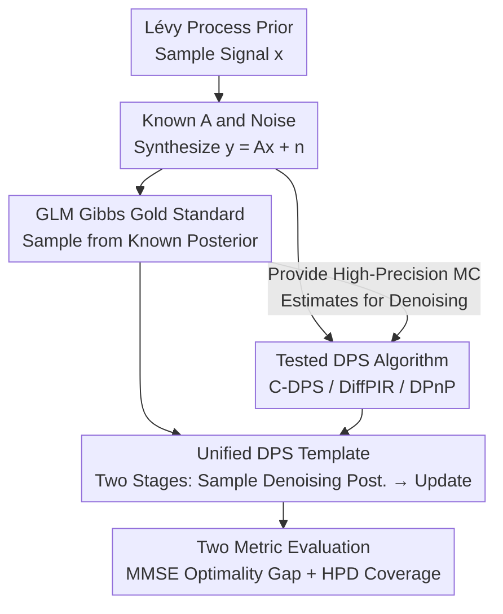

# A Statistical Benchmark for Diffusion-Posterior-Sampling Algorithms

**Conference**: ICLR2026  
**OpenReview**: [https://openreview.net/forum?id=zDI2G8t0of](https://openreview.net/forum?id=zDI2G8t0of)  
**Code**: https://github.com/zacmar/dps-benchmark  
**Area**: Diffusion Models / Image Restoration / Bayesian Inverse Problems / Benchmark  
**Keywords**: Diffusion Posterior Sampling, Linear Inverse Problems, Gibbs Sampling, Posterior Calibration, MMSE Optimality

## TL;DR
This paper establishes a "standard ruler" for Diffusion Posterior Sampling (DPS) algorithms: by utilizing Lévy process signals—which allow for exact Gibbs sampling—as the test distribution, it obtains "gold standard" posterior samples at the distribution level. The authors systematically evaluate mainstream DPS algorithms (C-DPS / DiffPIR / DPnP) across four types of inverse problems (denoising, deconvolution, inpainting, and partial Fourier reconstruction) using MMSE optimality gap and posterior coverage metrics. The conclusion reveals that these algorithms are generally **not calibrated**.

## Background & Motivation
**Background**: Due to their ability to characterize complex distributions, diffusion models are widely used as priors for Bayesian inverse problems. Given measurements $y = Ax + n$, the goal is to sample from the posterior $p_{X|Y=y}$ for signal reconstruction $x$. This class of methods, termed DPS (diffusion-posterior-sampling), has achieved SOTA or near-SOTA performance in scenarios such as MRI/CT reconstruction, deblurring, weather artifact removal, protein design, and financial time series denoising.

**Limitations of Prior Work**: Diffusion priors naturally lack a mechanism to inject measurement information into the sampling process. While the relationship between $Y$ and $X_0$ is known in the forward process, it is difficult to characterize the relationship between $Y$ and $X_t$ at any given time. Consequently, various algorithms rely on approximations of the likelihood score $\nabla \log p_{Y|X_t}$. The problem is: **how to judge whether these approximations are effective?** Currently, evaluation relies either on downstream perceptual metrics (SSIM, FID, LPIPS), which have been noted by Pierret & Galerne and Cardoso as unsuitable for measuring the statistical quality of "posterior sampling," or on extremeley simplified synthetic settings using Gaussian Mixture Models (GMMs). However, GMMs are light-tailed and fail to replicate the power-law heavy tails found in real asset returns or natural image statistics.

**Key Challenge**: Evaluating a posterior sampling algorithm fundamentally requires a **known ground-truth posterior** for comparison. In real-world scenarios, the posterior is intractable, while exactly solvable synthetic scenarios (like GMMs) are too simple and tend to **systematically overestimate** posterior quality, masking the flaws of actual algorithms. In high-risk domains like medical imaging or finance, overestimating reconstruction certainty can lead to costly decision errors.

**Goal**: To create a "realistic yet exactly solvable" statistical benchmark where test signals possess realistic statistical properties (e.g., heavy tails) while their posteriors allow for gold-standard sampling, thereby **decoupling** algorithmic errors from learning component errors.

**Key Insight**: The authors focus on **discretized Lévy processes**. These signals are driven by i.i.d. increments, and their priors can be written in product form over increments: $p_X(x) = \prod_k p_U([Dx]_k)$. Increment distributions can be Gaussian, Laplace, Student-t, or Bernoulli-Laplace; the latter three are naturally heavy-tailed or sparse, making them far more realistic than GMMs. Crucially, while these posteriors are non-conjugate and lack closed-form solutions, **efficient Gibbs samplers exist** to provide exact (gold-standard) samples.

**Core Idea**: Use "exactly solvable Lévy process posteriors via Gibbs sampling" as the gold standard for direct **distribution-level** comparisons of DPS algorithms. Furthermore, by embedding the same Gibbs method into reverse diffusion to sample the "denoising posterior," one can provide arbitrary-precision Monte Carlo estimates for the required quantities (MMSE denoiser and its Jacobian), enabling the decoupling of algorithmic approximation errors from learning errors.

## Method

### Overall Architecture
The benchmark logic operates as follows: First, a test signal $x$ is synthesized from a **known distribution** (sampled from a Lévy process prior). A measurement $y = Ax + n$ is simulated using a known forward operator $A$ and known noise. In this setup, both components of the posterior $p_{X|Y=y} \propto \exp(-\frac{1}{2\sigma_n^2}\|Ax-y\|^2)\,p_X(x)$ (likelihood and prior) are known. Evaluation then proceeds along two paths: one uses an **efficient Gibbs method** to draw "gold standard" samples from the posterior; the other runs the DPS algorithm under test on the same $(y, A)$ to produce its own posterior samples. Finally, the two sets of samples are compared at the **distribution level** using two specific metrics: MMSE optimality gap and Highest Posterior Density (HPD) coverage.

A key feature of this framework is that the Gibbs method can sample not only the "original inverse problem posterior" but also the **denoising posterior** $p_{X_0|X_t=x_t}$ for every step in reverse diffusion. This allows all quantities typically approximated by neural networks in DPS algorithms (the MMSE denoiser $\mathbb{E}[X_0|X_t]$ and its Jacobian) to be replaced by high-precision Monte Carlo estimates, isolating the approximation error of the algorithm itself.

### Key Designs

**1. Lévy Process Test Signals: Replacing GMMs with Solvable Heavy-Tailed Priors**

The core issue is that synthetic evaluations must have a "known truth," but GMM priors are too light-tailed and overestimate posterior quality. The authors utilize discretized Lévy processes: the signal $x$ is determined by i.i.d. increments $u = Dx$ (where $D$ is a finite difference matrix). The prior is expressed as $p_X(x) = \prod_{k=1}^d p_U([Dx]_k)$. Increment distributions $p_U$ include Gaussian, Laplace, Student-t, and Bernoulli-Laplace (spike-and-slab). The latter three exhibit sparsity or heavy tails, replicating power-law extremes found in asset returns and natural images. This prior is both realistic and well-structured, fitting the Gibbs framework for exact sampling.

**2. GLM Gibbs Gold Standard Sampler: Obtaining Exact Samples for Non-Conjugate Posteriors**

The posterior $p_{X|Y=y}(x) \propto \exp(-\frac{1}{2\sigma_n^2}\|Ax-y\|^2)\prod_k p_U([Dx]_k)$ is **non-conjugate** when $p_U$ is non-Gaussian. The authors utilize the fact that Laplace and Student-t distributions can be represented as **infinite Gaussian mixtures** using latent variables, fitting them into a Gaussian Latent Machine (GLM). The posterior is rewritten as $p(x) \propto \prod_{k=1}^{m+d} \phi_k([Kx]_k)$, where $K = [A; D]$. Gibbs sampling then alternates between $X|Z=z$ (which is Gaussian) and $Z|X=x$ (independent 1D samplings). For Bernoulli-Laplace, the authors optimized the algorithm with custom CUDA/Triton kernels and Woodbury updates, achieving a **74.61×** speedup, making it feasible to embed Gibbs sampling within the diffusion loop.

**3. Unified DPS Template: Abstracting Algorithms into a Two-Stage Framework**

DPS update rules vary significantly. To enable fair comparison, the authors abstract DPS iterations into a unified template: Given the current iteration $x_t$, (i) sample $S$ samples $\{\bar{x}_k\}$ from the denoising posterior $p_{X_0|X_t=x_t}$; (ii) use an update operator $\mathcal{S}$ combined with $x_t$, these samples, $y$, $A$, and parameters $\lambda$ to calculate $x_{t-1}$. Any statistical quantity required by the algorithm (e.g., MMSE mean or Jacobian) is calculated from these $S$ samples. By integrating Gibbs samples here, the learning component can be **completely replaced** with MC estimates to isolate errors.

**4. Two Statistical Metrics: MMSE Optimality Gap + HPD Coverage**

The benchmark uses two complementary metrics. The **MMSE Optimality Gap** (in dB, lower is better, 0 is perfect) is defined as $10\log_{10}\big(\|\hat{x}_{\text{est}}(y)-x\|^2 / \|\hat{x}^{\text{Gibbs}}_{\text{MMSE}}(y)-x\|^2\big)$, measuring how far the algorithm is from the theoretical optimal point estimate. The **HPD Coverage** measures the proportion of times the true signal $x$ falls within the highest posterior density region defined by the algorithm's samples. For a **calibrated** sampler at level $\alpha$, the coverage should approximately equal $\alpha$; lower values indicate samples are too concentrated around the mode (underestimating uncertainty).

### Loss & Training
The paper does not propose training a new model; it is a benchmark. Denoisiers for the learning-based DPS versions are trained offline. Hyperparameters $\lambda$ (including $\ell_1/\ell_2$ model baselines and DPS internal parameters) are **grid-searched specifically for each algorithm, distribution, and operator** on a validation set. 

## Key Experimental Results

Experiments use $d=64$ dimensional signals across four tasks: denoising, deconvolution, inpainting, and partial Fourier reconstruction. Baselines include $\ell_1/\ell_2$ MAP estimation and three DPS algorithms (C-DPS, DiffPIR, DPnP).

### Main Results

MMSE Optimality Gap (dB, lower is better; bold denotes best DPS). Selection of results:

| Task | Method | Gauss(0,0.25) | Laplace(1) | BL(0.1,1) | St(1) |
|------|------|------|------|------|------|
| Denoising | C-DPS | 0.12 | 0.12 | 2.22 | 3.26 |
| Denoising | **DiffPIR** | 0.16 | 0.09 | **0.72** | **0.93** |
| Denoising | DPnP | 0.24 | 0.11 | 1.33 | 1.19 |
| Denoising | $\ell_2$ Baseline | 0.00 | 0.16 | 8.61 | 3.25 |
| Deconv. | C-DPS | 0.12 | 0.12 | 4.30 | 18.30 |
| Deconv. | **DiffPIR** | 0.07 | 0.07 | **1.09** | **10.45** |
| Deconv. | DPnP | 0.10 | 0.13 | 1.71 | 7.84 |
| Deconv. | $\ell_2$ Baseline | 0.00 | 0.07 | 6.11 | 21.50 |

Findings: The $\ell_2$ baseline is perfect (0.00) under Gaussian increments, **validating the benchmark's correctness**. DiffPIR generally performs best among DPS algorithms, outperforming model baselines in complex scenarios (BL and Student-t).

### Key Findings
- **DPnP Benefits from Denoiser Quality**: Replacing learning components with gold-standard MC estimates significantly improves DPnP, suggesting it leverages improved denoising posteriors effectively. C-DPS and DiffPIR are more sensitive to hyperparameter coupling.
- **Tension between Point Estimates and Sample Quality**: Posterior samples retain high-frequency structure, while MMSE estimates are smoother. This explains why DPS scores high on perceptual metrics but is often outperformed by regression-based methods on distortion metrics (PSNR).
- **Ubiquitous Lack of Calibration**: HPD coverage for DPS algorithms is almost always much lower than $\alpha$, indicating that samples are overly concentrated and underestimate uncertainty—a critical warning for high-risk applications.

## Highlights & Insights
- **"Solvable yet Realistic Priors"**: Using Lévy processes satisfies the dual requirements of being realistic (heavy-tailed) and allowing exact Gibbs sampling, which GMMs fail to provide.
- **Error Decoupling Paradigm**: The approach of isolating "algorithmic error" from "learning error" through MC estimates is a modular paradigm applicable to various hybrid learning methods beyond DPS.
- **Unified DPS Template**: The two-stage abstraction provides a valuable framework for understanding the internal mechanics of disparate DPS methods.
- **Calibration as a Target**: The quantitative proof that current DPS methods are uncalibrated sets a clear future research goal for the community.

## Limitations & Future Work
- **Dimensionality**: Experiments are limited to $d=64$ 1D signals. Scaling the Gibbs sampler to high-dimensional 2D images remains a challenge.
- **Linear Models**: The framework currently focuses on linear operators and Gaussian noise. Extending exact sampling to non-linear measurement models is an open problem.
- **Algorithm Coverage**: Only three DPS algorithms were evaluated, although they represent the major categories of approximations used in the field.

## Related Work & Insights
- **vs. GMM Evaluations**: Unlike prior work using light-tailed GMMs, this work uses heavy-tailed Lévy processes to provide a more rigorous test of posterior statistics.
- **vs. Coverage Tests**: While others have noted under-calibration, this work uses a known ground-truth prior and posterior, making the coverage results statistically definitive.
- **vs. Analytical Approaches**: Rather than deriving bounds for Gaussian cases, this work utilizes numerical gold standards to cover a wider range of non-conjugate priors.

## Rating
- Novelty: ⭐⭐⭐⭐⭐ 
- Experimental Thoroughness: ⭐⭐⭐⭐ 
- Writing Quality: ⭐⭐⭐⭐⭐ 
- Value: ⭐⭐⭐⭐⭐ 

<!-- RELATED:START -->

## Related Papers

- [\[ICLR 2026\] CL-DPS: A Contrastive Learning Approach to Blind Nonlinear Inverse Problem Solving via Diffusion Posterior Sampling](cl-dps_a_contrastive_learning_approach_to_blind_nonlinear_inverse_problem_solvin.md)
- [\[ICLR 2026\] LearnIR: Learnable Posterior Sampling for Real-World Image Restoration](learnir_learnable_posterior_sampling_for_real-world_image_restoration.md)
- [\[ICML 2026\] Triadic Dynamics Aware Diffusion Posterior Sampling for Inverse Problems: Optimizing Guidance and Stochasticity Schedules](../../ICML2026/image_restoration/triadic_dynamics_aware_diffusion_posterior_sampling_for_inverse_problems_optimiz.md)
- [\[ICLR 2026\] Adaptive Moments are Surprisingly Effective for Plug-and-Play Diffusion Sampling](adaptive_moments_are_surprisingly_effective_for_plug-and-play_diffusion_sampling.md)
- [\[ICLR 2026\] Noise-Adaptive Diffusion Sampling for Inverse Problems Without Task-Specific Tuning](noise-adaptive_diffusion_sampling_for_inverse_problems_without_task-specific_tun.md)

<!-- RELATED:END -->
