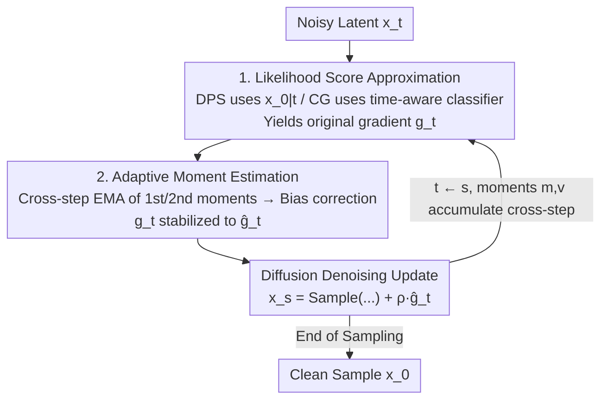

# Adaptive Moments are Surprisingly Effective for Plug-and-Play Diffusion Sampling

**Conference**: ICLR2026  
**OpenReview**: [https://openreview.net/forum?id=qYDObsHldZ](https://openreview.net/forum?id=qYDObsHldZ)  
**Code**: https://github.com/christianbelardi/adam-guidance  
**Area**: Diffusion Models / Image Restoration  
**Keywords**: Plug-and-play guidance, diffusion sampling, likelihood score, Adam, inverse problems

## TL;DR
The Adam adaptive moment estimation from standard optimizers is directly applied to the guidance gradients of diffusion sampling. By maintaining the exponential moving average (EMA) of the first and second moments of likelihood score estimates across sampling steps, the noisy gradients of plug-and-play methods like DPS and CG are stabilized at almost zero extra cost. This approach outperforms several more complex and slower methods in image restoration (super-resolution, deblurring, inpainting) and class-conditional generation.

## Background & Motivation
**Background**: Plug-and-play (PnP) conditional generation in diffusion models refers to using an unconditional diffusion model trained only on the marginal distribution $p(x)$ to sample from a conditional distribution $p(x \mid y)$ (where $y$ can be a low-resolution image, blur kernel, classification label, etc.) without retraining for specific tasks. The mathematical framework is Bayesian decomposition: posterior score = prior score + likelihood score,

$$\nabla_{x_t}\log p(x_t\mid y) = \nabla_{x_t}\log p(x_t) + \nabla_{x_t}\log p(y\mid x_t).$$

The prior score is directly provided by the diffusion network $\epsilon_\theta$, while the difficulty lies entirely in the likelihood score $\nabla_{x_t}\log p(y\mid x_t)$.

**Limitations of Prior Work**: The likelihood score requires integrating over all clean samples $x_0$ that could generate $x_t$, i.e., $p(y\mid x_t)=\int p(y\mid x_0)\,p(x_0\mid x_t)\,dx_0$, which is generally intractable and must be approximated. DPS replaces the integral with a point estimate $x_{0\mid t}$ from the denoising network, while CG trains a time-aware classifier to process noisy latents directly. Regardless of the approximation, the estimated likelihood scores are **extremely noisy**—due to limited conditional information and the need to backpropagate gradients through large networks.

**Key Challenge**: Previous literature (DPS → UGD → TFG) has focused on "how to approximate the single-step likelihood score more accurately," leading to increasing complexity with components like Monte Carlo smoothing, dual gradients in data/latent space, and recursive timestep revisited. However, these complex methods collapse when conditional signals weaken (e.g., $16\times$ SR instead of $4\times$), sometimes even performing worse than the simple DPS. A fundamental issue was ignored: the noise is not just about single-step accuracy, but **contradictory guidance directions across steps**. Empirical tests in this paper show that the cosine similarity of guidance gradients between adjacent steps in DPS is negative for most of the process.

**Goal**: Instead of refining single-step approximations, Ours asks an orthogonal question: **Can information from earlier sampling steps be used to cancel out approximation errors in subsequent steps?**

**Key Insight**: This is exactly what Adam/RMSProp solve in stochastic optimization. Stochastic gradients are noisy and jittery; Adam uses the first moment (momentum) to smooth the trajectory and the second moment (adaptive learning rate) to scale updates by historical variance. Since step-by-step guidance updates in diffusion sampling are essentially gradient descent on the likelihood term (see formula below), it is natural to apply Adam directly.

**Core Idea**: Treat the likelihood score estimate as a "stochastic gradient to be optimized" and apply Adam-style adaptive moment estimation across sampling steps. This simultaneously suppresses noise and preserves guidance signals. It is simple enough for a few lines of code yet surprisingly effective.

## Method

### Overall Architecture
Each step of plug-and-play sampling essentially replaces the prior score with the "prior + likelihood" posterior score in the standard annealed Langevin denoising update. Approximating the prior score with $s_\theta$ and the likelihood score with the DPS or CG approximation $-\nabla\mathcal{L}(\cdot)$, the sampling update is written as:

$$x_s = x_t + (\sigma_t^2-\sigma_s^2)\big[s_\theta(x_t,t) - \nabla\mathcal{L}(\cdot)\big] + \sqrt{\sigma_t^2-\sigma_s^2}\,\tfrac{\sigma_s}{\sigma_t}\,\epsilon.$$

The term $-\nabla\mathcal{L}(\cdot)$ in the brackets represents the "likelihood gradient." The entire step corresponds to performing one step of gradient descent on the likelihood objective at each timestep. This is where Adam intervenes. The modification in Ours is minimal: after calculating the original likelihood gradient $g_t=-\nabla\mathcal{L}(\cdot)$ and before updating the sample, an "adaptive moment estimation" module is inserted to stabilize $g_t$ into $\hat g_t$. The rest of the sampling process remains unchanged. When applied to DPS, it is called **AdamDPS**, and for CG, it is **AdamCG**.

### Key Designs

**1. Adaptive Moment Estimation Across Sampling Steps: Adam as a Stabilizer**

This addresses the noise and directional inconsistency in likelihood score estimation. Following Adam, indexing steps by $k$, the likelihood gradient $g_t=-\nabla\mathcal{L}(\cdot)$ and its element-wise square are maintained as EMAs:

$$m_k = \beta_1 m_{k-1} + (1-\beta_1)g_t,\qquad v_k = \beta_2 v_{k-1} + (1-\beta_2)g_t^2,$$

followed by bias correction $\hat m_k = m_k/(1-\beta_1^k)$ and $\hat v_k = v_k/(1-\beta_2^k)$. The stabilized gradient is:

$$\hat g_t = \frac{\hat m_k}{\sqrt{\hat v_k}+\delta}.$$

The two moments serve distinct roles: the first moment $\hat m_k$ (momentum) aggregates gradient information across steps to smooth out random vibrations, ensuring consistent guidance. The second moment $\hat v_k$ adaptively scales the step size based on historical variance—reducing updates for coordinates that jitter significantly and increasing them for stable ones. This is crucial for diffusion because the scale of the likelihood score changes drastically across noise levels $\sigma_t$; the second moment provides natural step-wise and coordinate-wise normalization. The paper provides direct evidence: while DPS gradients often show negative cosine similarity between adjacent steps, AdamDPS maintains positive similarity throughout, leading to coherent updates.

**2. AdamDPS and AdamCG: Agnostic Integration**

DPS uses the denoising point estimate $x_{0\mid t}=x_t-\sigma_t\epsilon_\theta(x_t,t)$ to approximate the likelihood score as $-\nabla_{x_t}\mathcal{L}(f_\phi(x_{0\mid t}),y)$. Here, $f_\phi$ can be any differentiable function (classifier or analytical operator). CG trains a time-aware classifier $f_\phi(x_t,t)$ to calculate $-\nabla_{x_t}\mathcal{L}(f_\phi(x_t,t),y)$.

Both algorithms insert the moment estimation between "gradient calculation" and "sample update." AdamDPS adds $\rho\hat g_t$ directly to the denoised sample ($x_s=\text{Sample}(x_{0\mid t},x_t,t,s)+\rho\hat g_t$). AdamCG, since it acts on latents, adds $\rho\hat g_t\sigma_t^2$ to the denoising estimate before sampling ($x_s=\text{Sample}(x_{0\mid t}+\rho\hat g_t\sigma_t^2,\,x_t,t,s)$). This proves the stabilizer is a model-agnostic, lightweight plugin.

**3. Task Difficulty as an Evaluation Dimension**

This is a methodological insight rather than an algorithm component. Ours argues that existing PnP evaluations focus too much on "mild degradation" (e.g., $4\times$ SR), which masks the fragility of complex methods. This paper systematically increases difficulty ($4\times \to 16\times$ SR, blur sigma $3 \to 12$) and uses the relative gain over DPS as a metric. Findings show that while complex methods like TFG might win in easy settings, they fall below DPS in high-difficulty tasks. AdamDPS remains consistently superior to DPS across all difficulties.

### Loss & Training
The method **requires no training**—it only modifies the guidance gradient during inference. The diffusion networks and guidance models are pre-trained. The only new hyperparameters are Adam parameters ($\beta_1, \beta_2, \delta$). All baselines (including Ours) were tuned using Bayesian Optimization on 32 held-out images, targeting LPIPS for reconstruction and CMMD for class-conditional generation.

## Key Experimental Results

### Main Results
Datasets: ImageNet, CIFAR-10, Cats. Reconstruction tasks: $16\times$ SR, Gaussian deblurring (sigma 12), 90% random mask inpainting. Comparison against LGD, MPGD, RED-diff, DPS, UGD, TFG.

| Task | Metric | Ours (AdamDPS/AdamCG) | Prev. SOTA | Description |
|------|------|------|----------|------|
| Reconstruction (ImageNet/Cats) | LPIPS + FID | Best across all | DPS (often 2nd) | Complex methods degrade in hard tasks; DPS is robustly 2nd. |
| CIFAR-10 Class-Cond. | Accuracy | **+9.86 points** over DPS | DPS | — |
| ImageNet Class-Cond. (Std Classifier) | Top-10 Acc | **10.49%** | ≈1% (Random) | All methods except AdamDPS fail (near random). |
| ImageNet Class-Cond. (Time-aware) | Accuracy | **+19+ points** over CG | CG | AdamCG vs CG comparison. |

### Ablation Study

| Configuration | Key Findings | Description |
|------|---------|------|
| AdamDPS (Full) | Best performance | Both moments included. |
| $\beta_1=0$ (No momentum) | Drop in performance | Directional inconsistency without momentum. |
| $\beta_2=0$ (No scaling) | Drop in performance | Step size mismatch across noise levels without second moment. |
| Step count (12/25/50/100) | Beats DPS at all budgets | TFG is only competitive at very low step counts. |
| Wall clock (H100, 100 steps) | Zero overhead over DPS | Much faster than TFG (which scales with recursion depth). |

### Key Findings
- **Both moments are essential**: Removing either momentum or adaptive scaling hurts performance, though their relative importance varies by task (e.g., inpainting favors momentum, SR favors scaling).
- **Directional consistency is key**: Adjacent DPS gradients are often contradictory (negative cosine similarity); AdamDPS maintain positive similarity.
- **Low terminal loss $\neq$ Good reconstruction**: In $16\times$ SR, TFG minimizes guidance loss the most but has the worst reconstruction due to artifacts; "over-optimization" is harmful when conditional information is scarce.
- **Hard tasks reveal the truth**: In extremely difficult settings like ImageNet class-guidance with standard classifiers, only AdamDPS can successfully reduce the loss and achieve non-random accuracy.

## Highlights & Insights
- **Transferring mature optimizers to sampling**: By recognizing that "step-wise guidance = gradient descent on likelihood," the paper migrates Adam's noise suppression to inference. This lightweight transfer outperforms complex, specially designed frameworks.
- **Valuable diagnostic approach**: Using cosine similarity of adjacent gradients to quantify "guidance contradiction" provides empirical evidence for *why* it works, beyond just reporting accuracy.
- **Critique of Evaluation Methodology**: Mild degradation settings systematically overestimate complex methods. Scanning across difficulty levels exposes robustness more accurately.

## Limitations & Future Work
- The performance ceiling is still **constrained by the base approximation** (DPS/CG). It stabilizes existing approximations but doesn't fix structural biases in the scores themselves.
- $\beta_1, \beta_2$ require per-task tuning (done via Bayesian optimization in the paper). A self-adapting or tuning-free setting is missing.
- The cross-step accumulation assumes likelihood gradients are cumulative across sampling steps; this assumption may be challenged in unconventional noise schedules or latent/data space switching.
- Experiments focus on image inverse problems and class-cond; verification on high-dimensional structured conditions like text-to-image is still needed.

## Related Work & Insights
- **vs DPS**: DPS approximates scores but guides cada step independently. Ours adds Adam stabilization to its gradients, solving the "self-contradictory" direction problem at zero cost.
- **vs CG**: AdamCG provides a significantly higher accuracy (+19 pts) by applying the same stabilizer to classifier guidance.
- **vs UGD / TFG**: These follow a complex route (combining more components + recursive steps). Ours shows that complexity is not necessary; a single lightweight stabilizer is more robust and faster.
- **vs LGD / MPGD**: While these use Monte Carlo smoothing or data-space projection to stabilize DPS, Ours focuses on the temporal dimension (cross-step moments) rather than single-step smoothing.

## Rating
- Novelty: ⭐⭐⭐⭐ Simple idea but orthogonal and well-justified.
- Experimental Thoroughness: ⭐⭐⭐⭐⭐ Comprehensive tasks, difficulty scaling, diagnostics, and hyperparameter analysis.
- Writing Quality: ⭐⭐⭐⭐⭐ Clear motivation-mechanism-evidence loop.
- Value: ⭐⭐⭐⭐ Plug-and-play, zero-cost enhancement for existing guidance methods.

<!-- RELATED:START -->

## Related Papers

- [\[ICLR 2026\] Taming Score-Based Denoisers in ADMM: A Convergent Plug-and-Play Framework](taming_score-based_denoisers_in_admm_a_convergent_plug-and-play_framework.md)
- [\[CVPR 2026\] PnP-CM: Consistency Models as Plug-and-Play Priors for Inverse Problems](../../CVPR2026/image_restoration/pnp-cm_consistency_models_as_plug-and-play_priors_for_inverse_problems.md)
- [\[ICLR 2026\] A Statistical Benchmark for Diffusion-Posterior-Sampling Algorithms](a_statistical_benchmark_for_diffusion-posterior-sampling_algorithms.md)
- [\[ECCV 2024\] BrushNet: A Plug-and-Play Image Inpainting Model with Decomposed Dual-Branch Diffusion](../../ECCV2024/image_restoration/brushnet_a_plug-and-play_image_inpainting_model_with_decomposed_dual-branch_diff.md)
- [\[ICLR 2026\] CL-DPS: A Contrastive Learning Approach to Blind Nonlinear Inverse Problem Solving via Diffusion Posterior Sampling](cl-dps_a_contrastive_learning_approach_to_blind_nonlinear_inverse_problem_solvin.md)

<!-- RELATED:END -->
