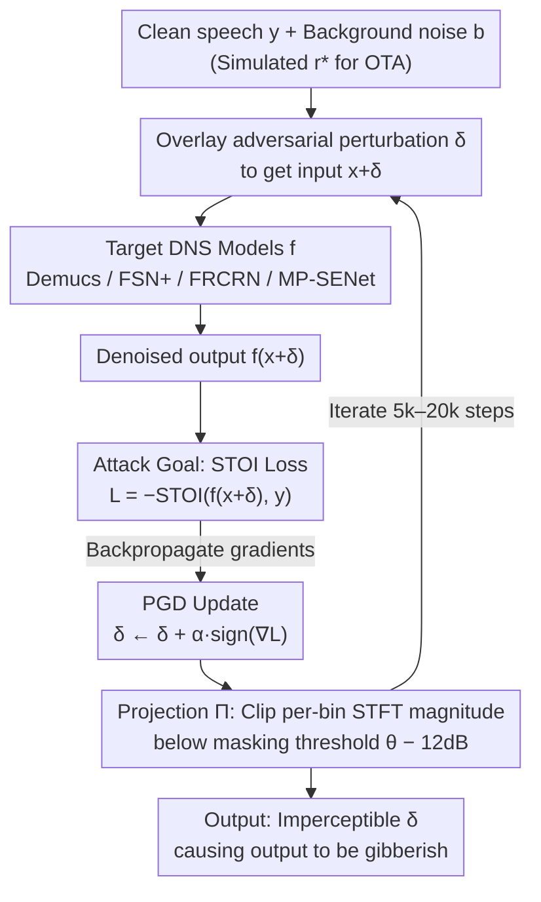

# Are Deep Speech Denoising Models Robust to Adversarial Noise?

**Conference**: ICLR 2026  
**arXiv**: [2503.11627](https://arxiv.org/abs/2503.11627)  
**Code**: [GitHub](https://github.com/audiolabs/speech-denoising-adversarial) (UMass Amherst + Dolby Labs)  
**Area**: Speech Restoration  
**Keywords**: Adversarial Attack, Speech Denoising, Psychoacoustic Masking, DNS, Adversarial Robustness, PGD  

## TL;DR
This paper presents the first systematic evaluation of the robustness of 4 SOTA Deep Speech Denoising (DNS) models against adversarial noise. By generating imperceptible adversarial perturbations through psychoacoustic-constrained PGD attacks, the authors demonstrate that Demucs, Full-SubNet+, FRCRN, and MP-SENet can be forced to output completely unintelligible gibberish. The experiments cover various acoustic conditions and human evaluations, while revealing limitations of targeted attacks, universal perturbations, and cross-model transfer.

## Background & Motivation

**Background**: Deep Speech Denoising (DNS) models (e.g., Demucs, Full-SubNet+, FRCRN, MP-SENet) have achieved significant progress in objective metrics like PESQ/STOI and are widely deployed in communication devices (phones, video conferencing systems, hearing aids). While they perform excellently under standard conditions, their adversarial robustness remains largely unstudied.

**Limitations of Prior Work**: (a) Research on adversarial robustness is mature in the image domain but nearly a blank space in speech denoising—existing works only cover single models or single attack methods and lack validation through human evaluation. (b) DNS models are being used in safety-critical scenarios (hearing aids, emergency communications); the possibility of silent attacks poses a real threat. (c) Traditional $L_p$ norm constraints are insufficient to guarantee imperceptibility in the audio domain, as frequency and temporal masking characteristics of human hearing require modeling via psychoacoustic models.

**Key Challenge**: While DNS models perform increasingly well on standard benchmarks, does there exist tiny, imperceptible acoustic perturbations that can completely destroy their denoising capabilities?

**Key Insight**: This work leverages the psychoacoustic model used in MP3 encoding to constrain the imperceptibility of adversarial perturbations, systematically evaluating the vulnerability of 4 representative DNS architectures under diverse acoustic conditions (SNR, reverberation, OTA).

**Core Idea**: Use PGD attacks constrained by psychoacoustic masking to generate adversarial noise that is imperceptible to humans but causes SOTA DNS models to output gibberish, with attack effectiveness confirmed via human evaluation.

## Method

### Overall Architecture
The paper addresses a security question: can a minute acoustic perturbation, completely imperceptible to the human ear, thoroughly destroy the denoising capabilities of SOTA speech denoising models? To this end, a white-box attack is constructed. When clean speech $y$ is corrupted by environmental noise $b$, a DNS model $f$ should ideally restore the clean speech. However, by superimposing an adversarial perturbation $\delta$ onto the input, the denoised output $f(x+\delta)$ becomes unintelligible gibberish. The attack iteratively solves for $\delta$ using Projected Gradient Descent (PGD) to satisfy two objectives: first, that $\delta$ is psychoacoustically imperceptible; second, that the intelligibility of the denoised output is extremely low (STOI approaching 0).

### Key Designs

**1. Attack Goal: Driving STOI towards 0 to make "unintelligibility" an optimizable loss**

The attack aims to destroy "intelligibility," so the loss is based directly on Short-Time Objective Intelligibility (STOI) rather than sound quality metrics. STOI calculates the normalized correlation coefficients between the clean reference and denoised output frame-by-frame. The attack uses the negative STOI as a loss function, optimizing the perturbation $\delta$ via PGD. STOI is preferred over PESQ because it correlates more strongly with human intelligibility—PESQ reflects "quality," while STOI reflects "understandability." Minimizing STOI is equivalent to maximizing the unintelligibility of the speech. Crucially, STOI is differentiable, allowing gradients to flow back to the input perturbation.

**2. Psychoacoustic Imperceptibility Constraint: Hiding perturbations using MP3 masking models**

Standard $L_\infty$ norm constraints used in traditional adversarial attacks are poorly suited for audio, as human hearing is more sensitive at low frequencies and can tolerate larger perturbations at higher frequencies. This method utilizes the ISO MPEG-1 Psychoacoustic Model 2 (the standard for MP3) to calculate masking thresholds $T(k)$ for each frequency bin. An additional 12 dB safety offset is subtracted to ensure total imperceptibility, constraining the Power Spectral Density (PSD) of the perturbation below this threshold:

$$\mathrm{PSD}(\delta, k) \le T(k) - 12\,\text{dB}$$

Furthermore, the constraint incorporates temporal effects, including pre-masking (approx. 2 ms) and post-masking (approx. 200 ms), relaxing constraints in the time domain to exploit temporal masking. This constraint set accurately models human perception and is key to the "silent" nature of the attack.

**3. PGD Optimization: Gradient descent + Projection to masking threshold constraints**

The solution follows a standard PGD framework: at each step, the perturbation $\delta$ is updated along the gradient direction $\delta \leftarrow \delta + \alpha \cdot \mathrm{sign}(\nabla_\delta \mathcal{L})$ to minimize STOI. Then, the projection operator $\Pi$ clips the STFT spectrum of the updated perturbation bin-by-bin to stay below the masking threshold, ensuring it remains within the constraint set $D(x)$. To account for different model complexities, the iteration count is set based on a fixed computational budget (approx. one hour on a single L40S GPU): 20,000 steps for Demucs and FSN+, 10,000 for MP-SENet, and 5,000 for FRCRN. This approach prevents slow models from appearing robust simply because they are computationally expensive to attack. For FSN+, which exhibits gradient explosion, additional stabilization was required.

**4. Target DNS Architectures: Four categories of design**

Four models were selected to ensure conclusions are not architecture-specific: Demucs (Meta), a time-domain U-Net + LSTM encoder-decoder; Full-SubNet+ (FSN+), a frequency-domain fullband-subband network; FRCRN (Alibaba), a frequency recurrent CRN operating on complex spectra; and MP-SENet, a mask-enhancement network predicting both magnitude and phase. These represent the four main technical routes in modern DNS.

### 评估设置
- **Acoustic Conditions**: 5 SNR levels (70dB / 30dB / 10dB / 5dB / 0dB) crossed with reverberation presence, plus simulated Over-The-Air (OTA) transmission.
- **Human Evaluation**: (a) Transcription test—participants attempt to transcribe denoised outputs to calculate Word Error Rate (WER); (b) ABX test—participants identify the adversarial signal among samples to verify imperceptibility.
- **Objective Metrics**: STOI, PESQ, ViSQOL, SI-SDR.

## Key Experimental Results

### Main Results — Untargeted Attack Effects (70dB SNR, No Reverb)

| Model | Pre-attack STOI | Post-attack STOI | Pre-attack PESQ | Post-attack PESQ |
|------|------------|------------|------------|------------|
| Demucs | 0.97 | 0.12 | 3.5 | 1.1 |
| FSN+ | 0.96 | 0.35 | 3.3 | 1.3 |
| FRCRN | 0.97 | 0.08 | 3.5 | 1.0 |
| MP-SENet | 0.96 | 0.15 | 3.4 | 1.1 |

### Attack Effects Across Acoustic Conditions

| Condition | Demucs STOI | FRCRN STOI | MP-SENet STOI | Description |
|------|-------------|------------|---------------|------|
| 70dB SNR, No Reverb | 0.12 | 0.08 | 0.15 | Ideal conditions |
| 10dB SNR, No Reverb | 0.15 | 0.11 | 0.18 | Moderate noise |
| 5dB SNR + Reverb | 0.20 | 0.14 | 0.22 | Difficult conditions |
| Simulated OTA | 0.25 | 0.18 | 0.28 | Real-world scenario |

### Human Evaluation Results
- **Transcription Test**: Post-attack denoised output WER > 95%. Participants were unable to understand any lexical content, confirming the output is gibberish.
- **ABX Test**: Accuracy in identifying adversarial vs. clean signals was approx. 55% (near 50% chance), confirming perturbations are imperceptible.
- The 12dB safety offset was experimentally validated as a robust setting for imperceptibility.

### Key Findings

1. **All 4 DNS models are vulnerable**: STOI drops from ~0.97 to 0.08–0.35, rendering outputs completely unintelligible.
2. **FSN+'s apparent robustness is an illusion**: Its higher post-attack STOI (0.35) stems from gradient explosion making PGD optimization difficult (obfuscated gradients), rather than true robustness.
3. **Model size does not correlate with robustness**: Demucs has the most parameters but is equally vulnerable; FRCRN has moderate parameters but is the easiest to break. Gradient flow stability is more critical than capacity.
4. **Attacks generalize across acoustic conditions**: Attacks remain effective from ideal conditions to low SNR, reverberation, and even simulated OTA scenarios.

### Negative Results (Equally Important Findings)

| Attack Type | Objective Metrics | Subjective Eval | Analysis |
|---------|---------|---------|---------|
| Targeted Attack (specific output) | Partially successful | Humans cannot hear target content | Audio perception is high-dimensional; low-level feature matching $\neq$ intelligibility. |
| Universal Perturbation (one $\delta$ for all) | Failure | Minimal STOI drop | Spectral differences across speech are too large for the psychoacoustic constraint set. |
| Cross-model Transfer | No transfer | Other models unaffected | Gradient directions vary greatly; white-box attacks are highly model-specific. |

### 防御探索
- **Gaussian Noise Injection**: Adding small amounts of noise to DNS input partially mitigates attacks (STOI recovers from 0.08 to ~0.5) but significantly degrades quality for normal use.
- **Adversarial Training**: Noted as a valuable direction but not tested due to the high computational cost of DNS training.

## Highlights & Insights

- **Sophisticated use of psychoacoustic constraints**: Leveraging the ISO MPEG-1 Psychoacoustic Model 2 with a 12dB offset and temporal masking sets a high standard for imperceptibility in audio adversarial research.
- **Honest reporting of negative results**: The failure of targeted, universal, and transfer attacks defines the boundaries of the threat model, avoiding over-sensationalizing the risk.
- **Gradient explosion $\neq$ robustness**: The case of FSN+ serves as a textbook example of "obfuscated gradients," reiterating that defense evaluations must use adaptive attacks.
- **Comprehensive threat modeling**: Testing from ideal scenarios to simulated OTA transmission ensures the findings are relevant to real-world deployments.
- **Architectural insights**: Large-scale models like Demucs provide no inherent safety advantage, suggesting that security must be an explicit design goal for DNS architectures.

## Rating
- **Novelty**: 4/5
- **Experimental Thoroughness**: 5/5
- **Writing Quality**: 5/5
- **Value**: 4/5

<!-- RELATED:START -->

## Related Papers

- [\[ICML 2026\] Coloring the Noise: Adversarial Sobolev Alignment for Faithful Image Super Resolution](../../ICML2026/image_restoration/coloring_the_noise_adversarial_sobolev_alignment_for_faithful_image_super_resolu.md)
- [\[CVPR 2026\] Convexity-Aware Noise Calibration: A Self-Supervised Framework for Noise-Level-Unknown Image Denoising](../../CVPR2026/image_restoration/convexity-aware_noise_calibration_a_self-supervised_framework_for_noise-level-un.md)
- [\[ECCV 2024\] Blind Image Deblurring with Noise-Robust Kernel Estimation](../../ECCV2024/image_restoration/blind_image_deblurring_with_noise-robust_kernel_estimation.md)
- [\[ACL 2025\] DiffuseDef: Improved Robustness to Adversarial Attacks via Iterative Denoising](../../ACL2025/image_restoration/diffusedef_adversarial_defense.md)
- [\[ICLR 2026\] Improved Adversarial Diffusion Compression for Real-World Video Super-Resolution](improved_adversarial_diffusion_compression_for_real-world_video_super-resolution.md)

<!-- RELATED:END -->
