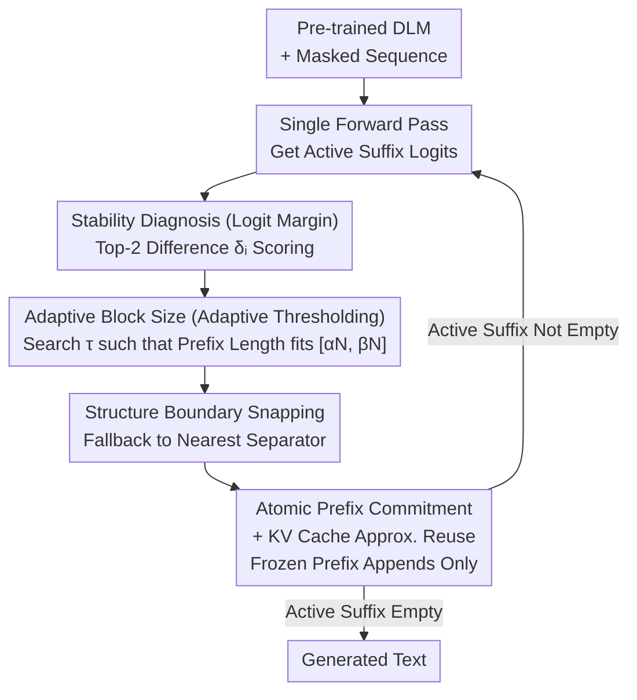

# Beyond Scattered Acceptance: Fast and Coherent Inference for DLMs via Longest Stable Prefixes

**Conference**: ICLR 2026  
**arXiv**: [2603.05454](https://arxiv.org/abs/2603.05454)  
**Code**: None  
**Area**: Image Restoration  
**Keywords**: Diffusion Language Models, Inference Acceleration, KV cache, Prefix Commitment, Logit Margin  

## TL;DR
The LSP scheduler accelerates DLM inference by 3.4$\times$ by atomically committing the longest stable continuous prefix in each denoising step (rather than scattered discrete tokens), while maintaining or slightly improving output quality.

## Background & Motivation
**Background**: Diffusion Language Models (DLMs) such as LLaDA and Dream provide parallel text generation capabilities, but actual inference speeds fall far short of theoretical parallelism.

**Limitations of Prior Work**:
   - **Scattered Acceptance** is the dominant strategy: tokens are committed independently based on local confidence, leading to an alternating distribution of "frozen" and "active" tokens in the sequence.
   - **Algorithm**: The frozen-active boundary is unstable, requiring the model to repeatedly perform local repairs, which slows global convergence.
   - **System**: The KV cache is fragmented into discontinuous small segments, destroying memory locality and causing high overhead for attention computation on long fragmented active sequences.

**Key Challenge**: Models designed for parallelism are limited by the sequential nature of commitment strategies—scattered commitment consumes the advantages of parallelism on fragment repair.

**Goal**: Design a new commitment topology to maximize KV cache reuse and accelerate active sequence contraction.

**Key Insight**: DLMs possess an empirical property where correct answers often appear in intermediate steps. This "early convergence" can be exploited for prefix commitment.

**Core Idea**: Replace scattered acceptance with global prefix absorption. The longest continuous stable prefix is committed at each step, making the frozen prefix grow monotonically and the active suffix decay geometrically.

## Method

### Overall Architecture
This paper addresses the gap between the "theoretical parallelism and practical slowness" of DLMs. Mainstream scattered acceptance strategies cause interleaved distributions of frozen and active tokens, which slows global convergence and fragments the KV cache. LSP adopts a different approach—instead of accepting high-confidence tokens sporadically, it commits only the longest continuous stable prefix from left to right at each step.

It is a training-free, model-agnostic inference scheduler that wraps around pre-trained DLMs. Each denoising iteration involves three steps: first, a single forward pass calculates stability scores for each position in the active suffix; second, an adaptive threshold is determined to select a target prefix length; finally, the prefix boundary is aligned to natural language structural separators for atomic commitment. These steps correspond to stability diagnosis, adaptive block size, and boundary snapping, while KV cache reuse realizes the speedup benefits of the prefix topology. The iteration repeats until the active suffix is geometrically reduced to empty.

### Key Designs

**1. Stability Diagnosis (Logit Margin): Cost-Effective Signals for Invariant Tokens**

To decide the prefix extension, the stability of each position's prediction must be determined. Rather than using metrics like entropy that require traversing the vocabulary, LSP directly uses the top-2 logit difference $\delta_i = z_{(1)}(i) - z_{(2)}(i)$ as the stability score. A large margin indicates the model has established a clear gap between the first and second candidates, meaning high confidence and a low probability of reversal; a small margin indicates hesitation. This signal requires only one forward pass, and its computational cost is negligible.

**2. Adaptive Block Size (Adaptive Thresholding): Geometric Contraction of Active Sequences**

A fixed threshold is insufficient—it is either too conservative (slow) or too aggressive (damages quality). LSP employs a dynamic threshold search: at each step $k$, it finds $\tau_k$ such that the candidate prefix length $L'(\tau_k)$ satisfying $\delta_i \geq \tau_k$ falls within the interval $[\alpha N_k, \beta N_k]$ (where $N_k$ is the current active length; $\alpha=0.25, \beta=0.50$). Since prefix length is monotonic with the threshold, the search is completed efficiently in $O(N_k)$. This ensures each step consumes 25%–50% of the active sequence, leading to a geometric decay of the active suffix at a rate of $(1-\alpha)^k$.

**3. Boundary Snapping: Preventing Mid-Word Truncation**

The candidate length $L'$ from the adaptive threshold often falls in the middle of a word or sentence. Hard truncation creates unnatural context for subsequent generation. LSP rolls back the prefix boundary to the nearest natural separator (e.g., punctuation, newlines, code symbols, denoted as set $\mathcal{D}$). Within a lookback window $W$, it selects the last position $j \leq L'$ that falls on a separator, while ensuring a minimum commitment $L_{\min}$ to prevent stagnation:
$$L = \max\{L_{\min},\ \max\{j \leq L' : \hat{y}_j \in \mathcal{D} \ \wedge\ L' - j \leq W\}\}.$$

**4. KV Cache Approximate Reuse: Converting Topology into Acceleration**

The continuous growth and clean boundaries of the frozen prefix allow for KV cache reuse. LSP treats the KV states of the committed prefix as fixed context. Although the prefix KV in a bidirectional DLM theoretically depends on the active suffix, recent studies observe that KV activations are highly similar between adjacent denoising steps, making the error from reuse negligible. Prefix growth equates to continuous KV cache appending without fragmentation.

### Loss & Training
- **Training-Free**: LSP works directly on pre-trained DLMs without parameter modification.
- **Core Hyperparameters**: $\alpha, \beta$ (target prefix ratio range), $L_{\min}$ (minimum commitment length), $W$ (lookback window).

## Key Experimental Results

### Main Results — Inference Acceleration (LLaDA-8B & Dream-7B)

| Benchmark | LSP Speedup | Quality Change |
|------|-----------|---------|
| Math Reasoning | Up to **3.4×** | Stable or Slightly Better |
| Code Generation | ~2.5× | Stable |
| Multilingual (CJK) | ~2.0× | Stable |
| Creative Writing | ~2.0× | Slightly Better |

### Ablation Study

| LSP Component | Impact of Removal |
|---------|----------|
| Adaptive Threshold → Fixed Threshold | Lower speedup; lower quality in some tasks |
| Boundary Snapping → Direct Truncation | Decreased coherence (especially in writing/multilingual) |
| Prefix Topology → Scattered Acceptance | Significant drop in speedup; KV cache fragmentation |
| Minimum Guarantee → No Guarantee | Potential stagnation under high uncertainty |

### Key Findings
- **Prefix Topology is Essential**: Compared to scattered acceptance, prefix commitment reduces token flip rates and the number of denoiser calls.
- **Geometric Decay of Active Sequences**: Aligns with theoretical predictions; total computation is approximately $O(N^2)$, superior to the $O(N^2 T)$ of scattered acceptance.
- **Bidirectional Lookahead Retained**: Unlike Block AR, LSP allows the model to utilize the active suffix as a lookahead buffer before commitment.

## Highlights & Insights
- **Shift in Commitment Topology**: Moving from "commit whichever tokens are good enough" to "commit continuously from left to right"—a simple yet effective paradigm shift.
- **Unification of System and Algorithm Optimization**: The prefix topology simultaneously addresses KV cache fragmentation (system level) and boundary instability (algorithmic level).
- **Geometric Decay Analysis**: The $\alpha$ to $\beta$ ratio ensures active length decays by $(1-\alpha)^k$, providing an upper bound on total workload.

## Limitations & Future Work
- Prefix strategies are naturally limited: if the start of a sequence is unstable but the middle is stable, LSP cannot exploit the middle stability.
- Structural separators $\mathcal{D}$ require manual definition and may vary by language or task.
- Error analysis for approximate KV cache reuse is not yet rigorous.
- Validated only on LLaDA-8B and Dream-7B; performance on larger models is unknown.

## Related Work & Insights
- **vs Prophet (Li et al., 2025b)**: Both use early-commit, but LSP adds adaptive thresholding and boundary snapping.
- **vs Block AR**: Block AR lacks bidirectional lookahead; LSP preserves this core DLM advantage.
- **vs MidTruth**: MidTruth uses early convergence for inter-step ensembling to improve quality; LSP uses it for early-commit to improve speed—complementary directions.

## Rating
- Novelty: ⭐⭐⭐⭐ Prefix absorption is a clear new paradigm, though core techniques (logit margin, adaptive threshold) are relatively standard.
- Experimental Thoroughness: ⭐⭐⭐⭐ Broad task coverage + ablation, but lacks comparison with multiple DLM acceleration methods.
- Writing Quality: ⭐⭐⭐⭐⭐ Clear problem statement and convincing dual system-algorithm analysis.
- Value: ⭐⭐⭐⭐⭐ 3.4$\times$ acceleration with no quality loss is of direct value for DLM deployment.

<!-- RELATED:START -->

## Related Papers

- [\[ICLR 2026\] LinearSR: Unlocking Linear Attention for Stable and Efficient Image Super-Resolution](linearsr_unlocking_linear_attention_for_stable_and_efficient_image_super-resolut.md)
- [\[ICLR 2026\] Pixel to Gaussian: Ultra-Fast Continuous Super-Resolution with 2D Gaussian Modeling](pixel_to_gaussian_ultra-fast_continuous_super-resolution_with_2d_gaussian_modeli.md)
- [\[ICML 2026\] DyLLM: Efficient Diffusion LLM Inference via Saliency-based Token Selection and Partial Attention](../../ICML2026/image_restoration/dyllm_efficient_diffusion_llm_inference_via_saliency-based_token_selection_and_p.md)
- [\[ICLR 2026\] FAST-DIPS: Adjoint-Free Analytic Steps and Hard-Constrained Likelihood Correction for Diffusion-Prior Inverse Problems](fastdips_adjointfree_analytic_steps_and_hardconstrained_likelihood_correction_fo.md)
- [\[ICLR 2026\] Breaking Scale Anchoring: Frequency Representation Learning for Accurate High-Resolution Inference from Low-Resolution Training](breaking_scale_anchoring_frequency_representation_learning_for_accurate_high-res.md)

<!-- RELATED:END -->
