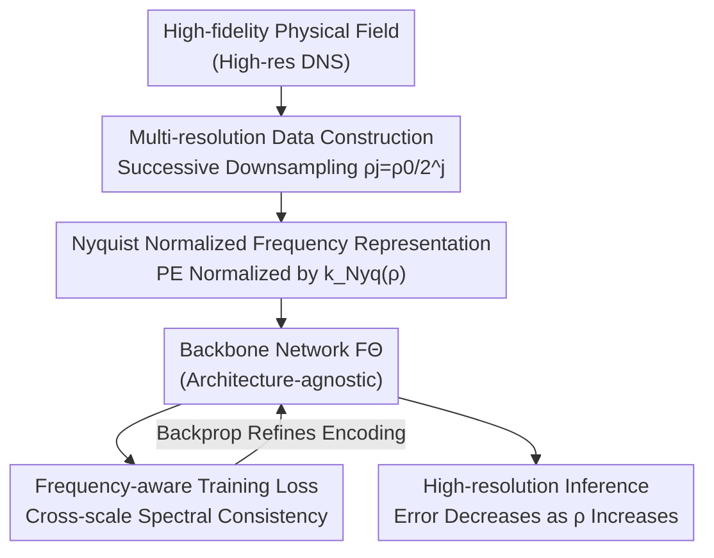

# Breaking Scale Anchoring: Frequency Representation Learning for Accurate High-Resolution Inference from Low-Resolution Training

**Conference**: ICLR 2026  
**arXiv**: [2512.05132](https://arxiv.org/abs/2512.05132)  
**Code**: To be confirmed  
**Area**: Object Detection (Spatiotemporal Forecasting / Zero-shot Super-Resolution)  
**Keywords**: scale anchoring, frequency representation, zero-shot super-resolution, spatiotemporal forecasting, Nyquist frequency

## TL;DR

The paper defines "Scale Anchoring" (where low-resolution training anchors error during high-resolution inference) and proposes an architecture-agnostic Frequency Representation Learning (FRL). By using Nyquist-normalized frequency encoding, it ensures that errors decrease as resolution increases, which is validated across 8 mainstream architectures.

## Background & Motivation

**Zero-shot Super-Resolution Spatiotemporal Forecasting (ZS-SR STF)**: Training deep learning models on low-resolution data and performing inference at high resolution—necessary because the training cost of high-resolution DNS simulation is prohibitive.

**Limitations of Prior Work**: Existing methods assume a "successful generalization" if the cross-resolution error ratio (RMSE_Ratio) is close to 1. However, for a $p$-order numerical solver, an $\alpha$-fold resolution increase should reduce the error by $\alpha^p$ times.

**Root of Scale Anchoring**: The Nyquist frequency of low-resolution training data limits the upper bound of physical law frequencies the model can learn. During high-resolution inference, the model cannot process high-frequency components never seen during training, causing the error to anchor at the training resolution level.

**Key Challenge (Distinction from Known Phenomena)**:
   - **vs Spectral Bias (SB)**: SB is a learning preference for low-to-high frequencies within the training band; SA is an information-theoretic limitation outside the training band.
   - **vs Discretization Mismatch Error (DME)**: DME arises from architecture/optimization choices and can be eliminated by design; SA is a hard limit imposed by the Shannon-Nyquist sampling theorem.

**Key Insight (Theory)**:
   - **Theorem 1 (Frequency Blind Zone)**: The frequency response of a network trained at resolution $\rho_0$ is undefined or incorrect for $\omega > \rho_0/2$.
   - **Theorem 2 (High-frequency Error Dominance)**: High-resolution inference error is primarily driven by frequency components in the range $[\rho_0/2, \rho/2]$.

## Method

### Overall Architecture

Frequency Representation Learning (FRL) is an architecture-agnostic "plug-in" workflow applied to both ends of a backbone network $F_\Theta$. The front end expands training data across multiple sampling rates and shifts the spatial frequency encoding from "resolution-drifting" to "Nyquist-normalized." The back end utilizes a frequency-domain consistency loss to lock the model's spectral behavior across scales. Among the three components, **Nyquist Normalized Frequency Representation** is the core to breaking Scale Anchoring. **Multi-resolution Data Construction** provides comparative samples at "same frequency, different resolution," while **Frequency-aware Training Loss** prevents normalized encodings from deviating during optimization—the latter two serve as scaffolds.

### Key Designs

**1. Multi-resolution Data Construction: Exposing the Model to Multiple Sampling Rates**

Starting from high-fidelity data, a set of resolution versions $\rho_j = \rho_0/2^j$ is generated via successive downsampling. This allows identical physical fields with different sampling densities to enter training simultaneously. This step alone is a standard multi-scale technique and does not break Scale Anchoring; ablation shows the RMSE_Ratio remains $\sim 1.0$ when used in isolation. Its true purpose is to provide "same frequency, different resolution" paired samples for the Nyquist normalization to learn cross-scale correspondences.

**2. Nyquist Normalized Frequency Representation: Decoupling Frequency and Resolution**

This is the central methodological innovation for breaking Scale Anchoring. Conventional frequency encodings use discrete wavenumbers $k$, meaning the same physical frequency maps to different encoding values at different resolutions. Consequently, the model binds "frequencies" to the "training resolution." FRL normalizes by the Nyquist frequency $k_{Nyq}(\rho)$ of each resolution:

$$PE_{freq}(x, k, \rho) = \sin\!\big(2\pi k \cdot x / k_{Nyq}(\rho)\big)$$

This ensures identical physical frequencies receive consistent representation values regardless of resolution. The network learns frequency structures independent of sampling rates rather than discrete patterns on a fixed grid. This allows the frequency response bandwidth to extend to the full spectrum, enabling error reduction at higher resolutions. In ablations, adding this step alone brings RMSE_Ratio down to $0.3$–$0.4$.

**3. Frequency-aware Training Loss: Enforcing Cross-scale Spectral Consistency**

A frequency-domain consistency loss is added to the standard regression loss to align predicted $F_\Theta$ and target $\hat{u}$ in the spectral domain:

$$\mathcal{L} = \mathcal{L}_{std} + \lambda \cdot \|F_\Theta - \hat{u}\|^2_{freq}$$

This explicitly incorporates spectral consistency into the optimization objective. Like Step 1, this is a standard regularization method that fails to break SA alone ($\sim 1.0$). Only when combined (Full FRL) does the RMSE_Ratio drop to $0.135$–$0.181$, effectively breaking Scale Anchoring.

## Key Experimental Results

### 3D Fluid Simulation (Train 32³, Test up to 129³)

| Method | RMSE_Ratio Original → +FRL | High-res RMSE Reduction |
|------|----------------------|----------------|
| GNN | 1.018 → **0.175** | 5.82× |
| CNN | 1.060 → **0.137** | 7.74× |
| NO | 1.017 → **0.135** | 7.53× |
| Transformer | 1.021 → **0.165** | 6.19× |
| Diffusion | 1.041 → **0.181** | 5.75× |

### ERA5 Weather Forecasting (Train 180×90, Inference up to 1440×721)

| Architecture | RMSE_Ratio → +FRL | ACC Gain |
|------|-------------------|---------|
| Transformer | 1.053 → 0.708 | 0.44→0.65 |
| CNN | 1.066 → 0.662 | 0.42→0.68 |

### Ablation Study

| Configuration | RMSE_Ratio | Description |
|------|-----------|------|
| Step 1 only (Multi-res) | ~1.0 | Does not break SA |
| Step 3 only (Freq loss) | ~1.0 | Does not break SA |
| **Step 1+2+3 (Full FRL)** | **0.135-0.181** | Successfully breaks SA |
| Step 2 only | 0.3-0.4 | Effective but insufficient |

### Key Findings

- All 8 mainstream architectures (GNN/Transformer/CNN/Diffusion/NO/Neural ODE/Mamba/NN) suffer from Scale Anchoring.
- FRL extends the frequency response bandwidth from the training Nyquist frequency to the full frequency band.
- Performance degrades in extreme systems such as high-Reynolds turbulence where spectral relationships are non-smooth.

## Highlights & Insights

- **Problem Definition**: High value in being the first to strictly distinguish Scale Anchoring from SB/DME with comprehensive theoretical analysis.
- **Architecture Agnostic**: Validated across 8 representative architectures, demonstrating that SA is a universal limitation of data-driven models.
- **Honest Discussion**: The authors self-report failure modes and suggest introducing Kolmogorov spectral constraints.
- **Cross-domain Validation**: Proved across fluid simulation and weather forecasting, two distinct physical domains.

## Limitations & Future Work

- No guarantee of a strict convergence order—deep learning models are not equivalent to numerical solvers.
- Extrapolation capability of FRL degrades in high-Reynolds turbulence or discontinuity problems where spectral relationships are non-smooth.
- Multi-resolution training incurs additional computational and memory overhead (approx. 2-3×).
- Applicability to other scenarios, such as image super-resolution, remains unknown as only spatiotemporal forecasting was tested.

## Related Work & Insights

- **FNO/PINO**: Improved resolution generalization but failed to explicitly address Nyquist frequency limitations.
- **Anti-Spectral Bias Methods**: Focused on learning high frequencies within the training band, whereas SA is an issue outside the band.
- **Multi-resolution Training / Spectral Regularization**: FRL's Steps 1 and 3 leverage these standard techniques to support the core normalization.

## Rating

- Novelty: ⭐⭐⭐⭐⭐ New problem definition + rigorous theory + validation.
- Experimental Thoroughness: ⭐⭐⭐⭐⭐ 8 architectures × 2 physical domains + complete ablations.
- Writing Quality: ⭐⭐⭐⭐ Clear structure with honest discussion of failure modes.
- Value: ⭐⭐⭐⭐ Deeply insightful for the Scientific Machine Learning (SciML) community.

<!-- RELATED:START -->

## Related Papers

- [\[ICLR 2026\] Learning Heterogeneous Degradation Representation for Real-World Super-Resolution](learning_heterogeneous_degradation_representation_for_real-world_super-resolutio.md)
- [\[CVPR 2026\] HDW-SR: High-Frequency Guided Diffusion Model based on Wavelet Decomposition for Image Super-Resolution](../../CVPR2026/image_restoration/hdw-sr_high-frequency_guided_diffusion_model_based_on_wavelet_decomposition_for_.md)
- [\[ICLR 2026\] Trust but Verify: Adaptive Conditioning for Reference-Based Diffusion Super-Resolution](trust_but_verify_adaptive_conditioning_for_reference-based_diffusion_super-resol.md)
- [\[CVPR 2026\] Event-Illumination Collaborative Low-light Image Enhancement with a High-resolution Real-world Dataset](../../CVPR2026/image_restoration/event-illumination_collaborative_low-light_image_enhancement_with_a_high-resolut.md)
- [\[ICLR 2026\] Texture Vector-Quantization and Reconstruction Aware Prediction for Generative Super-Resolution](texture_vector-quantization_and_reconstruction_aware_prediction_for_generative_s.md)

<!-- RELATED:END -->
