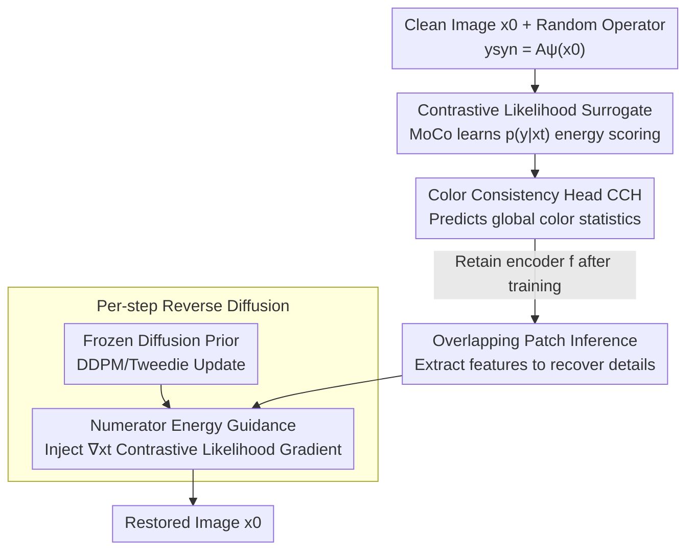

# CL-DPS: A Contrastive Learning Approach to Blind Nonlinear Inverse Problem Solving via Diffusion Posterior Sampling

**Conference**: ICLR2026  
**OpenReview**: [https://openreview.net/forum?id=KoLYNHJRBY](https://openreview.net/forum?id=KoLYNHJRBY)  
**Code**: https://anonymous.4open.science/r/CL-DPS-4F5D (Anonymous Repo)  
**Area**: Diffusion Models / Image Restoration / Inverse Problem Solving  
**Keywords**: Blind Inverse Problems, Nonlinear Operators, Diffusion Posterior Sampling, Contrastive Learning, Deblurring

## TL;DR
CL-DPS utilizes an offline-trained contrastive learning encoder to approximate the intractable likelihood term $p(y\mid x_t)$ in diffusion posterior sampling (DPS). This enables diffusion models to solve blind **nonlinear** inverse problems (e.g., rotation blur, radial blur) for the first time without **knowing or estimating operator parameters**. It achieves clean restorations where existing methods fail, while remaining competitive on linear blind deblurring tasks.

## Background & Motivation
**Background**: Inverse problems (medical imaging, computational photography, seismic imaging, etc.) aim to recover the original signal $x_0$ from observations $y$ degraded by a forward operator $A_\psi(\cdot)$. Diffusion models (DMs) have become a primary tool for solving inverse problems due to their ability to characterize the data prior $p(x_0)$. The most practical paradigm is "Diffusion Posterior Sampling (DPS)", which uses a pre-trained unconditional DM as a prior and injects a likelihood guidance term $\nabla_{x_t}\log p(y\mid x_t)$ during each step of reverse sampling to steer the trajectory toward data consistency.

**Limitations of Prior Work**: This paradigm faces two overlapping constraints. First, most DM inverse problem solvers are **non-blind**, assuming the operator $A_\psi$ is known. In reality, obtaining the precise operator is often difficult or impossible. Second, the few works handling **blind** problems (BlindDPS, GibbsDDRM, Sanghvi et al.) **almost all assume $A_\psi$ is a convolutional operator**, meaning they only handle **linear** blur. BlindDPS also requires training an additional DM for the blur operator parameters, further limiting its generality.

**Key Challenge**: Many real-world blind inverse problems involve **nonlinear** operators (e.g., rotation blur, zoom blur), which are not simple spatially invariant convolutions. Once the operator is nonlinear, the approach of "jointly estimating $A_\psi$ as a convolution" fundamentally fails. Existing blind solvers suffer catastrophic failures on such tasks (see Figure 1: all methods except CL-DPS produce unrecognizable artifacts).

**Goal**: To provide a likelihood guidance term that holds for both linear and nonlinear operators, without knowing the operator form or estimating its parameters.

**Key Insight**: The authors observe that DPS only requires the **gradient** of the likelihood term $p(y\mid x_t)$, rather than the operator itself. Can the "estimate operator $\rightarrow$ calculate likelihood" chain be bypassed by **learning a surrogate of the likelihood**? Contrastive learning is naturally suited for this: the InfoNCE loss essentially estimates the log-likelihood ratio between a query and a positive key.

**Core Idea**: Use a MoCo-style contrastive learning encoder $f$ to learn an energy surrogate of $p(y\mid x_t)$ offline across a large set of randomly sampled operators. During inference, the gradient of this surrogate is plugged into the reverse diffusion process as a guidance term—never requiring the operator parameters.

## Method

### Overall Architecture
CL-DPS consists of **offline training** and **online sampling**. In the offline phase, an auxiliary encoder $f$ is trained: given a clean image $x_0$, a random operator $\psi\sim P_\Psi$ is sampled to synthesize the measurement $y_{\text{syn}}=A_\psi(x_0)$. A random diffusion step $t$ provides the noisy state $x_t$. A MoCo-style contrastive objective trains $f$ to assign high scores to the positive pair $(x_t, y_{\text{syn}})$ and low scores to negative samples in a dictionary, which is equivalent to learning the energy score of the likelihood $p(y\mid x_t)$. A **Color Consistency Head (CCH)** is added during training to correct color insensitivity, then discarded during inference.

In the online phase, the pre-trained diffusion prior remains **frozen**. A contrastive guidance term is added to each step of the standard DDPM/DPS reverse update: the current state $x_t$ and observation $y$ are **patchified with overlap**, passed through encoder $f$ for feature extraction, and the gradient of the inner product $-\eta\,\nabla_{x_t}\langle f(\{p^{x_t}_j\}), f(\{p^{y}_j\})\rangle$ pushes the sampling trajectory (Algorithm 1, line 12). This guidance term is sampler-agnostic and can be directly integrated into modern samplers like DPM-Solver++.

### Key Designs

**1. Contrastive Likelihood Surrogate: Turning $p(y\mid x_t)$ under unknown operators into an offline-learnable energy score**

This is the core of the paper. Under the blind nonlinear setting, $p(y\mid x_t)$ has no analytical form and the operator is unknown, making DPS guidance impossible. The authors use Bayes' rule to write $p(y\mid x_t)=\dfrac{p(y,x_t)}{\int p(\tilde y,x_t)\,d\tilde y}$, then approximate the numerator using the energy score of a neural encoder $f$: $p(y,x_t)\propto\exp(\langle f(x_t),f(y)\rangle/\tau)$. The intractable integral in the denominator is approximated by a finite sum over a sufficiently large set $Y$. Thus:

$$p(y\mid x_t)\approx \frac{\exp(\langle f(x_t),f(y)\rangle/\tau)}{\sum_{\tilde y\in Y}\exp(\langle f(x_t),f(\tilde y)\rangle/\tau)}.$$

Maximizing its log-likelihood is equivalent to minimizing the **InfoNCE loss**, where the query is $q=f(x_t)$, the positive key is $k^+=f(y_{\text{syn}})$, and negative samples are drawn from MoCo's dynamic queue $Y$. In other words, the standard contrastive objective is naturally an estimator for this likelihood surrogate. The long MoCo queue (default $K=65536$) provides a cheap approximation of the population $Y$. Since test operator parameters are unknown, the authors synthesize $y_{\text{syn}}=A_\psi(x_0)$ using random operators from $P_\Psi$ (Gaussian/motion/rotation/zoom blur), allowing $f$ to learn to estimate the likelihood **across a family of operators**. Lemma 1 provides a theoretical basis: under the energy-based model assumption, the contrastive log-probability gradient equals the true likelihood gradient and converges almost surely to $\nabla_{x_t}\log p(y\mid x_t)$ as the dictionary size $n\to\infty$. This allows the unknown nonlinear parts of the blind problem to be absorbed into one-time offline training.

**2. Color Consistency Head (CCH): Recovering the color sensitivity gap of contrastive objectives**

Contrastive learning often results in **color insensitivity** because it aims to learn representations invariant to augmentations/degradations, leading to hue/brightness shifts in restored images. The authors attach a lightweight two-layer convolutional head $H_c$ to the encoder to predict the **global color statistics** of the input—specifically the spatial mean across channels $\big(\mathrm{AP}(x_t)\big)_c=\frac{1}{N_1N_2}\sum_{i,j}x_{t,cij}$. The color consistency loss is $L_{CC}(x_t)=\lVert H_c(x_t)-\mathrm{AP}(x_t)\rVert_2^2$, combined with the likelihood surrogate loss:

$$L_{\text{CL-DPS}}=L_{p(y_{\text{syn}}\mid x_t)}+\lambda\,L_{CC}(x_t).$$

Crucially, the CCH is **only used during training and discarded at inference**. It injects the "preserve color statistics" constraint into the encoder's representation without increasing sampling complexity.

**3. Overlapping Patch Inference: Using mutual information lower bounds to recover details lost in compression**

Convolutional encoders naturally compress low-level details (information bottleneck), which are necessary for fine-grained guidance in inverse problems. Instead of processing the entire image, the authors divide it into $L_s$ **overlapping** $n\times n$ patches (stride $s<n$), processing each patch through $f$ and stacking the features: $f(\{p^x_j\}_{j\in[L_s]})=[f^\top(p^x_1)\dots f^\top(p^x_{L_s})]^\top$. Theorem 1 demonstrates that **stacking more overlapping patches increases the mutual information $I(x;f(\{p^x_j\}))$** between the encoded features and the original image. Denser overlapping coverage makes the encoded output more "informative" about $x$, providing more stable guidance signals.

**4. Numerator Energy Guidance: Injecting surrogate gradients as a plug-in**

CL-DPS treats $f$ as a **plug-and-play likelihood surrogate** for standard DPS (Algorithm 1). The only modification to unconditional sampling is adding a contrastive guidance step after each DDPM update: $x_{t-1}\leftarrow x'_{t-1}-\eta\,\nabla_{x_t}\langle f(\{p^{x_t}_j\}),f(\{p^{y}_j\})\rangle$. The authors adopt an "energy guidance" perspective, treating the contrastive score as an **unnormalized** likelihood and **using only the numerator gradient**, bypassing the denominator term that requires iterating over the entire dictionary. A denominator-aware variant is provided in Appendix E, yielding similar results but with significantly higher computational cost.

### Loss & Training
The auxiliary encoder is trained with the InfoNCE-style contrastive objective $L_{p(y_{\text{syn}}\mid x_t)}$ plus the color consistency term $\lambda L_{CC}$ (Eq. 16), utilizing MoCo's momentum updates $\theta_k\leftarrow m\theta_k+(1-m)\theta_q$. Default hyperparameters: temperature $\tau=0.07$, guidance dictionary $|Y|=256$, MoCo queue $K=65536$, momentum $m=0.996$, projection dimension $d=128$, patch size $P=64$, stride $S=32$. Training modes: **Universal (UNI)**—one encoder for all operator families; **Specialist (SPE)**—one encoder per operator family (inference selects the encoder based on detection, but parameters $\psi$ remain unknown). Offline training is one-time and self-supervised with synthetic pairs.

## Key Experimental Results
Datasets: FFHQ, AFHQ, ImageNet (256×256); Metrics: PSNR↑, FID↓, LPIPS↓; Diffusion prior from Chung et al. (2022b).

### Main Results
Blind nonlinear deblurring (Rotation + Zoom) is the primary benchmark. The authors note that **no prior DM method can perform this task**, comparing instead against the strongest linear blind solvers and a classical non-DM baseline.

| Method | FFHQ PSNR↑ | FFHQ FID↓ | AFHQ PSNR↑ | ImageNet PSNR↑ |
|------|-----------|-----------|-----------|----------------|
| **CL-DPS (SPE)** | **22.74** | **33.66** | **21.46** | **20.05** |
| CL-DPS (UNI) | 22.27 | 36.55 | 21.61 | 19.92 |
| FastEM (WACV'24) | 15.96 | 268.4 | 11.57 | 13.90 |
| BlindDPS (CVPR'23) | 16.87 | 343.8 | 13.25 | 11.25 |
| GibbsDDRM (ICML'23) | 18.43 | 236.6 | 15.24 | 12.24 |

The gap is massive: baseline FIDs range from 200–390 (noise/artifacts), while CL-DPS achieves 33–45. All DM baselines fail on nonlinear tasks because they assume $A_\psi$ is convolutional.

On linear blind deblurring (Gaussian + Motion), CL-DPS is competitive or superior to SOTA. For Gaussian blur on FFHQ/AFHQ, it leads in both PSNR and FID. On FFHQ motion blur, it achieves PSNR 26.33 and LPIPS 0.117, placing it in the top tier and proving its effectiveness across both linear and nonlinear tasks.

### Ablation Study
Conducted on CL-DPS (SPE) averaged across datasets for rotation/zoom.

| Configuration | Key Change | Explanation |
|------|---------|------|
| Stride S=32→S=16 | PSNR 22.74→23.09, FID 33.66→32.10 | Supports Theorem 1: denser overlap leads to more stable guidance. |
| No overlap S=64 | PSNR drops to 21.94, FID rises to 36.90 | Coarse/disjoint patches lose local details. |
| Dictionary \|Y\|=64→256→1024 | Monotonic improvement; gain levels off after 256. | Larger dictionaries better approximate the likelihood gradient (Lemma 1). |
| Queue K=65536 | Consistent improvement over 8192 | Larger K provides harder negative samples. |
| Temperature τ | Robust between 0.05–0.10. | τ=0.15 over-smooths logits, weakening guidance. |

Additional experiments show that replacing the UNI encoder with ResNet-50 recovers most of the gap relative to SPE (FFHQ rotation FID 36.55→33.95). In terms of operator family misclassification, PSNR only drops from 22.74 to 21.71 even when the error rate $\epsilon$ is 0.20, while a ResNet-18 detector achieves 99.1% accuracy.

### Key Findings
- **Dictionary/Queue size is critical for likelihood surrogate quality**: Larger $|Y|$ and $K$ values allow the contrastive gradient to better approximate the true likelihood gradient, consistent with Lemma 1.
- **Overlapping patches are essential to overcome the information bottleneck** of contrastive representations; removing overlap (S=64) results in the largest performance drop.
- **Numerator-only guidance is sufficient**: The denominator-aware variant offers minimal quality improvement at a much higher computational cost.
- **The primary trade-off is speed**: CL-DPS requires backpropagation through the encoder at each step, taking ~60.84s per image, which is slower than baselines but enables previously impossible blind nonlinear restorations.

## Highlights & Insights
- **Transforming "unknown operators" into "offline representation learning"**: The breakthrough is recognizing that DPS only needs the likelihood gradient, enabling the use of InfoNCE to absorb the difficulty of unknown nonlinear operators into a one-time offline phase.
- **Tight coupling of theory and design**: Lemma 1 explains the convergence of contrastive gradients to true gradients, while Theorem 1 uses mutual information to justify overlapping patches.
- **CCH as a "train-time constraint, inference-time discard" paradigm**: This is a clean method for injecting attributes (like color) that contrastive representations are naturally insensitive to, without increasing inference costs.
- **Sampler-agnostic plug-in**: The guidance term is independent of the sampler, allowing seamless integration with accelerated samplers like DPM-Solver++.

## Limitations & Future Work
- **Inference Speed**: Backpropagation through the encoder at every step (~60s per image) is significantly slower than training-free baselines, limiting real-time application.
- **Dependence on Operator Family Prior $P_\Psi$**: SPE requires training per operator family, and generalization to unseen operator families remains a challenge.
- **Theoretical Assumptions**: Convergence in Lemma 1 relies on the EBM assumption and the infinite dictionary limit; the impact of finite dictionary bias in real-world scenarios needs further quantification.
- **Future Directions**: Reducing inference costs through fewer guidance steps, improving the "one universal encoder" performance, and extending the framework to non-blurring nonlinear degradations (e.g., phase retrieval, HDR).

## Related Work & Insights
- **vs. BlindDPS (CVPR'23)**: BlindDPS trains a **dedicated DM** for blur parameters, assuming convolution and linear operators. CL-DPS bypasses parameter estimation entirely through a likelihood surrogate, extending to nonlinear cases.
- **vs. GibbsDDRM (ICML'23)**: Uses Gibbs sampling on the joint distribution but is restricted to linear convolutional operators.
- **vs. DPS / ΠGDM (Non-blind)**: These approximate the likelihood using Tweedie’s formula for known operators; CL-DPS replaces "known operator likelihood" with "contrastive surrogate likelihood" to enable blind solving.
- **vs. DDNM**: DDNM enforces data consistency in the null-space for linear measurements without auxiliary training; CL-DPS’s patching is for local feature extraction to support nonlinearities.

## Rating
- Novelty: ⭐⭐⭐⭐⭐ First DM method to solve blind nonlinear inverse problems.
- Experimental Thoroughness: ⭐⭐⭐⭐ Extensive datasets and ablations; however, limited to blurring-type degradations.
- Writing Quality: ⭐⭐⭐⭐ Strong integration of motivation, theory, and design.
- Value: ⭐⭐⭐⭐ Opens a new frontier for blind nonlinear problems, despite inference overhead.

<!-- RELATED:START -->

## Related Papers

- [\[ICLR 2026\] A Statistical Benchmark for Diffusion-Posterior-Sampling Algorithms](a_statistical_benchmark_for_diffusion-posterior-sampling_algorithms.md)
- [\[ICML 2026\] Triadic Dynamics Aware Diffusion Posterior Sampling for Inverse Problems: Optimizing Guidance and Stochasticity Schedules](../../ICML2026/image_restoration/triadic_dynamics_aware_diffusion_posterior_sampling_for_inverse_problems_optimiz.md)
- [\[ICLR 2026\] LearnIR: Learnable Posterior Sampling for Real-World Image Restoration](learnir_learnable_posterior_sampling_for_real-world_image_restoration.md)
- [\[ICLR 2026\] Noise-Adaptive Diffusion Sampling for Inverse Problems Without Task-Specific Tuning](noise-adaptive_diffusion_sampling_for_inverse_problems_without_task-specific_tun.md)
- [\[ICML 2026\] Measurement-Consistent Langevin Corrector for Stabilizing Latent Diffusion Inverse Problem Solvers](../../ICML2026/image_restoration/measurement-consistent_langevin_corrector_for_stabilizing_latent_diffusion_inver.md)

<!-- RELATED:END -->
