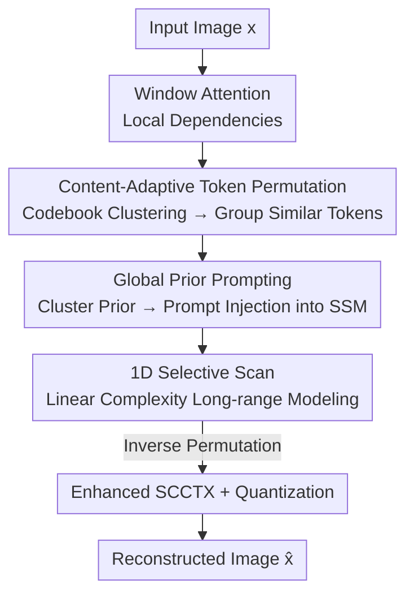

# Content-Aware Mamba for Learned Image Compression

**Conference**: ICLR2026  
**OpenReview**: [https://openreview.net/forum?id=WwDNiisZQm](https://openreview.net/forum?id=WwDNiisZQm)  
**Code**: https://github.com/UnoC-727/CMIC  
**Area**: Image Compression / Low-level Vision  
**Keywords**: Learned Image Compression, State Space Models, Mamba, Content-Adaptive Scanning, Global Prior

## TL;DR
Addressing the two major flaws of Mamba in learned image compression—"fixed raster scanning" and "strict causality"—this paper proposes Content-Aware Mamba (CAM). It uses token rearrangement based on codebook clustering to group similar tokens for scanning and injects global priors into SSM output projections via a redundancy-aware prompt dictionary to break causality. Consequently, the CMIC model outperforms VTM-21.0 across Kodak/Tecnick/CLIC with BD-rates of −15.91%/−21.34%/−17.58%, while maintaining nearly 80% lower GPU memory usage than similar Mamba-based methods.

## Background & Motivation
**Background**: Learned Image Compression (LIC) follows an end-to-end VAE pipeline—analysis transforms encode images into latent variables, entropy models estimate bitrates, and synthesis transforms reconstruct images, optimized by the rate-distortion loss $L_{RD}=R+\lambda\, d(x,\hat{x})$. To eliminate redundancy between spatially distant but semantically related regions, a large receptive field is required. CNNs lack locality, while Transformers achieve a global receptive field at the cost of quadratic complexity relative to sequence length. State Space Models (Mamba) have emerged as an attractive compromise—linear complexity with a global receptive field—and have been integrated into LIC by works like MambaVC and MambaIC.

**Limitations of Prior Work**: Mamba's Selective Scan is designed for 1D sequences, leading to two fundamental issues when applied to image compression. First, **content-agnostic scanning order**: vanilla Mamba processes tokens in a fixed raster order, considering only spatial proximity while ignoring feature correlation. This scatters content-related tokens and groups unrelated ones, hindering dependency modeling for semantically similar but spatially distant tokens. Second, **strict causality conflicts with the non-causal nature of images**: SSM is a causal sequence model where each token only perceives preceding tokens in the raster order, ignoring subsequent global context. Common multi-directional scanning mitigates causality but quadruples computation and still relies on content-agnostic Euclidean-based paths.

**Key Challenge**: To eliminate redundancy, models should organize token interactions based on "proximity in feature space"; however, Mamba processes them based on "proximity in Euclidean space + unidirectional causal chains." The mismatch between scanning paths and redundancy structures is the bottleneck for Mamba-based LIC, rather than the "globality vs. complexity" trade-off typical of Transformers.

**Goal**: Without sacrificing Mamba's linear complexity, the goal is to (1) scan by content similarity rather than spatial adjacency and (2) enable global context awareness at every step to bypass strict causality.

**Key Insight**: Since the problem lies in the "scanning order" and "unidirectional info flow," the solution targets both: clustering-based token rearrangement for the former and global statistics injection as prompts for the latter. Both utilize the same clustering results with negligible overhead.

**Core Idea**: Replace fixed raster scanning with "content-adaptive token rearrangement" and use "cluster-prior-based prompt injection" instead of multi-directional scanning to break causality, achieving content-aware, non-causal long-range modeling with linear complexity.

## Method

### Overall Architecture
CMIC follows a standard VAE-style LIC layout: the analysis transform $g_a$ encodes RGB image $x$ into latents $y$, which are mean-shifted and quantified as $\hat{y}=Q(y-\mu)+\mu$. The synthesis transform $g_s$ reconstructs $\hat{x}$. An hyper-prior codec produces $(\mu,\sigma)$ which, along with spatial-channel context $\phi$, defines a conditional Gaussian entropy model to estimate bitrate $R$. Nonlinear transforms are divided into six resolution stages (three downsampling in encoding, three upsampling in decoding, with depths $\{L_1,L_2,L_3,L_3,L_2,L_1\}$). Each stage first uses window-attention for fine-grained local dependencies, followed by the proposed **CAM block** for long-range modeling.

The core of the CAM block is Content-Aware SSM: it clusters tokens into categories, rearranges the flattened sequence to group similar tokens together, and generates sample-specific prompts from a dictionary. The rearranged tokens with injected prompts undergo a 1D selective scan for efficient long-range modeling, followed by an inverse permutation to restore spatial layout. The entropy model is based on SCCTX, enhanced with depth-wise convolutions for context modeling and gated MLPs for parameter aggregation. The two primary modules are **Content-Adaptive Token Permutation (CTP)** and **Global Prior Prompting (GPP)**.

### Key Designs

**1. Content-Adaptive Token Permutation (CTP): Changing scan order from "Spatial Adjacency" to "Feature Similarity"**

Fixed raster scanning separates semantically related but spatially distant tokens, which is the direct cause of Mamba's inefficiency in redundancy elimination. The intuitive solution is to group similar tokens via clustering. However, per-sample online K-Means is costly and unstable during training. This paper borrows from VQ-VAE, using a **shared, learnable codebook** to store centroids. For every position in feature map $X\in\mathbb{R}^{H\times W\times d}$ as a token $x_i$, $N$ tokens are assigned to $K$ classes ($K=64$) by cosine similarity. Centroids $c_k$ are updated during training via K-Means: tokens are assigned to the nearest centroid based on $\text{Distance}_{i,j}=\frac{x_i^\top c_j}{\|x_i\|_2\|c_j\|_2}$, and normalized means of each class serve as new centroids, smoothed via EMA with decay $\lambda$. Each CAM block maintains its own centroids, shared across images and updated only during training to anchor dataset-level feature distributions.

Using the final class labels $g_i$, a permutation $\pi$ is constructed to group tokens of same classes consecutively. The rearranged sequence $\tilde{X}=X_{\pi(\cdot)}$ ensures similar tokens are adjacent in the 1D sequence, encouraging SSM to focus on feature space proximity. The inverse permutation $\pi^{-1}$ is cached for spatial restoration. During inference, no K-Means iterations are needed; fixed centroids allow for deterministic, efficient assignment.

**2. Global Prior Prompting (GPP): Breaking SSM Causality without Quadrupling Computation**

CTP only modifies the scanning order, but the SSM recurrence $h_i=\bar{A}h_{i-1}+\bar{B}x_i,\ O_i=Ch_i+Dx_i$ remains strictly causal—each token state depends only on its predecessors. Instead of multi-directional scanning, this paper observes that output matrix $C$ acts like a "query" in self-attention; thus, it **modulates $C$ using global priors**.

A **redundancy-aware distribution dictionary** $U\in\mathbb{R}^{K\times d_s}$ is introduced: each centroid is projected via $A:\mathbb{R}^d\to\mathbb{R}^{d_s}$ to get $U=A([c_1;\dots;c_K])$, where each row is a prompt vector for a semantic cluster. For $N$ tokens, a one-hot membership matrix $\Gamma\in\{0,1\}^{N\times K}$ queries the dictionary to generate a sample-specific prompt matrix $P=\Gamma U$. The prompt signal thus reflects the redundancy distribution across semantic clusters. Finally, $P$ is injected into the SSM to augment the output projection:

$$O_i=(C+P)h_i+Dx_i$$

This allows each token's output to fuse global statistical knowledge from the dictionary with the current sample's semantic layout, feeding global priors throughout the scanning process and effectively relaxing the strict causal chain. Unlike MambaIRv2, which uses independent learnable prompt pools, these prompts are tied to redundancy-aware centroids updated via non-gradient K-Means, while the mapping $A(\cdot)$ is trained end-to-end.

### Loss & Training
The framework uses the end-to-end rate-distortion loss $L_{RD}=R+\lambda\, d(x,\hat{x})$. Bitrate $R$ includes entropy for latents and hyper-priors. Distortion is measured by MSE and MS-SSIM, with $\lambda$ sets for each (MSE: $\{0.0017,\dots,0.050\}$, MS-SSIM: $\{3,\dots,64\}$). It is trained on Flickr2W using Adam with a learning rate of $10^{-4}$. Channel dims are $\{128,192,256,320\}$, block depths $\{L_1,L_2,L_3\}=\{3,2,2\}$, window size 8, and 64 clusters with 5 K-Means updates per step.

## Key Experimental Results

### Main Results
Using VTM-21.0 as a reference for BD-rate (lower is better), CMIC achieves SOTA performance with significantly better complexity (Parameters/FLOPs/Memory) than comparable Mamba methods:

| Method | Kodak BD-rate | Tecnick | CLIC | Params(M) | Peak Memory(GB) |
|------|--------------|---------|------|-----------|-------------|
| VTM-21.0 | 0.00 | 0.00 | 0.00 | – | – |
| MLIC++ | −13.42 | −16.73 | −13.94 | 116.48 | 2.08 |
| FTIC | −12.94 | −13.89 | −10.21 | 69.78 | 4.90 |
| MambaVC | −8.10 | −11.82 | −10.94 | 47.88 | 14.73 |
| MambaIC | −13.01 | −15.27 | −15.23 | 157.09 | 20.32 |
| **CMIC (Ours)** | **−15.91** | **−21.34** | **−17.58** | 69.11 | **4.44** |

Compared to the SOTA Transformer method FTIC, BD-PSNR improves by 0.15/0.32/0.36 dB (Kodak/CLIC/Tecnick). Higher gains on high-resolution sets (CLIC, Tecnick) validate CAM's global modeling. Regarding complexity: compared to MambaIC, parameters are reduced by 56%, FLOPs by 57%, decoding latency by 39%, and **GPU memory by 78%** (leveraging single selective scan over 2D 4-way scanning).

### Ablation Study
The two modules (CTP, GPP) were disassembled. The baseline (Table 2) is a vanilla single-scan Mamba block (BD-rate %, lower is better):

| Configuration | Kodak | Tecnick | CLIC | Description |
|------|-------|---------|------|------|
| baseline (vanilla Mamba) | −13.26 | −17.74 | −14.87 | Both off |
| + CTP | −15.21 | −20.17 | −16.67 | Content-adaptive permutation only |
| + GPP | −14.27 | −19.13 | −15.34 | Global prior prompt only |
| + CTP + GPP (Full) | **−15.91** | **−21.34** | **−17.58** | CMIC |

Structural comparisons (Table 4) show that replacing CAM with Conv (−12.89), 2D Mamba (−14.13), pure Attention (−13.06), or pure CAM (−14.68) is inferior to the hybrid strategy of CMIC (−15.91). Throughput only slightly decreased from 23.19 to 22.05 samples/s, with only a 4% increase in 2K image decoding time.

### Key Findings
- **CTP contributes more than GPP**: CTP alone provides a 1.8%–2.4% BD-rate gain. Removing CTP from the full model results in a 1.6%–2.2% drop. GPP yields 0.5%–1.4%. They are highly complementary, totaling a 2.7%–3.6% contribution.
- **CAM is suitable for transforms, not entropy models**: Adding CAM to entropy models provided negligible gains but increased latency, suggesting CAM's benefit lies in long-range redundancy modeling within nonlinear transforms.
- **ERF Visualization confirms mechanism**: Without CTP & GPP, the Effective Receptive Field (ERF) stops abruptly at the center token (strict raster causality). With GPP, non-zero activations appear after the scan sequence (perceiving "global semantics"). With CTP, the ERF expands into semantically related areas (hair, feathers, coastline) rather than a raster pattern.

## Highlights & Insights
- **Learning scanning order as a content-adaptive variable**: While prior vision Mamba works stacked multi-directional scans, this paper identifies "mismatch between raster order and redundancy structure" as the root cause. Using shared codebook clustering + sequence rearrangement aligns the scan path to feature space—a concept transferable to any SSM processing images as sequences.
- **Prompting via cluster centroids with semantic constraints**: Unlike MambaIRv2’s free-gradient prompt pool, this dictionary is tied to K-Means centroids, providing global priors with semantic interpretability while avoiding instability through non-gradient centroid updates and differentiable projections.
- **Breaking causality via output projection**: Injecting global priors via $C\to C+P$ achieves non-causal context in a single scan, which is key to reducing memory usage to 1/5th of MambaIC—crucial for practical deployment.

## Limitations & Future Work
- CAM provides little gain for entropy models, as its mechanism focuses on transform-side long-range redundancy.
- The number of clusters $K=64$ is fixed, and each block holds its own centroids. Whether adaptive cluster counts are needed for different resolutions/contents remains unexplored.
- K-Means overhead during training and permutation/inverse-permutation costs for very long sequences require further quantification.
- Evaluation focused on natural images (Kodak/CLIC/Tecnick); benefits for screen content or medical imaging with different redundancy structures remain to be verified.

## Related Work & Insights
- **vs. MambaVC / MambaIC**: These use content-agnostic (multi-directional) raster scanning. CMIC uses content-adaptive rearrangement + prompt injection, lowering BD-rate by an additional 2.2%–10.1% with significantly lower memory.
- **vs. FTIC / TCM-L (Transformer/CNN-Transformer)**: These use attention for global fields but have high complexity. CMIC outperforms them by 0.15–0.53 dB in BD-PSNR with lower FLOPs and latency.
- **vs. MambaIRv2**: Both use prompts to enhance SSM, but MambaIRv2 uses a free-learning prompt pool. CMIC’s prompt dictionary is explicitly tied to redundancy-aware cluster centroids, designed specifically for compression structures.

## Rating
- Novelty: ⭐⭐⭐⭐⭐ Simultaneously tackles "raster order" and "causality" flaws of SSM for images with a clean, transferable approach.
- Experimental Thoroughness: ⭐⭐⭐⭐⭐ Multi-dataset RD + complexity + ablations + ERF visualization.
- Writing Quality: ⭐⭐⭐⭐ Clear logic from motivation to verification.
- Value: ⭐⭐⭐⭐⭐ SOTA RD performance while reducing memory to ~1/5 of similar Mamba models.

## Related Papers

- [\[CVPR 2026\] Learned Image Compression via Sparse Attention and Adaptive Frequency](../../CVPR2026/image_restoration/learned_image_compression_via_sparse_attention_and_adaptive_frequency.md)
- [\[ICLR 2026\] Trajectory-aware Shifted State Space Models for Online Video Super-Resolution](trajectory-aware_shifted_state_space_models_for_online_video_super-resolution.md)
- [\[CVPR 2026\] VEMamba: Efficient Isotropic Reconstruction of Volume Electron Microscopy with Axial-Lateral Consistent Mamba](../../CVPR2026/image_restoration/vemamba_efficient_isotropic_reconstruction_of_volume_electron_microscopy_with_ax.md)
- [\[AAAI 2026\] Depth-Synergized Mamba Meets Memory Experts for All-Day Image Reflection Separation](../../AAAI2026/image_restoration/depth-synergized_mamba_meets_memory_experts_for_all-day_image_reflection_separat.md)
- [\[ICLR 2026\] Improved Adversarial Diffusion Compression for Real-World Video Super-Resolution](improved_adversarial_diffusion_compression_for_real-world_video_super-resolution.md)

<!-- RELATED:END -->

<!-- RELATED:START -->

## Related Papers

- [\[ICLR 2026\] Trajectory-aware Shifted State Space Models for Online Video Super-Resolution](trajectory-aware_shifted_state_space_models_for_online_video_super-resolution.md)
- [\[ICLR 2026\] Exploring Real-Time Super-Resolution: Benchmarking and Fine-Tuning for Streaming Content](exploring_real-time_super-resolution_benchmarking_and_fine-tuning_for_streaming_.md)
- [\[CVPR 2026\] Learned Image Compression via Sparse Attention and Adaptive Frequency](../../CVPR2026/image_restoration/learned_image_compression_via_sparse_attention_and_adaptive_frequency.md)
- [\[CVPR 2026\] VEMamba: Efficient Isotropic Reconstruction of Volume Electron Microscopy with Axial-Lateral Consistent Mamba](../../CVPR2026/image_restoration/vemamba_efficient_isotropic_reconstruction_of_volume_electron_microscopy_with_ax.md)
- [\[ICLR 2026\] Learning Domain-Aware Task Prompt Representations for Multi-Domain All-in-One Image Restoration](learning_domain-aware_task_prompt_representations_for_multi-domain_all-in-one_im.md)

<!-- RELATED:END -->
