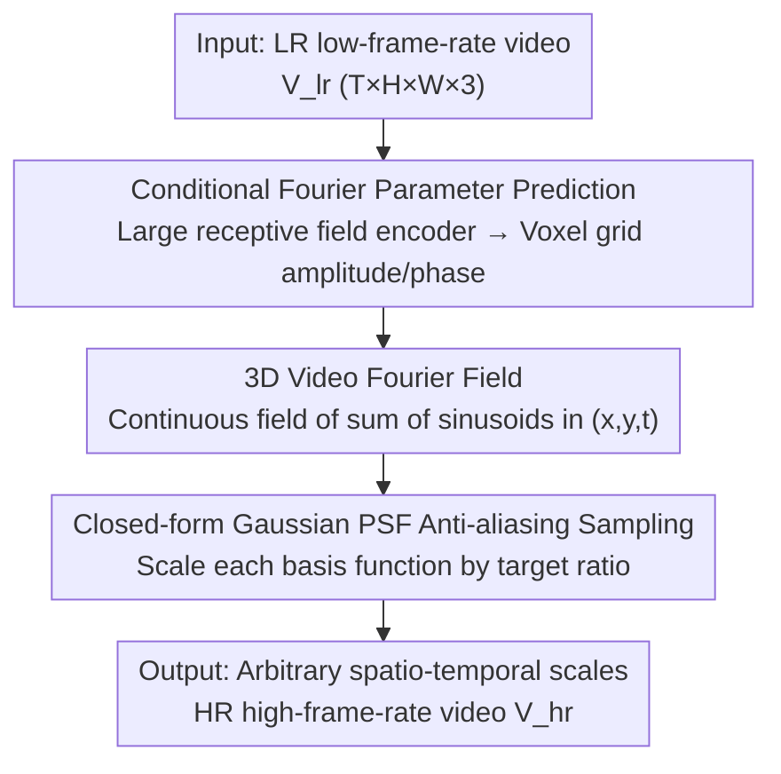

# Continuous Space-Time Video Super-Resolution with 3D Fourier Fields

**Conference**: ICLR2026  
**OpenReview**: [https://openreview.net/forum?id=bLmImy7g1w](https://openreview.net/forum?id=bLmImy7g1w)  
**Code**: Project Page https://v3vsr.github.io  
**Area**: Video Restoration / Continuous Space-Time Super-Resolution  
**Keywords**: Video Super-Resolution, Continuous Representation, Fourier Fields, Anti-aliasing, Space-time Modeling

## TL;DR
This paper proposes V3, which utilizes a unified 3D Video Fourier Field (VFF) to represent video directly as a sum of sinusoids in $(x,y,t)$ space. By discarding the fragmented and fragile "Spatial INR + Optical Flow Warp" paradigm, it transforms super-resolution at arbitrary spatial and temporal scales into a single continuous sampling process. Furthermore, it enables the closed-form incorporation of a Gaussian Point Spread Function (PSF) for anti-aliasing, achieving a PSNR improvement of approximately 1.5–2 dB across multiple benchmarks while being faster and more memory-efficient.

## Background & Motivation
**Background**: The goal of Continuous Space-Time Video Super-Resolution (C-STVSR) is to recover high-definition, high-frame-rate video from low-resolution, low-frame-rate inputs with arbitrary sampling rates in both space and time. Mainstream approaches (VideoINR, MoTIF, BF-STVSR) decompose the video representation into two parts: each frame is characterized by a 2D Implicit Neural Representation (INR) for spatial content, while motion between frames is characterized by another function (usually an optical flow field). During inference, features from neighboring frames are aligned and fused into intermediate frames via explicit warping.

**Limitations of Prior Work**: This "Space $\times$ Time" decomposition has several inherent flaws. First, optical flow estimation is most prone to errors at object boundaries and occlusion regions; once warping is misaligned, the super-resolution quality collapses, with errors concentrating exactly in the most critical parts of the image. Second, optical flow is typically estimated only between adjacent frames; extending motion information to longer temporal windows leads to accumulated errors, over-smoothing, and difficulties in handling (de-)occlusions, making "temporal modeling" difficult to beyond adjacent frame pairs. Third, anti-aliasing is problematic: the representation does not know the future sampling rate during training and must store high-frequency details for the highest possible scale. When sampling at low scales, these details exceed the Nyquist limit, causing aliasing artifacts. However, since INRs hide information in abstract latent spaces, incorporating an integral observation model (PSF) to suppress unrepresentable frequencies is computationally expensive and complex.

**Key Challenge**: Representing space and time separately essentially discards spatio-temporal correlations and offloads motion compensation to an unreliable optical flow module. Meanwhile, continuous representations lack a mathematical structure capable of direct, closed-form anti-aliasing.

**Goal**: To find a **unified, spatio-temporally consistent** continuous representation that simultaneously satisfies four criteria: simplicity, avoidance of explicit warping, support for long-range multi-frame motion context, and a built-in efficient anti-aliasing mechanism.

**Key Insight**: The authors note a classic fact—**translational motion in the frequency domain is equivalent to a phase shift** (Kuglin 1975). If the entire video is represented directly as a superposition of sinusoids in $(x,y,t)$ 3D space, motion is naturally encoded in the phase, eliminating the need for separate optical flow estimation and warping. Moreover, sinusoidal bases are inherently band-limited and can be multiplied by the frequency response of a Gaussian PSF in closed form.

**Core Idea**: Replace the "Spatial INR + Optical Flow Warp" paradigm with a minimalist continuous representation (VFF) consisting of a "sum of 3D sinusoids in $(x,y,t)$," transforming spatio-temporal super-resolution into analytical sampling of a unified frequency-domain field.

## Method

### Overall Architecture
V3 addresses the problem: given a low-resolution, low-frame-rate video $V_{lr}\in\mathbb{R}^{T\times H\times W\times 3}$, recover a signal $\hat V(x,y,t):\mathbb{R}^2\times[0,T]\to\mathbb{R}^3$ defined on a continuous domain. For any arbitrary spatial scale $s$ and temporal scale $r$, $V_{hr}\in\mathbb{R}^{rT\times sH\times sW\times 3}$ is obtained by sampling at the corresponding grid points.

The pipeline is streamlined: LR video is first fed into a neural video encoder with a large spatio-temporal receptive field (RVRT is used as the backbone). The encoder outputs a voxel grid, where each voxel predicts a set of VFF parameters—specifically, amplitudes $a_i$ and phases $\phi_i$ of 3D sinusoidal bases (frequencies $\omega_i$ are globally shared and fixed after training). These parameters define the local continuous function $\hat V$, the Video Fourier Field. Finally, a sampler with a Gaussian PSF is used to evaluate the field at any $(x,y,t)$ coordinates in closed form to obtain the super-resolved video. The entire system is differentiable and trained end-to-end.

### Key Designs

**1. 3D Video Fourier Field (VFF): Representing video as a sum of sinusoids in $(x,y,t)$**

This is the foundation of the work, directly addressing the "space/time fragmentation + explicit warp" pain point. The authors define a set of $N$ 3D sinusoidal basis functions $\{B_i\}_{i=1}^N$, where each basis is determined by a frequency $\omega_i\in\mathbb{R}^3$ and a phase $\phi_i\in\mathbb{R}$:

$$B_i(x,y,t)=a_i\cdot\sin\!\big(\omega_i\cdot(x,y,t)+\phi_i\big)$$

The video signal is a finite superposition of these bases $\hat V(x,y,t)=\sum_{i=1}^N B_i(x,y,t,a_i,\phi_i,\omega_i)$. It is termed a "Fourier Field" because its form resembles the classic Fourier transform, though it is not a strict Fourier series—true Fourier series require infinite orthogonal bases with integer frequencies for completeness, whereas here, a finite number of continuous, non-orthogonal sinusoidal bases are used. sacrificing orthogonality yields a **continuous, band-limited** representation that can be queried at any spatial/temporal resolution, precisely what is needed for C-STVSR.

Why does this bypass optical flow? Because translational motion in the frequency domain is a phase shift; motion is naturally encoded into $\phi_i$, removing the need for an error-prone external optical flow module for frame-to-frame warping. Furthermore, since it is defined in the joint $(x,y,t)$ space, it can model long-range, non-linear, and periodic motions simultaneously rather than being trapped between adjacent frames. To keep the number of basis functions manageable, $(x,y,t)$ space is partitioned into local axis-aligned voxels, each fitting its own VFF (with parameters adjusted by local content), while maintaining coverage across the entire continuous domain when combined.

**2. Conditional Fourier Parameter Prediction: Mapping LR video to field parameters via large receptive field encoders**

Having the VFF form is insufficient; one must determine the **amplitudes and phases for a specific input video**. The authors utilize a domain-specific neural video encoder $E$ (RVRT, embedding dimension 90, 12 attention heads), which aggregates semantic features $E(x)\in\mathbb{R}^{T\times H\times W\times F}$ for each input voxel over a large spatio-temporal receptive field. A small convolutional network then maps these features to VFF parameters $\{(a_j,\phi_j)\}_j$ on the 3D grid. Compared to methods that only see adjacent frame flow, this large context allows the model to reason jointly across multiple frames, more robustly handling occlusions/de-occlusions and capturing non-linear and periodic motions that simple inter-frame interpolation cannot.

A key simplification is that **frequencies $\{\omega_i\}$ do not vary by voxel and are learned only once during training, remaining fixed for all videos and voxels during inference**. Each voxel only adjusts amplitudes and phases to fit the input. This not only saves computation, but the authors also found that sharing the same set of frequency bases slightly improves the stability and continuity of the reconstructed video. Global consistency across voxels is ensured by the encoder's large receptive field—although each cell fits its own VFF, the parameters are derived from the same backbone that has observed a wide range of context.

**3. Closed-form Gaussian PSF Anti-aliasing Sampling: Hardcoding theoretically correct PSFs into sampling**

Super-resolution at arbitrary scales must handle aliasing: during training, the future sampling scale is unknown, so the representation includes high frequencies up to the maximum scale. These high frequencies cross the Nyquist limit during low-scale sampling. A benefit of VFF is that anti-aliasing can be done in **closed-form**. According to Fourier theory, downsampling under a Gaussian PSF with variance $\sigma$ is equivalent to multiplying each basis function by a frequency-dependent factor:

$$\hat V_\sigma(x,y,t)=\sum_{i=1}^N B_i(x,y,t)\cdot\xi(\omega_i,\sigma),\qquad \xi(\omega_i,\sigma)=\exp\!\big(-\|\omega_i\|^2/8\pi^2\sigma^2\big)$$

where $\sigma$ is inversely proportional to the effective sampling rate (determined by the Nyquist limit). In other words, aliasing-free sampling reduces to "per-basis frequency scaling + phase shifting," which can be implemented with a single matrix multiplication and element-wise addition/scaling, making it far more efficient than explicit filtering or oversampling. Unlike VideoINR/MoTIF/BF-STVSR, which treat the appropriate PSF as part of a neural model to be learned from data, V3 hardcodes the theoretically correct PSF into the sampling. This not only saves parameters but also improves generalization, as it is unaffected by training bias. $\sigma$ can also be set independently per dimension: for example, applying Gaussian blurring spatially while using point sampling temporally, or setting a small constant for time to simulate the narrow temporal PSF of a camera with finite exposure.

### Loss & Training
V3 is implemented in JAX with $N=512$ basis functions. Training is conducted on the Adobe240 dataset (240fps). Spatial downsampling is performed using bicubic interpolation (scale sampled from $U(1.2,4)$), while temporal downsampling is fixed at $\times 8$ to obtain 30fps inputs. All ground-truth frames (randomly sampled in space-time) serve as supervision. Training patches are $80\times80$ pixels and 14 frames long. The model uses L1 reconstruction loss, AdamW (lr=$10^{-4}$) with Cosine Annealing, and gradients clipped to a global L2 norm of 1. All parameters are trained from scratch, except for the optical flow component in RVRT (RAFT), which is fine-tuned only during the final $3\times10^5$ steps. Training is performed with a batch size of 16 on 16 GH200 GPUs, while inference requires only a single consumer-grade GPU (RTX 3090 Ti).

## Key Experimental Results

### Main Results
C-STVSR main task (Space $\times4$, Time $\times8$; Vid4 Time $\times2$), PSNR/SSIM:

| Dataset | Metric | V3 (Ours) | BF-STVSR (Prev. SOTA) | Gain |
|--------|------|-----------|--------------------|------|
| Vid4 | PSNR | 26.76 | 25.85 | +0.91 dB |
| GoPro-Average | PSNR | 32.26 | 30.22 | +2.04 dB |
| Adobe-Average | PSNR | 32.29 | 30.12 | +2.17 dB |
| Adobe-Center | PSNR | 32.91 | 30.83 | +2.08 dB |

V3 (13.7M parameters) sets new SOTA records across all three datasets, leading by >1.5 dB in most scenarios. The enlarged V3-Large (20.6M) further extends the lead to approximately 2 dB, indicating the model has not yet reached a point of saturation.

In Arbitrary Video Super-Resolution (AVSR, REDS validation set), V3 is the first C-STVSR method to **clearly outperform frame-wise image super-resolution (AISR)** across all scales (including out-of-distribution scales). The authors attribute this to the larger temporal context window provided by unified spatio-temporal bases, which allows for cross-frame redundancy utilization rather than just flicker avoidance:

| Scale | V3 | BF-STVSR | RDN-LTE† (Frame-wise AISR) |
|------|------|----------|------------------------|
| ×2 | 36.53 / 0.963 | 34.72 / 0.946 | 34.73 / 0.943 |
| ×4 | 29.92 / 0.849 | 29.11 / 0.820 | 28.75 / 0.804 |
| ×8 | 25.96 / 0.690 | 25.40 / 0.668 | 25.24 / 0.669 |

### Ablation Study
Boundary cases of "Space/Time Decoupling" (Adobe240, setting the other dimension to $\times1$) highlight the value of unified representation:

| Configuration | VideoINR | MoTIF | BF-STVSR | V3 |
|------|----------|-------|----------|-----|
| Space Only S×4, T×1 | 31.84 / 0.904 | 32.95 / 0.916 | 33.03 / 0.917 | **34.25 / 0.938** |
| Time Only S×1, T×8 | 24.45 / 0.712 | 28.09 / 0.843 | 29.37 / 0.867 | **33.43 / 0.936** |

Temporal Consistency (tOF↓, Vid4, lower is better): V3 = 0.254, V3-Large = 0.250, significantly better than BF-STVSR (0.323), MoTIF (0.354), and VideoINR (0.344).

Computational Overhead (14×80×80 patch, $\times8$ Time $\times4$ Space, RTX 3090 Ti):

| Method | Inference Time | Memory |
|------|----------|------|
| VideoINR | 3.03 s | 2.6 GiB |
| MoTIF | 1.88 s | 8.4 GiB |
| BF-STVSR | 1.90 s | 10.4 GiB |
| V3 | **1.27 s** | 6.1 GiB |

### Key Findings
- In the Time-only $\times8$ interpolation scenario, V3 outperforms BF-STVSR by **4 dB** (33.43 vs 29.37). This is the largest gap in all comparisons and directly proves that VFF's temporal modeling is far stronger than "optical flow + warp," as the latter produces ghosting or repeated textures at abrupt motion boundaries and occlusions due to inaccurate flow.
- By hardcoding the "theoretically correct PSF" into sampling for anti-aliasing, V3 generalizes better than methods that learn the PSF from data, maintaining a stable lead even at out-of-distribution scales (REDS).
- Basis function analysis shows a non-uniform distribution learned by the model: denser along coordinate axes (corresponding to horizontal/vertical structures) and with more high-frequency than low-frequency components. Amplitudes decay as frequency increases, consistent with classic Fourier analysis—indicating the representation captures the data structure effectively.

## Highlights & Insights
- **"Motion = Phase Shift" is the pivot of the paper**: By writing video into the $(x,y,t)$ frequency domain, translational motion automatically becomes phase. Consequently, the two most fragile components—optical flow and warping—are completely removed. This is an elegant approach of "changing the coordinate system to make the hard problem disappear," a concept worth transferring to other low-level vision tasks requiring motion compensation.
- **Anti-aliasing transformed from "learned" to "calculated"**: Because the bases are sinusoids, the effect of a Gaussian PSF reduces to multiplying each basis by $\exp(-\|\omega_i\|^2/8\pi^2\sigma^2)$, achievable with a single matrix multiplication. Replacing a capability that a network originally had to learn implicitly with a closed-form formula provides both parameter savings and generalization guarantees—an exemplar of "replacing black boxes with the right mathematical structure."
- **Shared Frequency Bases**: Sharing a set of fixed frequency bases across all videos and voxels, adjusting only amplitudes and phases, saves computation and improves stability. This suggests that for many continuous representation tasks, "fixed bases, adaptive coefficients" might be more robust than "learning the bases."
- **Fast, High Quality, and Memory Efficient**: Achieving 1.27s inference while leading by 1.5–2 dB shatters the conventional wisdom that quality relies solely on stacking more compute.

## Limitations & Future Work
- **Ours**: At extremely high scales, the output tends towards smoothness, a common issue in regression-based SR where the training objective favors low distortion over perceptual realism; generative models (like diffusion) would look better but "hallucinate" details. The lack of hallucination is the price of low reconstruction error.
- **Ours**: VFF is a finite 3D Fourier sum with a simple structure, which theoretically could become a bottleneck for extremely high-frequency content; no issues were observed in current tests, but $N$ can be increased if necessary.
- **Ours**: The degradation operator could be extended beyond spatio-temporal downsampling to more complex degradations (sensor noise, motion blur, compression artifacts). Motion blur is particularly natural—simply setting $\sigma_{\text{time}}$ to a large value.
- **Observations**: Evaluations were all conducted on synthetic degradations (bicubic + sub-sampling). Performance under real-world degradations (unknown kernels, compression, noise mixtures) has not yet been verified. Additionally, the encoder still relies on a heavy backbone like RVRT; the "simplicity" of VFF is primarily in the representation side, whereas parameter prediction remains relatively heavyweight.

## Related Work & Insights
- **vs VideoINR**: VideoINR parameterizes video as decoupled spatial and temporal INRs, where the temporal INR predicts backward motion fields for warping. However, backward flow changes structurally over time and is discontinuous and hard to learn at motion boundaries. V3 uses a unified $(x,y,t)$ field where motion is phase, eliminating the need for warp entirely.
- **vs MoTIF**: MoTIF learns forward motion trajectories and uses softmax splatting for forward warping, leaving occlusion conflicts to be handled by the decoder. V3 performs no feature warping, relying on joint multi-frame reasoning via the large receptive field encoder.
- **vs BF-STVSR**: BF-STVSR also introduces Fourier bases in latent space and uses B-splines to parameterize the motion field, but **still relies on explicit warping** to map keyframes to intermediate frames and lacks a principled anti-aliasing mechanism. V3, which has no warp and closed-form anti-aliasing, leads it by 4 dB in pure temporal interpolation.
- **vs Frame-wise Image SR (LTE/CLIT/HIIF)**: Applying image SR frame-wise ignores temporal dependencies and causes flickering. V3 is the first C-STVSR method to outperform frame-wise AISR across all scales by utilizing cross-frame redundancy through unified spatio-temporal bases.

## Rating
- Novelty: ⭐⭐⭐⭐⭐ Transforming space-time unification into 3D Fourier fields, motion into phase, and anti-aliasing into closed-form calculations represents a true paradigm shift in C-STVSR representation.
- Experimental Thoroughness: ⭐⭐⭐⭐⭐ Covers five dimensions: C-STVSR, pure spatial AVSR, pure temporal VFI, temporal consistency, and computational cost, including V3-Large scaling validation.
- Writing Quality: ⭐⭐⭐⭐⭐ Motivation progresses logically, and the mathematical motivation (phase=motion, closed-form PSF) is clear and persuasive.
- Value: ⭐⭐⭐⭐⭐ Fast, high-quality, and memory-efficient with single-card inference, offering direct value for practical scenarios like video editing and digital zoom.

<!-- RELATED:START -->

## Related Papers

- [\[CVPR 2026\] Time Without Time: Pseudo-Temporal Representation for Space-Time Super-Resolution](../../CVPR2026/image_restoration/time_without_time_pseudo-temporal_representation_for_space-time_super-resolution.md)
- [\[ICLR 2026\] Trajectory-aware Shifted State Space Models for Online Video Super-Resolution](trajectory-aware_shifted_state_space_models_for_online_video_super-resolution.md)
- [\[ICML 2026\] Phy-CoSF: Physics-Guided Continuous Spectral Fields Reconstruction and Super-Resolution for Snapshot Compressive Imaging](../../ICML2026/image_restoration/phy-cosf_physics-guided_continuous_spectral_fields_reconstruction_and_super-reso.md)
- [\[ICLR 2026\] SuperF: Neural Implicit Fields for Multi-Image Super-Resolution](superf_neural_implicit_fields_for_multi-image_super-resolution.md)
- [\[ICLR 2026\] Pixel to Gaussian: Ultra-Fast Continuous Super-Resolution with 2D Gaussian Modeling](pixel_to_gaussian_ultra-fast_continuous_super-resolution_with_2d_gaussian_modeli.md)

<!-- RELATED:END -->
