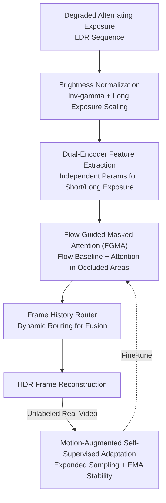

# DeAltHDR: Learning HDR Video Reconstruction from Degraded Alternating Exposure Sequences

**Conference**: ICLR2026  
**OpenReview**: [https://openreview.net/forum?id=buzIPnGxA8](https://openreview.net/forum?id=buzIPnGxA8)  
**Code**: https://zhang-shuohao.github.io/DeAltHDR/ (Available)  
**Area**: Image/Video Restoration · HDR Video Reconstruction  
**Keywords**: HDR Video Reconstruction, Alternating Exposure, Flow-Guided Masked Attention, Self-supervised Adaptation, Degradation Modeling

## TL;DR
DeAltHDR is the first to directly address the neglected reality that "alternating exposure LDR frames inherently contain noise and motion blur." By employing a Flow-Guided Masked Attention (FGMA) module, it performs cross-frame alignment only in occlusion areas where optical flow is unreliable, while utilizing cheap optical flow warping elsewhere. This achieves a tunable trade-off between efficiency and quality. Coupled with a self-supervised adaptation method improved for large video motions, it surpasses existing SOTA on both synthetic and real-world datasets.

## Background & Motivation
**Background**: The mainstream approach for HDR video reconstruction starts from LDR sequences with alternating short/long exposures, aligning and merging adjacent frames to recover the missing dynamic range. Representative methods like Chen et al., LAN-HDR, NECHDR, and HDRFlow focus on two tasks: compensating for brightness differences between adjacent frames and eliminating ghosting artifacts caused by motion misalignment.

**Limitations of Prior Work**: Existing methods almost exclusively assume that input LDR frames are clean (noise-free and blur-free), focusing all energy on brightness alignment and de-ghosting. However, alternating exposure strategies inherently introduce degradation: short-exposure frames are heavy with noise (especially in low light), while long-exposure frames are prone to motion blur from camera shake or object movement. This gap between "clean assumptions" and "dirty reality" causes existing methods to fail in real-world scenarios.

**Key Challenge**: Degradation exacerbates the already difficult step of "alignment." Optical flow and deformable convolutions are inaccurate under noise and blur; pure attention-based alignment offers high quality but suffers from exorbitant computational costs and fixed inference overhead. In other words, a hard trade-off exists between alignment quality and computational cost, and degradation pushes this trade-off to an even worse position. Furthermore, paired training data for the real world is scarce, causing models trained solely on synthetic data to suffer from performance collapse in real scenes.

**Goal**: (1) To perform high-quality HDR video reconstruction on degraded alternating exposure sequences containing noise and blur; (2) To make alignment both accurate and efficient, with inference costs that can be dynamically adjusted based on computational budgets; (3) To solve the domain gap problem caused by the scarcity of real-world data.

**Key Insight**: The authors observe that optical flow is actually sufficient and cheap for most non-occluded areas; problems only arise in a few occluded or unreliable regions. Therefore, it is unnecessary to perform expensive dense attention on the entire frame; attention should only be applied to the small subset of pixels where "optical flow is unreliable." While the recent BracketIRE considers degradation, it is designed for HDR images rather than video, yielding suboptimal results when directly applied to video.

**Core Idea**: Use "Optical flow baseline + Sparse attention only in unreliable areas" instead of "Full-frame dense attention" to align degraded frames, and make the attention ratio a continuously adjustable knob. Additionally, transform image-based self-supervised fine-tuning into a version capable of handling large video motions.

## Method

### Overall Architecture
DeAltHDR is built upon the multi-scale encoder-decoder architecture, Turtle. When processing frame $t$, it utilizes four neighboring frames (two before, two after) to assist in reconstruction. The input undergoes brightness normalization preprocessing: LDR frames are linearized via inverse gamma correction, and all long-exposure frames are scaled by the exposure ratio $\Delta e_{2i}/\Delta e_{2i-1}$ to align with short-exposure brightness. Finally, the linear frames and their gamma-transformed versions are concatenated $\{L_t^c\}=\{\hat L'_t,(\hat L'_t)^\gamma\}$ ($\gamma=1/2.2$) and fed into the network.

The network uses two encoders with identical structures but independent parameters to process short-exposure and long-exposure frames separately, extracting multi-scale features $\{F_t^i\}_{i=1,2,3}$. In each scale's decoding block, the original Turtle alignment module is replaced by the proposed **Flow-Guided Masked Attention (FGMA)**: it takes current frame features $F_t^{in}$ and neighbor frame features $F_{t-1}^i$, outputting the aligned neighbor feature $F_{t-1\to t}^{out}$. This is calculated for each of the four neighbors and concatenated. Finally, the original frame history router from Turtle performs dynamic routing to fusion these motion-compensated neighbor features using adaptive relevance weighting. Training follows a two-stage paradigm: pre-training on a self-constructed synthetic paired dataset, followed by fine-tuning on unlabeled real videos using the proposed motion-augmented self-supervised method.

### Key Designs

**1. Flow-Guided Masked Attention (FGMA): Applying attention only where flow is unreliable**

This is the core of the paper, addressing the pain point that "degraded frames are hard to align and pure attention is too expensive." The key to FGMA is using a bidirectional consistency check to identify "unreliable regions" and then limiting expensive attention to these areas. Specifically, a lightweight pre-trained flow network (SpyNet) calculates bidirectional optical flows $O_{t-1\to t}$ and $O_{t\to t-1}$. Warping $L_t$ to $t-1$ and back to $t$ gives $L_{t\to t-1\to t}$, and the absolute difference $D_{t-1\to t}(i,j)=|L_{t\to t-1\to t}(i,j)-L_t(i,j)|$ directly measures bidirectional warping inconsistency (occlusion degree). A binary occlusion mask is derived using a sensitivity factor $s$:

$$M_{t-1\to t}(i,j)=\begin{cases}1 & \text{if } s\cdot D_{t-1\to t}(i,j)/255 > 0.5\\ 0 & \text{otherwise}\end{cases}$$

For regions marked by the mask, attention is used for alignment refinement: the query $Q$ is obtained by element-wise multiplication of current features and the mask $Q=\mathrm{Proj}_q(F_t^{in}\odot M)$, while key/value come from neighbor features. The final output is a concatenation of the flow-warped feature $F^{flow}_{t-1\to t}=\mathrm{Warp}(F_{t-1}^i,O_{t\to t-1})$, the mask $M$, and the attention refinement $F^{att}_{t-1\to t}$.

Its effectiveness lies in being "sparse + targeted": the vast majority of pixels use cheap flow, while only a few occluded pixels use attention, achieving a much better balance than pure attention. Unlike MIA-VSR, which calculates masks based on simple frame differences, HDR LDR frames have massive exposure and degradation differences, so bidirectional consistency is used here instead of frame differences.

**2. Tunable Attention Ratio: An adjustment knob for adaptive inference cost**

This addresses the issue that "existing methods have fixed costs and cannot scale with computational budgets." Since the proportion of non-zero pixels in the mask is controlled by $s$, adjusting $s$ allows the model to slide continuously from "pure flow-dominant" to "attention-dominant." The authors define four key boundaries $s=0$ (pure flow), $s=15$ (balanced), $s=100$ (attention-heavy), $s=\infty$ (pure attention), plus 16 sampling points. At test time, one can pick any point on the performance-cost curve—saving power at the bottom-left or maximizing PSNR at the top-right. This allows the same model to be deployed on hardware with varying capacities without retraining.

**3. Independent Dual-Encoder Parameters: Specializing encoders for different degradations**

Short-exposure frames have heavy noise, while long-exposure frames have heavy blur; the nature of these degradations is fundamentally different. This paper provides two identical encoders with **completely independent parameters** for short and long exposures, allowing them to specialize in extracting features under their respective degradations. Ablations show that having independent parameters across all three scales yields the best results (PSNR 32.55), while sharing parameters at different levels leads to monotonic performance drops (fully shared drops to 31.96).

**4. Motion-Augmented Self-Supervised Adaptation: Handling large video motions**

BracketIRE's image-level self-supervised fine-tuning provides only minor gains when applied to video because its sampling is strictly limited to the input subset, failing to cover diverse motion magnitudes. This paper's approach: input 5 consecutive frames $\{L_i^c\}_{i=t-2}^{t+2}$ to get a high-quality output $\hat H_t$ as a pseudo-label; then construct a 3-frame subset (always including the current frame + a randomly selected long-exposure neighbor + a randomly selected short-exposure neighbor) to get $\tilde H_t$. A temporal loss $L_{time}=\|T(\tilde H_t)-T(sg(\hat H_t))\|_1$ pulls them together ($T$ is $\mu=5000$ tone-mapping, $sg$ is stop-gradient). This random sampling introduces inter-frame motion diversity and improves temporal consistency. An EMA regularization loss $L_{ema}$ is added for stability: $L_{total}=L_{time}+\beta L_{ema}$. The sampling range is expanded from $t\pm2$ to $t\pm6$ to cover even larger motions.

### Loss & Training
Pre-training uses $\ell_1$ loss plus VGG perceptual loss: $L_{total}=L_1+\lambda_{vgg}L_{vgg}$, both calculated in the $\mu$-law tone-mapped domain with $\lambda_{vgg}=0.5$. During training, three alignment branches are mixed: 30% batch pure flow, 30% pure attention, 40% FGMA (mask size determined by random $s$), so the model learns all three modes. Optimizer is AdamW ($\beta_1=0.9, \beta_2=0.999$), 250 epochs on synthetic data (init lr $4\text{e}{-4}$), and 20 epochs fine-tuning on real data (init lr $1\text{e}{-6}$) with cosine annealing. Patch size 192×192, batch size 8, on a single RTX A6000.

## Key Experimental Results

### Main Results
Synthetic datasets use PSNR/SSIM/LPIPS/HDR-VDP-2 (full-reference), while real-world datasets use CLIP-IQA/MANIQA (no-reference).

| Dataset | Metric | Ours (DeAltHDR) | Prev. SOTA (HDRFlow) | Gain |
| :--- | :--- | :--- | :--- | :--- |
| Synthetic | PSNR↑ | 32.55 | 32.26 | +0.29 |
| Synthetic | SSIM↑ | 0.9644 | 0.9629 | +0.0015 |
| Synthetic | LPIPS↓ | 0.192 | 0.196 | -0.004 |
| Synthetic | HDR-VDP-2↑ | 77.02 | 76.56 | +0.46 |
| Real (w/o adapt) | CLIPIQA↑ | 0.2621 | 0.2601 | +0.0020 |
| Real (w/ adapt) | CLIPIQA↑ | 0.2679 | 0.2601 | +0.0078 |
| Real (w/ adapt) | MANIQA↑ | 0.2774 | 0.2694 | +0.0080 |

In terms of temporal consistency, DeAltHDR outperforms HDRFlow and NECHDR across TWE/tLP/tOF metrics (tOF 3.21 vs 4.02 vs 4.36), indicating smoother reconstructed videos with less flickering. Regarding computational cost, at $s=15$, FLOPs are 128G and latency is 152ms, comparable to the fastest HDRFlow (116G/128ms), while significantly faster than SCTNet (338G/356ms) or BracketIRE (382G/387ms).

### Ablation Study

| Configuration | PSNR↑ | FLOPs(G) | Note |
| :--- | :--- | :--- | :--- |
| Flow-Guided Defor. Conv. | 32.42 | 102 | Replace alignment |
| Guided Defor. Attention | 32.46 | 202 | Replace with RVRT attention |
| Patch Alignment | 32.41 | 178 | Replace with PSRT |
| Ours (s=0, Pure Flow) | 32.42 | 84 | Efficient but suboptimal |
| Ours (s=15) | 32.55 | 128 | Balance point |
| Ours (s=∞, Pure Attn) | 32.65 | 169 | Quality upper bound |

| Dual-Encoder Strategy | PSNR↑ | LPIPS↓ |
| :--- | :--- | :--- |
| Fully Independent (3 levels) | 32.55 | 0.192 |
| level3 shared | 32.40 | 0.195 |
| level2,3 shared | 32.18 | 0.204 |
| Fully shared (3 levels) | 31.96 | 0.211 |

Self-supervised adaptation: Ours achieves CLIPIQA 0.2679 / MANIQA 0.2774, outperforming TMRNet (0.2648/0.2732) and the no-adaptation baseline (0.2621/0.2734).

### Key Findings
- FGMA achieves both higher PSNR and lower FLOPs: at $s=15$, it gets 32.55 with 128G FLOPs, performing better and faster than deformable attention (202G/32.46), proving "targeted sparse attention" is more cost-effective.
- The $s$ knob creates a smooth performance-cost curve: from $s=0$ (84G/32.42) to $s=\infty$ (169G/32.65), a single model allows for trade-offs without retraining.
- Independent dual-encoder parameters are monotonically effective: PSNR increases from 31.96 (shared) to 32.55 (independent), confirming that short/long exposure degradations require specialization.
- Even when trained only on synthetic data, DeAltHDR outperforms existing methods on real data, showing strong architectural generalization; self-supervised adaptation adds a further significant layer of improvement.

## Highlights & Insights
- **Hybrid "Flow + Attention" alignment is highly transferable**: The core insight is "not all pixels need expensive alignment; only occlusions where flow is unreliable do." This can be migrated to any cross-frame alignment tasks like VSR or video deblurring.
- **Computational budget as a continuous knob $s$**: By mixing alignment branches during training, a single model can slide along the cost-performance curve at test time—a "free" bonus of the FGMA sparse structure with high engineering value.
- **Degradation modeling + Self-supervised adaptation "One-Two Punch"**: Admitting the fact that alternating exposure frames are noisy and blurry (often ignored by the field) and closing the domain gap via synthetic pre-training followed by real-world self-supervision is the key to moving methods toward real-world deployment.

## Limitations & Future Work
- Real-world datasets still rely on "slight manual iPhone shaking" to produce motion blur; there may be a gap between controlled datasets and uncontrolled wild degradation distributions.
- Self-supervised adaptation relies on pseudo-labels $\hat H_t$, so its quality is capped by the pre-trained model—if the pre-trained model fails in extreme scenes, self-supervision might amplify those biases.
- While $s$ is flexible, the paper does not deeply analyze how to automatically select $s$ online based on content (it currently uses presets); automated scene-dependent attention ratio selection is a valuable direction.
- The method is tied to the Turtle architecture and triple-exposure settings; generalization to other exposure patterns (e.g., dual exposure) is not fully verified.

## Related Work & Insights
- **vs BracketIRE**: BracketIRE first considered degradation but only for HDR images; its adaptation sampling is limited. DeAltHDR extends this to video and uses motion-augmented sampling to handle large video motions.
- **vs HDRFlow**: HDRFlow is a representative SOTA for balancing performance/efficiency using efficient flow, but it assumes clean inputs and has fixed costs. DeAltHDR provides higher quality at similar speeds and supports dynamic cost adjustment.
- **vs MIA-VSR**: Both use sparse attention + masks, but MIA-VSR's mask comes from frame differences, which fails in HDR scenes due to massive exposure/degradation gaps. This paper uses bidirectional flow consistency instead.

## Rating
- Novelty: ⭐⭐⭐⭐ "Attention only where flow is unreliable + tunable ratio" is a simple yet effective mechanism that fills the gap in degraded HDR video.
- Experimental Thoroughness: ⭐⭐⭐⭐ Synthetic/Real datasets, Full/No-reference metrics, temporal consistency, computational costs, and thorough ablations.
- Writing Quality: ⭐⭐⭐⭐ Clear motivation, complete formulas, and good diagrams; the consistency check is explained well.
- Value: ⭐⭐⭐⭐ High engineering value by pushing HDR video to real-world scenarios with tunable costs; the approach is transferable to other video tasks.

<!-- RELATED:START -->

## Related Papers

- [\[CVPR 2026\] LRHDR: Learning Representation-enhanced HDR Video Reconstruction](../../CVPR2026/image_restoration/lrhdr_learning_representation-enhanced_hdr_video_reconstruction.md)
- [\[CVPR 2026\] ExpoCM: Exposure-Aware One-Step Generative Single-Image HDR Reconstruction](../../CVPR2026/image_restoration/expocm_exposure-aware_one-step_generative_single-image_hdr_reconstruction.md)
- [\[CVPR 2026\] HFR and HDR Video from Multi-Attenuated Spikes Using a Rapidly Rotating SpokeND Filter](../../CVPR2026/image_restoration/hfr_and_hdr_video_from_multi-attenuated_spikes_using_a_rapidly_rotating_spokend_.md)
- [\[ECCV 2024\] Intrinsic Single-Image HDR Reconstruction](../../ECCV2024/image_restoration/intrinsic_single-image_hdr_reconstruction.md)
- [\[ICLR 2026\] DeLiVR: Differential Spatiotemporal Lie Bias for Efficient Video Deraining](delivr_differential_spatiotemporal_lie_bias_for_efficient_video_deraining.md)

<!-- RELATED:END -->
## Related Papers

- [\[CVPR 2026\] LRHDR: Learning Representation-enhanced HDR Video Reconstruction](../../CVPR2026/image_restoration/lrhdr_learning_representation-enhanced_hdr_video_reconstruction.md)
- [\[CVPR 2026\] ExpoCM: Exposure-Aware One-Step Generative Single-Image HDR Reconstruction](../../CVPR2026/image_restoration/expocm_exposure-aware_one-step_generative_single-image_hdr_reconstruction.md)
- [\[ECCV 2024\] Intrinsic Single-Image HDR Reconstruction](../../ECCV2024/image_restoration/intrinsic_single-image_hdr_reconstruction.md)
- [\[ICLR 2026\] DeLiVR: Differential Spatiotemporal Lie Bias for Efficient Video Deraining](delivr_differential_spatiotemporal_lie_bias_for_efficient_video_deraining.md)
- [\[ICLR 2026\] Continuous Space-Time Video Super-Resolution with 3D Fourier Fields](continuous_space-time_video_super-resolution_with_3d_fourier_fields.md)

<!-- RELATED:END -->
