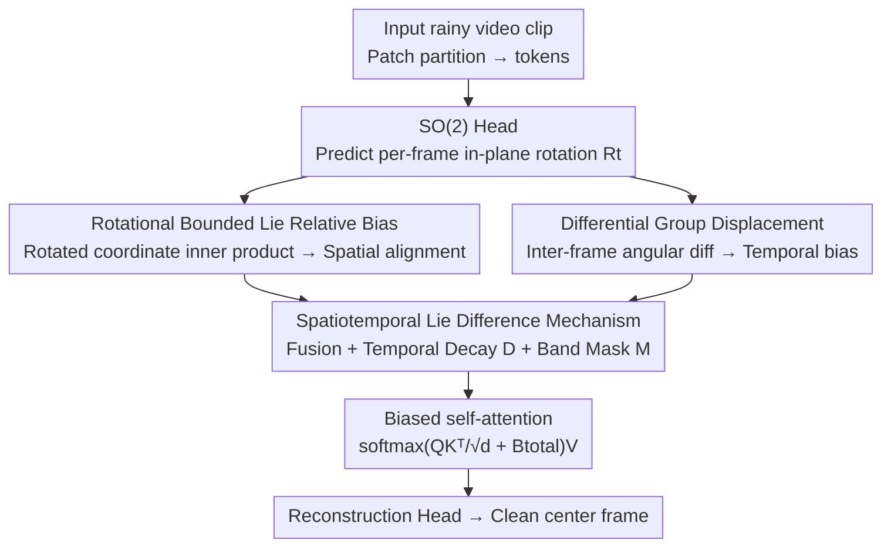

# DeLiVR: Differential Spatiotemporal Lie Bias for Efficient Video Deraining

**Conference**: ICLR2026  
**OpenReview**: [https://openreview.net/forum?id=W2eNfLmCHY](https://openreview.net/forum?id=W2eNfLmCHY)  
**Code**: https://github.com/Shuning0312/ICLR-DeLiVR  
**Area**: Video Restoration / Video Deraining  
**Keywords**: Video deraining, Lie group, Geometric prior, Attention bias, Spatiotemporal alignment

## TL;DR
DeLiVR integrates two types of geometric priors from the SO(2) Lie group—"per-frame rotation" and "inter-frame angular velocity differentiation"—directly into the Transformer attention scores as biases. It achieves geometrically consistent cross-frame alignment and temporal deraining without relying on optical flow, reaching SOTA performance on the real-world WeatherBench with only 2.64M parameters.

## Background & Motivation
**Background**: Video deraining aims to recover clean frames from videos corrupted by rain streaks, blur, and noise. Early methods relied on manual priors (frequency domain filtering, sparse/low-rank decomposition, Gaussian Mixture Models), followed by end-to-end learning with CNNs/RNNs/GANs. Recently, Transformers and diffusion models have been employed to capture long-range spatiotemporal dependencies.

**Limitations of Prior Work**: The key lies in how cross-frame information is utilized. Current approaches primarily rely on **optical flow alignment** or **unconstrained implicit attention**. Optical flow often fails in rainy conditions because it is built on the "brightness constancy" assumption, which is violated by rain streaks (failure cases illustrated in Fig.1c where $\nabla I\cdot v + I_t + \sigma_r \neq 0$). Moreover, flow calculation is computationally expensive and fragile under fast motion or camera shake. While implicit attention is more robust, it lacks geometric knowledge, potentially leading to "misaligned correspondences" when dealing with complex kinematics like rotation or rapid motion across varying rain densities.

**Key Challenge**: Networks lack a **physically interpretable motion prior** to distinguish between "true cross-frame correspondences" and "rain noise." Optical flow provides unreliable explicit motion, while implicit learning lacks any geometric constraints—neither is ideal.

**Goal**: To explicitly inject the physical prior of "continuous geometric transformations" into the **attention mechanism** without relying on optical flow, guiding the network to aggregate features along geometrically aligned directions while characterising motion trends.

**Key Insight**: Lie groups are naturally suited for representing continuous geometric transformations. The authors observe that cross-frame misalignment in rain primarily stems from **in-plane rotation** (slight camera pose changes). Thus, they use the SO(2) rotation group to model per-frame orientation and perform differentiation on its Lie algebra to obtain angular velocity, which mirrors the trend of rain streak direction changes.

**Core Idea**: Construct a "Spatiotemporal Lie Bias" using SO(2) Lie group rotation priors and inter-frame angular velocity differences. This bias is **directly added to the self-attention logits** ($\mathrm{softmax}(QK^\top/\sqrt d + \text{Bias})V$), serving as a replacement for fragile optical flow alignment.

## Method

### Overall Architecture
The backbone of DeLiVR is a biased spatiotemporal Transformer. Given a video clip (window size $T=5$), the input is partitioned into patches and embedded as tokens. A lightweight **SO(2) Head** predicts the in-plane rotation $R_t$ for each frame to capture camera pose changes. Based on these rotations, two complementary priors are constructed: **Spatial Bias** $B_{space}$ (inner product of rotated coordinates for geometric alignment) and **Temporal Bias** $B_{time}$ (inter-frame angular difference reflecting relative displacement). A **Spatiotemporal Lie Difference Mechanism** then fuses these using **temporal decay $D$** and a **band mask $M$** into a unified bias $B_{total}$, which is added to the self-attention scores. Attention is thus focused on reliable spatiotemporal correspondences, and the reconstruction head decodes the clean center frame.

### Key Designs

**1. SO(2) Head: Predicting Bounded Per-frame Rotation on Lie Algebra**

To address cross-frame misalignment caused by subtle camera pose changes, a lightweight head predicts a rotation matrix $R_t \in SO(2)$ for each frame $X_t$. Instead of direct angle regression, the head parametrizes the axis-angle $\omega_t$ in the Lie algebra $\mathfrak{so}(2)$, then maps it to a valid rotation via the exponential map: $R_t = \exp(\tanh(\omega_t))$, with a constraint $\|\omega_t\|\le\theta_{max}$. Since $\mathfrak{so}(2)$ consists of $2\times2$ skew-symmetric matrices $\begin{bmatrix}0 & -\theta\\ \theta & 0\end{bmatrix}$, the exponential map yields a standard rotation matrix $\begin{bmatrix}\cos\theta & -\sin\theta\\ \sin\theta & \cos\theta\end{bmatrix}$. The $\tanh$ and upper bound $\theta_{max}$ prevent degenerate solutions (excessive predicted rotations). This "predict in tangent space, map to manifold" approach is numerically stable, differentiable, and integrates naturally with Lie bias construction.

**2. Rotational Bounded Lie Relative Bias: Geometric Consistency in Attention Logits**

To inform the attention mechanism of geometric correspondences, patch token positions are embedded as unit-normalized 3D coordinates $p_i$ ($\|p_i\|=1$). For frame $t$, the coordinate is transformed by the predicted rotation: $\tilde p_{t,i}=R_t p_i$. The spatial bias between token $i$ in frame $t$ and token $j$ in frame $s$ is defined as the inner product of rotated coordinates: $B_{space}[(t,i),(s,j)]=\langle\tilde p_{t,i},\tilde p_{s,j}\rangle$. This measures geometric similarity under the predicted rotation. Adding this to the logits ($\text{Logits}=QK^\top/\sqrt d + B_{space}$) explicitly guides the self-attention to aggregate features along alignment directions, rather than being misled by rain streaks.

**3. Differential Group Displacement: Inter-frame Motion Trends via Lie Algebra**

Temporal consistency is achieved by modeling relative motion between adjacent frames $R_{t-1}, R_t$ as $\Delta R_t = R_{t-1}^\top R_t$. Mapping this back to the Lie algebra via the logarithm gives $v_t=\|\log(\Delta R_t)\|$, interpreted as the "Lie velocity." For any frame pair $(t,s)$, the angular difference $\theta_{t-1,t}=\|\log(R_t^\top R_s)\|$ is converted to a temporal bias $B_{time}[t-1,t]=-\theta_{t-1,t}/\kappa$. Larger pose differences result in heavier penalties, discouraging strong attention correspondences. To stabilize training, a velocity regularization $R_v=(1-\beta)\cdot\mathrm{mean}(v_t)+\beta\cdot\mathrm{mean}(|v_t-v_{t-1}|)$ is used to encourage smooth inter-frame transitions.

**4. Spatiotemporal Lie Difference Mechanism: Fusion with Decay and Masking**

Spatial and temporal biases are unified: $B_{total}=(B_{space}+\alpha B_{time})\odot D\odot M$. The temporal decay matrix $D[t,s]=\exp(-|t-s|/\tau)$ prioritizes short-range interactions where correspondences are more reliable. The band mask $M[t,s]=\mathbb{1}(|t-s|\le\delta)$ restricts attention to a local temporal neighborhood to prevent unstable distal correspondences. This coupling of geometric alignment and temporal regularization within the attention layer provides significant performance gains.

### Loss & Training
The model is trained end-to-end with a hybrid loss $L=L_{rec}+\lambda_\theta R_\theta+\lambda_v R_v$. $L_{rec}$ is the L1 reconstruction loss for pixel-level fidelity. $R_\theta$ constrains the magnitude of SO(2) rotations to stabilize predictions, and $R_v$ ensures temporal smoothness of the Lie velocity. Hyperparameters are set to $\lambda_\theta=\lambda_v=0.02$ using grid search. The implementation uses PyTorch, trained on 8 RTX 3090s with AdamW and cosine annealing over 5000 epochs.

## Key Experimental Results

### Main Results
Evaluated on four benchmarks: synthetic NTURain, Rain-Syn-Light, Rain-Syn-Complex, and real-world WeatherBench.

| Dataset | Metric | DeLiVR | Prev. SOTA | Note |
|--------|------|--------|----------|------|
| WeatherBench (Real) | PSNR↑ | **26.56** | 26.51 (S2VD) | New SOTA on real rain |
| WeatherBench (Real) | SSIM↑ | **0.781** | 0.773 (VDMamba) | VDMamba drops to 23.91/0.773 |
| Rain-Syn-Light | PSNR↑ | **30.53** | 28.76 (VDMamba) | +1.77 dB Gain |
| Rain-Syn-Complex | PSNR↑ | **24.68** | 21.05 (MFGAN) | Large margin on complex rain |
| NTURain | PSNR↑ | 34.06 | 36.29 (VDMamba) | Second to VDMamba |

Key observation: While VDMamba (CVPR25) performs well on synthetic NTURain, its performance significantly degrades on real-world WeatherBench. DeLiVR maintains superior performance in real scenarios, demonstrating that the Lie group geometric prior provides **generalization robustness** rather than overfitting to synthetic distributions.

### Ablation Study
Stepwise addition of components on NTURain:

| Configuration | PSNR↑ | SSIM↑ | FVD↓ | Note |
|------|-------|-------|------|------|
| Baseline (ST Transformer) | 29.21 | 0.868 | 47.25 | No Lie bias |
| + $B_{space}$ | 32.58 | 0.927 | 31.6 | Geometric alignment +3.37 dB |
| + $B_{time}$ | 33.14 | 0.935 | 22.5 | Motion modeling addition |
| + D&M (Full) | **34.06** | **0.952** | **18.5** | Final gain from decay/mask |

### Key Findings
- **Spatial bias is the primary contributor**: Adding $B_{space}$ alone increases PSNR from 29.21 to 32.58 (+3.37 dB), confirming that explicit geometric alignment is the core mechanism.
- **Superiority over optical flow**: In a controlled experiment replacing the Lie rotation module with "RAFT flow + MLP bias," DeLiVR outperformed the flow-based version by **+2.43 dB** on NTURain, proving that SO(2) manifold modeling is more robust than unconstrained flow for deraining.
- **Efficiency**: DeLiVR features only 2.64M parameters and 82.52 ms/frame latency. It is much smaller than Turtle (58.62M) or ViWS-Net (57.82M) and achieves better accuracy than the ultra-lightweight S2VD (0.53M).
- **Rotation Perturbation**: Under artificial in-plane rotation noise, the model maintains temporal stability and shows higher, more concentrated attention entropy, providing interpretability for its robustness.

## Highlights & Insights
- **Attention Bias vs. Explicit Warp**: Instead of warping frames using flow, geometric consistency is injected into the attention logits. This avoids failure modes of brightness constancy and allows alignment to occur adaptively within the attention mechanism.
- **Lie Algebra Predictor**: The use of $\exp$ mapping from $\mathfrak{so}(2)$ with $\tanh$ bounding provides a numerically stable and physically valid rotation parameterization template.
- **Lie Velocity Differentiation**: Deriving angular velocity from $R_{t-1}^\top R_t$ transforms temporal motion into a regularizable scalar sequence, simplifying temporal consistency.
- **Synthetic vs. Real Generalization**: The performance gap observed in previous SOTA models highlights that synthetic performance does not equal real-world robustness. Geometric priors are essential for resisting distribution shifts.

## Limitations & Future Work
- **Rotation-only modeling**: Current modeling does not cover complex non-rigid dynamics or camera motions beyond in-plane rotation (e.g., translation, zooming, 3D rotation). Future work aims to extend this to SE(2) or SE(3) groups.
- **Temporal constraints**: The fixed window ($T=5$) and temporal decay might limit very long-range temporal consistency in long video sequences.
- **Data Discrepancy**: A minor inconsistency exists between the text (+1.37 dB) and the ablation table (+3.37 dB); evaluations follow the reported table values.

## Related Work & Insights
- **Comparison with Flow-based methods**: Flow-based models suffer from brightness violations caused by rain. DeLiVR's SO(2) prior outperforms flow-based baselines (+2.43 dB) without the need for flow estimation.
- **Comparison with Transformer/Mamba**: Purely data-driven models lack geometric constraints, leading to poor generalization in real-world scenes (e.g., VDMamba's drop on WeatherBench). DeLiVR's explicit bias ensures robustness.
- **Comparison with Equivariant Networks**: Unlike computationally expensive fully equivariant designs, DeLiVR balances efficiency (2.64M parameters) by using lightweight Lie differential biases.

## Rating
- Novelty: ⭐⭐⭐⭐⭐ First to introduce Lie group differential biases to video deraining, providing a clean "geometric prior in attention" paradigm.
- Experimental Thoroughness: ⭐⭐⭐⭐ Comprehensive across four benchmarks, including flow-controlled comparisons and downstream tasks.
- Writing Quality: ⭐⭐⭐⭐ Clear derivations and motivation; minor digit inconsistencies.
- Value: ⭐⭐⭐⭐ Lightweight and robust in real scenarios; the paradigm is transferable to other low-level video tasks.

<!-- RELATED:START -->

## Related Papers

- [\[AAAI 2026\] SpatioTemporal Difference Network for Video Depth Super-Resolution](../../AAAI2026/image_restoration/spatiotemporal_difference_network_for_video_depth_super-resolution.md)
- [\[ICLR 2026\] Continuous Space-Time Video Super-Resolution with 3D Fourier Fields](continuous_space-time_video_super-resolution_with_3d_fourier_fields.md)
- [\[ICLR 2026\] DeAltHDR: Learning HDR Video Reconstruction from Degraded Alternating Exposure Sequences](dealthdr_learning_hdr_video_reconstruction_from_degraded_alternating_exposure_se.md)
- [\[CVPR 2026\] A Bit is All You Need! Efficient Video Capture via Single Bit Imaging](../../CVPR2026/image_restoration/a_bit_is_all_you_need_efficient_video_capture_via_single_bit_imaging.md)
- [\[ICLR 2026\] DISK: Differentiable Sparse Kernel Complex for Efficient Spatially-Variant Convolution](disk_differentiable_sparse_kernel_complex_for_efficient_spatially-variant_convol.md)

<!-- RELATED:END -->
