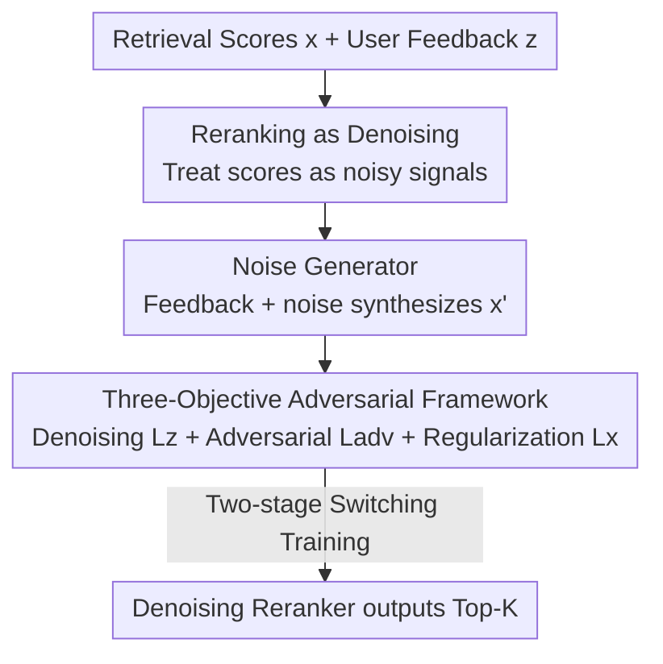

# Denoising Neural Reranker for Recommender Systems

**Conference**: ICLR2026  
**OpenReview**: [https://openreview.net/forum?id=JlwYkFm91F](https://openreview.net/forum?id=JlwYkFm91F)  
**Code**: https://github.com/maowenyu-11/DNR  
**Area**: Recommender Systems / Reranking  
**Keywords**: Recommender Systems, Multi-stage Reranking, Denoising, Adversarial Learning, Retrieval Scores

## TL;DR
This paper points out that retrieval scores in industrial two-stage "retrieval → reranking" pipelines are useful but noisy signals that are often ignored. It reformulates reranking as a denoising task for retrieval scores, utilizing an adversarial noise generator. By jointly training with denoising, adversarial, and distribution regularization objectives, it consistently outperforms existing SOTA reranking methods on three public datasets and an industrial system.

## Background & Motivation
**Background**: Industrial recommendation is typically a multi-stage cascade: a simple and efficient retriever first selects dozens of candidates from a million-item pool and scores them, followed by a more complex but slower reranker that refines these candidates to expose the top-K items to users. To co-optimize these stages towards a single goal (aligning with user behavior), most existing works focus on "reranker-aware retrievers," making the retriever cater to the reranker.

**Limitations of Prior Work**: The reverse direction—"retriever-aware reranker," or making the reranker utilize the information produced during the retrieval stage—has rarely been systematically studied. Existing reranking methods (pointwise rescoring, list-refinement, generator-evaluator, and diffusion-based list generation) basically discard retrieval scores or, at most, treat them as additional input features for concatenation.

**Key Challenge**: The authors empirically observed that retrievers, constrained by computational power, use simple models for large candidate pools, resulting in scores with **significantly higher noise** than those of the reranker (Figure 1e shows the reranker's error distribution is more concentrated around 0). Thus, the reranking stage is naturally a process of "denoising retrieval scores." However, noise in retrieval scores is uncertain; simply treating it as a feature (naive solution) might cause the denoising process to deviate from the system-level goal of "aligning with user feedback." The authors also theoretically prove that optimizing retrieval scores directly as input ($\mathcal{L}_{direct}$) only optimizes an **upper bound** of the negative log-likelihood of the data, where two residual terms $\mathcal{L}_1$ and $\mathcal{L}_2$ are independent of the reranker and uncontrollable, leading to a systematic mismatch between reranking results and user feedback.

**Goal**: To develop a "noise-aware" reranker that utilizes the retrieval score as a prior and explicitly treats it as a noisy signal for denoising, while ensuring the denoising direction aligns with actual user feedback.

**Core Idea**: Model reranking as a **noise reduction problem** for retrieval scores and introduce an **adversarial noise generator** to synthesize noisy scores that the retriever "might have produced." The reranker learns robust denoising on these augmented samples, approaching the true target of user feedback alignment through three objectives: "denoising + adversarial exploration + distribution regularization."

## Method

### Overall Architecture
DNR (Denoising Neural Reranker) views two-stage recommendation from a probabilistic perspective: for a user request $u$, the retriever first produces continuous retrieval scores $x_u=[x_{i_1},\dots,x_{i_n}]\in[0,1]^n$ (viewed as an uncontrollable prior $p_x(x)$), while the true user feedback is binary labels $z_u\in\{0,1\} ^n$ (clicks/watches/shares, etc.). The reranker is a conditional likelihood estimator $q_\theta(z|x,u)$, aiming to maximize the log-likelihood of observed feedback $\max_\theta \log p(z_u|u,\theta)$.

The key pivot of DNR is: instead of denoising only on real retrieval scores $x$, it introduces a **noise generator** $f_\phi(\cdot|z_u)$ to synthesize a "posterior of noisy scores the retriever might produce" $p_\phi(x|z_u)$ based on user feedback. The reranker then denoises on both real and synthetic scores. The methodology can be divided into three collaborative parts: rewriting reranking as a denoising task (with theoretical limitation analysis), constructing a noise generator to synthesize retrieval scores, and jointly training the denoiser and generator using a three-objective adversarial framework. The data flow is as follows:

### Key Designs

**1. Rewriting Reranking as Denoising: Identifying Theoretical Limitations of the Naive Approach**

The authors first express the naive solution of "treating retrieval scores directly as input" as $\mathcal{L}_{direct}=-\mathbb{E}_{x\sim p_x}[\log q_\theta(z_u|x)]$ (standard BCE under binary feedback). While seemingly reasonable, it is theoretically only an upper bound on the negative log-likelihood:

$$-\log p(z_u)=\mathcal{L}_{direct}+\mathcal{L}_1+\mathcal{L}_2,\quad \mathcal{L}_1=\mathbb{E}_{x\sim p_x}\Big[\log\tfrac{q_\theta(z_u|x)}{p_{z|x}(z_u|x)}\Big],\quad \mathcal{L}_2=-D_{KL}\big(p_x(x)\|p_{x|z}(x|z_u)\big).$$

Here, $p_{z|x}$ is the true feedback probability, and $p_{x|z}$ is the posterior of retrieval scores given feedback—both are determined only by the retriever prior and the user, and are **independent of and uncontrollable by the reranker $q_\theta$ in $\mathcal{L}_{direct}$**. The optimization of the upper bound only equals the true objective when $\mathcal{L}_1, \mathcal{L}_2$ are also small. Since the naive approach cannot manage them, a mismatch occurs. This analysis precisely identifies the problem as "the gap between $p_x$ and the posterior $p_{x|z}$," motivating the introduction of a noise generator to approximate the posterior.

**2. Noise Generator: Backward Synthesis of Noisy Retrieval Score Posterior from Feedback**

To bridge the posterior gap in $\mathcal{L}_2$, the authors equip the denoising reranker with a noise generator $f_\phi(\cdot|z_u)$. Using the reparameterization trick, they synthesize retrieval scores by adding noise to user feedback:

$$x'_u=(1-\lambda_c)z_u+\lambda_c\epsilon,\quad \epsilon\sim f_\phi,$$

where $\epsilon$ represents the "noise behavior" in retrieval scores, and $\lambda_c$ controls the noise ratio. The synthesized $x'_u\sim p_\phi$ simulates "noisy scores the retriever might have produced under this request," acting as a sampled approximation of the posterior $p_{x|z}$. There are two implementations: **Heuristic Generator** uses a preset distribution (the authors argue the conjugate prior/posterior of the retriever prior under binary feedback is a Beta distribution, hence $\epsilon\sim\mathrm{Beta}(\alpha,\beta)$); **Model-based Generator** uses a 2-layer MLP to learn a trainable $f_\phi^{model}$, directly outputting $x'_u$, allowing the noise distribution to fit adaptively and personally.

**3. Three-Objective Adversarial Denoising Framework: Decomposing Feedback Alignment**

The negative log-likelihood objective is decomposed into three optimizable terms and one non-optimizable residual:

$$-\log p(z_u)=\mathcal{L}_z+\mathcal{L}_{adv}+\mathcal{L}_x+\delta_x,$$
$$\mathcal{L}_z=-\mathbb{E}_{x\sim p_\phi}[\log q_\theta(z_u|x)],\quad \mathcal{L}_{adv}=\mathbb{E}_{x\sim p_\phi}\Big[\log\tfrac{q_\theta(z_u|x)}{p_{z|x}(z_u|x)}\Big],\quad \mathcal{L}_x=D_{KL}\big(p_\phi(x|z_u)\|p_x(x)\big).$$

Each term serves a specific purpose: **$\mathcal{L}_z$ (Augmented Denoising Loss)** makes the reranker $q_\theta$ predict true feedback $z_u$ on noisy scores $x'_u$ synthesized by the generator, effectively exposing the reranker to various noisy behaviors of the retriever to improve robustness. **$\mathcal{L}_{adv}$ (Adversarial Noise Loss)** fixes the reranker and trains the generator to synthesize samples that are "difficult to denoise correctly" $\min_\phi \log q_\theta(z_u|x'_u)$, forcing the reranker to become stronger. **$\mathcal{L}_x$ (Distribution Regularization)** uses KL divergence to pull the synthetic score distribution $p_\phi$ closer to the true retrieval prior $p_x$, ensuring the generated noise "looks like real retrieval noise." The final denoiser + adversarial generator forms a GAN-like minimax game.

### Loss & Training
The final loss for the reranker is $\mathcal{L}_\theta = \mathcal{L}_{direct} + \lambda_m \mathcal{L}_z$. The framework is model-agnostic (can use PRM, Pier, etc.). Training occurs in two stages for stability: the first $\lambda_e$ epochs use a heuristic generator (Gaussian/Beta) for stable convergence on $\mathcal{L}_z$, followed by a switch to the model-based generator to enable adversarial learning $\mathcal{L}_{adv}$ and regularization $\mathcal{L}_x$. Key hyperparameters $\lambda_c$ (noise ratio), $\lambda_m$ (denoising loss weight), and $\lambda_e$ (switching time) are searched in $[0.1, 1.0]$, $[0.1, 1.0]$, and $[0, 200]$ respectively.

## Key Experimental Results

### Main Results
Datasets: ML-1M, Kuaivideo, Amazon-Books, and an industrial recommendation system. The retriever uses collaborative filtering for top-50 candidates; the reranker selects top-K=6. Hidden dimension is 128. Metrics: H@6, N@6, M@6, F1@6, AUC. DNR-G / DNR-B denote Gaussian / Beta heuristic noise before the switch.

| Dataset | Metric | Best Baseline | DNR-B | DNR-G |
|--------|------|--------------|-------|-------|
| ML-1M | N@6 | 76.18 (MG-E) | 77.12 | **77.67** |
| Kuaivideo | N@6 | 66.19 (MG-E) | 70.15 | **69.60** (H@6 50.30, best) |
| Book | N@6 | 80.75 (EGRank) | **83.53** | 82.57 |
| Kuaivideo | AUC | 90.93 (Pier) | 93.38 | 93.20 |

DNR significantly outperforms four categories of baselines (traditional rescoring: SASRec/Caser; list-refinement: SetRank/PRM/MIR; generator-evaluator: Pier/NAR4Rec; diffusion: DiffuRec/DCDR) across all datasets, with the most notable gains on the noisier industrial Kuaivideo data.

### Ablation Study

| Configuration | Meaning | Result Trend |
|------|------|---------|
| c/+/w score | Score as concat/add/weight feature | Better than PRM without scores, proving score utility |
| DNR (PRM & Pier backbone) | Denoising formulation | Outperforms naive methods on both backbones |
| w/ G, w/ B | Heuristic only (no switch/adv) | Better than PRM, proves $\mathcal{L}_z$ effectiveness |
| G/B w/o $\mathcal{L}_{adv}$ | No adversarial objective | Performance drop across the board |
| G/B w/o $\mathcal{L}_x$ | No distribution regularization | Performance drop across the board |
| DNR-G / DNR-B (Full) | Complete model | Best |

Using Kuaivideo / N@6 as an example: PRM 55.93 → w/G 67.34 → DNR-G 69.60, validating that all three objectives contribute.

### Key Findings
- **Retrieval scores are indeed undervalued signals**: Even naive integration (c/+/w score) provides gains, but DNR's denoising approach is superior.
- **Adversarial + Model-based Generator > Heuristic**: Adaptive noise learning fits the data better than hand-crafted distributions.
- **Three objectives are indispensable**: Removing $\mathcal{L}_{adv}$ or $\mathcal{L}_x$ leads to performance degradation.
- **Optimal hyperparameter regions exist**: $\lambda_c, \lambda_m, \lambda_e$ have peak values, beyond which performance drops, indicating a need for balance.

## Highlights & Insights
- **Redefining "Reranking" as "Denoising Retrieval Scores"**: This is an elegant perspective shift—converting a signal often discarded as noise into the target of denoising and a useful prior, supported by empirical noise distribution evidence.
- **Theoretical Gap before Design**: The paper identifies the controllable gap in the likelihood upper bound and then designs the noise generator to fill it, providing stronger logical grounding than simple module stacking.
- **Adversarial GAN Logic in Reranking**: Using the generator to synthesize difficult samples for denoising is essentially a form of hard negative augmentation in the score space. This can be generalized to any cascaded system where downstream models consume noisy upstream scores.
- **Model-agnostic**: Plug-and-play compatibility with various reranking backbones like PRM or Pier ensures low industrial deployment costs.

## Limitations & Future Work
- **Dependency on the "Retrieval score is noisier than reranking" hypothesis**: In systems where the retriever is exceptionally strong or scores are discrete/unavailable, the benefits of the denoising perspective may diminish.
- **Unobservable Posterior $p_{x|z}$**: The residual $\delta_x$ can only be "expected to decrease" rather than directly optimized; there is no direct measure of how much the gap is closed.
- **Complex Training**: Adversarial training and two-stage switching introduce additional hyperparameters and potential stability/convergence issues in larger scales.
- **Future Directions**: Replacing the generator with stronger conditional generative models (e.g., Diffusion) or extending the denoising formulation to cascades with more than two stages.

## Related Work & Insights
- **vs Reranker-aware Retriever**: They use the downstream model to guide the retriever; Ours does the opposite, using retrieval scores to constrain the reranker. These are complementary directions.
- **vs List-refinement (PRM/SetRank)**: They model mutual influence but ignore retrieval scores; DNR provides a layer that can be added on top of them.
- **vs Generator-Evaluator / Diffusion Reranking**: Those methods involve heavy computational overhead; DNR strengthens the reranker without changing the "list generation" paradigm.
- **vs Adversarial Learning in RecSys (IRGAN/AdvIR)**: While IRGAN samples hard negatives and AdvIR perturbs embeddings, DNR synthesizes "hard-to-denoise scores" specifically to enhance reranking robustness.

## Rating
- Novelty: ⭐⭐⭐⭐⭐ Perspective shift of "reranking = denoising" + adversarial generation with theoretical support.
- Experimental Thoroughness: ⭐⭐⭐⭐ Three datasets + industrial system + multiple backbones + extensive ablation.
- Writing Quality: ⭐⭐⭐⭐ Clear logical chain from empirical observation to theory and design.
- Value: ⭐⭐⭐⭐ Model-agnostic and plug-and-play, providing direct value for industrial cascaded recommendation.

<!-- RELATED:START -->

## Related Papers

- [\[ICLR 2026\] Divergence-Free Neural Networks with Application to Image Denoising](divergence-free_neural_networks_with_application_to_image_denoising.md)
- [\[ICLR 2026\] DiffusionBlocks: Block-wise Neural Network Training via Diffusion Interpretation](diffusionblocks_block-wise_neural_network_training_via_diffusion_interpretation.md)
- [\[CVPR 2026\] The Surprising Effectiveness of Noise Pretraining for Implicit Neural Representations](../../CVPR2026/image_restoration/the_surprising_effectiveness_of_noise_pretraining_for_implicit_neural_representa.md)
- [\[ICLR 2026\] SuperF: Neural Implicit Fields for Multi-Image Super-Resolution](superf_neural_implicit_fields_for_multi-image_super-resolution.md)
- [\[CVPR 2025\] A Physics-Informed Blur Learning Framework for Imaging Systems](../../CVPR2025/image_restoration/a_physics-informed_blur_learning_framework_for_imaging_systems.md)

<!-- RELATED:END -->
