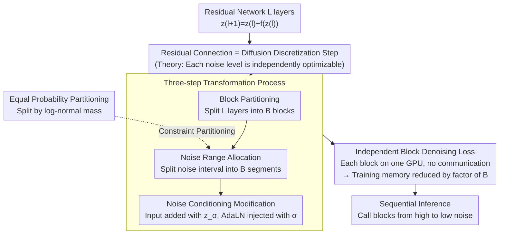

# DiffusionBlocks: Block-wise Neural Network Training via Diffusion Interpretation

**Conference**: ICLR2026  
**arXiv**: [2506.14202](https://arxiv.org/abs/2506.14202)  
**Code**: [SakanaAI/DiffusionBlocks](https://github.com/SakanaAI/DiffusionBlocks)  
**Area**: Image Restoration  
**Keywords**: block-wise training, diffusion models, score matching, memory efficiency, residual networks

## TL;DR

DiffusionBlocks is proposed to interpret the layer-wise updates of residual networks as discretization steps of a continuous-time diffusion process. This allows partitioning the network into blocks that can be trained completely independently, reducing training memory by a factor of $B$ (the number of blocks) while maintaining performance competitive with end-to-end training.

## Background & Motivation

- **Background**: End-to-end backpropagation requires storing intermediate activations for all layers, leading to memory consumption that grows linearly with network depth, which severely restricts model scaling and deployment.
- **Limitations of Prior Work**: Existing block-wise training methods (e.g., Forward-Forward, greedy layer-wise training) rely on heuristic local objective functions, lack theoretical guarantees, and are mostly validated only on classification tasks, failing to extend naturally to generative tasks.
- **Key Insight**: The denoising objective of score-based diffusion models naturally possesses the property that "each noise level can be optimized independently"—this provides the missing theoretical foundation for block-wise training.
- **Key Challenge**: The update rule of residual connections (ResNet, Transformer, etc.), $\mathbf{z}_{\ell+1} = \mathbf{z}_\ell + f_{\theta_\ell}(\mathbf{z}_\ell)$, corresponds to the Euler discretization of the probability flow ODE in diffusion processes.

## Core Problem

How to design a **theoretically grounded** block-wise training framework for Transformer-based networks such that:

1. Each block can be trained **completely independently** (without requiring gradients or activations from other blocks).
2. It maintains competitiveness with end-to-end training.
3. It is universally applicable across various tasks/architectures, such as classification and generation.

## Method

### Overall Architecture

The starting point of DiffusionBlocks is a neglected correspondence: the layer-by-layer stacked updates of a residual network are essentially a discretization trajectory of a continuous-time diffusion process. From this perspective, the $L$-layer network is partitioned into $B$ blocks, where each block is responsible for denoising a specific segment of noise levels in the diffusion process. The implementation consists of three steps: first, partitioning the network into $B$ contiguous blocks; second, dividing the noise interval $[\sigma_{\min}, \sigma_{\max}]$ into $B$ segments based on equal probability and assigning them to each block; finally, applying noise-conditioning modifications to each block so it can denoise independently within its assigned segment. Once modified, the $B$ blocks each possess a complete, non-communicating denoising loss—eliminating the need to pass gradients or activations between blocks during training. Only one block's activations are cached at any time, reducing memory by a factor of $B$. During inference, blocks are called sequentially from high to low noise levels to restore the target.

### Key Designs

**1. Residual Connection = Diffusion Discretization Step: Theoretical Basis for Independent Training**

Block-wise training has lacked theoretical guarantees because it was unclear why "local objectives" are equivalent to the global objective. This paper provides an answer within the Variance Exploding (VE) diffusion framework: given a noise level sequence $\sigma_0 > \sigma_1 > \cdots > \sigma_T$, Euler discretization of the probability flow ODE yields the update formula:

$$\mathbf{z}_{\sigma_\ell} = \mathbf{z}_{\sigma_{\ell-1}} + \frac{\Delta\sigma_\ell}{\sigma_{\ell-1}}\left(\mathbf{z}_{\sigma_{\ell-1}} - D_\theta(\mathbf{z}_{\sigma_{\ell-1}}, \sigma_{\ell-1})\right),$$

which is identical in form to the skip connection update rule of residual networks $\mathbf{z}_\ell = \mathbf{z}_{\ell-1} + f_{\theta_\ell}(\mathbf{z}_{\ell-1})$. By viewing each layer (or block) as a segment of the diffusion trajectory, the "independent optimization of noise levels" property inherent in score matching is inherited. Independent block training is thus no longer a heuristic assembly but an equivalent decomposition backed by the denoising objective.

**2. Three-step Transformation Process: Turning Any Residual Network into a Blockable Denoiser**

Based on the above correspondence, the paper transforms existing architectures into DiffusionBlocks via three steps (the `CONV` subgraph in the diagram). First, **block partitioning** splits the $L$-layer network into $B$ contiguous blocks $\mathcal{F}_1, \ldots, \mathcal{F}_B$. Second, **noise range allocation** defines a noise distribution $p_{\text{noise}}$ (log-normal is recommended) and partitions the interval $[\sigma_{\min}, \sigma_{\max}]$ into $B$ segments $\{[\sigma_b, \sigma_{b-1}]\}_{b=1}^B$, assigning each segment to a specific block. Third, **noise conditioning modification** extends each block's input to $\tilde{\mathbf{x}} = (\mathbf{x}, \mathbf{z}_\sigma)$, where $\mathbf{z}_\sigma = \mathbf{y} + \sigma\epsilon$, and injects the current noise level condition via mechanisms like AdaLN, allowing the same set of parameters to operate continuously within its assigned noise interval.

**3. Independent Denoising Loss: Simultaneous Reduction of Memory and Inference Overhead**

The loss for the $b$-th block is formulated as:

$$\mathcal{L}_b(\theta_b) = \mathbb{E}_{(\mathbf{x},\mathbf{y}),\, \sigma\sim p_{\text{noise}}^{(b)},\, \epsilon\sim\mathcal{N}(0,I)}\left[w(\sigma)\cdot\|f_{\theta_b|\sigma}(\mathbf{x}, \mathbf{y}+\sigma\epsilon) - \mathbf{y}\|_2^2\right],$$

performing weighted denoising regression on its assigned noise sub-distribution $p_{\text{noise}}^{(b)}$. Crucially, as the expectation is only taken over the block's specific noise interval, the $B$ losses are completely decoupled. They can be trained on separate GPUs with independent backpropagation and no synchronization. Their combined noise intervals cover the entire diffusion trajectory, making them equivalent to training the full network. This is the source of the $B$-fold reduction in training memory.

**4. Equal Probability Partitioning: Balancing Denoising Difficulty Across Blocks**

How the noise interval is partitioned determines the load balance. If partitioned uniformly by $\sigma$, the high and low noise ends would be assigned to regions with sparse samples or low information. This paper instead uses equal partitioning based on the cumulative probability mass of the log-normal distribution, i.e., ensuring $\int_{\sigma_{b-1}}^{\sigma_b} p_{\text{noise}}(\sigma)\,d\sigma = 1/B$. This ensures each block processes an equal amount of the training distribution, automatically creating finer intervals at the intermediate noise levels where denoising is hardest and samples are densest. On CIFAR-10, this improved FID from 43.53 (uniform) to 38.03.

## Key Experimental Results

| Task / Architecture | Dataset | End-to-end Baseline | Ours (DiffusionBlocks) | Block count $B$ / Memory Reduction |
|---|---|---|---|---|
| ViT Classification | CIFAR-100 | 60.25% Acc | 59.30% Acc | B=3 / 3× |
| DiT Image Gen | CIFAR-10 | 32.84 FID | 30.59 FID | B=3 / 3× |
| DiT Image Gen | ImageNet 256 | 12.09 FID | 10.63 FID | B=3 / 3× |
| Masked Diffusion Text | text8 | 1.56 BPC | 1.45 BPC | B=3 / 3× |
| AR Transformer Text | LM1B | 0.50 MAUVE | 0.71 MAUVE | B=4 / 4× |
| AR Transformer Text | OpenWebText | 0.85 MAUVE | 0.82 MAUVE | B=4 / 4× |
| Huginn (recurrent-depth) | LM1B | 0.49 MAUVE | 0.70 MAUVE | Eliminated 32 iterations |

- Forward-Forward reached only 7.85% accuracy on CIFAR-100, far underperforming DiffusionBlocks.
- On ImageNet with B=2, the FID of 9.90 was **better** than end-to-end training (12.09), suggesting moderate partitioning can improve performance.
- Equal probability partitioning significantly outperformed uniform partitioning across all layer allocation schemes (CIFAR-10 FID: 38.03 vs 43.53).

## Highlights & Insights

1. **Solid Theoretical Foundation**: Derived naturally from the noise-level independence of score matching, rather than heuristic local targets.
2. **High Versatility**: A unified three-step transformation process applies to five architecture types: ViT, DiT, AR Transformer, Masked Diffusion, and Recurrent-depth.
3. **Equal Probability Partitioning** is a simple yet critical design that ensures blocks handle equal denoising difficulty without manual layer tuning.
4. **Multiple Efficiency Gains**: $B$-fold reduction in training memory; $B$-fold acceleration in diffusion inference; removal of BPTT in recurrent-depth models.
5. **Occasional Superiority over End-to-End**: ImageNet FID for B=2/3 was better than end-to-end, suggesting a "specialization" benefit from moderate partitioning.

## Limitations & Future Work

- ViT classification was only validated on CIFAR-100; large-scale ImageNet classification has not been tested.
- Inference still requires sequential block calls, preventing parallelization of denoising steps.
- Noise conditioning (e.g., AdaLN) introduces a small amount of parameter and engineering complexity.
- Performance degrades when $B$ is too large (e.g., B=6 yielded FID 14.43), indicating a lower bound for block granularity.
- Primarily focused on Transformer-style residual architectures; applicability to networks without residual connections remains undiscussed.

## Related Work & Insights

| Method | Theoretical Foundation | Versatility | Continuous Time | Block Independent |
|---|---|---|---|---|
| Forward-Forward | Contrastive Objective | Classification only | ✗ | ✓ |
| NoProp | Diffusion-related | CNN only | ✓(CT) or ✗(DT) | ✗(CT) or ✓(DT) |
| DiffusionBlocks | Score matching | Classif. + Gen. | ✓ | ✓ |

- DiffusionBlocks is architecture-agnostic, unlike NoProp which is tied to specific CNNs. It also outperformed all NoProp variants on the original NoProp architecture (46.88 vs 46.06/21.31/37.57).
- Unlike stage-specific diffusion models (e.g., eDiff-I), which use joint training or shared parameters, DiffusionBlocks ensures **complete isolation** between blocks.

## Rating

- Novelty: ⭐⭐⭐⭐⭐ — The introduction of diffusion independence to block-wise training is a highly original theoretical contribution.
- Experimental Thoroughness: ⭐⭐⭐⭐ — Covers five architecture types, though classification tasks are relatively small-scale.
- Writing Quality: ⭐⭐⭐⭐⭐ — Mathematical derivations are clear; the three-step process is intuitive.
- Value: ⭐⭐⭐⭐ — Provides a theoretically sound paradigm for addressing memory bottlenecks in large model training.

<!-- RELATED:START -->

## Related Papers

- [\[ICLR 2026\] Denoising Neural Reranker for Recommender Systems](denoising_neural_reranker_for_recommender_systems.md)
- [\[CVPR 2026\] DiffDecompose: Layer-Wise Decomposition of Alpha-Composited Images via Diffusion Transformers](../../CVPR2026/image_restoration/diffdecompose_layer-wise_decomposition_of_alpha-composited_images_via_diffusion_.md)
- [\[NeurIPS 2025\] Encoder-Decoder Diffusion Language Models for Efficient Training and Inference](../../NeurIPS2025/image_restoration/encoder-decoder_diffusion_language_models_for_efficient_training_and_inference.md)
- [\[ICLR 2026\] Analyzing the Training Dynamics of Image Restoration Transformers: A Revisit to Layer Normalization](analyzing_the_training_dynamics_of_image_restoration_transformers_a_revisit_to_l.md)
- [\[ECCV 2024\] Efficient Diffusion Transformer with Step-wise Dynamic Attention Mediators](../../ECCV2024/image_restoration/efficient_diffusion_transformer_with_step-wise_dynamic_attention_mediators.md)

<!-- RELATED:END -->
