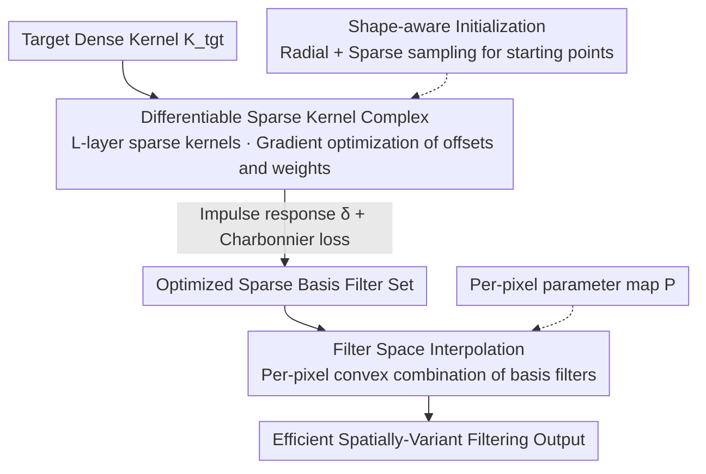

# DISK: Differentiable Sparse Kernel Complex for Efficient Spatially-Variant Convolution

**Conference**: ICLR2026  
**OpenReview**: [https://openreview.net/forum?id=bbuxDoRD2D](https://openreview.net/forum?id=bbuxDoRD2D)  
**Code**: To be confirmed  
**Area**: Image Restoration / Efficient Convolution  
**Keywords**: Sparse kernel decomposition, Spatially-variant convolution, Differentiable optimization, Real-time rendering, Mobile imaging

## TL;DR
A large and complex dense kernel is re-represented as a "cascade of sparse kernels." End-to-end differentiable optimization (instead of heuristic search) is used to learn the offsets and weights of sampling points in each layer. Combined with shape-aware initialization and filter space interpolation, this achieves up to approximately 20× acceleration for spatially-variant filtering on mobile devices with image quality close to ground-truth.

## Background & Motivation
**Background**: Image convolution with large and complex kernels is a fundamental operation in computational photography, optical imaging, and animation rendering—powering effects like depth-of-field bokeh, various Point Spread Functions (PSFs), and rotational/radial motion blur. Larger and more complex kernels yield more realistic results, but dense convolution incurs $O(M^2)$ cost ($M$ being the kernel side length), which is prohibitive for resource-constrained devices like mobile phones.

**Limitations of Prior Work**: To achieve acceleration, the industry primarily follows two paths, both with significant drawbacks. One is low-rank decomposition (LowRank/SVD), which supports arbitrary kernels but essentially replaces one large convolution with several smaller **dense** convolutions, resulting in limited sparsity and a low acceleration ceiling, as well as blocky artifacts on non-convex kernels. The other is using truly sparse kernels to approximate dense kernels (e.g., PST via parallel simulated annealing/tempering). While this achieves thorough sparsification and significant acceleration, it relies on heuristic searches to find sampling patterns, leading to high iteration costs (often hundreds of thousands of steps) and frequent misses of high-fidelity solutions due to the non-convex optimization landscape.

**Key Challenge**: To simultaneously achieve "generality for arbitrary/non-convex kernels" and "high acceleration from true sparsity," optimization must be performed in a highly non-convex discrete sampling space. Heuristic searches are slow and unreliable, while structured decompositions (low-rank, separable 1D kernels) can only handle specific kernel structures.

**Goal**: (i) Find high-fidelity sparse representations for arbitrary (including non-convex) dense kernels; (ii) Ensure stable optimization with fewer iterations; (iii) Extend single-kernel approximation to spatially-variant filtering (one kernel per pixel) without increasing runtime costs.

**Key Insight**: The authors observe that a "cascade of sparse kernel convolutions" can itself approximate a large dense kernel, and the offsets and weights of sampling points are continuous—since they are continuous, gradients can be calculated. Thus, the discrete heuristic search is reformulated as **end-to-end differentiable optimization**, replacing simulated annealing with gradient descent.

**Core Idea**: Decompose the dense kernel into a "differentiable Sparse Kernel Complex," using gradient optimization for offsets and weights across all layers. Convergence for non-convex kernels is stabilized via shape-aware initialization, and the cost of spatially-variant kernel synthesis is decoupled from image resolution through filter space interpolation.

## Method

### Overall Architecture
The input is a known target dense kernel $K_{tgt}$ (and a per-pixel parameter map $P$ for spatially-variant filtering), and the output is a set of sparse basis filters used at runtime to efficiently synthesize filtering results nearly identical to the target. The pipeline consists of three steps: first, use shape-aware initialization to provide a good starting point for sparse sampling points; second, treat the "Sparse Kernel Complex" ($L$ layers, $N$ sampling points per layer) as differentiable parameters and optimize every offset and weight end-to-end using impulse response supervision + Charbonnier loss; finally, for spatially-variant filtering, offline optimize a set of basis filters covering the effect range, and at runtime perform convex combination interpolation for each pixel based on parameters to avoid real-time dense kernel generation.

A key representation is writing the cascade of $L$ sparse kernels as nested convolutions:

$$I_{out} = (\dots((I_{in} * K_1) * K_2) * \dots * K_L),$$

Each sparse kernel $K_{sparse}=\{(o_i, w_i)\}_{i=1}^{N}$ contains only a small number of "offset-weight" pairs. Consequently, the per-pixel cost is reduced from $O(M^2)$ to $O(\sum_{l=1}^{L} N_l)$, where $\sum N_l \ll M^2$, leading to acceleration.

### Key Designs

**1. Differentiable Sparse Kernel Complex: Decomposing dense kernels into L-layer sparse kernels for end-to-end gradient optimization**

This step directly addresses the pain point of heuristic searches being slow and missing high-fidelity solutions. The authors formulate the decomposition as a continuous optimization problem: the offsets $o_{l,i}$ and weights $w_{l,i}$ for all sampling points in all layers form the learnable parameter set $\Theta=\bigcup_{l=1}^{L}\{(o_{l,j}, w_{l,j})\}_{j=1}^{N_l}$. The goal is to minimize the difference between the composite kernel and the target kernel:

$$\Theta^* = \arg\min_{\Theta}\ \mathcal{L}\big(K_{target},\ F_{approx}(\Theta)\big),\quad F_{approx}(\Theta)=K_{s,1} * K_{s,2} * \dots * K_{s,L}.$$

Since both offsets and weights are continuously differentiable, the entire cascade can be optimized end-to-end using Adam for all layers at once, moving away from the blind search in discrete space used by PST. The benefit is more reliable convergence and a significant reduction in iterations—the paper shows it can exceed the quality of PST after 100,000 steps (10,000 iterations × 10 parallel candidates) in just 1,000 steps, representing a 100x reduction in iterations, which is the direct dividend of "differentiable" over "heuristic" methods.

**2. Shape-aware Initialization: Radial + Sparse sampling to stabilize convergence for non-convex kernels**

While differentiable optimization is superior, the optimization landscape for non-convex target kernels is full of poor local optima; random initialization often leads to vanishing gradients or getting stuck. The authors use a two-part initialization to stabilize the starting point. The first is **Radial Initialization**: sampling points in the $l$-th layer are uniformly distributed on a circle with radius $r_l = l\cdot\Delta r$. The radius increases linearly with the layer index, causing the effective receptive field of the composite kernel to expand layer by layer, covering a large area of the target kernel from the start:

$$o_{l,i}=\Big(r_l\cos\tfrac{2\pi i}{N_l},\ r_l\sin\tfrac{2\pi i}{N_l}\Big),\quad w_{l,i}=\tfrac{1}{N_l}.$$

The second is **Sparse Sampling Initialization** for the first layer $K_{s,1}$ (which has the greatest impact on final output): instead of sampling within the kernel's bounding box (which contains many empty areas for non-convex kernels), rejection sampling is used to pick points directly from the kernel's support set (non-zero pixels). The effective sampling area $S$ is defined by the number of non-zero pixels, and the sampling radius $r=\sqrt{S/(N_s\pi)}$ is derived from the target sampling number $N_s$. This ensures sampling points naturally fit the target shape, avoiding gradient disappearance caused by empty regions and significantly reducing the risk of falling into poor local optima.

**3. Filter Space Interpolation: Efficient spatially-variant filtering via convex combination of basis filters**

Spatially-variant filtering requires generating an independent kernel for each pixel $(x,y)$ based on parameters $P(x,y)$. Generating dense kernels in real-time is too slow, and pre-storing all kernels consumes too much memory—the cost scales linearly with image resolution, which is the bottleneck. The authors' approach decouples the kernel synthesis cost from resolution: a set of ordered basis filters $\mathcal{F}=\{f_k(p_k)\}_{k=1}^{M}$ is optimized offline, discretely sampling a continuous 1D filter space (parameters $p_1<p_2<\dots<p_M$, with each basis being a set of sparse offsets and weights). At runtime, interpolation weights $\alpha(x,y)$ are derived from $P(x,y)$ for each pixel, and the kernel is synthesized as a convex combination of the basis filters:

$$f(x,y)=\sum_{k=1}^{M}\alpha_k(x,y)\cdot f_k,\quad \sum_k\alpha_k=1,\ \alpha_k\ge 0.$$

By interpolating directly at the "offset + weight" level, each pixel requires only a minimal number of parallelizable multiply-adds. The kernel generation cost becomes independent of image resolution, and memory is saved due to the high compressibility of the bases. The paper further analyzes that the optimized bases are "more linearly interpolatable" than those of PST/LowRank, allowing sharp complex structures to be maintained after interpolation, whereas PST introduces more noise and LowRank results in blurry averages.

### Loss & Training
To prevent the learned filters from overfitting to specific images, the authors employ an **image-independent** optimization strategy, utilizing the core property of Linear Shift-Invariant (LSI) systems—that a filter is completely characterized by its impulse response. Specifically, the multi-layer filter $F_\theta$ is applied to a discrete Dirac impulse $\delta$ (a single center point of 1) to obtain the synthesized kernel $K_{syn}=F_\theta(\delta)$, which is supervised to approximate the target kernel using the Charbonnier $L1$ loss:

$$\mathcal{L}=C(K_{syn}, K_{tgt}).$$

This "impulse response supervision" collapses the entire multi-layer filtering sequence into an equivalent kernel, allowing direct and precise alignment with the target without depending on any specific image. The implementation uses PyTorch + Adam, with the learning rate linearly decaying from $1\times10^{-3}$ to $1\times10^{-4}$ over 1,000 optimization steps per kernel, requiring only a single 24GB GPU (e.g., RTX 4090).

## Key Experimental Results

### Main Results
Evaluation kernels include Gaussian kernels ($\sigma=5\sim11$), geometric primitives (disk, ring), regular polygons, non-convex shapes (heart, four-pointed star, & symbol), animal silhouettes, and optical PSFs (coma, spherical aberration). Baselines include LowRank decomposition (SVD) and Parallel Tempering (PST). Spatially-variant filtering latency is measured on a mobile Snapdragon 8 Gen 3.

The table below compares latency and quality for three spatially-variant effects (Fig. 5); Ours achieves the highest PSNR with latency comparable to or lower than PST, closely matching GT quality:

| Spatially-Variant Effect | Method | Latency (ms) | PSNR (dB) |
|------------|------|-----------|-----------|
| 1D tilt-shift | GT (Reference) | 241.33 | — |
| | **Ours 24×4** | **12.66** | **39.27** |
| | PST 24×4 | 12.61 | 32.49 |
| | LowRank 49×4 | 23.15 | 33.22 |
| 2D rotational bokeh | **Ours 32×4** | **17.04** | **35.67** |
| | PST 32×4 | 16.94 | 28.56 |
| 2D radial motion blur | **Ours 32×4** | **26.01** | **34.21** |
| | PST 32×4 | 26.09 | 27.11 |

Regarding single-kernel approximation (Fig. 2/4), Ours achieves the lowest LPIPS across all tests, often by a significant margin: for a Gaussian kernel with an 8×6 configuration, LPIPS is approximately 0.001–0.002, while PST 8×6 is around 0.008–0.019. As $\sigma$ increases, PST performance degrades severely, while Ours remains visually consistent. Fig. 1 highlights a reduction from 241.33ms to 12.66ms, approximately **20×** acceleration with quality near GT.

### Ablation Study

| Config | Key Finding | Description |
|------|----------|------|
| Sparse Sampling Init (SS) | Optimal | Fastest convergence, highest quality |
| Incremental Radial Init (IR) | Second best | Stable but weaker than SS |
| Random Init (Rand) | Worst | Prone to poor local optima |
| Differentiable vs. PST | 1/100 Iterations | Ours 1,000 steps vs. PST 100,000 steps |
| Layers × Samples | More is better | All configurations converge stably; quality improves with more samples/layers |

### Key Findings
- **Initialization is Crucial**: SS > IR > Random. Even when PST is given SS initialization, it still requires over 30× the iterations to converge, and its final quality is significantly lower than Ours—indicating that the benefits primarily stem from "differentiable optimization" rather than just a change in initialization.
- **Differentiable vs. Heuristic**: Gradient optimization is particularly stable in sparse configurations (e.g., 12×4); PST shows noticeable noise/artifacts as $\sigma$ increases or samples decrease.
- **Basis Interpolatability Determines Spatially-Variant Quality**: The bases optimized in this work are "more linear," allowing sharp complex structures to be synthesized after interpolation, whereas PST interpolates noise and LowRank interpolates blur.

## Highlights & Insights
- **Reformulating Discrete Search as Differentiable Optimization**: The core insight is that "sampling point offsets + weights are continuously differentiable," allowing gradient descent to replace simulated annealing and reducing iteration counts to about 1/100—a classic example of reframing an engineering acceleration problem as a learning problem.
- **Impulse Response Supervision for Image-Independent Training**: Leveraging the LSI property "filter = impulse response," the multi-layer cascade is collapsed into a single equivalent kernel for supervision. Training does not depend on any images, ensuring natural generalization; this trick is transferable to any scenario requiring operator/filter approximation.
- **Interpolating in "Filter Space" instead of "Image Space"**: Decoupling the per-pixel kernel synthesis cost from resolution is the key strategy for accelerating spatially-variant filtering, applicable to bokeh, motion blur, variable PSFs, and other per-pixel operators.
- **Shape-aware (Rejection) Sampling**: Directly sampling from the support set for non-convex kernels instead of the bounding box avoids gradient disappearance in empty regions, serving as a practical solution for handling non-convex targets.

## Limitations & Future Work
- **Assumes Target Dense Kernel is Known**: Both optimization and filtering require $K_{tgt}$ to be available (same as LowRank/PST), making it unsuitable for "blind" scenarios where kernels are unknown and must be inferred from data.
- **One-Dimensional Filter Space**: Basis filters are sampled along a 1D parameter space. Handling multi-parameter effects (e.g., simultaneous variation of intensity + angle) for 2D anisotropic effects relies on two-parameter control; efficient sampling/interpolation for higher-dimensional filter spaces is not fully explored.
- **Evaluation Primed for Synthetic/Standard Kernels**: The kernel set mostly consists of analytical shapes and typical PSFs. Robustness under complex camera PSFs or extreme non-convex/multi-modal kernels requires further validation.
- **Possible Improvements**: Relaxing the known-kernel assumption to joint estimation of kernels and sparse decomposition from image pairs; or extending 1D bases into learnable high-dimensional manifolds to cover more complex spatially-variant effects.

## Related Work & Insights
- **vs. LowRank/SVD Decomposition (McGraw, 2015)**: Low-rank replaces large convolutions with several smaller **dense** convolutions, which limits sparsity and creates blocky artifacts on non-convex kernels. Ours optimizes a **natively sparse** kernel cascade, yielding more thorough acceleration and better non-convex fidelity.
- **vs. PST Parallel Tempering (Schuster et al., 2020)**: Also aims for truly sparse kernels, but PST relies on heuristic search, is sensitive to hyperparameters, requires 100k steps, and often misses high-fidelity solutions. Ours uses differentiable optimization, requiring ~1/100 iterations with higher and more stable quality.
- **vs. Separable/Structured Decomposition (Niklaus 2017, Depthwise Separable CNNs, etc.)**: These can only handle specific kernel structures (2D to 1D, space-time atoms, depthwise+1×1). Ours is a general differentiable decomposition for arbitrary (including non-convex) kernels.
- **vs. Analytical Fast Blur (Kawase, Dual Filtering, Summed-Area Table)**: Analytical methods are only effective for specific kernels like Gaussian and lack a systematic mapping from target $\sigma$ to parameters. Ours can match the target response for any kernel and fills this mapping gap.

## Rating
- Novelty: ⭐⭐⭐⭐ Reformulating heuristic sparse kernel search as end-to-end differentiable optimization, combined with impulse response supervision and filter space interpolation, is clear and practical.
- Experimental Thoroughness: ⭐⭐⭐⭐ Covers Gaussian/geometric/non-convex/PSF kernels and three spatially-variant effects, including initialization and configuration ablations, with mobile-measured latency; some numerical layouts in comparison tables are slightly cluttered.
- Writing Quality: ⭐⭐⭐⭐ Logical flow from motivation to method to experiments, with appropriate formulas and diagrams.
- Value: ⭐⭐⭐⭐ Directly valuable for accelerating complex filtering in mobile imaging/real-time rendering; the methodology is transferable to general operator approximation.

<!-- RELATED:START -->

## Related Papers

- [\[ECCV 2024\] Spatially-Variant Degradation Model for Dataset-free Super-resolution](../../ECCV2024/image_restoration/spatially-variant_degradation_model_for_dataset-free_super-resolution.md)
- [\[ICCV 2025\] Emulating Self-Attention with Convolution for Efficient Image Super-Resolution](../../ICCV2025/image_restoration/emulating_self-attention_with_convolution_for_efficient_image_super-resolution.md)
- [\[ICLR 2026\] DeLiVR: Differential Spatiotemporal Lie Bias for Efficient Video Deraining](delivr_differential_spatiotemporal_lie_bias_for_efficient_video_deraining.md)
- [\[CVPR 2026\] Learned Image Compression via Sparse Attention and Adaptive Frequency](../../CVPR2026/image_restoration/learned_image_compression_via_sparse_attention_and_adaptive_frequency.md)
- [\[CVPR 2025\] Variational Garrote for Sparse Inverse Problems](../../CVPR2025/image_restoration/variational_garrote_for_sparse_inverse_problems.md)

<!-- RELATED:END -->
