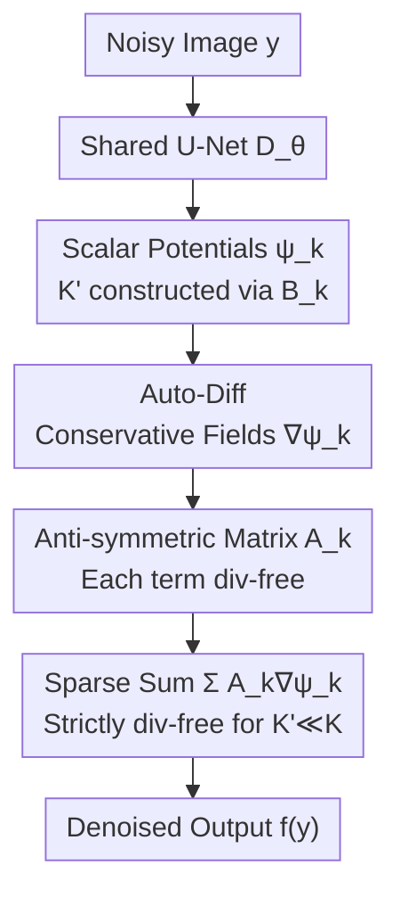

# Divergence-Free Neural Networks with Application to Image Denoising

**Conference**: ICLR 2026  
**OpenReview**: [https://openreview.net/forum?id=a5lL1ygtkG](https://openreview.net/forum?id=a5lL1ygtkG)  
**Code**: https://github.com/sherbret/divergence_free_nn  
**Area**: Image Restoration / Self-supervised Learning / Image Denoising  
**Keywords**: Divergence-free networks, SURE, Self-supervised denoising, Representer theorem, Anti-symmetric matrices

## TL;DR
This paper proposes CENSURE, a neural network parameterization that is "divergence-free by design." By utilizing a representer theorem to structure divergence-free vector fields as a combination of "anti-symmetric matrices × gradients of conservative fields" and adopting a sparse approximation for high-dimensional images, the method achieves higher stability and accuracy than constrained methods like Noise2Self and UNSURE in self-supervised denoising scenarios where the noise level $\sigma$ is unknown and varies per sample.

## Background & Motivation

**Background**: In self-supervised denoising without clean images, Stein’s Unbiased Risk Estimate (SURE) is the primary theoretical tool. SURE provides an identity $\mathbb{E}\|f(y)-x\|_2^2 = \mathbb{E}[-n\sigma^2 + \|f(y)-y\|_2^2 + 2\sigma^2\,\mathrm{div}\,f(y)]$, which reformulates the Mean Squared Error (MSE) relative to the ground truth using only the noisy observation $y$, the noise level $\sigma$, and the divergence of the estimator $\mathrm{div}\,f(y)$. This allows training denoisers without ground truth.

**Limitations of Prior Work**: The SURE training objective includes the term $2\sigma^2\,\mathrm{div}\,f(y)$, which requires knowledge of $\sigma$ for every image and the calculation of the neural network's divergence. The latter is analytically intractable for deep networks, usually necessitating Monte-Carlo approximations (introducing an extra hyperparameter $\tau$ and causing unstable training sensitive to $\tau$). Furthermore, noise levels $\sigma$ in real sensors are often unknown and vary across samples or devices.

**Key Challenge**: To eliminate the dependency on $\sigma$, one class of methods restricts the estimator $f$ to a constraint set $\mathcal{S}$ such that $\mathbb{E}_{y,\sigma}[\sigma^2\,\mathrm{div}\,f(y)] = \lambda$ remains constant. This removes the divergence term from the optimization objective, leaving only measurement consistency $\min_f \mathbb{E}\|f(y)-y\|_2^2$. However, stronger constraints reduce expressivity: **Blind-spot networks (Noise2Self)** enforce $\partial f_i/\partial y_i = 0$, ensuring zero divergence but discarding the most informative input (the pixel itself), leading to lower image quality and checkerboard artifacts. **UNSURE** only constrains "expected divergence to be zero" $\mathbb{E}_y\,\mathrm{div}\,f(y)=0$, which is more flexible but relies on the statistical independence of $\sigma^2$ and $\mathrm{div}\,f$. When $\sigma$ varies per sample, this independence fails (as $y$ depends on $\sigma$), causing UNSURE to collapse.

**Goal**: Construct a constraint set with expressivity between "blind-spot" and "expected divergence" that works regardless of whether $\sigma$ is constant, and provide a divergence-free parameterization that is computationally feasible for high-dimensional image problems.

**Key Insight**: Enforce the divergence to be **pointwise constant** $\mathrm{div}\,f(y)=nc\;(\forall y)$. This defines a constraint set $\mathcal{S}_{DC}$ that strictly sits between $\mathcal{S}_{BS}\subset\mathcal{S}_{DC}\subset\mathcal{S}_{CED}$. A scalable network, CENSURE, is implemented using a "anti-symmetric matrix × conservative field gradient" representer theorem combined with sparse approximation.

## Method

### Overall Architecture

CENSURE (Concealed and Erratic Noise level with Stein's Unbiased Risk Estimate) aims to construct a neural network $f$ that is mathematically **pointwise divergence-free** (taking $c=0$), maintains the expressivity of standard denoising networks, and remains computationally efficient for large image dimensions $n$. The method consists of two layers: a theoretical layer defining the structure of divergence-free fields and an engineering layer implementing it as a U-Net-scale network.

The theoretical layer is based on a representer theorem (Theorem 1): any smooth divergence-free field can be written as $f=\sum_{k=1}^{K} A_k\nabla\psi_k$, where $A_k$ are anti-symmetric matrices and $\psi_k$ are scalar potential fields. Since anti-symmetric matrices $A$ satisfy $A^\top=-A$, $\mathrm{div}(A\nabla\psi)=\mathrm{tr}(AJ_{\nabla\psi})=0$ (the trace product of a symmetric Hessian and an anti-symmetric matrix is zero). Thus, each term is naturally divergence-free, and their sum remains so. A complete representation requires $K=\binom{n}{2}\sim n^2$ terms, which is infeasible for images.

The engineering layer employs two strategies for scalability: ① **Sparse Approximation**: Only $K'\ll K$ terms (typically $K'=8$) are retained. Since divergence-free functions are closed under addition, the result remains **strictly** divergence-free after truncation; $K'$ only affects expressivity. ② **Shared Parameterization**: Anti-symmetric matrices $A_k$ and matrices $B_k$ within the scalar fields are constructed using fixed permutation matrices $P_k$ sandwiching a shared block-diagonal matrix. The scalar potentials $\psi_k$ share a single U-Net $D_\theta$. The learnable parameters are limited to $\{\theta, \Theta, \Theta'\}$, keeping the model size close to that of the base U-Net $D_\theta$.

The forward data flow is as follows: The noisy image $y$ enters the shared U-Net $D_\theta$. Using $K'$ sets of matrices $B_k$, $K'$ scalar potentials $\psi_k$ are constructed. Automatic differentiation computes the conservative fields $\nabla\psi_k$, which are multiplied by anti-symmetric matrices $A_k$ and summed to produce the divergence-free denoising result $f(y)$.

### Key Designs

**1. CENSURE Constraint Set: Recovering Expressivity Between "Blind-Spot" and "Expected Divergence"**

The paper addresses the "expressivity-robustness" trade-off in constrained self-supervised denoising. The blind-spot constraint $\mathcal{S}_{BS}=\{\partial f_i/\partial y_i=c\}$ is too rigid (each $f_i$ cannot see pixel $y_i$), while UNSURE’s expected divergence constraint $\mathcal{S}_{CED}=\{\mathbb{E}_y\,\mathrm{div}\,f(y)=nc\}$ fails when $\sigma$ varies. The authors propose the **pointwise constant divergence** constraint set:

$$\mathcal{S}_{DC}^{c}=\{f\in L^1(\mathbb{R}^n,\mathbb{R}^n):\forall y,\ \mathrm{div}\,f(y)=nc\},$$

and prove the strict inclusion $\mathcal{S}_{BS}\subset\mathcal{S}_{DC}\subset\mathcal{S}_{CED}$. Crucially, $f \in \mathcal{S}_{DC}$ allows each component $f_i$ to depend on its own pixel $y_i$ (forbidden by blind-spot), providing higher expressivity. Simultaneously, because the divergence is constant **pointwise**, the constraint $\mathbb{E}_{y,\sigma}[\sigma^2\,\mathrm{div}\,f(y)]=nc\,\mathbb{E}[\sigma^2]$ holds unconditionally. This resolves UNSURE's failure: when $\sigma$ varies, $\sigma^2$ and $\mathrm{div}\,f(y)$ are no longer independent, breaking expected divergence constraints, whereas pointwise constant divergence requires no independence assumptions.

The authors also provide supporting theory: each constraint set is an affine space $\mathcal{S}^c = c\,\mathrm{id} + \mathcal{S}^0$ (Lemma 1). Thus, one only needs to solve for $\mathcal{S}^0$. The optimal constant is $c^*=1-\frac{n\mathbb{E}[\sigma^2]}{\min_{f\in\mathcal{S}^0}\mathbb{E}\|f(y)-y\|^2}\in[0,1]$ (Prop. 2). Since $c^*$ requires knowledge of $\mathbb{E}[\sigma^2]$, $c=0$ is used when unknown (consistent with Noise2Self and UNSURE).

**2. Representer Theorem and Sparse Approximation for Divergence-Free Fields**

To make a network divergence-free by design, the general form of such fields must be known. Theorem 1 provides the necessary and sufficient conditions: given a basis $\{A_1,\dots,A_K\}$ of the space of anti-symmetric matrices ($A_k^\top=-A_k$), $f$ is divergence-free if and only if there exist scalar fields $\psi_k$ such that

$$f=\sum_{k=1}^{K}A_k\nabla\psi_k .$$

This generalizes the work of Richter-Powell et al., rooted in classic Hodge decomposition. For $n=3$, this simplifies to the familiar "curl of a vector field." The challenge of $K=\binom{n}{2}$ scaling quadratically with dimension is solved via **Sparsification**: using $K'\ll K$ terms. Because divergence-free functions are closed under addition, **any truncation $K'$ remains strictly divergence-free**. $K'$ becomes a clean trade-off between expressivity and computation. This differs from "soft constraints" (adding a penalty term), as CENSURE ensures exactly zero divergence regardless of truncation.

**3. Shared Parameterization of Anti-Symmetric Matrices and Scalar Potentials**

To keep $A_k$ and $\psi_k$ learnable and efficient for images:

Anti-symmetric matrices use a "permutation-sandwiched block-diagonal" construction: $A_k=P_k^\top\frac{\Theta-\Theta^\top}{2}P_k$, where $\Theta$ is a shared, block-diagonal learnable matrix and $P_k$ are unique **fixed** permutations (e.g., rotations or translations). Since $\{A:A^\top=-A\}=\{P_k^\top\frac{A-A^\top}{2}P_k\}$, these $A_k$ are naturally anti-symmetric and add minimal parameters due to the sparsity of $\Theta$.

The scalar potential field is designed to incorporate image priors rather than using a plain feed-forward network. Inspired by energy-based models, the authors use:

$$\psi_{\theta,B_k}(y)=\tfrac12\big(\|B_k y\|_2^2-\|B_k y-D_\theta(y)\|_2^2\big),$$

where $D_\theta$ is a shared U-Net and $B_k=P_k^\top \Theta' P_k$ is similarly parameterized. Its gradient (computed via auto-diff to avoid explicit Jacobians) is:

$$\nabla\psi_{\theta,B_k}(y)=B_k^\top D_\theta(y)+J_{D_\theta}(y)^\top\big(B_k y-D_\theta(y)\big).$$

The first term $B_k^\top D_\theta(y)$ aligns with effective denoising forms. Learnable parameters are limited to $\{\theta, \Theta, \Theta'\}$, keeping the total parameter count slightly above a standard U-Net.

### Loss & Training

Since $f$ is divergence-free by design, the divergence term in the SURE objective vanishes. Training only requires minimizing measurement consistency:

$$\arg\min_f \mathbb{E}_y\|f(y)-y\|_2^2,\quad \text{s.t. } f\in\mathcal{S}_{DC}^0 .$$

Training data consists of clean images with synthetic Gaussian noise $\sigma\sim\mathcal{U}([0,75])$. $\sigma$ is **not** provided to the loss or model during inference. All methods use the same backbone for fair comparison. CENSURE does not require the Monte-Carlo divergence term, making it independent of $\tau$ and resulting in smooth training curves without the oscillations seen in UNSURE/MC-SURE.

## Key Experimental Results

### Main Results

Performance under unknown and non-constant noise ($\sigma\in[0,75]$, single model for all levels). Color image denoising PSNR (dB) for constrained methods:

| Dataset | $\sigma$ | Noise2Self | UNSURE ($\tau{=}10^{-2}$) | CENSURE (Ours) | Supervised DRUNet light |
|--------|------|-----------|------|----------------|-------------------|
| Kodak24 | 15 | 34.08 | 29.48 | **34.21** | 35.18 |
| Kodak24 | 25 | 31.90 | 22.03 | **32.05** | 32.78 |
| Kodak24 | 50 | 29.07 | 15.58 | **29.24** | 29.77 |
| Kodak24 | 75 | 27.49 | 12.56 | **27.67** | 28.14 |
| CBSD68 | 25 | 30.70 | 22.15 | **30.83** | 31.61 |
| CBSD68 | 75 | 26.21 | 12.68 | **26.33** | 26.74 |

CENSURE consistently outperforms the blind-spot method Noise2Self by ~0.1–0.15 dB and stays close to the supervised upper bound. UNSURE fails catastrophically (PSNR drops by over 10 dB) when $\sigma$ varies, confirming that its divergence constraint is violated when $\sigma$ is not constant across samples.

### Expressivity Comparison (Constant $\sigma$ Scenario)

| Constraint Set | Condition | $\sigma$ Applicability | Expressivity Rank (Constant $\sigma$) |
|--------|---------|----------------|-------------------------------|
| $\mathcal{S}_{BS}$ (Noise2Self) | $\partial f_i/\partial y_i=c$ | Any, most general | Lowest (3rd) |
| $\mathcal{S}_{DC}$ (CENSURE) | $\mathrm{div}\,f(y)=nc\;\forall y$ | Constant or varying $\sigma$ | Medium (2nd) |
| $\mathcal{S}_{CED}$ (UNSURE) | $\mathbb{E}_y\,\mathrm{div}\,f(y)=nc$ | Constant $\sigma$ only | Highest (1st) but fails if $\sigma$ varies |

The ranking UNSURE > CENSURE > Noise2Self under constant noise matches the theoretical containment $\mathcal{S}_{BS}^0\subset\mathcal{S}_{DC}^0\subset\mathcal{S}_{CED}^0$: looser constraints allow for higher expressivity.

### Key Findings
- **Pointwise constant divergence is the source of robustness**: CENSURE is the only method that satisfies the SURE constraint (7) when $\sigma$ is unknown and varying, as its divergence is constant for every $y$ without requiring independence assumptions.
- **$\tau$-independence improves training stability**: CENSURE bypasses Monte-Carlo approximations, avoiding sensitivity to $\tau$. This leads to smooth training curves compared to the heavy oscillations of MC-SURE/UNSURE.
- **Adjustable expressivity with "free" zero-divergence**: The number of terms $K'$ (typically 8) adjusts expressivity. Even with heavy truncation, the network remains strictly divergence-free.
- While non-constrained methods like Neighbor2Neighbor achieve higher PSNR on natural images, they rely on "neighboring pixel similarity" assumptions. Constrained methods like CENSURE are more mathematically principled for non-natural images.

## Highlights & Insights
- **From Soft Penalty to Hard Structure**: By using the representer theorem, the divergence-free property is baked into the network architecture. This is a qualitative shift from adding penalty terms that only encourage low divergence.
- **Sparse Truncation "Free Lunch"**: The property that divergence-free fields are closed under addition allows the $O(n^2)$ complexity to be reduced to just 8 terms without losing the theoretical zero-divergence guarantee.
- **The "Sandwich" Positioning of Constraint Sets**: The hierarchy $\mathcal{S}_{BS}\subset\mathcal{S}_{DC}\subset\mathcal{S}_{CED}$ provides a clear expressivity-robustness spectrum, positioning CENSURE as "stronger than blind-spot yet more robust than UNSURE."
- The design of $\psi$ ensures the conservative field gradient aligns with proven denoising architectures, which is key to embedding U-Nets into the divergence-free framework without sacrificing image quality.

## Limitations & Future Work
- Setting $c=0$ is a heuristic; the optimal $c^*$ requires knowledge of $\mathbb{E}[\sigma^2]$, which may not be available.
- There is no rigorous theoretical characterization for the optimal $K'$.
- Evaluations are limited to additive white Gaussian noise and PSNR; performance on real-world camera noise or perceptual metrics is not yet explored.
- Under ideal conditions where $\sigma$ is constant and known, looser methods (like MC-SURE with oracle $\tau$) can outperform CENSURE by approaching the supervised limit more closely.

## Related Work & Insights
- **vs Noise2Self / Blind-spot**: Both use constraints for divergence control, but blind-spot's $\partial f_i/\partial y_i=0$ is overly restrictive. CENSURE allows self-dependency, improving expressivity and removing artifacts.
- **vs UNSURE**: UNSURE is more accurate under constant $\sigma$ but fails when $\sigma$ varies per sample due to the breakdown of independence. CENSURE's pointwise constraint is universally valid and easier to train.
- **vs MC-SURE**: MC-SURE optimizes the full objective with noise levels known; CENSURE sacrifices a small theoretical upper bound for practical robustness when noise levels are unknown.
- **vs Richter-Powell et al. (2022)**: While both use representer theorems, the original work requires full Jacobian calculations that do not scale. CENSURE introduces sparse approximation and block-diagonal sharing to make the approach viable for U-Net-sized models.

## Rating
- Novelty: ⭐⭐⭐⭐⭐ Bringing the representer theorem for divergence-free fields to image denoising with a scalable sparse approximation is highly original.
- Experimental Thoroughness: ⭐⭐⭐⭐ Extensive comparison across noise levels and constraint sets, though limited to synthetic Gaussian noise.
- Writing Quality: ⭐⭐⭐⭐⭐ The theoretical progression from Lemma to Theorem is clear, and the motivation for the constant divergence set is well-justified.
- Value: ⭐⭐⭐⭐ Provides a robust, $\tau$-independent self-supervised denoising solution for the realistic scenario of varying noise levels.

<!-- RELATED:START -->

## Related Papers

- [\[ICLR 2026\] Denoising Neural Reranker for Recommender Systems](denoising_neural_reranker_for_recommender_systems.md)
- [\[ICLR 2026\] SuperF: Neural Implicit Fields for Multi-Image Super-Resolution](superf_neural_implicit_fields_for_multi-image_super-resolution.md)
- [\[ICCV 2025\] IDF: Iterative Dynamic Filtering Networks for Generalizable Image Denoising](../../ICCV2025/image_restoration/idf_iterative_dynamic_filtering_networks_for_generalizable_image_denoising.md)
- [\[NeurIPS 2025\] Spiking Meets Attention: Efficient Remote Sensing Image Super-Resolution with Attention Spiking Neural Networks](../../NeurIPS2025/image_restoration/spiking_meets_attention_efficient_remote_sensing_image_super-resolution_with_att.md)
- [\[ICLR 2026\] LucidFlux: Caption-Free Photo-Realistic Image Restoration via a Large-Scale Diffusion Transformer](lucidflux_caption-free_photo-realistic_image_restoration_via_a_large-scale_diffu.md)

<!-- RELATED:END -->
