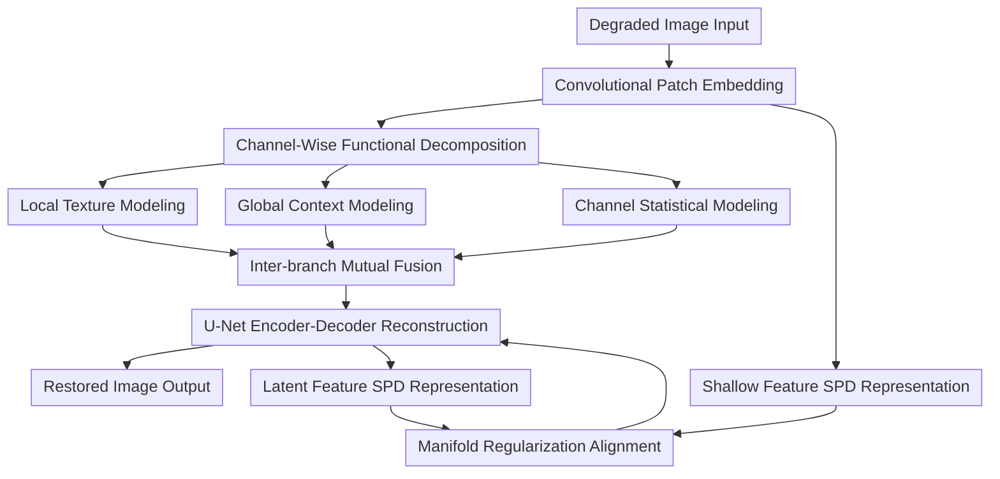

# Efficient Degradation-agnostic Image Restoration via Channel-Wise Functional Decomposition and Manifold Regularization

**Conference**: ICLR 2026  
**Paper**: [OpenReview: jDMAvoLsVj](https://openreview.net/forum?id=jDMAvoLsVj)  
**Code**: https://github.com/Amazingren/MIRAGE (Available)  
**Area**: Image Restoration / All-in-One Restoration  
**Keywords**: Degradation-agnostic restoration, channel-wise functional decomposition, SPD manifold contrastive learning, mixed degradation, efficient model design  

## TL;DR
MIRAGE achieves higher accuracy and lower computational overhead in all-in-one image restoration by "splitting attention features by channel into three branches (CNN/Attention/MLP) for specialized tasks + aligning shallow and deep features via contrastive learning in the SPD covariance space."

## Background & Motivation
**Background**: The goal of degradation-agnostic image restoration (IR) is to handle multiple types of degradation (denoising, deraining, dehazing, deblurring, low-light enhancement, etc.) within a single model. Recent mainstream approaches are divided into two categories: those relying on prompt/multimodal/large model enhancements for strong generalization at high costs, and those utilizing lightweight architectures that offer speed but suffer from performance drops in multi-degradation scenarios.

**Limitations of Prior Work**: The primary difficulty for a unified model is that "a single set of parameters must simultaneously satisfy the representation requirements of different degradations." Additive degradations (noise, rain) require more local texture modeling, multiplicative degradations (haze, low-light) depend more on global context, and convolutional degradations (blur) require cross-scale structural reasoning. Many methods either scale the network size or add complexity through extra modules, resulting in high parameter counts, memory usage, and FLOPs.

**Key Challenge**: Prior works often treat "Transformer channel redundancy" as a candidate for pruning rather than systematically redistributing these redundant capabilities into "functionally distinct subspaces." Consequently, models either waste capacity or lack expressive power under complex degradations.

**Goal**: The authors decompose the problem into two sub-objectives. First, how to make a single backbone cover local texture, global relationships, and channel statistics without increasing model size. Second, how to maintain semantic consistency between shallow and deep features in multi-degradation scenarios to avoid unstable generalization caused by cross-layer drift.

**Key Insight**: The authors first performed empirical redundancy analysis (PCA/SVD), observing significant low-rank redundancy in multi-scale attention features, particularly in shallow layers. They further observed that shallow and deep features are naturally asymmetric in statistical structure, which can be used to construct "natural contrastive pairs." Based on these observations, they propose a combination of "channel-wise functional decomposition + SPD contrastive regularization."

**Core Idea**: Attention features are split by channel and assigned to three complementary branches for specialized modeling. Then, SPD covariance contrastive learning is used to align shallow details with deep semantics, achieving strong generalization with a small model.

## Method

### Overall Architecture
MIRAGE is a U-Net style 4-level encoder-decoder backbone, with the core block named MDAB (Mixed Degradation Adaptation Block). Each MDAB performs "three-branch parallel processing in the channel dimension," followed by "inter-branch mutual fusion," and finally closes with an FFN and residual connection. During training, a shallow-latent SPD contrastive loss is introduced; this regularization branch adds no overhead during inference.

Intuitively, instead of adding an expensive prompt module, it reorganizes existing channel capacity: one part for local details via convolution, one for global context via attention, and one for channel statistics via MLP. Simultaneously, cross-layer contrastivness pulls "shallow texture perception" and "deep semantic stability" into the same structured space.

### Key Designs
**1. Channel-Wise Functional Decomposition: Turning Redundant Channels into Complementary Representations**

In traditional attention-only structures, channel redundancy is often treated as "prunable waste." MIRAGE's approach is "redivision of labor rather than hard deletion." Given an input feature $F_{in}\in\mathbb{R}^{H\times W\times C}$, it is first split along the channel dimension into three parts: $F^{att}_{in}, F^{conv}_{in}, F^{mlp}_{in}$, which enter the attention, dynamic convolution, and C-MLP branches for parallel processing. Each branch only processes $\frac{C}{3}$ channels, significantly reducing computation without crudely discarding representation capacity.

The key is "aligning branches with degradation attributes": the convolution branch focuses on local textures (suitable for fine-grained residuals like noise/rain); the attention branch focuses on global relationships (suitable for spatially non-uniform degradations like haze/low-light); and the MLP branch supplements channel statistical mixing to enhance robustness across degradations.

**2. Inter-branch Mutual Fusion: Restoring Cross-mechanism Interaction on Low-cost Parallelism**

Parallel branches can lead to a lack of cross-branch information flow. MIRAGE adds inter-branch mutual fusion in the MDAB: each branch absorbs gated information from the other two, controlled by learnable coefficients $\lambda_{att}, \lambda_{conv}, \lambda_{mlp}$. The form is as follows:

$$
\begin{aligned}
F^{att'} &= F^{att} + \lambda_{att}\,\sigma(F^{conv}+F^{mlp}),\\
F^{conv'} &= F^{conv} + \lambda_{conv}\,\sigma(F^{att}+F^{mlp}),\\
F^{mlp'} &= F^{mlp} + \lambda_{mlp}\,\sigma(F^{att}+F^{conv}).
\end{aligned}
$$

Compared to direct concatenation followed by linear projection, this mechanism finds a more stable compromise between "lightweight division of labor" and "information coupling."

**3. SPD Manifold Regularization: Cross-layer Alignment via Second-order Statistics**

In unified restoration, the semantics of shallow and deep layers are asymmetric. Shallow layers are more sensitive to local degradation details, while deep layers are more stable regarding semantic structures. If they drift, the model may mismatch on mixed or unseen degradations. The authors treat them as "natural contrastive pairs" and construct covariance matrices to enter the SPD space rather than direct Euclidean alignment.

For shallow and latent features $X_s, X_l$, the covariance is calculated:

$$
C_s=\frac{1}{N-1}(X_s-\mu_s)(X_s-\mu_s)^\top+\epsilon I,\quad
C_l=\frac{1}{N'-1}(X_l-\mu_l)(X_l-\mu_l)^\top+\epsilon I.
$$

They are then vectorized and projected into contrastive embeddings using InfoNCE:

$$
\mathcal{L}_{SPD}=-\log\frac{\exp(\mathrm{sim}(z_s,z_l)/\tau)}{\sum_{z_l'}\exp(\mathrm{sim}(z_s,z_l')/\tau)}.
$$

The core benefit is retaining the second-order dependency structure between channels, preventing the representation collapse often seen in Euclidean contrastive learning.

**4. Loss & Training: Synergistic Spatial, Frequency, and Structural Constraints**

The total loss for MIRAGE is:

$$
\mathcal{L}_{total}=\mathcal{L}_1+\lambda_{fre}\mathcal{L}_{Fourier}+\lambda_{ctrs}\mathcal{L}_{SPD}.
$$

Where $\mathcal{L}_1$ ensures pixel reconstruction, $\mathcal{L}_{Fourier}$ aligns frequency domain components to constrain texture consistency, and $\mathcal{L}_{SPD}$ handles cross-layer structural alignment. The paper uses $\lambda_{fre}=0.1, \tau=0.1$, and $\lambda_{ctrs}=0.05$.

### Mechanism Example
Taking a triple-degradation sample (low-light + haze + snow) from CDD11 as an example:

1. Input yields shallow features through patch embedding, retaining local edge and noise information.
2. MDAB splits channels: convolution restores snow particles and edge breaks, attention estimates the global contrast shift from haze, and MLP stabilizes color and brightness statistics.
3. Features enter the next encoding stage after inter-branch fusion; abstraction increases, and multi-scale details are re-injected during decoding.
4. SPD contrastive loss forces "local detail cues" and "deep semantic cues" to align structurally during training.
5. The final output achieves better quality than OneRestore while maintaining strong generalization on unseen underwater enhancement tasks.

### Loss & Training
The training follows standard all-in-one IR settings but emphasizes objective combination:

- Optimizer: Adam, initial LR $2\times10^{-4}$, $\beta_1=0.9, \beta_2=0.999$, cosine annealing.
- Augmentation: Random crop $128\times128$, horizontal/vertical flip.
- Epochs: ~130 for 3-degradation, ~150 for 5-degradation, ~170 for composite.
- Model scale: Tiny 6.21M (16G FLOPs), Small 9.68M (27G FLOPs).

## Key Experimental Results

### Main Results
The table below summarizes the core multi-setting results, demonstrating the "accuracy-efficiency" advantage of MIRAGE.

| Setting | Method | Params | Key Results | Comparison |
|------|------|--------|----------|----------|
| 3-Degradation All-in-One | MIRAGE-S | 10M | Avg PSNR 32.91 / SSIM 0.919 | +0.85dB vs PromptIR(36M); +0.18dB vs MoCE-IR(25M) |
| 3-Degradation All-in-One | MIRAGE-T | 6M | Avg PSNR 32.77 / SSIM 0.919 | Exceeds various larger models with only 6M params |
| 5-Degradation All-in-One | MIRAGE-S | 10M | Avg PSNR 30.68 / SSIM 0.914 | +1.53dB vs PromptIR; +0.60dB vs MoCE-IR-S |
| CDD11 Composite | MIRAGE-S | 10M | Avg PSNR 29.33 / SSIM 0.887 | +0.28dB vs MoCE-IR(11M) |
| Zero-shot Underwater | MIRAGE-S | 10M | 17.29dB / 0.773 | +1.38dB vs MoCE-IR |

Complexity comparison (from Table 6 of the paper):

| Method | Avg PSNR (3-deg) | Memory | Params | FLOPs |
|------|--------------------|----------|--------|-------|
| PromptIR | 32.06 | 9830M | 35.59M | 132G |
| MoCE-IR-S | 32.51 | 4263M | 11.48M | 37G |
| MoCE-IR | 32.73 | 6654M | 25.35M | 75G |
| MIRAGE-T | 32.77 | 3729M | 6.21M | 16G |
| MIRAGE-S | 32.91 | 4810M | 9.68M | 27G |

### Ablation Study
Ablation of core modules (Table 7 / Table C):

| Config | Params | Avg PSNR | Gain/Loss | Note |
|------|--------|-----------|----------------|------|
| att-only | 19.89M | 32.23 | -0.54dB | Pure attention is heavier and worse |
| w/o DynamicConv | 9.43M | 32.21 | -0.56dB | Dynamic conv is critical for detail |
| w/o C-MLP | 7.01M | 32.39 | -0.38dB | Channel statistics are necessary |
| w/o Fusion | 5.71M | 32.57 | -0.20dB | Parallelism requires mutual modulation |
| w/o CL & SPD | 5.80M | 32.63 | -0.14dB | Cross-layer alignment is effective |
| w/o SPD (Euclidean CL) | 6.10M | 32.53 | -0.24dB | Euclidean contrast is inferior to SPD |
| Full (MIRAGE-T) | 6.21M | 32.77 | 0 | Best balance |

### Key Findings
- The Dynamic Convolution branch provides the most substantial gain (-0.56dB if removed), proving local texture restoration remains basic for all-in-one IR.
- SPD alignment is more stable than Euclidean alignment, which suffers from representation collapse.
- MIRAGE-T proves that "reasonable decomposition + alignment" allows 6M-scale models to outperform 25M+ schemes.
- Sustained advantages in composite and zero-shot settings indicate cross-degradation transferable representations.

## Highlights & Insights
- Shifting the perspective of "channel redundancy" from pruning to "functional redistribution" is the most valuable methodological point.
- The SPD contrastive learning is implemented pragmatically: added during training, zero extra cost during testing.
- The ablation study is highly complete, covering branches, fusion, and loss variants.
- Success in CDD11 and zero-shot underwater tasks shows practical potential for real-world deployment.

## Limitations & Future Work
- Slight performance gap in deblurring tasks compared to some larger models suggests capacity configuration might need adjustment for strong structural degradations.
- SPD regularization currently uses a projection to Euclidean space rather than pure Riemannian optimization.
- Channel ratios for CNN/Attention/MLP are fixed rather than adaptive per degradation type.
- Verification on larger scales under complex camera ISP chains is still needed.

Future directions:
- Degradation-aware dynamic channel allocation.
- Exploring stricter SPD manifold distances or geodesic contrastive targets.
- Stronger cross-scale constraints specifically for deblurring.

## Related Work & Insights
- **vs PromptIR (NeurIPS 2023)**: PromptIR generalizes well but is heavy (36M); MIRAGE achieves higher PSNR with fewer parameters via structural reorganization.
- **vs MoCE-IR (CVPR 2025)**: MoCE-IR uses mixture-of-experts for complexity sensitivity; MIRAGE offers lower computational cost and better composite degradation performance.
- **vs DA-RCOT (TPAMI 2025)**: Also uses contrastive learning but primarily in residual space; MIRAGE emphasizes shallow-latent pairing and second-order statistics.

## Rating
- Novelty: ⭐⭐⭐⭐☆ The combination of functional decomposition and SPD cross-layer alignment is a clear innovation.
- Experimental Thoroughness: ⭐⭐⭐⭐⭐ Comprehensive coverage of various degradations and zero-shot scenarios.
- Writing Quality: ⭐⭐⭐⭐☆ Clear motivation and detailed engineering specifics.
- Value: ⭐⭐⭐⭐⭐ Provides a reusable efficient design paradigm for all-in-one IR.

<!-- RELATED:START -->

## Related Papers

- [\[CVPR 2026\] Disentanglement-wise Image Dehazing through Cross-Domain Manifold Consensus](../../CVPR2026/image_restoration/disentanglement-wise_image_dehazing_through_cross-domain_manifold_consensus.md)
- [\[CVPR 2026\] DiffDecompose: Layer-Wise Decomposition of Alpha-Composited Images via Diffusion Transformers](../../CVPR2026/image_restoration/diffdecompose_layer-wise_decomposition_of_alpha-composited_images_via_diffusion_.md)
- [\[CVPR 2026\] Retrieve-to-Restore: Efficient All-in-One Image Restoration with a Retrieval-Based Degradation Bank](../../CVPR2026/image_restoration/retrieve-to-restore_efficient_all-in-one_image_restoration_with_a_retrieval-base.md)
- [\[CVPR 2026\] Degradation-Robust Fusion: An Efficient Degradation-Aware Diffusion Framework for Multimodal Image Fusion in Arbitrary Degradation Scenarios](../../CVPR2026/image_restoration/degradation-robust_fusion_an_efficient_degradation-aware_diffusion_framework_for.md)
- [\[CVPR 2026\] MMDIR: Multimodal Instruction-Driven Framework for Mixed-Degradation Document Image Restoration](../../CVPR2026/image_restoration/mmdir_multimodal_instruction-driven_framework_for_mixed-degradation_document_ima.md)

<!-- RELATED:END -->
