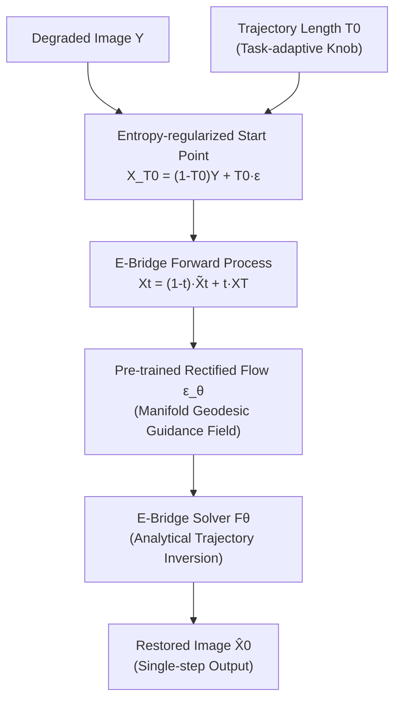

# Energy-oriented Diffusion Bridge for Image Restoration with Foundational Diffusion Models

**Conference**: ICLR 2026  
**Code**: https://jinnh.github.io/E-Bridge/  
**Area**: image_restoration  
**Keywords**: diffusion bridge, image restoration, geodesic trajectory, consistency model, single-step inference

## TL;DR

The E-Bridge framework is proposed, which achieves optimal performance for multi-task image restoration under single-step inference by constructing low-energy manifold geodesic trajectories and a closed-form one-step consistency solver.

## Background & Motivation

**Background**: Diffusion models in image restoration have formed two major paradigms: conditional generation starting from pure noise (e.g., SR3, DiffBIR) and direct degradation-to-clean mapping via bridging processes (e.g., I2SB, UniDB). The latter significantly reduces sampling steps by shortening the gap between the trajectory starting point and the target.  
**Limitations of Prior Work**: Trajectories of bridging models are often preset polynomial interpolations rather than the shortest paths on the data manifold—they force a "re-noising" stage before denoising starts, causing trajectory energy redundancy. Meanwhile, methods leveraging foundation model priors (e.g., IRBridge) rely on complex concatenation mechanisms, introducing distribution mismatches between two independent diffusion processes.  
**Key Challenge**: Existing bridging trajectories involve high path energy and require multi-step iteration for inference, while reducing steps severely damages restoration quality, making it difficult to balance efficiency and quality.  
**Goal**: Redesign the restoration trajectory to evolve along the geodesics of the data manifold and achieve single-step high-fidelity restoration.  
**Core Idea**: Within a stochastic optimal control framework, it is proven that the optimal trajectory expectation should satisfy a linear transport equation (Proposition 4.1). Based on this, a low-energy diffusion bridge starting from an "entropy-regularized mixed starting point" is constructed, using a pre-trained Rectified Flow network as a geometric guidance field. A closed-form one-step mapping function is then derived through analytical inversion of the trajectory equation and trained using a continuous-time consistency objective.

## Method

### Overall Architecture

E-Bridge consists of two main components: the **low-energy geodesic diffusion bridge** (E-Bridge trajectory) and the **Consistency E-Bridge Solver** (E-Bridge-Solver). The former defines an efficient trajectory from the entropy-regularized starting point $X_{T_0}$ to the clean image $X_0$, while the latter achieves single-step direct prediction of the clean image via analytical inversion. Both are unified through training with a continuous-time consistency objective.

### Key Designs

**1. Low-energy Geodesic Bridge Trajectory: Bypassing Redundant Noising**

Traditional bridging models (e.g., I2SB) have a noise variance $\sigma_t^2 \propto t(1-t)$ that follows a symmetric arch, forcing the reverse restoration process to "add noise" before denoising, which wastes trajectory energy. Through analysis of the stochastic optimal control energy $J(u)$, E-Bridge proves that the expectation of the optimal trajectory must satisfy:

$$E[\tilde{X}_t] = \left(1 - \frac{t}{T_0}\right)X_0 + \frac{t}{T_0}Y$$

Accordingly, a new bridge trajectory is defined:

$$X_t = (1-t)\tilde{X}_t + t X_T, \quad \alpha_t = 1-t,\ \beta_t = t$$

Where $X_T \sim \mathcal{N}(0,I)$, and $T_0 \in (0,1]$ is a controllable time span. Via Lipschitz stability analysis (Proposition 4.2), $\alpha_t=1-t, \beta_t=t$ aligns perfectly with the linear SNR evolution of pre-trained Rectified Flow models, minimizing adaptation energy and allowing pre-trained priors to be directly inserted without complex concatenation.

**2. Closed-form One-step Solver: Analytical Trajectory Inversion**

A core theoretical insight of E-Bridge is: for any state $X_t$ on the trajectory, the pre-trained Rectified Flow network $\epsilon_\theta$ provides an estimate of the endpoint noise $\epsilon_\theta(X_t) = X_T - X_0$. Substituting this into the trajectory definition yields a linear equation with $X_0$ as the only unknown, which can be analytically inverted:

$$\hat{X}_0 := F_\theta(X_t, Y, t) = \frac{X_t - A(t)Y - B(t)\epsilon_\theta(X_t)}{C(t)}$$

Where $A(t) = (1-t)\frac{t}{T_0}$, $B(t) = t$, and $C(t) = 1 - (1-t)\frac{t}{T_0}$. This makes E-Bridge essentially a direct solver for the data manifold endpoint rather than an interpolator, completely bypassing the $O(N \times C)$ cost of iterative ODE solving.

**3. Continuous-time Geodesic Consistency Training Objective**

To ensure the solver maintains stable output across the entire trajectory (geodesic consistency: $\frac{dF_\theta}{dt} = 0$), a continuous-time consistency objective is used for training:

$$\nabla_\theta \mathcal{L}_{\text{E-Bridge}}(\theta) = \mathbb{E}_{X_t, Y, t}\left[\nabla_\theta F_\theta(X_t,Y,t)^\top \cdot \text{sg}\!\left(\frac{dF_{\theta^-}(X_t,Y,t)}{dt}\right)\right]$$

Where $\text{sg}(\cdot)$ is the stop-gradient operator, and $\frac{dF_{\theta^-}}{dt}$ is the inconsistency tangent vector. The unique stable equilibrium is reached when the inconsistency vector becomes zero, forcing the solver to output an invariant clean image at any trajectory time. The model is initialized with pre-trained diffusion model parameters to avoid the cost of training from scratch.

**4. Task-adaptive Trajectory Length $T_0$**

The noise mixture ratio of the starting point $X_{T_0} = (1-T_0)Y + T_0 \epsilon$ is controlled by $T_0$, forming an "information-entropy trade-off": for denoising tasks with slight degradation, a small $T_0$ is chosen to keep the starting point close to $Y$, maximizing information preservation; for super-resolution with severe degradation, $T_0 \to 1$ makes the starting point approach pure noise, unleashing the model's generative capacity. This serves as a principled task-adaptive knob without requiring changes to the model architecture.

## Key Experimental Results

### Main Results (5 restoration tasks, comparison with SOTA)

| Task | Metric | E-Bridge (NFE=1) | Strongest Baseline | Δ |
|------|------|-----------------|---------|---|
| Super-resolution | LPIPS↓ | 0.452 | UniDB++(NFE=1) 0.658 | **-0.206** |
| Super-resolution | FID↓ | 72.001 | UniDB++(NFE=1) 83.718 | **-11.7** |
| Denoising | LPIPS↓ | 0.258 | UniDB++(NFE=1) 0.613 | **-0.355** |
| Denoising | PSNR↑ | 25.241 | UniDB++(NFE=1) 25.420 | +0 (Parity) |
| Raindrop Removal | PSNR↑ | 29.220 | UniDB++(NFE=1) 25.420 | **+3.8 dB** |
| De-moiré | PSNR↑ (NFE=5) | 20.849 | UniDB++(NFE=5) 20.527 | +0.32 dB |

> At NFE=10, super-resolution FID=57.837, which is superior to IRBridge(NFE=100) at 59.539, exceeding it with one-tenth of the steps.

### Ablation Study (Impact of Trajectory Type on SR/Denoising)

| Configuration | NFE | SR PSNR↑ | SR LPIPS↓ | Denoising PSNR↑ |
|------|-----|----------|-----------|-----------------|
| (a) Standard Diffusion Trajectory (from noise) | 10 | 20.527 | 0.464 | 24.241 |
| (b) Traditional Bridge Trajectory (re-noising) | 10 | 19.945 | 0.446 | 24.391 |
| **(Ours) E-Bridge Geodesic Trajectory** | **10** | **21.282** | **0.346** | **26.069** |

E-Bridge's advantage is most significant in the single-step (NFE=1) setting: SR PSNR 24.094 vs. traditional bridge 22.039, an improvement of +2.0 dB.

### Key Findings

- Low-energy geodesic trajectories show more prominent advantages as the number of steps decreases; at NFE=1, they outperform the LPIPS of all multi-step baselines.
- The task-adaptive $T_0$ design allows the same model to cover five types of tasks with vastly different degradation levels without retraining.
- Using pre-trained Rectified Flow (FLUX) as a geometric guidance field results in significant improvements in perceptual quality (MUSIQ/NIQE outperform baselines).

## Highlights & Insights

- **Theory-driven Design**: Derived the necessary form of the trajectory based on energy minimization from a stochastic optimal control perspective, rather than heuristic interpolation choices; Proposition 4.1 & 4.2 provide rigorous theoretical guarantees for the design.
- **Elegant Integration of Foundational Priors**: Pre-trained Rectified Flow (FLUX series) is not "concatenated" as an independent component but embedded within the trajectory dynamics as a geometric guidance field, avoiding the distribution mismatch issue found in IRBridge.
- **Closed-form Solution Eliminates Iteration**: Analytical inversion directly yields a single-step solver, reducing inference complexity from $O(N \cdot C)$ to $O(C)$; single-step quality already surpasses 100-step baselines.

## Limitations & Future Work

- Experiments are focused on academic-grade degradations (synthetic noise, bicubic downsampling, etc.); generalization to real-world blind restoration scenarios remains to be validated.
- $T_0$ is currently manually selected per task; future work could explore adaptive schemes to automatically estimate $T_0$ from degraded images.
- Pre-trained backbones based on Rectified Flow (FLUX) have a large number of parameters; paths for lightweight deployment need further exploration.

## Related Work & Insights

- **vs. I2SB / UniDB**: Also bridging diffusion, but E-Bridge replaces symmetric arch variance with linear SNR trajectories, eliminating redundant noising and achieving lower energy.
- **vs. IRBridge**: Also leverages foundation model priors, but IRBridge uses a "state transition equation" to force two independent processes together; E-Bridge directly embeds the pre-trained network into the same trajectory dynamics, ensuring better consistency.
- **vs. Continuous-time Consistency Models (ECM)**: E-Bridge-Solver transfers the self-consistency training objective of ECM to bridging trajectories, extending "point-to-point" consistency from generation tasks to restoration tasks.

## Rating

- Novelty: ⭐⭐⭐⭐ Redesigns bridging trajectories from an energy minimization perspective and transfers consistency models to restoration bridging; the combination is unique.
- Experimental Thoroughness: ⭐⭐⭐⭐ Comprehensive coverage of 5 task types, multiple step counts, and thorough ablations; balances perceptual and distortion metrics.
- Writing Quality: ⭐⭐⭐⭐ Clear theoretical derivations; the chain of Proposition $\rightarrow$ Design $\rightarrow$ Algorithm is complete and consistent with figures/text.
- Value: ⭐⭐⭐⭐ Single-step SOTA restoration is highly valuable for real-time applications; the adaptive trajectory design provides insights for unified multi-task models.

<!-- RELATED:START -->

## Related Papers

- [\[ICLR 2026\] Text-Aware Image Restoration with Diffusion Models](text-aware_image_restoration_with_diffusion_models.md)
- [\[ICLR 2026\] SFBD-OMNI: Bridge Models for Lossy Measurement Restoration with Limited Clean Samples](sfbd-omni_bridge_models_for_lossy_measurement_restoration_with_limited_clean_sam.md)
- [\[CVPR 2026\] Bi-Bridge: Bidirectional Diffusion Bridges for Low-Light Image Enhancement](../../CVPR2026/image_restoration/bi-bridge_bidirectional_diffusion_bridges_for_low-light_image_enhancement.md)
- [\[ICLR 2026\] Horizon Imagination: Efficient On-Policy Rollout in Diffusion World Models](horizon_imagination_efficient_on-policy_rollout_in_diffusion_world_models.md)
- [\[CVPR 2025\] Prior Does Matter: Visual Navigation via Denoising Diffusion Bridge Models](../../CVPR2025/image_restoration/prior_does_matter_visual_navigation_via_denoising_diffusion_bridge_models.md)

<!-- RELATED:END -->
